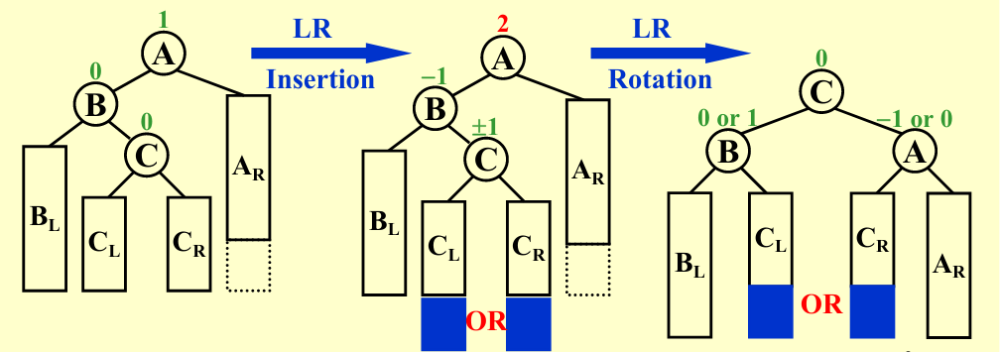

# ADS

> *第一节课就讲了AVL+Splay+摊还分析，让信息竞赛退役选手的我已经汗流浃背……*

## Data Structrure

### AVL

- 定义：任意节点左右子树**高度差**不大于1

- 复杂度分析：

    - 对于常见操作（插入、删除、查询）$O(h)$
    
    - 由定义，让高度最大，有$N_{h} = N_{h-1} + N_{h-2} + 1$
    
    - 化简，得到$(N_{h} + 1)= (N_{h-1} + 1) + (N_{h-2} + 1)$
    
    - 由斐波那契数列相关知识，得$N_h = F_{h+3} - 1$ (空树为-1)
    
    - 由此可得，$h = O(\log N)$

- 维护（Rotation）

    - 由定义的严格性，可知只要处理最小不平衡子树即可
    
    - **个人感觉旋转反而不够直观，更像是将下面的节点往上面“拎”起来，从而该节点（子树根节点）的各个儿子向两边“掉下去”，整棵子树也就像是被展平了一样更加平衡了**
    
    - LL / RR Rotation

        - 单链倾斜，将中间节点拎起来（将中间节点向上旋转）就好
        
        - 

    - LR / RL Rotation

        - 弯曲链，将权值为中间值（最下端儿子）的节点拎起来，该节点的两个儿子分别向两边掉下去
        
        - 还有一种理解，将这种情况理解为最下端儿子向上rotation两次 
        
        - 
    
    - Code

      ```cpp

        struct Node{
            int data, H;
            Node *Ls, *Rs;
            Node(int data): data(data), H(0), Ls(NULL), Rs(NULL){}
            int Update(){
                int HL = -1, HR = -1;
                if(Ls != NULL) HL = Ls->H;
                if(Rs != NULL) HR = Rs->H;
                H = max(HL, HR) + 1;
                return abs(HL - HR);
            }
        };
        struct AVL{
            Node *Rot;
            
            //Structure
            void Clear(Node *x){
                if(x->Ls) Clear(x->Ls);
                if(x->Rs) Clear(x->Rs);
                delete x;
            }
            Node *Insert(Node *p, int x){
                if(p == NULL) return new Node(x);
                if(x < p->data) p->Ls = Insert(p->Ls, x);else p->Rs = Insert(p->Rs, x);

                if(p->Update() > 1) return Balance(p,x);
                return p;
            }
            void Rotate(Node **X, Node **Y, bool p){
                // p = 0 -> Left, p = 1 -> Right
                // rotate X to Y
                // mind the order of the following two lines
                if(!p){
                    (*Y)->Ls = (*X)->Rs;
                    (*X)->Rs = *Y;
                }else{
                    (*Y)->Rs = (*X)->Ls;
                    (*X)->Ls = *Y;
                }
                (*Y)->Update(), (*X)->Update();
            }
            Node *Balance(Node *Trouble, int x){
                Node *G = Trouble, *F, *X;
                bool p, q;
                if(x < G->data) F = G->Ls, p = 0;else F = G->Rs, p = 1;
                if(x < F->data) X = F->Ls, q = 0;else X = F->Rs, q = 1;
                if(p ^ q) Rotate(&X, &F, q), Rotate(&X, &G, p);
                    else Rotate(&F, &G, p), X = F;
                return X;
            }

            // For Debug
            void Print(Node *x){
                printf("%d ",x->data);
                if(x->Ls) Print(x->Ls);
                if(x->Rs) Print(x->Rs);
            }

            // User
            void Clear(){if(Rot) Clear(Rot);Rot = NULL;}
            void PrintRoot(){printf("%d\n",Rot->data);}
            void Insert(int x){Rot = Insert(Rot, x);}
        }Tree;
        ```

### Splay

- 每次查询时，将查询的节点旋转到根节点，从而在过程中将树展平

- *由于动态自适应等特性，实际上splay树非常强大*

- 均摊复杂度：$O(\log N)$

- 维护（ZigZag）

    - 目的与AVL略有不同，AVL完全是为了保持树的平衡，而Splay是为了将查询的节点向上移动的同时尽量展平树（一般为每次考虑当前节点、父节点和祖先节点，选择最合适的旋转方法）
    
    - Zig
        
        - 已经是根节点的儿子，直接向上旋转一次即可
        
        -  
    
    - ZigZig
    
        - 倾斜链，将当前节点的父节点向上旋转一次，再将当前节点向上旋转一次
        
        - *不能直接将当前节点向上旋转两次，因为这样会导致倾斜链歪向另一边*

        - 也可以看成直接将当前节点往最上面一提，剩下的儿子们“纷纷”往下掉

        - 
    
    - ZigZag 
    
        - 弯曲链，直接将当前节点向上旋转两次
        
        - 也可以看成直接将当前节点往最上面一提，两个儿子被父节点和祖先节点均分，从而趋向平衡
        
        -  

## Algorithm

### Amortized Analysis (摊还分析)

- **Aggregated Analysis (聚类分析)**

    - 对于一个长度为N的操作序列，若该操作序列的最坏时间复杂度为T(N),则该操作序列的平均时间复杂度（摊还代价）为 T(N) / N
    
    - 简单粗暴，但是很多时候不够精确，因为 T(N) 并不一定好求 

- **Accounting Method (核算法)**

    - 为每个操作分配一个额外摊还代价，从而便于估计总代价
    
    - 常见理解： 将额外分配的代价视为存钱，之后的一些操作可以通过取钱来解决，从而使得总代价不会超过预期
    
    - *个人感觉*，不如直接从定义式上去理解
        
        - $\sum_{i=1}^{n}c_i + \sum_{i=1}^{n}t_i \leq \sum_{i=1}^{n}a_i$
        
        - $c_i$ 为实际每一步的代价，$t_i$ 为额外摊还代价，$a_i$ 为估计的摊还代价
        
        - 因而只要让$t_i \geq 0$, 就能保证分析的复杂度一定是上界。换句话说，类似于数列放缩，通过合理~~（玄学）~~的分配权值，使得总和不会超过预期

- **Potential Method（势能法）**

    - 给每个状态分配一个势能，将摊还代价视为势能的变化
    
        - $c_i$ 为实际每一步的代价，$a_i$ 为估计的摊还代价，$\Phi_i$ 为势能
        
        - $\Phi_0 = 0$
        
        - $c_i + \Phi_i - \Phi_{i-1} =a_i$  

        - 两边求和，得到 $\sum_{i=1}^{n}c_i + \Phi_{n} = \sum_{i=1}^{n}a_i$
    
    - 从而相当于获得比核算法更加宽松的条件，我们不再需要每一步的摊还代价都为正，只要选择一个玄学的势能函数（考虑题目特性），保证最后一个状态的势能为正即可

    - Splay Tree

        - 选择势能函数 $\Phi = \sum_{i=1}^{n}log(size_i)$, 即为每个节点的子树大小之和
        
        - 对三种旋转操作进行分别分析，可以证明，每次旋转的摊还代价为 $O(logN)$
        
        - 

