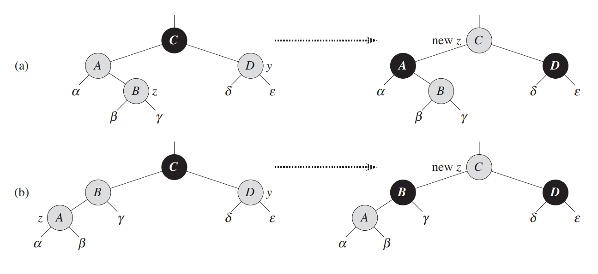
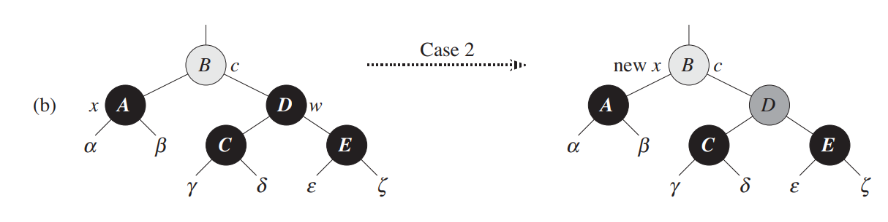
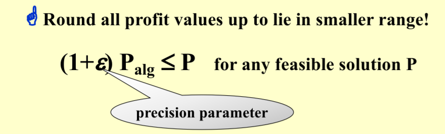
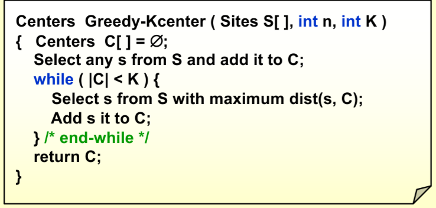
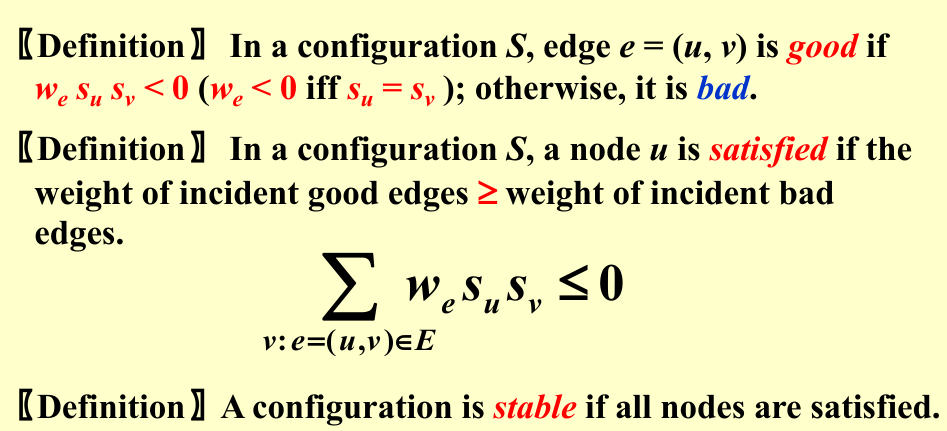

# ADS

> *第一节课就讲了AVL+Splay+摊还分析，让信息竞赛退役选手的我已经汗流浃背……*

## Data Structrure

----

### AVL

> 定义：任意节点左右子树**高度差**不大于1
>
> **Balance factor = $h_L - h_R \in \set{-1, 0, 1}$**

- 复杂度分析：

    - 对于常见操作（插入、删除、查询）$O(h)$

    - 由定义，让高度最大，有$N_{h} = N_{h-1} + N_{h-2} + 1$

    - 化简，得到$(N_{h} + 1)= (N_{h-1} + 1) + (N_{h-2} + 1)$

    - 由斐波那契数列相关知识，得$N_h = F_{h+3} - 1$ (空树为-1)

    - 由此可得，$h = O(\log N)$

- 维护（Rotation）

    - 由定义的严格性，可知只要处理最小不平衡子树即可

    - **个人感觉旋转反而不够直观，更像是将下面的节点往上面“拎”起来，从而该节点（子树根节点）的各个儿子向两边“掉下去”，整棵子树也就像是被展平了一样更加平衡了**

    - LL / RR Rotation

        - 单链倾斜，将中间节点拎起来（将中间节点向上旋转）就好

        - 

    - LR / RL Rotation

        - 弯曲链，将权值为中间值（最下端儿子）的节点拎起来，该节点的两个儿子分别向两边掉下去

        - 还有一种理解，将这种情况理解为最下端儿子向上rotation两次 

        - 

??? collapsible "Code"

    ```cpp title="AVL Tree" linenums="1"

    struct Node{
        int data, H;
        Node *Ls, *Rs;
        Node(int data): data(data), H(0), Ls(NULL), Rs(NULL){}
        int Update(){
            int HL = -1, HR = -1;
            if(Ls != NULL) HL = Ls->H;
            if(Rs != NULL) HR = Rs->H;
            H = max(HL, HR) + 1;
            return abs(HL - HR);
        }
    };
    struct AVL{
        Node *Rot;
        
        //Structure
        void Clear(Node *x){
            if(x->Ls) Clear(x->Ls);
            if(x->Rs) Clear(x->Rs);
            delete x;
        }
        Node *Insert(Node *p, int x){
            if(p == NULL) return new Node(x);
            if(x < p->data) p->Ls = Insert(p->Ls, x);else p->Rs = Insert(p->Rs, x);

            if(p->Update() > 1) return Balance(p,x);
            return p;
        }
        void Rotate(Node **X, Node **Y, bool p){
            // p = 0 -> Left, p = 1 -> Right
            // rotate X to Y
            if(!p){
                (*Y)->Ls = (*X)->Rs;
                (*X)->Rs = *Y;
            }else{
                (*Y)->Rs = (*X)->Ls;
                (*X)->Ls = *Y;
            }
            (*Y)->Update(), (*X)->Update();
        }
        Node *Balance(Node *Trouble, int x){
            Node *G = Trouble, *F, *X;
            bool p, q;
            if(x < G->data) F = G->Ls, p = 0;else F = G->Rs, p = 1;
            if(x < F->data) X = F->Ls, q = 0;else X = F->Rs, q = 1;
            if(p ^ q) Rotate(&X, &F, q), Rotate(&X, &G, p);
                else Rotate(&F, &G, p), X = F;
            return X;
        }

        void Print(Node *x){
            printf("%d ",x->data);
            if(x->Ls) Print(x->Ls);
            if(x->Rs) Print(x->Rs);
        }

        // User
        void Clear(){if(Rot) Clear(Rot);Rot = NULL;}
        void PrintRoot(){printf("%d\n",Rot->data);}
        void Insert(int x){Rot = Insert(Rot, x);}
        
    }Tree;

    ```

----

### Splay

- 每次查询时，将查询的节点旋转到根节点，从而在过程中将树展平

- *由于动态自适应等特性，实际上splay树非常强大*

- 均摊复杂度：$O(\log N)$

- 维护（ZigZag）

    - 目的与AVL略有不同，AVL完全是为了保持树的平衡，而Splay是为了将查询的节点向上移动的同时尽量展平树（一般为每次考虑当前节点、父节点和祖先节点，选择最合适的旋转方法）
    
    - Zig
        
        - 已经是根节点的儿子，直接向上旋转一次即可
        
        -  
    
    - ZigZig
    
        - 倾斜链，将当前节点的父节点向上旋转一次，再将当前节点向上旋转一次
        
        - *不能直接将当前节点向上旋转两次，因为这样会导致倾斜链歪向另一边*

        - 也可以看成直接将当前节点往最上面一提，剩下的儿子们“纷纷”往下掉

        - 
    
    - ZigZag 
    
        - 弯曲链，直接将当前节点向上旋转两次
        
        - 也可以看成直接将当前节点往最上面一提，两个儿子被父节点和祖先节点均分，从而趋向平衡
        
        - 
    
- NOTES:
    
    - Splaying roughly halves the depth of most nodes on the access path. 

??? collapsible "Code (Not checked yet)"

    ```cpp title="Splay Tree" linenums="1"

    struct Node{
        Node *fa, *v[2];
        int data;
        Node (int x, Node *F, Node *Pivot):data(x),fa(F),v{Pivot, Pivot}{}
    };
    typedef Node *Pt;
    Pt NUL;// A trick to avoid NULL pointer
    struct SplayTree{
        Pt Rot;
        void Print(Pt i){// Preorder
            if(i == NUL) return;
            cout << i->data << " ";
            Print(i->v[0]), Print(i->v[1]);
        }
        bool Is(Pt i){return (i->fa->v[1] == i);}// 0: left son, 1: right son
        void Rotate(Pt i){ // Rotate i to its father
            Pt F = i->fa, G = F->fa; bool p = Is(i), q = Is(F);
            F->v[p] = i->v[p ^ 1], i->v[p^1]->fa = F;
            F->fa = i, i->v[p^1] = F;
            G->v[q] = i, i->fa = G;
        }
        void Splay(Pt i){// Splay i to the root
            while(i->fa != NUL){
                if(i->fa->fa != NUL) Rotate(Is(i) == Is(i->fa) ? i->fa : i), Rotate(i);
                    else Rotate(i);
            }
            Rot = i;
        }
        void Insert(Pt &i, Pt F, int x){
            if(i == NUL) return (void)(Splay(i = new Node(x, F, NUL)));
            Insert(i->v[x > i->data], i, x);
        }

        // User Interface
        void Clear(){Rot = NUL = new Node(-1, NULL, NULL);}
        void Print(){Print(Rot);cout << endl;}
        void Insert(int x){Insert(Rot, NUL, x);}
        void Find(int x){
            Pt i = Rot;
            while(i != NUL && i->data != x) i = i->v[x > i->data];
            if(i != NUL) Splay(i);
        }
        void Delete(int x){
            Find(x);// Splay x to the root
            if(Rot->v[0] == NUL) Rot = Rot->v[1], Rot->fa = NUL;
            else{
                Pt i = Rot->v[0], X = Rot;
                while(i->v[1] != NUL) i = i->v[1];// Find the maximum in the left subtree
                Splay(i);
                i->v[1] = X->v[1], X->v[1]->fa = i;
            }
        }
    }Tree;

    ```

----

### B+ Tree

> 一种多路搜索树，常用于数据库索引、文件系统等

- **特征** （Order of M）

    - 根节点有$[2,M]$个子节点
    
    - 其余非叶节点有$[[\frac{M+1}{2}],M]$个子节点，用 K - 1 个关键字进行区间划分
    
    - 所有叶节点在同一层，且都在最底层, 且都有$[[\frac{M+1}{2}],M]$个关键字

- 优势：

    - 可以看出，B+树的高度非常低，整棵树总体上非常“扁平”，因而查询效率非常高

    - 由于叶节点都在同一层，若对兄弟节点间建立指针，可以很方便的进行范围查询

- 维护

    - 插入

        - 从根节点开始，找到合适的叶节点，插入关键字
        
        - 若叶节点关键字数目超过上限，将节点均分为$[\frac{M+1}{2}],[\frac{M}{2}]$两部分，并更新划分关键字为右半边的最小值
        
        - 递归向上，若父节点关键字数目超过上限，分裂为$[\frac{M+1}{2}],[\frac{M}{2}]$两部分，并更新父节点处关键字为**中间剩余的一个划分关键字**
        
        - 若到达根节点，则新建节点，即全树高度加一
    
    - 删除
    
        - 从根节点开始，找到合适的叶节点，删除关键字
        
        - 若叶节点关键字数目低于下限，找到兄弟节点，若兄弟节点关键字数目大于下限，和兄弟平分节点
        
        - 若兄弟节点关键字数目也低于下限，将当前节点与兄弟节点合并，删除父节点处的一个关键字
        
        - 递归向上，对父节点进行相同操作
        
        - 若到达根节点，且根节点关键字数目为0，删除根节点，即全树高度减一        
        
??? collapsible "Code (Delete Not Carefully Checked yet)"

    我觉得B+树最恶心的一点就在于他的内部节点与叶结点定义的不一致性，导致编写代码非常麻烦（*对于我这种具有“统一性写法”强迫症的人来说*）

    结果就是白白花费数小时去写掺杂着各种 IsLeaf 运算的式子，和无穷无尽的Debug

    因此，**惨痛教训：很多时候可以通过简单分类，增加代码长度，大大降低编码复杂度！！！** 

    ```cpp title="B+ Tree" linenums="1"
    const int Order = 5;
    struct Node{
        int M;                  //  Number of keys
        int Key[Order + 1];     //  Keys
        Node* Child[Order + 1]; //  Children
        Node *Ls, *Rs;          //  Left and Right Sibling
        int Height;              //  Height of the node for printing
        Node(){
            M = Height = 0;
            Ls = Rs = NULL;
            for(int i = 0; i <= Order; i++) Child[i] = NULL, Key[i] = 0;
        }
        Node *Split(){
            Node *j = new Node();
            j->Height = Height;
            j->Rs = Rs, Rs = j, j->Ls = this;
            if(Height){ // Internal Node
                for(int k = (Order + 1 >> 1); k < M ; k++){
                    j->Key[j->M] = Key[k], j->Child[j->M] = Child[k];
                    j->M++;
                }
                j->Child[j->M] = Child[M], M = (M - 1 >> 1);
            }else{  // Leaf Node
                for(int k = (Order + 1 >> 1); k < M ; k++) j->Key[j->M++] = Key[k];
                M = (M + 1 >> 1);
            }
            return j;
        }
    };
    int tp[Order << 1]; Node *tq[Order << 1];
    struct BpTree{
        Node *Rot;
        #define IsLeaf(x) ((x)->Height == 0)
        void Insert(Node *i, Node *F, int x){
            int k;
            if(IsLeaf(i)){// Leaf Node can contain more keys
                for(k = 0; k < i->M; k++) if(i->Key[k] == x) return (void)(printf("Key %d is duplicated\n", x));
                while(k && i->Key[k - 1] > x) i->Key[k] = i->Key[k - 1], k--;
                i->Key[k] = x, i->M++;
                return;
            }

            // search for the child to insert
            for(k = 0; k < i->M; k++) if(i->Key[k] > x) break;
            Insert(i->Child[k], i, x);
            if(i->Child[k]->M - (IsLeaf(i->Child[k])) < Order) return;

            // split the child
            Node *j = i->Child[k]->Split();
            for(int t = i->M; t > k; t--) i->Child[t + 1] = i->Child[t], i->Key[t] = i->Key[t - 1];
            i->Child[k + 1] = j, i->Key[k] = i->Child[k]->Key[i->Child[k]->M], i->M++;
        }
        int GetChild(Node *F, Node *i){
            for(int k = 0; k <= F->M; k++) if(F->Child[k] == i) return k;
            return -1;
        }
        void Delete(Node *i, Node *F, int x){
            int k;
            if(IsLeaf(i)){
                for(k = 0; k < i->M; k++) if(i->Key[k] >= x) break;
                if(i->Key[k] != x) return;
                i->M--;
                for(; k < i->M; k++) i->Key[k] = i->Key[k + 1];
                return;
            }
            for(k = 0; k < i->M ; k++) if(i->Key[k] > x) break;
            Node *s = i->Child[k], *t = k == i->M ? i->Child[k - 1] : i->Child[k + 1];
            Delete(s, i, x);
            if(s->M + 1 - IsLeaf(s) >= (Order + 1 >> 1)) return;
            
            if(k == i->M) swap(s,t), k--;// s --> t
            if(IsLeaf(s)){ // cope with leaf node
                if(s->M + t->M > Order){// Borrow from sibling
                    int cnt = (s->M + t->M >> 1), M = 0;
                    for(int j = 0; j < s->M; j++) tp[++M] = s->Key[j];
                    for(int j = 0; j < t->M; j++) tp[++M] = t->Key[j];//merge together

                    s->M = t->M = 0;
                    for(int j = 1;j <= cnt; j++) s->Key[s->M++] = tp[j];//average
                    for(int j = cnt + 1; j <= M; j++) t->Key[t->M++] = tp[j];
                    i->Key[k] = t->Key[0];
                }else{ // merge leaf
                    for(int j = 0; j < t->M; j++) s->Key[s->M++] = t->Key[j];
                    i->M--;
                    for(int j = k; j < i->M; j++) i->Key[j] = i->Key[j + 1], i->Child[j + 1] = i->Child[j + 2];
                    s->Rs = t->Rs;
                    if(t->Rs != NULL) t->Rs->Ls = s;
                }
            }else{
                if(s->M + 1 + t->M + 1 > Order){// Borrow from sibling(average with sibling)
                    int cnt = (s->M + t->M >> 1), M = 0;
                    for(int j = 0; j < s->M; j++) tp[++M] = s->Key[j], tq[M] = s->Child[j];
                    tp[++M] = i->Key[k], tq[M] = s->Child[s->M];
                    for(int j = 0; j < t->M; j++) tp[++M] = t->Key[j], tq[M] = t->Child[j];
                    tq[M + 1] = t->Child[t->M];//merge together
                    
                    s->M = t->M = 0;
                    for(int j = 1; j <= cnt; j++) s->Key[s->M] = tp[j], s->Child[s->M++] = tq[j];
                    s->Child[s->M] = tq[cnt + 1];
                    for(int j = cnt + 2; j <= M; j++) t->Key[t->M] = tp[j], t->Child[t->M++] = tq[j];
                    t->Child[t->M] = tq[M + 1];//average
                    i->Key[k] = tp[cnt + 1];
                }else{
                    s->Key[s->M] = i->Key[k];
                    for(int j = 0; j < t->M; j++) s->Key[++s->M] = t->Key[j], s->Child[s->M] = t->Child[j];
                    s->Child[++s->M] = t->Child[t->M];
                    i->M--;
                    for(int j = k; j < i->M; j++) i->Key[j] = i->Key[j + 1], i->Child[j + 1] = i->Child[j + 2];
                }
            }
        }

        // interface for user
        void Clear(){Rot = new Node();}
        void Insert(int x){
            Insert(Rot, NULL, x);
            Node *i = Rot;
            if(i->M - IsLeaf(i) >= Order){// Split the root if necessary
                Rot = new Node();
                Node *j = i->Split();
                Rot->Key[0] = i->Key[i->M], Rot->M = 1, Rot->Child[0] = i, Rot->Child[1] = j;
                Rot->Height = i->Height + 1;
            }
        }

        void Delete(int x){
            if(Rot == NULL) return(void)(puts("Empty"));
            Delete(Rot, NULL, x);
            if(!Rot->M) Rot = Rot->Child[0];
        }
        void Print(){// BFS
            if(Rot == NULL) return (void)(puts("Empty"));
            queue<Node*> Q;
            Q.push(Rot);
            int lst = Rot->Height;
            while(!Q.empty()){
                Node *x = Q.front(); Q.pop();
                if(x->Height != lst) putchar('\n'), lst = x->Height;
                putchar('[');
                for(int i = 0; i < x->M - 1; i++) printf("%d,", x->Key[i]);
                printf("%d]", x->Key[x->M - 1]);
                for(int i = 0; i <= x->M; i++) if(x->Child[i] != NULL) Q.push(x->Child[i]);
            }
            puts("");
        }
    }B;
    ```

----

### RB Tree

*第二节课就讲手撕红黑树 & B+树，这就是ZJU的ADS, 恐怖如斯……*

> 一种自平衡二叉查找树，常用于C++ STL中的set和map，以及Linux内核中的进程调度等
>
> 效率较高且比一般平衡树稳定，但实现……

- **特征（熟记？！）**

    1. 每个节点要么是红色，要么是黑色
    
    2. 根节点是黑色
    
    3. 每个叶节点都为NIL节点，且为黑色
    
    4. 不能有两个相邻的红色节点
    
    5. 从任一节点到其每个叶节点的所有路径都包含相同数目的黑色节点*（也正是基于此我们定义了树的黑高）*

- **复杂度分析**

    |operation|complexity|rotation|recoloring|
    |--|--|--|--|
    |Insert|O(logN)|O(1)|O(logN)|
    |Delete|O(logN)|O(1)|O(logN)|

    - 常见操作均为$O(logN)$

    - 维护的旋转次数为常数时间，所以非常快 

    > 首先定义黑高 bh(x) 为从节点 x 到其每个叶节点的简单路径上黑色节点数目（不包括自己）

    - 证明：

        - 首先，由红黑树定义，$h(x) <= 2bh(x)$
        
        - 使用数学归纳法，对于任意节点 x，其子树的节点数目 $N(x) >= 2^{bh(x)} - 1$
        
            - 因为对于任意节点，其子节点的黑高为 bh(x) 或 bh(x) - 1
            
            - 从而由归纳假设，有 $N(x) >= 2^{bh(x) - 1} - 1 + 2^{bh(x) - 1} - 1 + 1 = 2^{bh(x)} - 1$
        
        - 综上，得证     

- **维护**
    
    *主要参考了算法导论，感觉相对于课件，将子树的分布画出来，更加清晰明了一些*

    - **我觉得，本质上插入和删除最关注的还是黑高的维护，因此关键步骤都是在调整树的形态的同时，如何对黑高不产生影响**
    
        - 基于同高度同时变化的不变
            
            - 黑下放：将黑色节点的两个红色儿子变为黑色，自己变为红色
        
            - 黑上提：将两黑色儿子的黑色汇聚到红色的父亲身上，儿子变红 
        
        - 旋转不变
        
            - 在旋转时，若下方待转节点为红色，则旋转后继承其原本父节点的颜色，原本父节点变红，黑高不变
            
            - 特别的，红节点转来转去并不会对黑高产生影响   

    - 插入 
        
        - 按正常二叉排序树的方式，插入一个红色节点 —— 此时不会影响黑高，但可能出现两个相邻的红色节点，从而需要进行调整
          
          *（插入黑色节点会对到根整条路径产生破坏，更加难调整）*

        - 简单情况：父节点为黑色，不需要调整
        
        - **复杂情况：父节点为红色，插入主要关注“叔”节点**（z为当前节点，y为叔节点）
        
            - Case 1
            
                - 叔节点为红色，则祖父节点必为黑色，那么实行一次“黑下放”操作，将祖父节点的黑色向下传递到其子节点，自己变为红色即可

                  
 
            - Case 2 & Case 3
                
                - Case 2, 叔节点为当前节点的同侧节点，则可以通过当前节点的一次旋转，变为异侧的情况（此时 z 变成原来的父节点了）
                
                - Case 3, 叔节点为当前节点的异侧节点，而父节点为红色，可以通过一次上述的不变旋转完成调整
                
                - *从结果来看，实际上是非常好理解的，本质上就是下图中 A < B < C, 从而应将B旋转到最中央，使平衡树尽可能平衡* 
                
                      
    
    - 删除 

        - 和一般的二叉查找树一样，先用节点的前驱/后继节点替换（颜色不变），然后删除前驱/后继节点
        
        - 这样可能会导致删除了黑色节点影响黑高，或者出现两个相邻的红色节点
        
        - 简单情况：删除的节点为红色，不会产生影响，不需要调整
        
        - **复杂情况：删除了黑色节点，影响很大，会导致多个特征不符合**
        
            **本质上，就是导致了替换节点 x 这颗子树的黑高都偏少了1, 所以接下来就是讨论如何优雅地将他们全部+1**

            下面讨论替换节点 x 为黑色的情况（红色的话直接染黑即可，还可以顺便避免相邻红色节点），**删除主要关注兄弟节点 w** 
        
            - Case 1
                
                - 兄弟节点为红色，则进行一次上述的不变旋转，将兄弟节点变为黑色，父节点变为红色（红节点上方下方，原来必黑），转化为下面要讨论的情形

                

            - Case 2
            
                - 兄弟节点为黑色，且兄弟节点的两个儿子都为黑色, 则干脆将兄弟节点变为红色，这样当前节点和兄弟节点的子树相当于“扯平”了都差1，从而可以向上递归调整，即当前待调整节点变为父节点
                
                

            - Case 3
            
                - 兄弟节点为黑色，且兄弟节点的异侧子节点为黑色，同侧子节点为红色，此时可以通过一次不变旋转，将该红色节点变为黑色兄弟，并获得异侧子节点，转化为Case 4
                
                 
                
            - Case 4
            
                - 兄弟节点为黑色，且兄弟节点的异侧子节点为红色，此时将父节点旋转下来强制染黑来补偿子树黑高，兄弟节点旋转到上方并继承父节点的颜色，**并将剩下的一个儿子也染黑**，维护其余子树的黑高不变，直接Over（可以检查每颗子树所经过的路径，恰好完美符合，**过于巧妙！**）

                   

    - *上面提到的都是自底向上调整的方法，还有一种自顶向下的办法，即在用循环插入/寻找关键字的同时对树的形态进行维护和调整，使得插入/删除后树的形态直接满足要求，这种方法会跑得更快一点*

??? collapsible "Code" 

    *面向Luogu P3369平衡树模板题写的，跑得嘎嘎快，这就是RBTree! 但是花了我一下午debug！！！*

    **主要注意空节点的一些处理（提前将对应指针记下来防止后面被更改），以及及时更新根节点的指针**

    ```cpp title="Red Black Tree" linenums="1"
    const int INF = 1e9;
    enum Color {RED, BLACK};
    struct Node{
        int data, size; // size denotes the number of nodes in subtree x
        Color color;
        Node *v[2], *F;
        Node(int x = 0, Color c = BLACK, Node *fa = NULL, Node *NIL = NULL){
            data = x, size = 0, color = c, F = fa;
            v[0] = v[1] = NIL;
        }
        void Update(){size = v[0]->size + v[1]->size + 1;}
    };
    typedef Node *Pt;
    Pt NIL = new Node(-1, BLACK, NIL, NIL);
    struct RBTree{
        Node *Rot;
        #define Is(i) ((i)->F->v[1] == (i))
        void Rotate(Pt i){ // Rotate i to i->F
            Pt F = i->F; bool p = Is(i), q = Is(F);
            F->v[p] = i->v[p ^ 1], i->v[p ^ 1]->F = F;// first cope with external nodes
            i->F = F->F, F->F->v[q] = i;               // then i and F
            F->F = i, i->v[p ^ 1] = F;
            F->Update(), i->Update();
            if(F == Rot) Rot = i;
        }
        void FixUp_Insert(Pt i){
            while(i->F->color == RED){
                bool p = Is(i), q = Is(i->F) ^ 1;
                Pt F = i->F, U = F->F->v[q];
                
                if(U->color == RED){ // case 1: uncle is red, black down
                    F->color = U->color = BLACK;
                    F->F->color = RED, i = F->F;
                    continue;
                }

                if(p == q){ // case 2: uncle is black but same side, rotate to case 3
                    Rotate(i);
                    swap(i, F), p ^= 1;
                }

                // case 3: uncle is black and different side, rotate and recolor
                F->color = BLACK, F->F->color = RED;
                Rotate(F);
                break;
            }
        }
        void Insert(Pt &i, Pt fa, int x){
            if(i == NIL){
                i = new Node(x, RED, fa, NIL), i->size = 1;
                FixUp_Insert(i);
                return;
            }
            i->size++, Insert(i->v[x > i->data], i, x);
        }
        Pt Find(Pt i, int x){
            if(i == NIL) return NIL;
            i->size--;
            if(i->data == x) return i;
            return Find(i->v[x > i->data], x);
        }
        void FixUp_Delete(Pt i){
            // Print();
            while(i != Rot && i->color == BLACK){
                bool p = Is(i);
                Pt F = i->F, S = F->v[p ^ 1];
                if(S->color == RED){ // case 1: sibling is red
                    S->color = BLACK, F->color = RED;
                    Rotate(S);
                    S = F->v[p ^ 1];
                    // if(S == NIL) assert(i != NIL);
                }
                
                if(S->v[0]->color == BLACK && S->v[1]->color == BLACK){ // case 2: sibling is black and both children are black
                    S->color = RED, i = F;
                    continue;
                }

                if(S->v[p ^ 1]->color == BLACK){ // case 3: sibling is black and the child in the opposite side is black
                    S->v[p]->color = BLACK, S->color = RED;
                    Rotate(S->v[p]);// rotate to case 4
                    S = F->v[p ^ 1];
                }

                // case 4: sibling is black and the child in the opposite side is red
                S->color = F->color, F->color = BLACK, S->v[p ^ 1]->color = BLACK;
                Rotate(S);
                i = Rot;
            }
            i->color = BLACK;
        }
        int Rank(Pt i, int x){
            if(i == NIL) return 0;
            if(i->data < x) return i->v[0]->size + 1 + Rank(i->v[1], x);
            return Rank(i->v[0], x);
        }
        int Kth(Pt i, int k){
            if(i->v[0]->size + 1 == k) return i->data;
            if(i->v[0]->size + 1 < k) return Kth(i->v[1], k - i->v[0]->size - 1);
            return Kth(i->v[0], k);
        }
        int Pre(Pt i, int x){
            if(i == NIL) return -INF;
            if(i->data < x) return max(i->data, Pre(i->v[1], x));
            return Pre(i->v[0], x);
        }
        int Next(Pt i, int x){
            if(i == NIL) return INF;
            if(i->data > x) return min(i->data, Next(i->v[0], x));
            return Next(i->v[1], x);
        }

        // interface for user
        void Clear(){Rot = NIL;}
        void Insert(int x){
            Insert(Rot, NIL, x);
            Rot->color = BLACK;
        }
        void Delete(int x){
            Pt i = Find(Rot, x);
            Color dc = i->color;// deleted color
            if(i == NIL) return;
            if(i->v[0] == NIL || i->v[1] == NIL){ // i has at most one child
                bool p = (i->v[1] != NIL);
                i->v[p]->F = i->F, i->F->v[Is(i)] = i->v[p];
                i = i->v[p];
                if(i->F == NIL) Rot = i;
            }else{
                Pt j = i->v[0];j->size--;
                while(j->v[1] != NIL) j = j->v[1], j->size--;// maximum in left subtree

                dc = j->color;
                i->data = j->data;// replace i with j
                i = j->v[0], i->F = j->F, j->F->v[Is(j)] = i; // delete j
            }
            if(dc == BLACK) FixUp_Delete(i);
        }
        int Rank(int x){return Rank(Rot, x);}
        int Kth(int k){return Kth(Rot, k);}
        int Pre(int x){return Pre(Rot, x);}
        int Next(int x){return Next(Rot, x);}
    }Tree;

    ```

----

### Reverse Index

就是一个邻接矩阵一样的感觉，附加了一些简单的优化，没啥好说的

一些专有名词：


- Notes
    
    - word stemming 会提高召回率，但是会影响精度
    
    - Thresholding 注意是document还是query,两者操作方式不一样
    
    - In data retrieval, the response time is more important than the relevance of the answer set. 
 
----

### Leftist Tree

> 一种自平衡二叉堆，常用于两堆的快速合并操作

- 特征：

    - 堆的特性：根节点为子树中的最大 / 最小值
    
    - 左偏：**Npl(Ls) >= Npl(Rs)**
    
        - 其中Npl(x)为x到最近空节点的距离，**Npl(x) = min{Npl(C)} + 1**
        
        - 规定**Npl(NULL) = -1** 

- **维护：**

    - **核心操作 merge**
    
        - 选两颗树中根节点小的那棵作为主树
        
        - 递归合并其右子树与剩下的那棵树
        
        - 递归操作完成后，对左偏性质进行维护，交换不符性质的左右子树并维护 Npl
    
    - 插入
    
        - 可以视为主树与一个单一节点的树合并
    
    - 删除（最值）
    
        - 直接删除根节点，并合并其两棵子树 

- **复杂度分析**

    - 可以利用类似红黑树中的数学归纳法，证明
    
        > 右路径上有 $r$ 个节点的左偏树至少有 $2^r - 1$个节点
        >
        > 即右路径长度为$O(logN)$
        

    - 而左偏树的合并操作显然复杂度为右路径长度之和，因此复杂度为$O(logN)$  

??? collapsible "Code (passed Luogu P3377)"

    ```cpp title="Leftist Tree" linenums="1"
    struct Node{
        int Key, pos, Npl;
        Node *Ls, *Rs;
        Node(int _Key, int _Npl = 0,  int _pos = 0, Node *_s = NULL):Key(_Key), Npl(_Npl), Ls(_s), Rs(_s), pos(_pos){}
        bool operator <(const Node &Y)const{return Key == Y.Key ? pos < Y.pos : Key < Y.Key;} // for this specific test problem
    };
    class Leftist{
        private:
            Node *Rot;
            static Node *NIL;
            Node *Merge(Node *L, Node *R){
                if(L == NIL) return R;
                if(R == NIL) return L;
                if(*R < *L) swap(L, R); // choose the root
                L->Rs = Merge(L->Rs, R);
                if(L->Ls->Npl < L->Rs->Npl) swap(L->Ls, L->Rs); // maintain the property
                L->Npl = L->Rs->Npl + 1;        // update Npl
                return L;
            }
        public:
            Leftist():Rot(NIL){}
            void Clear(){Rot = NIL;}
            void Push(int Key, int pos = 0){Rot = Merge(Rot, new Node(Key, 0, pos, NIL));}
            bool Empty(){return Rot != NIL;}
            int Top(){return Rot->Key;}
            int Top_pos(){return Rot->pos;} // for this specific problem
            int Pop(){
                int Key = Rot->Key;
                Rot = Merge(Rot->Ls, Rot->Rs);
                return Key;
            }
            void Merge(Leftist T){Rot = Merge(Rot, T.Rot);}
    };
    Node *Leftist::NIL = new Node(-1, -1);  // NULL Node
    ```

----

### Skew Heap

> 也是一种自平衡二叉堆，常用于两堆的快速合并操作

- 特征：

    - 堆的特性：根节点为子树中的最大 / 最小值
    
    - Skew：**不再维护Npl，而是通过每次强制交换左右子树的方式来维护平衡**
    
        可以理解为 为了平衡，每次左边塞一个，右边塞一个
    
    - *还有“中庸”版，randomize heap, 同样不用维护Npl, 不过为每次随机交换左右子树，期望平衡，其余写法一模一样*

- **维护：**

    - **核心操作 merge**
    
        - 选两棵树中根节点小的作为主树，交换其左右节点
        
        - 递归合并其左节点与剩下的一棵树
        
        - 当某棵树已经为空时可以直接接上，停止递归（会导致这棵剩下的子树内部没有充分旋转，影响见下方复杂度分析）    
    
    - 其余操作同左偏树都类似 

- **复杂度分析：** 

*采用天才的势能分析法*

> 定义势能函数 $\Phi(i) = N_{heavy\ nodes}$
>
> 其中 heavy node 重节点 定义为右子树比左子树大的节点

**注意到每次合并都发生在左边，而左边都是右边换过去的，因此实际上是在右路径上操作，左边的那些结构不变，只要关注操作前整棵树的右路径**

将右路径单独剥离出来，设 $H_i = l_i + h_i$ ($H_i$ 为右路径节点数，$l_i$ 为其中light node, $h_i$ 为其中heavy node)

则对于一次merge, $$ c_i \leq H_1 + H_2 = l_1 + h_1 + l_2 + h_2 $$

**而每次 merge 之后， 右路径上所有的重节点将会变成轻节点， 轻节点有可能会变成重节点**

则 $$ \Delta \Phi(i) \leq (l_1 + l_2) - (h_1 + h_2) $$ (右路径外的重节点不变，会被抵消)

综上，得到 $$ \hat{c_i} \leq c_i + \Delta \Phi(i) = 2(l_1 + l_2) $$

根据轻节点定义，左子树一定大于右子树，而且在右路径上，从而 $l_1 + l_2 = O(logN)$

即证明了每次 merge 的摊还代价为 $O(logN)$

下面说明一下为什么提前终止不会影响摊还代价：

首先，提前终止确实会导致剩下的那棵子树中的重节点未被转化为轻节点

但是观察上方 $\Delta \Phi(i)$ 的式子会发现，这部分 $\Delta h$ 在前后的势能函数中保持不变，会被直接抵消，因此原式仍然成立

??? collapsible "Code（passed Luogu P3377）"

    ```cpp title="SkewHeap" linenums="1"
    struct Node{
        int Key, pos;
        Node *Ls, *Rs;
        Node(int _Key, int _pos):Key(_Key), pos(_pos), Ls(NULL), Rs(NULL){}
        bool operator <(const Node &Y)const{return Key == Y.Key ? pos < Y.pos : Key < Y.Key;} // for this specific test problem
    };
    class SkewHeap{
        private:
            Node *Rot;
            Node *Merge(Node *L, Node *R){
                if(L == NULL) return R;         
                if(R == NULL) return L;
                if(*R < *L) swap(L, R); // choose the smaller one as the root
                swap(L->Ls, L->Rs);
                L->Ls = Merge(L->Ls, R);
                return L;
            }
        public:
            void Clear(){Rot = NULL;}
            void Push(int Key, int pos = 0){Rot = Merge(Rot, new Node(Key, pos));}
            bool Empty(){return Rot != NULL;}
            int Top(){return Rot->Key;}
            int Top_pos(){return Rot->pos;}
            int Pop(){
                int Key = Rot->Key;
                Rot = Merge(Rot->Ls, Rot->Rs);
                return Key;
            }
            void Merge(SkewHeap T){Rot = Merge(Rot, T.Rot);}
    };
    ```

----

### Binomial Queue
                
- **特征**

    - 由一系列二项树组成，每个二项树都是一颗节点数为$2^K$的树，满足第$R$层的节点数为$C_{K}^{R}$
    
    - 本质上每棵树就代表二进制位的一个“1”， 因此一切操作都可以看成在二进制上的运算

- **维护**

    - 插入

        - 相当于二进制+1, 新节点直接为一颗子树，然后向上进位合并
  
    - 删除

        - 找最小值显然需要遍历所有树根

        - 删除根节点相当于二进制-1, 删除某颗树根节点后，将其子树分解为一个新的二项队列，然后两二进制数相加合并
        
    - 合并

        - 两个二项队列合并，相当于二进制相加，然后将进位的部分合并
        
        - 两棵二项树合并，为了应用常用的“Left-Child-Next-Sibling”存储法，一般将子树按大小倒排，然后新来一颗同等大小的子树时，直接将根大的插到根小的左儿子上即可

            *（但是这种方式实际有点智障，不如加上最左最右儿子指针，详见下方代码部分）* 
    
- 复杂度分析：
    
    - **插入**
    
        - 考虑单次进位，最坏复杂度为$O(logN)$
        
        - 但是考虑每一位所能贡献的进位次数
        
            $$ T(N) = \frac{N}{2} + \frac{N}{2^2} + \frac{N}{2^3} + \cdots = O(N) $$

            因此，插入操作的均摊复杂度为$O(1)$    

    - **合并** 

        - 由上可知，两棵二项树的合并是$O(1)$的
  
        - 二项队列的合并操作实际上就是二进制的加法，因此复杂度为$O(logN) * O(1) = O(logN)$
        
    - 删除
        
        - 查询最小值显然为$O(logN)$
        
        - 删除本质上就是二项队列的合并，因此复杂为$O(logN)$  

??? "Code (Passed Luogu P3378)"

    纯属自己NT，想要实现全链表版的，然后就被各种NULL指针和坏指针折磨（包括但不限于**空指针判断、结构体重载小于号后忘记加“*”导致指针内存地址比大小等**）

    而且我越写越觉得课件中为了满足left-child-next-sibling的存储方式而倒排儿子实在是太智障了，因为二进制加法应该是从低位开始运算，这样会导致删除操作过于尴尬，甚至需要额外开销反转链表等

    因此经历各种错误后，我选择正排儿子，保证merge的统一性，并且分别使用左右指针来记录最左边的儿子和最右边的儿子，保证了二项树合并仍然为O(1)，~~用较小的空间大大降低了编码复杂度~~

    此外，由于用链表实现，两棵二项树包括进位的二项树的大小关系并不能保证，因此在双指针的基础上又要加入各种繁琐的判断，确实是有点麻烦的，还是数组实现比较好！！！


    ```cpp title="Binomial Queue" linenums="1"
    class BinomialQueue{
    private:
        struct Node{
            int data, size;
            Node *Ls, *nxt, *Rs;    // left-child-next-sibling + right-child to simplify the coding
            Node(int _data): data(_data), size(1), Ls(NULL), nxt(NULL), Rs(NULL){}
            bool operator < (const Node &rhs) const{return data < rhs.data;}
        };
        Node *Rots;
        Node *Merge(Node *i, Node *j){// Merge two binomial trees in O(1)
            if(i == NULL) return j;
            if(j == NULL) return i;
            if(*j < *i) swap(i, j);
            if(i->Ls == NULL) i->Ls = i->Rs = j; else i->Rs->nxt = j, i->Rs = j;
            i->size += j->size, i->nxt = j->nxt = NULL;
            return i;
        }
        void Merge(BinomialQueue *BQ){
            if(BQ == NULL) return;
            Node *i = Rots, *j = BQ->Rots, *k = NULL, *t = NULL, *tp = NULL; 
            // i is the current node of this, j is the current node of BQ, k is the carry node
            // t is the new line of the result, tp is the current node of the new line
            Rots = NULL;
            while(i != NULL || j != NULL || k != NULL){
                if(i == NULL || (j != NULL && j->size < i->size)) swap(i, j);
                Node *nxti = NULL, *nxtj = NULL;
                if(i != NULL) nxti = i->nxt;
                if(j != NULL) nxtj = j->nxt; // store the next node of i and j, otherwise it will be changed
                if(i != NULL && j != NULL){ // easy task 
                    if(k != NULL && k->size < i->size) tp = k, k= NULL;          // easy
                    else if(i->size == j->size) tp = k, k = Merge(i, j), i = nxti, j = nxtj; // 1 + 1 + ?
                    else if(k != NULL) tp = NULL, k = Merge(i, k), i = nxti;    // 1 + 1 + 0
                    else tp = i, i = nxti;                                      // 1
                }else{
                    int cnt = (i != NULL) + (j != NULL) + (k != NULL);
                    if(cnt == 1){   // 1 node in the line  1 + 0 + 0
                        if(i != NULL) tp = i, i = nxti;
                        else if(j != NULL) tp = j, j = nxtj;
                        else tp = k, k = NULL;
                    }
                    else if(k->size == i->size) tp = NULL, k = Merge(i, k), i = nxti;  // 1 + 0 + 1
                    else tp = k, k = NULL;   // 0 + 0 + 1 
                }
                if(tp != NULL)
                    if(Rots == NULL) Rots = t = tp;else t->nxt = tp, t = t->nxt;
                if(j == NULL && k == NULL){t->nxt = i;break;} // break the loop to minimize the time complexity
            }
        }

    public:
        BinomialQueue(): Rots(NULL){}
        BinomialQueue(Node *x): Rots(x){}
        bool Empty(){return Rots == NULL;}
        int Top(){  // return the minimum element
            if(Empty()) return -1;
            Node *i = Rots;
            int res = i->data;
            while(i != NULL) res = min(res, i->data), i = i->nxt;
            return res;
        }

        void Insert(int x){Merge(new BinomialQueue(new Node(x)));}

        int Pop(){ // pop the min
            if(Empty()) return -1;
            Node *i = Rots, *Pre = NULL, *Pos = i, *Pos_Pre = NULL;
            while(i != NULL){
                if(*i < *Pos) Pos = i, Pos_Pre = Pre;
                Pre = i, i = i->nxt;
            }
            if(Pos_Pre == NULL) Rots = Pos->nxt;else Pos_Pre->nxt = Pos->nxt;

            int res = Pos->data;
            Merge(new BinomialQueue(Pos->Ls));
            return res;
        }

        void Print(){  // for debug
            queue<Node *>Q;
            Q.push(Rots);
            while(!Q.empty()){
                Node *j = Q.front(); Q.pop();
                if(j == NULL) continue;
                for(; j != NULL; j = j->nxt) Q.push(j->Ls), printf("%d ", j->data);
                puts("");
            }
            puts("");
        }
    };
    ```

----

### Fibonacci Heap

- **特征**

    - 有点类似与二项队列，由一堆子树串接而成，但是每个节点可以有任意多的儿子，而且不再是二项树
    
    - 兄弟间通过循环双向链表串接，父子间同样使用类似“Left-Child-Next-Sibling”存储方式 
    
    - 具有最小堆的性质，即根节点为最小值 

- **维护**

    - 插入

        - 直接在root list中插入一个新的节点，然后更新最小值

    - 删除

        - 删除最小值，将其子树全部插入到root list中
        
        - **神奇合并**
        
            - 将root list中所有度相同（这里度 指节点的直连儿子数目）的子树按小根堆的方式合并
            
            - 重复处理，直至root list中没有度相同的子树   

    - 合并

        - 两个堆合并，相当于两个root list做循环双向链表的合并，然后更新最小值即可

    - **减小关键字**

        - 将节点的关键字减小，然后与父节点比较，如果小于父节点，则不满足小根堆的性质，将这棵子树摘下放到root list中，然后向上级联处理
        
        - **若某个非根节点已经失去了两个儿子，则将其摘下放到root list中，递归向上级联处理** 

    - 删除节点

        - 将节点的关键字减小到负无穷，然后删除最小值即可

- **复杂度分析**

    > 采用势能分析法，定义势能函数 $\Phi(H) = t(H) + 2m(H)$，其中 $t(H)$ 为root list中的节点数，$m(H)$ 为已经标记过的节点数（即已经失去一个儿子的非根节点）
    >
    > 先要证明一点：N 个节点的斐波那契堆的子树的最大度数 $D_n = O(logN)$
    >
    > 为此，设节点 x 所在子树的节点数为 $S_x$，则 $S_x \geq F_{k+2}$, 其中 $F_k$ 为第 k 个斐波那契数
    >
    > 证明：
    >
    > 首先，对于 x 的所有按添加顺序排列的子树$y_i$，有$y_i \geq (i-1) -1 =i-2$（因为只有度数相同才能合并，并且每个节点最多失去一个儿子）
    >
    > 设度数为 k 的节点所在子树的最小大小为$S_k$，则有 $S_k \geq 2 + \Sigma_2^k size(y_i) \geq 2 + \Sigma_{2}^{k}S_{i-2} \geq F_{k+2}$

    - 插入

        - 直接插入到root list，显然复杂度为$O(1)$
    
    - **删除**

        - 查询最小值可以直接用一个指针记录，因此为$O(1)$
        
        - 删除时，首先需要将所有子树插入到root list中，需要$O(D_N) = O(logN)$
      
        - **神奇合并**的均摊分析
            
            - 合并需要处理的总结点数最大为 $D_N + t(H) - 1$，由于每次合并都会减少一个节点，因此实际开销的复杂度为$O(D_N + t(H) - 1)$
            
            - 处理过后，显然$t(H) \leq D_N + 1$ 
            
            - 因此总均摊复杂度 
                $$\hat c_i = O(D_N + t(H)) + \Delta \Phi $$

                $$= O(D_N + t(H)) + ((D_N + 1 + 2m(H)) - (t(H) + 2m(H))) $$
                
                $$= O(D_N) = O(logN)$$
    
    - 合并
    
        - 两个链表合并，显然复杂度为$O(1)$
    
    - **减小关键字**
    
        - 主要在于递归向上级联断开的处理，下面证明其均摊复杂度为$O(1)$
        
            > 假设调用了 k 次递归向上的操作，即拔掉了 k - 1 个节点，复杂度为 $O(k)$
            >
            > $\Delta \Phi \leq (t(H) + (k - 1) + 1 + 2(m(H) - (k - 1) + 1)) - (t(H) + 2m(H)) = 4 - c$ 
            >
            > 其中前面根节点的 +1 表示减小关键字的这棵子树，后面的 +1 表示最后停止时可能的新增标记
            >
            > 因此，最终的均摊复杂度 
            >
            > $$\hat c_i = O(k) + \Delta \Phi = O(1)$$
    
??? collapsible "Code (Passed Luogu P3371 & P4779)"

    斐波那契的优越性主要体现在插入和减小关键字的操作上，因为它可以在$O(1)$的时间内完成

    因此，在删除较少的情况下，斐波那契堆的效率是非常高的，但是在删除较多的情况下，由于总体常数较大，可能会比一般的堆更慢

    **经典：斐波那契堆优化DIJ 复杂度 $O(N + MlogM) --> O(NlogN + M)$，在稠密图的优化效果还是非常明显的**

    ```cpp title="Fibonacci Heap" linenums="1"
    class FiboHeap{
    private:
        struct Node{
            int pos, data;// pos denotes the node, data denotes the distance
            int degree;     // degree records the direct children of this node
            Node *Ls, *Rs, *Fa, *Son;//Ls & Rs for cycle list with siblings, Fa for parent, Son for  a single child (randomly chosen)
            bool mark;      // spcecial signal for FiboHeap, set to 1 if a child of this node has been removed
            Node(int _pos, int _data){    // new Node at node _pos with value _data
                pos = _pos, data = _data;
                degree = 0;
                Ls = Rs = this, Fa = Son = NULL;
                mark = 0;
            }
            void Remove(){  // remove this Node from the cycle-list
                this->Ls->Rs = this->Rs;
                this->Rs->Ls = this->Ls;
                this->Ls = this->Rs = this, this->Fa = NULL;
            }
            void Link(Node *L, Node *R){ // link this node between L and R
                L->Rs = this, this->Ls = L;
                R->Ls = this, this->Rs = R;
            }
        };
        int Size;
        Node *Min;
        Node *Dis[MaxN];
        void Consolidate(){ // Consolidating the nodes (subtrees) in root list
            static Node *A[MaxS];// A[i] denotes the subtree with degree i
            Node *p = Min, *q;
            LL S = 0; // State of the degree of the root list, more precisely locate the nodes not null
            while(p != NULL){
                q = p, p = p->Rs;
                if(q == p) p = NULL;
                q->Remove();
                while(A[q->degree] != NULL){    // merge the subtree with the same degree, ensure the degree of the root list is unique
                    Node *t = A[q->degree];
                    if(q->data > t->data) swap(q, t); // minimum heap

                    t->Fa = q, S ^= 1ll << (q->degree), A[q->degree++] = NULL;
                    if(q->Son == NULL) q->Son = t;else t->Link(q->Son->Ls, q->Son);
                }
                S |= 1ll << (q->degree), A[q->degree] = q;
            }
            Min = NULL;
            while(S){
                int i = __builtin_ctzll(S);// find the first bit 1
                S ^= 1ll << i;
                if(Min == NULL) Min = A[i], Min->Ls = Min->Rs = Min;
                else{
                    A[i]->Link(Min->Ls, Min);
                    if(A[i]->data < Min->data) Min = A[i];
                }
                A[i] = NULL;
            }
        }
        void Cut(Node *p, Node *q){ // cut p from its parent q
            if(q->Son == p)
                if(p == p->Rs) q->Son = NULL;else q->Son = p->Rs;
            p->Remove(), q->degree--;

            p->mark = 0, p->Link(Min->Ls, Min);
        }
        void CascadingCut(Node *p){ // cascading cut p recursively
            Node *q = p->Fa;
            if(q != NULL){
                if(p->mark == 0) p->mark = 1;
                else Cut(p, q), CascadingCut(q);
            }
        }
    public:
        FiboHeap(): Min(NULL), Size(0){}
        void Clear(){Min = NULL, Size = 0;}
        bool Empty(){return !Size;} // check if the heap is empty
        void Insert(int i, int x){
            Size++;
            Node *p = new Node(i, x);  // build a new Node & insert it into root list
            if(Min == NULL){
                Min = p;
                Min->Ls = Min->Rs = Min;
            }else{
                p->Link(Min->Ls, Min);
                if(p->data < Min->data) Min = p;
            }
            Dis[i] = p;
        }
        int Top(){return Min->data;} // get the minimum value
        bool Find(int i){return Dis[i] != NULL;}    // check if the i-th node is in the heap
        int GetData(int i){return Dis[i]->data;} // get the value of i-th node
        void Merge(FiboHeap *H){    // merge two heaps(not used in this problem)
            if(H->Min == NULL) return;
            if(Min == NULL) return (void)(Min = H->Min, Size = H->Size);
            Node *L = Min->Ls, *R = H->Min->Ls;
            Min->Ls = R, R->Rs = Min;
            L->Rs = H->Min, H->Min->Ls = L;
            Size += H->Size;
            if(H->Min->data < Min->data) Min = H->Min;
        }
        int Pop(){  // pop the minimum value
            Node *p = Min->Son, *q;
            while(p != NULL){   // split the subtree of the minimum node, and insert them into the root list
                q = p, p = p->Rs;
                if(p == q) p = NULL;
                q->Remove(), q->Link(Min->Ls, Min);
            }
            p = Min;

            if(p == p->Rs) Min = NULL;
            else{
                Min = p->Rs, p->Remove();
                Consolidate();
            }
            Size--;
            return p->pos; 
        }       
        void Decrease(int i, int x){    // decrease the value of i-th Node to x
            Node *p = Dis[i];
            p->data = x;
            
            if(p->Fa != NULL){      // if the node is not in the root list
                Node *q = p->Fa;
                if(p->data < q->data){  // if the value of the node is smaller than its parent, cut it & cascading cut its parent
                    Cut(p, q);
                    CascadingCut(q);
                }
            }

            if(x < Min->data) Min = p;  // update the minimum value
        }
    };
    ```

----

## Algorithm

----

### Amortized Analysis (摊还分析)

> worst-case bound >= amortized bound >= average-case bound(强弱关系)

- **Aggregated Analysis (聚类分析)**

    - 对于一个长度为N的操作序列，若该操作序列的最坏时间复杂度为T(N),则该操作序列的平均时间复杂度（摊还代价）为 T(N) / N
    
    - 简单粗暴，但是很多时候不够精确，因为 T(N) 并不一定好求 

- **Accounting Method (核算法)**

    - 为每个操作分配一个额外摊还代价，从而便于估计总代价
    
    - 常见理解： 将额外分配的代价视为存钱，之后的一些操作可以通过取钱来解决，从而使得总代价不会超过预期
    
    - *个人感觉*，不如直接从定义式上去理解
        
        - $\sum_{i=1}^{n}c_i + \sum_{i=1}^{n}t_i \leq \sum_{i=1}^{n}a_i$
        
        - $c_i$ 为实际每一步的代价，$t_i$ 为额外摊还代价，$a_i$ 为估计的摊还代价
        
        - 因而只要让$t_i \geq 0$, 就能保证分析的复杂度一定是上界。换句话说，类似于数列放缩，通过合理~~（玄学）~~的分配权值，使得总和不会超过预期

- **Potential Method（势能法）**

    - 给每个状态分配一个势能，将摊还代价视为势能的变化
    
        - $c_i$ 为实际每一步的代价，$a_i$ 为估计的摊还代价，$\Phi_i$ 为势能
        
        - $\Phi_0 = 0$
        
        - $c_i + \Phi_i - \Phi_{i-1} =a_i$  

        - 两边求和，得到 $\sum_{i=1}^{n}c_i + \Phi_{n} = \sum_{i=1}^{n}a_i$
    
    - 从而相当于获得比核算法更加宽松的条件，我们不再需要每一步的摊还代价都为正，只要选择一个玄学的势能函数（考虑题目特性），保证最后一个状态的势能为正即可

    - Splay Tree

        - 选择势能函数 $\Phi = \sum_{i=1}^{n}log(size_i)$, 即为每个节点的子树大小之和
        
        - 对三种旋转操作进行分别分析，可以证明，每次旋转的摊还代价为 $O(logN)$
        
        - 

- NOTES:
  
    - Amortized bounds are weaker than the corresponding worst-case bounds, because there is no guarantee for any single operation. 

----

### BackTracking

$\alpha - \beta$ pruning

- $\alpha$

    - 求最大值，当前节点求最小值且当前值已经偏小
 
        

- $\beta$

    - 求最小值，当前节点求最大值且当前值已经偏大

         

- Notes:

    Evaluating the time complexity in backtracking algorithms involves considering various factors. Some important elements that affect time complexity in backtracking include:

    - The number of decisions or choices to be made at each step.

    - The size of the problem space or the search space.

    - Constraints and pruning techniques applied to reduce the search space.

----

### Divide and Conquer（分治）

> 分治是非常重要的程序设计方法，但在课中更注重相关**分治时间复杂度递推式**的计算
>
> $T(N) = a T(N/b) + f(N)$

- **带入法**

    - 得到一个好的猜测（可以用后面介绍的递归树辅助）

    - 使用数学归纳法完成证明
  
        **注意这里运算要求相关常数 c 保持严格一致性，即显式地证明 $T(N) \leq cF(N)$ 否则界是不对的**

        例如对于最经典的 $T(N) = 2 T(N/2) + N$

        $$ T(N) \leq 2 c (N/2) log(N/2) + N = cNlog(N) +(1-c)N \leq cNlogN = O(N)$$

        $$ T(N) \leq 2c (N/2) + N = (c+1)N \neq O(N)$$

    - *算法导论中提到，有时归纳假设不够强时，可以尝试减去一个低阶项来弥补*

- **递归树** 

> 如上面提到的，是一个非常好的 **获得猜测** 甚至 **直接计算答案** 的方法

  - 一般的，对于上面提到的“工整”的式子，他的递归树是一棵完全 a 叉树，总共有 $\log_b^N$ 层，第 i 层有 $a^i$ 个节点，每个节点的代价为 $f(N/b^i)$，因此第 i 层总代价为 $a^i f(N/b^i)$

    *最后一层严格时视为 $\Theta(a^{log_b^N}) = \Theta(N^{log_b^a})$ ，实际直接当T(1)=O(1)直接计算也可*

    示例如下：
    
    $$ T(N) = 3 T(N/4) + cN^2 $$

    
    
  - 对于歪斜的式子，例如下面的式子，有时精确的代价会很难计算，~~感性理解猜测~~

    $$ T(N) = T(N/3) + T(2N/3) + cN $$

    整棵树应该是右斜的，前面几层的代价巧恰好为 $cN$，而后面几层显然会铺不满，因此可以得到一个上界 $O(N\log_{\frac{3}{2}}^N)$ （如果恰好铺满），进而猜测 $T(N) = O(N \log{N})$ ，可以用代入法验证  

    

- **主方法**

> $f(N) = O(N^{\log_b^a - \epsilon}), T(N) = \Theta(N^{\log_b^a})$
>
> $f(N) = \Theta(N^{\log_b^a}), T(N) = \Theta(N^{\log_b^a} \log N)$
>
> $f(N) = \Omega(N^{\log_b^a + \epsilon}), T(N) = \Theta(f(N)) (\exists c < 1, af(n/b) \leq cf(n))$

  - **简单记忆，就是看递归式的前一项大还是后一项大，或者说，递归树上的叶子节点代价大还是根节点代价大，若相等则都统计乘上logN**

    其中这里指的大小是多项式意义上的大小，相差为 $N^{\epsilon}$ 倍，比如 $N$ 与 $N \log N$ 就不能在这个意义下比大小，也就无法使用一般的主方法

    关于case 3的正则化条件，本质上就是保证根节点最大

  - **证明（结合递归树）**

    
    
    - 根据三种情况的条件，对几何级数进行求和，比较容易得到结论 

  - *前面提到的一种特殊情况，实际上下两种符合原本主定理的条件，只要考虑中间那种幂指数一样($N^{\log_b^a} = N^k$)但后面挂了个log尾巴的情况*
  
    用递归树求和后会发现
    
    $$ T(N) = N^{\log_b^a} \Sigma_{i=0}^{\log_b^a} \lg^p \frac{N}{b^i} = N^{\log_b^a} \Sigma_{i=0}^{\log_b^a} (\lg{N} - \lg{b^i})^p $$
    
    $$\approx N^{\log_b^a} \Sigma_{i=0}^{\log_b^a} \lg^p{N}=N^{\log_b^a} \log_b^a \lg^p{N} $$
    
    $$= \Theta(N^{\log_b^a} \lg^{p+1}{N})$$
  
    

----

### FFT & FNTT

> **Fast Fourier Transform & Fast Number Theoretic Transform**
>
> Here we only discuss the application of FFT in polynomial multiplication

For coefficient representated polynomials $A(x) = \sum_{i=0}^{n-1} a_i x^i, B(x) = \sum_{i=1}^{n-1} b_i x^i$, the polynomial multication can seen as the convolutions which needs $O(n^2)$ 

We can also represent a n-degree polynomial as a vector of n points $\{(x_1, A(x_1)), (x_2, A(x_2)), ... (x_{n-1},A(x_{n-1}))\}$

> proof: **Lagrange Interpolation using Vandermonde Matrix**
>
> $$ \begin{bmatrix} 1 & x_0 & x_0^2 & \cdots & x_0^{n-1} \\ 
1 & x_1 & x_1^2 & \cdots & x_1^{n-1} \\ 
\vdots & \vdots & \vdots & \ddots & \vdots \\ 
1 & x_{n-1} & x_{n-1}^2 & \cdots & x_{n-1}^{n-1} \end{bmatrix} 
\begin{bmatrix} a_0 \\ a_1 \\ \vdots \\ a_{n-1} \end{bmatrix} = 
\begin{bmatrix} A(x_0) \\ A(x_1) \\ \vdots \\ A(x_{n-1}) \end{bmatrix} $$
>
> If all $x_i$ are unique, then the determinant of the vandermonde matrix is $\prod_{0 \leq i < j < n} (x_j - x_i) \neq 0$, which means there exists a unique solution for the coefficient vector, or say, the polynomial can be uniquely represented by the n points

Then the polynomial multiplication can be seen as the vector dot product, which can be done in $O(n)$

If we use point-value representaion $\{(x_i,A(x_i))\}, \{x_i, B(x_i)\}$, then the polynomial multiplication can be seen as a vector dot product, which can be done in $O(n)$

So the key point is the fast transformation between the coefficient representation and point-value representation, Which can be done in $O(nlogn)$ using FFT


- **coeffcient to point-value**

    - If we randomly choose n points, then the transformation should be done in $O(n) * O(n) = O(n^2)$,  which is not so good
    
    - Here we choose a novel method, selecting the complex n powers of n-th root of unity $w_n = e^{2\pi i / n}$, that is, $w_n^0, w_n, w_n^2, ... w_n^{n-1}$
    
        - Special property:
        
            - Definition: $w_n^n = 1$
            
            - Halving Lemma: $w_{2n}^{2k} = w_n^k$ 

                *Proved easily by Euler's Formula, $w_{2n}^{2k} = e^{2\pi i \frac{2k}{2n}} = e^{2\pi i \frac{k}{n}} = w_n^k$* 

            - Inverse Lemma: $w_n^{k + \frac{n}{2}} = -w_n^{k}$

                *Proved easily by Euler's Formula, $w_n^{k + \frac{n}{2}} = e^{2\pi i \frac{k + \frac{n}{2}}{n}} = e^{2\pi i \frac{k}{n} + \pi i} = -e^{2\pi i \frac{k}{n}} = -w_n^k$*

            - Summation Lemma: $\sum_{i=0}^{n-1} w_n^{ik} = \begin{cases} n & \text{if } n | k \\ 0 & \text{otherwise} \end{cases}$

                *Proved easily by the geometric progression, $S = 1 + w_n^k + w_n^{2k} + ... + w_n^{(n-1)k} = \frac{1 - w_n^{nk}}{1 - w_n^k} = 0$*
            
            - *Halving & Inverse Lemmas are quite useful in the FFT algorithm, which can be seen as a divide-and-conquer algorithm*
    
    - Considre a polynomial $A(x) = a_0 + a_1 x + a_2 x^2 + ... + a_{n-1} x^{n-1}$,where $n = 2^k$ (Easier to cope with, so we can append 0s as coefficients to make it a power of 2)

        Then we divide the polynomial into two parts:
    
        $$ A_1(x) = a_0 + a_2 x + a_4 x^2 + ... + a_{n-2} x^{n/2 - 1} $$

        $$ A_2(x) = a_1 + a_3 x + a_5 x^2 + ... + a_{n-1} x^{n/2 - 1} $$

        Then we can see that 
        
        $$A(x) = A_1(x^2) + xA_2(x^2)$$

        Substitute $w_n^k$ and using Halving Lemma

        $$A(w_n^k) = A_1(w_{n}^{2k}) + w_n^k A_2(w_{n}^{2k}) = A_1(w_{\frac{n}{2}}^k) + w_n^k A_2(w_{\frac{n}{2}}^k)$$

        Substituting the rest $w_{n}^{k+\frac{n}{2}}$ and using Inverse Lemma

        $$A(w_n^{k+\frac{n}{2}}) = A_1(w_{\frac{n}{2}}^k) - w_n^k A_2(w_{\frac{n}{2}}^k)$$

        Now to get $A(w_n^{k})$ for $k=0,1,...n-1$，we only need to calculate $A_1(w_{\frac{n}{2}}^k)$ and $A_2(w_{\frac{n}{2}}^k)$ for $k=0,1,...\frac{n}{2}-1$, which is just half of the original problem!

        ```c++ title="FFT"
            FFT(A[0,1,...n-1]){
                if(n == 1) return A;
                A1 = FFT(A[0,2,...n-2])
                A2 = FFT(A[1,3,...n-1])

                w = exp(2 * pi * i / n)
                for(int k = 0; k < n/2; k++){
                    A[k] = A1[k] + w^k * A2[k];
                    A[k + n/2] = A1[k] - w^k * A2[k];
                }
                return A;
            }
        ```

    - More efficient way

        > Use **Butterfly Operation** instead of Recursion
        
        *Maybe because of this photo so-called butterfly?*

        

        Check the clearer picture below, we can find the final position is just the inverse of its original position's binary represention!

        So based on this discovery, we can easily transform the recursive version into an iterative version, which is more efficient.

         

- **point-value to coefficient**

    > Use the Lagrange Interpolation as mentioned above

    - The Vandermond Matrix $V_n A = Y$
    
        $$ \begin{bmatrix} 1 & 1^1 & 1^2 & \cdots & 1^{n-1} \\ 
        1 & w_n^1 & w_n^2 & \cdots & w_n^{n-1} \\ 
        \vdots & \vdots & \vdots & \ddots & \vdots \\ 
        1 & w_n^{n-1} & w_n^{2(n-1)} & \cdots & w_n^{(n-1)(n-1)} \end{bmatrix} 
        \begin{bmatrix} a_0 \\ a_1 \\ \vdots \\ a_{n-1} \end{bmatrix} = 
        \begin{bmatrix} y_0 \\ y_1 \\ \vdots \\ y_{n-1} \end{bmatrix} $$

        Recall the knowledge in Linear Algebra, the next step is to calculate the $V_n^{-1}$, then $A = V_n^{-1}Y$

        Consider the definition of inverse matrix

        $$V_n^{-1} V_n = I_n$$

        $$I_{ij} = \sum_{k=0}^{n-1} V^{-1}_{ik} V_{kj} = \sum_{k=0}^{n-1} V^{-1}_{ik} w_n^{kj}$$

        Thinking of the Summation Lemma, we can *easily find* the $V_{ij}^{-1} = w_n^{-ij}$, which is the similar form of the $V_n$, like a vector-direction inverse on the complex plane

        So given the point-value representation, we can solve the corresponding coefficient representation by just changing the $w_n^k$ to $w_n^{-k}$ 
    
In conclusion, the FFT algorithm is a very efficient algorithm for polynomial multiplication, which can be done in $O(n \log n)$

However, since the use of double type in the complex number calculation, the precision of the result may be affected. We can then put the problem into the modulo field, which is the Fast Number Theoretic Transform (FNTT).

Wonderfully, the FNTT is almost the same as the FFT, except that we change the complex n-th root of unity to the primitive root of the modulo field, which has the same properties as the n-th root of unity as mentioned above.

- *primitive root g*:

    $$g_n^n \equiv 1 \pmod{P}$$

    $$g_n^{\frac{n}{2}} \equiv -1 \pmod{P}$$

    $$g_l = g^{\frac{P-1}{l}} \pmod{P}$$

- Example: 
 
    > RB-Tree count: Count the number of different RB-Trees with N nodes.

    Using **Generating Function** $T_h(x)$ for the RB-Trees with black height h 

    $$T_h(x) = \sum_{i=0}^{n} a_i x^i$$ 
    
    where $a_i$ denotes the number of RB-Trees with black height h and i nodes

    Consider the  subtree of a RB-Tree

    $$\begin{cases} T_{h-1}(x)\  (black \ subtree) \\
    xT_{h-1}^2(x) \ (red \ subtree, must \ have \ two \ black \  sub-subtrees) \\ 
    \end{cases}$$

    Since a black root have two subtrees where order matters, we can easily get the recursive formula

    $$T_h(x) = x N_{h-1}^2= x(T_{h-1}(x) + xT_{h-1}^2(x))^2$$

    The answer is the sum of all $a_n$

    *If the module prime is not good like 998244353 with primitive root, we need complicated MTT, which I haven't learned yet*

??? collapsible "Code"

    ```c++ title="RB-Tree Count" linenums="1"
    #include<bits/stdc++.h>
    using namespace std;
    #define LL long long
    int N;
    // Coefficient representation of polynomial
    class Poly{ 
    private: 
        // Primitive root of P 998244353(7 * 17 * 2^23 + 1) is 3
        // _G = 3 ^ (-1) (Mod P)
        static const int G = 3, _G = 332748118;

        // Coefficients a[i] * x^i
        vector<int>a;

        // quick pow x^y in O(log(y))
        static int Pow(int x, int y){
            int s = 1, w = x;
            while(y){
                if(y & 1) s = (LL) s * w % P;
                w = (LL) w * w % P, y >>= 1;
            }
            return s;
        }
    public:
        // Module 
        static const int P = 998244353;
        Poly(int L) : a(vector<int>(L, 0)) {}
        Poly(vector<int> &_a) : a(_a) {}
        
        // the length of the polynomial
        inline int Length()const{return a.size();}

        // robust access to the coeffcient a[i]
        inline int Para(int i)const{return i < Length() ? a[i] : 0;}

        // add a constant (in this problem is just for +1)
        Poly operator +(const int B){
            Poly C = *this;
            C.a[0] += B;
            return C;
        }

        // addition of two polynomial: just add the corresponding coefficient, O(length)
        Poly operator +(const Poly &B){
            Poly C(max(this->Length(), B.Length()));
            for(int i = 0; i < C.Length(); i++) C.a[i] = (this->Para(i) + B.Para(i)) % P;
            return C;
        }

        // plus x^i, just like shift
        Poly operator << (int i){
            Poly C = *this;
            C.a.resize(Length() + i);   // make more capacity
            for(int k = C.Length() - 1; k >= i; k--) C.a[k] = C.a[k - i];   //move the data
            for(int k = i - 1; k >= 0; k--) C.a[k] = 0; // set the first ones to 0
            return C;
        }

        // FNTT: fast number-theoretic transform
        // f = 1: transform the coefficient representation to point-value representaion 
        // f = -1: inv-transform as f = 1, to transform back to coefficient representation using interpolating polynomial
        // both done in O(nlogn)
        void NTT(vector<int> &A, int f, vector<int> &pos){
            // butterfly operation, transform the recursive into loops
            int n = A.size();
            for(int i = 0; i < n; i++) if(i < pos[i]) swap(A[i], A[pos[i]]);

            // bottom-up calculation 
            for(int L = 1; L < n; L <<= 1){
                // the primitive root chosen W_n / (W_n ^ -1)
                int Wl = Pow((~f) ? G : _G, (P - 1) / (L << 1));
                for(int j = 0; j < n; j += (L << 1)){
                    int Wk = 1;// twiddle factor
                    for(int k = 0; k < L; k++, Wk = (LL) Wk * Wl % P){
                        // recursively done, A[j+k] & A[j+k+L] are calculated at the same time
                        int x = A[j + k], y = (LL) Wk * A[j + k + L] % P;
                        A[j + k] = (x + y) % P, A[j + k + L] = (x - y + P) % P;
                    }
                } 
            }
        }

        // NTT
        Poly operator *(const Poly &_B){
            // append 0s to ensure the length to be the power of 2
            // it makes recursion more easily without influence the answer
            int L = 1;
            while((1<<L) < this->Length() + _B.Length()) L++;  
            vector<int> A = a, B = _B.a, C(1<<L), pos(1<<L);
            // make transformation for the butterfly operation
            for(int i = 0;i < (1<<L); i++) pos[i] = (pos[i>>1] >> 1) | ((i & 1) << (L - 1));
            L = 1 << L;
            A.resize(L), B.resize(L);

            NTT(A, 1, pos), NTT(B, 1, pos);   // change to point-value representation
            // multiplication can be done in O(n) now in point-value representation
            for(int i = 0; i < L; i++) C[i] = (LL)A[i] * B[i] % P;  
            NTT(C, -1, pos);    // to transform back
            int Inv = Pow(L, P - 2);   // 1/n in module space
            // trick: remove the coefficient that over n, which can't contribute to the answer
            C.resize(min(N + 1, this->Length() + _B.Length())); 
            for(int i = 0; i < C.size();i++) C[i] = (LL) C[i] * Inv % P;
            return Poly(C); 
        }

        // for debug
        void Print(){
            for(auto i:a) cout << i << " ";
            cout << endl;
        }
    };

    int main(){
        cin >> N;
        // T[i] denotes the generating function of RB-Tree that with bh(root) = i+1
        // ai is the number of RB-trees with i nodes
        // T[i] = Sum(ai * x^i)
        vector<Poly> T;
        // T[0] --> bh(root) = 1
        // a0 = 0 (impossible)
        // a1 = 1 (only root)
        // a2 = 2 (root with single red child)
        // a3 = 1 (root with two red children)
        vector<int> T0{0, 1, 2, 1};
        T.push_back(Poly(T0));
        int Ans = T[0].Para(N);

        // by the amortized analysis proof in class, we know N >= 2^bh(root) - 1
        // thus bh(root) <= log(N+1)
        for(int i=1, h = log2(N + 1);i < h;i++){
            // T[i] = x * T[i-1]^2 * (1 + x * T[i-1])^2
            Poly Ti =((T[i-1] * T[i-1] << 1) + T[i-1]);
            Ti = Ti * Ti << 1;
            // add answer for N nodes
            Ans = (Ans + Ti.Para(N)) % Poly::P;
            T.push_back(Ti);
        }
        cout << Ans << endl;
        return 0;
    }
    ```

----

### NP-Completeness

- **P: Polynomial Time**

    - The class of problems that can be solved in polynomial time

- **NP: Nondeterministic Polynomial Time**

    - The class of problems for which a solution can be verified in polynomial time

- **NP-Hard**

    - A problem is NP-Hard if every problem in NP can be reduced to it in polynomial time ($L^{'} \leq_p L$, not harder than)

    - **May not in NP**

- **NP-Complete**

    - A problem is NP-Complete if it is **in NP** and is **NP-Hard**
  
- Some items:

    - deterministic turing machine: a machine that can only have one possible state at any time
    
    - non-deterministic turing machine: a machine that can have multiple possible states at any time, and can choose best one

- Some NPC problems

    - **SAT**: Given a boolean formula, is there an assignment of truth values to the variables that makes the formula true?
    
    - **3-SAT**: Given a boolean formula in conjunctive normal form, where each clause has exactly 3 literals, is there an assignment of truth values to the variables that makes the formula true?
    
    - **Vertex Cover**: Given a graph G and an integer k, is there a set of k vertices such that each edge in G is incident to at least one vertex in the set?
    
    - **Hamiltonian Cycle**: Given a graph G, is there a simple cycle that visits every vertex exactly once?
    
    - **Subset Sum**: Given a set of integers and an integer k, is there a subset of the integers that sums to k?
    
    - **Traveling Salesman Problem**: Given a set of cities and distances between them, is there a tour that visits each city exactly once and has total length at most k?
    
    - **Knapsack Problem**: Given a set of items, each with a weight and a value, and a knapsack with a weight limit, is there a subset of the items that fits in the knapsack and has total value at least k?
    
    - **Partition**: Given a set of integers, is there a partition of the integers into two sets such that the sum of the integers in each set is equal?

----

### Approximation

> $\rho(n)$-approximation algorithm: $\max\{\frac{C}{C^*},\frac{C^*}{C}\}\leq \rho(n)$

- approximation scheme: $\forall \epsilon > 0, \exists \rho(n) \leq 1 + \epsilon$

- PTAS: Polynomial Time Approximation Scheme

    复杂度为规模n的一个多项式

- FPTAS: Fully Polynomial Time Approximation Scheme

    复杂度同时为规模n以及 $\frac{1}{\epsilon}$ 的一个多项式

- Some problems:

    - Vertex Cover: $\rho(n) = 2$
    
        - 每次挑选一条边，将其两端的点加入集合，并删除对应邻边，直到所有边都被覆盖 
    
    - Set Cover: $\rho(n) = O(\log n)$
    
        - 每次选择覆盖最多未覆盖元素的集合，直到所有元素都被覆盖

    - 三角不等式约束的TSP: $\rho(n) = 2$

        - 生成树的最小边权和即为TSP的下界，然后遍历生成树使得每条边恰好被访问两次，根据三角不等式，可以证明这个解为上界
    
    - Bin packing
    
        - Next Fit: $\rho(n) = 2$
        
            - 每次只考虑上一桶能否装下，则相邻桶相加必大于1,从而得出上界 

        - First Fit: $\rho(n) = 1.7$  
        
            - 每次找到第一个能装下的桶
        
        - Best Fit：$\rho(n) = 1.7$
        
            - 每次找到最合适的桶（剩余空间最小的）
        
        - Online：$\rho(n) \geq \frac{5}{3}$ 
    
        - Offline: $\rho(n) \leq \frac{11}{9}M+\frac{6}{9}$
    
    - Knapsack
    
        - greedy

            $P_{greedy} = \max \{P_{max},P_{density}\}$

              

        - round
        
            
    
    - K-centers
    
        - binary search & check: $\rho(n) = 2$

            - 二分搜索半径，然后检查直径为2r是否能够覆盖所有点 

                
        
        - smarter way: $\rho(n) = 2$
        
             
        
        - lower bound: $\rho(n) = 2$

### Local Search

- **Gradient Descent**

    - 从一个初始解开始，每次选择一个邻域内的更优解，直到找不到更优解为止

    - 但是可能会陷入局部最优解

- **Metropolis Algorithm**

    - 一种蒙特卡洛采样算法，以一定概率（$e^{-\frac{\Delta{cost}}{kT}}$）接受更差的解，从而避免陷入局部最优解

        

- **Simulated Annealing**

    - 模拟退火算法，是Metropolis Algorithm的一个变种，通过逐渐降低接受更差解的概率，从而逐渐收敛到全局最优解

- **Example**

    - Vertex Cover

        - 从全集开始，每次随机删除一个点，检查是否仍然是覆盖
        
        - 可能会陷入局部最优解，可以通过Metropolis Algorithm或者Simulated Annealing来避免
    
    - Hopfield Network

        - Definations
          
            
        
        - 算法流程：每次随机翻转一个不稳定的点，直到所有点都稳定为止
            
            
        
        - 势能分析：$\Phi(S) = \sum_{e \in good} |W_e|$

            那么每次翻转一个点，势能至少增大1，因此最多需要$\sum_{e} |W_e|$次翻转，一定可以达到一个最大值
    
    - Max-Cut

        - 类似 Hopfield Network，每次随机翻转一个点(更改阵营)，直到所有点都稳定为止
        
        - 近似算法

            

            !!! 简要证明
                
                考虑$(1+\frac{1}{x})^x \geq 2$，代入$x=\frac{|V|}{2\epsilon}$，则每$x$次翻转势能至少增大为原来的2倍

----

### Randomized Algorithm

- **Hiring Problem**

    *(在数模课上已经研究过各种抽象版本了)*

    - Naive (Randomized Permutaion)
    
        > 每次雇佣比前面所有人都优秀的人

        - 期望雇佣人数：
        
            考虑第i个人为最优秀的概率为$\frac{1}{i}$，则期望雇佣人数

            $$c_n = \sum_{i=1}^{n} \frac{1}{i} \approx \ln n$$
    
        !!! Randomizing Permutaion
        
            1. 给每个元素随机赋予一个优先级（一般为$[1, n^3]$），然后按照优先级排序
            
            2. 对于每个元素$i$，随机与$[i+1, n]$的某一个元素进行交换

    - Online
    
        > 总共只雇佣1人，每次需要当场做决定

        - 期望雇佣到最优秀的人：
        
            考虑先考察前$k$个人，然后使用前面的策略，即选择第一个比前面所有人都优秀的人

            对于第$i$个人，其为最优秀的概率为$\frac{1}{n}$

            而他要被选到，需要前面位置在$[k+1, i-1]$的人都不被选，也即前面$i-1$个人的最大值只能在$[1, k]$中，概率为$\frac{k}{i-1}$

            **显然**，上述两个条件是独立的，因此成功选到$i$且他恰好是最优秀的概率为$\frac{1}{n} \cdot \frac{k}{i-1}$

            从而雇佣到最优秀的人的概率为

            $$\sum_{i=k+1}^{n} \frac{1}{n} \cdot \frac{k}{i-1} = \frac{k}{n} \sum_{i=k}^{n-1} \frac{1}{i} \approx \frac{k}{n} \ln \frac{n}{k}$$

            对$k$求导，得到

            $$\frac{d}{dk} \frac{k}{n} \ln \frac{n}{k} = \frac{1}{n}（\ln{n} - \ln{k} - 1） = 0 \implies k = \frac{n}{e}$$

            从而取$k = \frac{n}{e}$时，概率最大，为$\frac{1}{e}$
    
- **Randomized Quick Sort**

    - 期望时间复杂度：$O(n \log n)$
    
    - 最坏时间复杂度：$O(n^2)$ 

    - 证明：
    
        **快速排序算法的复杂度本质上来源于划分时与pivot的比较次数**

        !!! warning
            
            为了便于分析，我们下面所说的第$i$个元素，指的是在排序后的序列中的第$i$个元素，而不是在原序列中的第$i$个元素

            **做到相关题目时需要小心！！！**

        考虑第$i$与第$j$个元素的比较次数，显然最多比较1次，因为比较**当且仅当**其中一个被选为pivot，另一个被划分后不会再被比较

        从而比较次数的期望$E_{ij} = 1 \cdot P_{ij} = P_{ij}$

        而两者要比较，除了其中一个被选为pivot外，还需要他们没有被划分为到两边，即他们之间没有其他元素被选为pivot

        因此，对于$[i,j]$这个子区间，pivot的选择是等概的，$P_{ij} = \frac{2}{j-i+1}$（即选择$i$或$j$作为pivot的概率）

        从而，对于整个序列，比较次数的期望为

        $$E(n) = \sum_{i=1}^{n-1} \sum_{j=i+1}^{n} P_{ij} = \sum_{i=1}^{n-1} \sum_{j=i+1}^{n} \frac{2}{j-i+1} < 2n \sum_{k=1}^{n} \frac{1}{k} = O(n \log n)$$

----

### Parallel

通过并行加速算法的执行。很多时候为了挖掘并行性，可能会设计一个工作负载变大的算法，但是由于并行性，整体的运行效率反而会提高。

- 运行基础：

    - PRAM（Parallel Random Access Machine）
    
    -  Access
    
        

- **关键定义**

    - $T_p$ 表示p个处理器时的实际工作效率，也即处理器并行调用的次数
    
    - $W$ (Workload) 表示总工作量，易知 $W = T_1$

    - $D$ (Depth) 表示并行层数，易知 $D = T_{\infty}$
    
    - $\frac{W}{p} \leq T_p \leq \frac{W}{p} + D$ 

- Summation

    - Balanced Binary Tree 模型（Bottom-Up）
    
        $D = O(log N)$ 
        
        $W = O(N)$

        

- Prefix-Summation

    - 由于需要计算前缀和，因此在上述计算出的B节点的基础上，进行Top-Down计算，计算每个节点到起最右节点的前缀和，记为C
    
        更新策略：

        - 若为右儿子，则易得值和父节点相等
        
        - 若为左儿子，则需要从上一层父节点的左兄弟获得前半段的结果，再累加上自己
        
        
    
    - 复杂度相当于在原来算法的基础上多做了一遍而已，没有影响
  
        $D = O(log N)$ 
        
        $W = O(N)$

- Merge

    - 考虑归并排序的merge环节，如果使用常规的串行来做，复杂度为线性$O(N)$

        为了挖掘并行性，我们希望为每一个元素直接找到其合并后的顺序，而这本质上就是找两个序列中有多少个数比自己小：
        
        **己方的由于有序已经通过位置得到，只要得到对方序列中的个数即可，而这本质上就是一个在有序序列中求rank问题**

        
    
    - 并行二分查找：

        每个元素在对方序列中进行二分查找

        $D = O(log N)$

        $W = O(N log N)$
    
    - 分块：

        通过巧妙的设计平衡复杂度：
        
        在每个序列中每 $p$个元素 取一个pivot进行二分查找，找到其在对方序列中的位置

        $D = O(logN),\qquad W = O(\frac{N}{p} \times logN)$

        此时根据连接关系，两个序列都被分成了小于等于$p$的块，并且这些块应当按顺序与对应块进行合并，此时对对应的块之间调用朴素的串行方法进行合并即可

        $D = O(p), \qquad W = O(N)$

        

        综上，若取$p=logN$，得到
        
        $D = O(log N)$

        $W = O(N)$

- Maximum Finding

    ??? "结论速览"

        | |$W$|$D$|
        |----|----|----|
        |朴素分治|$O(logN)$|$O(NlogN)$|
        |并行二重循环|$O(1)$|$O(N^2)$|
        |递归分块（$p=\sqrt{N}$）|$O(loglogN)$|$O(NloglogN)$|
        |递归分块（$p=loglogN$）|$O(loglogN)$|$O(N)$|
        |随机采样|$O(1)$|$O(N)$|

    - 利用前面求和类似的**Balanced Binary Tree 分治**
    
        $D = O(logN)$

        $W = O(N)$

    - 充分挖掘并行性，采用**并行的二重循环**，即并行进行$N^2$对比较，一旦有一组比较不满足则淘汰（需要common CRCW策略支持）

        $D = O(1)$

        $W = O(N^2)$

    - 考虑**递归分块**，可以得到所谓 **Doubly-logarithmic Paradigm**

        若每$p$个分成一块，块与块之间并行处理，最后对$\frac{N}{p}$块进行汇总，则容易得到复杂度的递推式

        $D(N) = D(p) + F_D(\frac{N}{p}), \qquad W(N) = \frac{N}{p}W(p) + F_W(\frac{N}{p})$

        若都采用上述 **并行二重循环** 的方法，则有 
        
        $D(N) = D(p) + O(1), \qquad W(N) = \frac{N}{p}W(p) + O((\frac{N}{p})^2)$

        取$p=\sqrt{N}$，可以得到优化：

        $D(N) = O(loglogN)$

        $W(N) = O(N log log N)$

    - **究极硬凑**

        在前面递归分块得到的比较优秀的算法基础上，考虑先使用$p=loglogN$分块，每一个块内直接用朴素的串行线性算法进行求解，而合并时使用上方的**递归分块**方法

        $D(N) = O(p) + O(loglog \frac{N}{p}) = O(loglogN)$

        $W(N) = O(N) + O(\frac{N}{p} loglog \frac{N}{p}) = O(N)$
    
    - **随机采样**

        1. 随机选取$N^{\frac{7}{8}}$个元素作为采样的序列

            $D = O(1), \qquad W = O(N^{\frac{7}{8}})$
        
        2. 每$N^{\frac{1}{8}}$为一块分组，得到$N^{\frac{3}{4}}$块，每组内使用 **并行二重循环** 进行求解最大值
        
            $D = O(1), \qquad W = O(N^{\frac{3}{4}} \times (N^{\frac{1}{8}})^2) = O(N)$
        
        3. 每$N^{\frac{1}{4}}$为一块分组，得到$N^{\frac{1}{2}}$块，每组内使用 **并行二重循环** 进行求解最大值
        
            $D = O(1), \qquad W = O(N^{\frac{1}{2}} \times (N^{\frac{1}{4}})^2) = O(N)$

        4. 剩下的 $N^{\frac{1}{2}}$ 块直接使用 **并行二重循环** 求解最终答案
            
            $D = O(1), \qquad W = O((N^{\frac{1}{2}})^2) = O(N)$

        综上，总复杂度为

        $D=O(1)$

        $W=O(N)$

        ??? "补充说明"

            

### External Sorting

- **External Memory Model**

    - 有内存和外存之分，内存可以快速进行随机访问，而外存实现随机访问需要开销很大的I/O操作

    - 通常内存远小于外存，因此需要设计一些算法，在内存里进行实际排序，在外存中只进行尽可能少的顺序I/O操作

- 一些基本概念

    - **Block**：内存和外存之间的数据传输单位，可以认为是一个固定大小的数据块

    - **Run**：一次内存排序的结果，即一个有序的子序列，初始一般为内存大小

    - **Tape**：抽象模型，可以理解为顺序读写的磁头，一般 k-way merge 需要 k + 1 个tape

    - **Pass**：一次内存排序的过程，即将外存数据读入内存，进行排序，然后写回外存

- **External Merge Sort**

    - Split：

        - 常规：将外存数据分成若干块，每块大小为内存大小，然后在内存中调用内部排序算法进行排序，写回磁盘
        
        - **Replacement Selection**：

            > 增大run的初始大小，降低pass的次数，提高效率
    
            大佬Donald Knuth发明的算法：使用内存维护一个堆，每次将堆顶元素写入外存，然后将新元素加入堆。若新写入的元素比当前run的末尾元素小，则应该新开一个run,此时直接将该元素放到内存末尾，即内存前半部分为堆空间，后半部分为下一个run的缓存，等到堆空间为空则进行重建堆继续上述过程。

            可以使用所谓“snowplow”理论感性理解其run的大小会增大为原来的两倍，从而减少pass的次数

    - Merge：
    
        - k-way merge：
            
            将k个run的第一个元素块读入内存，留下一个内存块作为输出buffer, 使用堆进行k路归并排序，然后将结果写回外存，直到所有run都被合并

            这样所需的内存为$block = k+1$

            优化的$pass = 1 + \lceil \log_k(runs) \rceil$
        
        - **并行优化：**
        
            上述朴素的多路合并算法有个问题，当某路的数据块处理完时，整个算法会被阻塞，等待这一路的新数据块写入（一般认为数据块不能同时读写）

            为此，可以考虑使用并行手段，每个数据块分成2部分，一部分为当前处理的数据块，另一部分为并行写入下一个数据块，从而避免阻塞（输出buffer同理）

            此时需要的$block = 2 k + 2$
        
        - **tape 优化**
        
            朴素的k-way merge算法需要k+1个tape，但是实际上可以通过一些技巧，充分利用空间，达到只需k个tape

            !!! example "以二路归并为例"

                

                通过分配初始run的个数为斐波那契数列，每次的run的个数可以辗转相减、滚动减小
            
            对于k路归并，可以通过类似的方法，使用k阶斐波那契数列

            但是这样的方法显然会导致pass的次数增加，因此需要权衡
        
        ??? note "迭代归并"

            对于多路归并，除了使用堆进行辅助外，还可以使用迭代归并的方法，即每次合并两个run

            “合并果子”即视感，可以使用哈夫曼树进行优化

            
            
