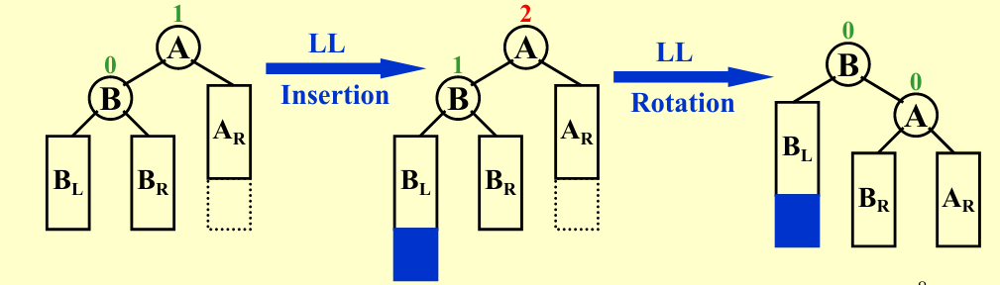
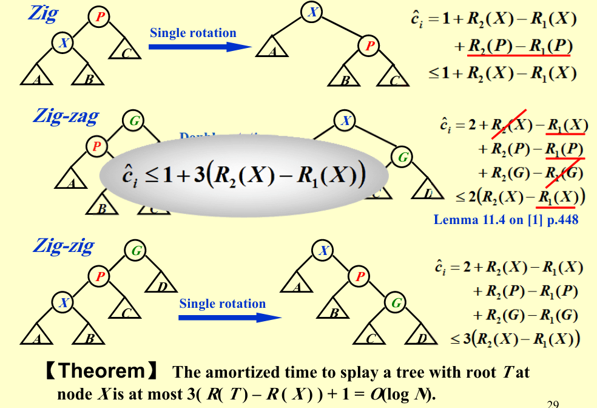

# ADS

> *第一节课就讲了AVL+Splay+摊还分析，让信息竞赛退役选手的我已经汗流浃背……*

## Data Structrure

----

### AVL

- 定义：任意节点左右子树**高度差**不大于1

- 复杂度分析：

    - 对于常见操作（插入、删除、查询）$O(h)$
    
    - 由定义，让高度最大，有$N_{h} = N_{h-1} + N_{h-2} + 1$
    
    - 化简，得到$(N_{h} + 1)= (N_{h-1} + 1) + (N_{h-2} + 1)$
    
    - 由斐波那契数列相关知识，得$N_h = F_{h+3} - 1$ (空树为-1)
    
    - 由此可得，$h = O(\log N)$

- 维护（Rotation）

    - 由定义的严格性，可知只要处理最小不平衡子树即可
    
    - **个人感觉旋转反而不够直观，更像是将下面的节点往上面“拎”起来，从而该节点（子树根节点）的各个儿子向两边“掉下去”，整棵子树也就像是被展平了一样更加平衡了**
    
    - LL / RR Rotation

        - 单链倾斜，将中间节点拎起来（将中间节点向上旋转）就好
        
        - 

    - LR / RL Rotation

        - 弯曲链，将权值为中间值（最下端儿子）的节点拎起来，该节点的两个儿子分别向两边掉下去
        
        - 还有一种理解，将这种情况理解为最下端儿子向上rotation两次 
        
        - 
    
- Code

```cpp title="AVL Tree" linenums="1"

struct Node{
    int data, H;
    Node *Ls, *Rs;
    Node(int data): data(data), H(0), Ls(NULL), Rs(NULL){}
    int Update(){
        int HL = -1, HR = -1;
        if(Ls != NULL) HL = Ls->H;
        if(Rs != NULL) HR = Rs->H;
        H = max(HL, HR) + 1;
        return abs(HL - HR);
    }
};
struct AVL{
    Node *Rot;
    
    //Structure
    void Clear(Node *x){
        if(x->Ls) Clear(x->Ls);
        if(x->Rs) Clear(x->Rs);
        delete x;
    }
    Node *Insert(Node *p, int x){
        if(p == NULL) return new Node(x);
        if(x < p->data) p->Ls = Insert(p->Ls, x);else p->Rs = Insert(p->Rs, x);

        if(p->Update() > 1) return Balance(p,x);
        return p;
    }
    void Rotate(Node **X, Node **Y, bool p){
        // p = 0 -> Left, p = 1 -> Right
        // rotate X to Y
        if(!p){
            (*Y)->Ls = (*X)->Rs;
            (*X)->Rs = *Y;
        }else{
            (*Y)->Rs = (*X)->Ls;
            (*X)->Ls = *Y;
        }
        (*Y)->Update(), (*X)->Update();
    }
    Node *Balance(Node *Trouble, int x){
        Node *G = Trouble, *F, *X;
        bool p, q;
        if(x < G->data) F = G->Ls, p = 0;else F = G->Rs, p = 1;
        if(x < F->data) X = F->Ls, q = 0;else X = F->Rs, q = 1;
        if(p ^ q) Rotate(&X, &F, q), Rotate(&X, &G, p);
            else Rotate(&F, &G, p), X = F;
        return X;
    }

    void Print(Node *x){
        printf("%d ",x->data);
        if(x->Ls) Print(x->Ls);
        if(x->Rs) Print(x->Rs);
    }

    // User
    void Clear(){if(Rot) Clear(Rot);Rot = NULL;}
    void PrintRoot(){printf("%d\n",Rot->data);}
    void Insert(int x){Rot = Insert(Rot, x);}
    
}Tree;

```

----

### Splay

- 每次查询时，将查询的节点旋转到根节点，从而在过程中将树展平

- *由于动态自适应等特性，实际上splay树非常强大*

- 均摊复杂度：$O(\log N)$

- 维护（ZigZag）

    - 目的与AVL略有不同，AVL完全是为了保持树的平衡，而Splay是为了将查询的节点向上移动的同时尽量展平树（一般为每次考虑当前节点、父节点和祖先节点，选择最合适的旋转方法）
    
    - Zig
        
        - 已经是根节点的儿子，直接向上旋转一次即可
        
        -  
    
    - ZigZig
    
        - 倾斜链，将当前节点的父节点向上旋转一次，再将当前节点向上旋转一次
        
        - *不能直接将当前节点向上旋转两次，因为这样会导致倾斜链歪向另一边*

        - 也可以看成直接将当前节点往最上面一提，剩下的儿子们“纷纷”往下掉

        - 
    
    - ZigZag 
    
        - 弯曲链，直接将当前节点向上旋转两次
        
        - 也可以看成直接将当前节点往最上面一提，两个儿子被父节点和祖先节点均分，从而趋向平衡
        
        -  

- Code (Not checked yet)

```cpp title="Splay Tree" linenums="1"

struct Node{
    Node *fa, *v[2];
    int data;
    Node (int x, Node *F, Node *Pivot):data(x),fa(F),v{Pivot, Pivot}{}
};
typedef Node *Pt;
Pt NUL;// A trick to avoid NULL pointer
struct SplayTree{
    Pt Rot;
    void Print(Pt i){// Preorder
        if(i == NUL) return;
        cout << i->data << " ";
        Print(i->v[0]), Print(i->v[1]);
    }
    bool Is(Pt i){return (i->fa->v[1] == i);}// 0: left son, 1: right son
    void Rotate(Pt i){ // Rotate i to its father
        Pt F = i->fa, G = F->fa; bool p = Is(i), q = Is(F);
        F->v[p] = i->v[p ^ 1], i->v[p^1]->fa = F;
        F->fa = i, i->v[p^1] = F;
        G->v[q] = i, i->fa = G;
    }
    void Splay(Pt i){// Splay i to the root
        while(i->fa != NUL){
            if(i->fa->fa != NUL) Rotate(Is(i) == Is(i->fa) ? i->fa : i), Rotate(i);
                else Rotate(i);
        }
        Rot = i;
    }
    void Insert(Pt &i, Pt F, int x){
        if(i == NUL) return (void)(Splay(i = new Node(x, F, NUL)));
        Insert(i->v[x > i->data], i, x);
    }

    // User Interface
    void Clear(){Rot = NUL = new Node(-1, NULL, NULL);}
    void Print(){Print(Rot);cout << endl;}
    void Insert(int x){Insert(Rot, NUL, x);}
    void Find(int x){
        Pt i = Rot;
        while(i != NUL && i->data != x) i = i->v[x > i->data];
        if(i != NUL) Splay(i);
    }
    void Delete(int x){
        Find(x);// Splay x to the root
        if(Rot->v[0] == NUL) Rot = Rot->v[1], Rot->fa = NUL;
        else{
            Pt i = Rot->v[0], X = Rot;
            while(i->v[1] != NUL) i = i->v[1];// Find the maximum in the left subtree
            Splay(i);
            i->v[1] = X->v[1], X->v[1]->fa = i;
        }
    }
}Tree;

```

----

### B+ Tree

> 一种多路搜索树，常用于数据库索引、文件系统等

- **特征** （Order of M）

    - 根节点有$[2,M]$个子节点
    
    - 其余非叶节点有$[[\frac{M+1}{2}],M]$个子节点，用 K - 1 个关键字进行区间划分
    
    - 所有叶节点在同一层，且都在最底层, 且都有$[[\frac{M+1}{2}],M]$个关键字

- 优势：

    - 可以看出，B+树的高度非常低，整棵树总体上非常“扁平”，因而查询效率非常高

    - 由于叶节点都在同一层，若对兄弟节点间建立指针，可以很方便的进行范围查询

- 维护

    - 插入

        - 从根节点开始，找到合适的叶节点，插入关键字
        
        - 若叶节点关键字数目超过上限，将节点均分为$[\frac{M+1}{2}],[\frac{M}{2}]$两部分，并更新划分关键字为右半边的最小值
        
        - 递归向上，若父节点关键字数目超过上限，分裂为$[\frac{M+1}{2}],[\frac{M}{2}]$两部分，并更新父节点处关键字为**中间剩余的一个划分关键字**
        
        - 若到达根节点，则新建节点，即全树高度加一
    
    - 删除
    
        - 从根节点开始，找到合适的叶节点，删除关键字
        
        - 若叶节点关键字数目低于下限，找到兄弟节点，若兄弟节点关键字数目大于下限，和兄弟平分节点
        
        - 若兄弟节点关键字数目也低于下限，将当前节点与兄弟节点合并，删除父节点处的一个关键字
        
        - 递归向上，对父节点进行相同操作
        
        - 若到达根节点，且根节点关键字数目为0，删除根节点，即全树高度减一        
        
- Code (Delete Not Carefully Checked yet)

我觉得B+树最恶心的一点就在于他的内部节点与叶结点定义的不一致性，导致编写代码非常麻烦（*对于我这种具有“统一性写法”强迫症的人来说*）

结果就是白白花费数小时去写掺杂着各种 IsLeaf 运算的式子，和无穷无尽的Debug

因此，**惨痛教训：很多时候可以通过简单分类，增加代码长度，大大降低编码复杂度！！！** 

```cpp title="B+ Tree" linenums="1"
const int Order = 5;
struct Node{
    int M;                  //  Number of keys
    int Key[Order + 1];     //  Keys
    Node* Child[Order + 1]; //  Children
    Node *Ls, *Rs;          //  Left and Right Sibling
    int Height;              //  Height of the node for printing
    Node(){
        M = Height = 0;
        Ls = Rs = NULL;
        for(int i = 0; i <= Order; i++) Child[i] = NULL, Key[i] = 0;
    }
    Node *Split(){
        Node *j = new Node();
        j->Height = Height;
        j->Rs = Rs, Rs = j, j->Ls = this;
        if(Height){ // Internal Node
            for(int k = (Order + 1 >> 1); k < M ; k++){
                j->Key[j->M] = Key[k], j->Child[j->M] = Child[k];
                j->M++;
            }
            j->Child[j->M] = Child[M], M = (M - 1 >> 1);
        }else{  // Leaf Node
            for(int k = (Order + 1 >> 1); k < M ; k++) j->Key[j->M++] = Key[k];
            M = (M + 1 >> 1);
        }
        return j;
    }
};
int tp[Order << 1]; Node *tq[Order << 1];
struct BpTree{
    Node *Rot;
    #define IsLeaf(x) ((x)->Height == 0)
    void Insert(Node *i, Node *F, int x){
        int k;
        if(IsLeaf(i)){// Leaf Node can contain more keys
            for(k = 0; k < i->M; k++) if(i->Key[k] == x) return (void)(printf("Key %d is duplicated\n", x));
            while(k && i->Key[k - 1] > x) i->Key[k] = i->Key[k - 1], k--;
            i->Key[k] = x, i->M++;
            return;
        }

        // search for the child to insert
        for(k = 0; k < i->M; k++) if(i->Key[k] > x) break;
        Insert(i->Child[k], i, x);
        if(i->Child[k]->M - (IsLeaf(i->Child[k])) < Order) return;

        // split the child
        Node *j = i->Child[k]->Split();
        for(int t = i->M; t > k; t--) i->Child[t + 1] = i->Child[t], i->Key[t] = i->Key[t - 1];
        i->Child[k + 1] = j, i->Key[k] = i->Child[k]->Key[i->Child[k]->M], i->M++;
    }
    int GetChild(Node *F, Node *i){
        for(int k = 0; k <= F->M; k++) if(F->Child[k] == i) return k;
        return -1;
    }
    void Delete(Node *i, Node *F, int x){
        int k;
        if(IsLeaf(i)){
            for(k = 0; k < i->M; k++) if(i->Key[k] >= x) break;
            if(i->Key[k] != x) return;
            i->M--;
            for(; k < i->M; k++) i->Key[k] = i->Key[k + 1];
            return;
        }
        for(k = 0; k < i->M ; k++) if(i->Key[k] > x) break;
        Node *s = i->Child[k], *t = k == i->M ? i->Child[k - 1] : i->Child[k + 1];
        Delete(s, i, x);
        if(s->M + 1 - IsLeaf(s) >= (Order + 1 >> 1)) return;
        
        if(k == i->M) swap(s,t), k--;// s --> t
        if(IsLeaf(s)){ // cope with leaf node
            if(s->M + t->M > Order){// Borrow from sibling
                int cnt = (s->M + t->M >> 1), M = 0;
                for(int j = 0; j < s->M; j++) tp[++M] = s->Key[j];
                for(int j = 0; j < t->M; j++) tp[++M] = t->Key[j];//merge together

                s->M = t->M = 0;
                for(int j = 1;j <= cnt; j++) s->Key[s->M++] = tp[j];//average
                for(int j = cnt + 1; j <= M; j++) t->Key[t->M++] = tp[j];
                i->Key[k] = t->Key[0];
            }else{ // merge leaf
                for(int j = 0; j < t->M; j++) s->Key[s->M++] = t->Key[j];
                i->M--;
                for(int j = k; j < i->M; j++) i->Key[j] = i->Key[j + 1], i->Child[j + 1] = i->Child[j + 2];
                s->Rs = t->Rs;
                if(t->Rs != NULL) t->Rs->Ls = s;
            }
        }else{
            if(s->M + 1 + t->M + 1 > Order){// Borrow from sibling(average with sibling)
                int cnt = (s->M + t->M >> 1), M = 0;
                for(int j = 0; j < s->M; j++) tp[++M] = s->Key[j], tq[M] = s->Child[j];
                tp[++M] = i->Key[k], tq[M] = s->Child[s->M];
                for(int j = 0; j < t->M; j++) tp[++M] = t->Key[j], tq[M] = t->Child[j];
                tq[M + 1] = t->Child[t->M];//merge together
                
                s->M = t->M = 0;
                for(int j = 1; j <= cnt; j++) s->Key[s->M] = tp[j], s->Child[s->M++] = tq[j];
                s->Child[s->M] = tq[cnt + 1];
                for(int j = cnt + 2; j <= M; j++) t->Key[t->M] = tp[j], t->Child[t->M++] = tq[j];
                t->Child[t->M] = tq[M + 1];//average
                i->Key[k] = tp[cnt + 1];
            }else{
                s->Key[s->M] = i->Key[k];
                for(int j = 0; j < t->M; j++) s->Key[++s->M] = t->Key[j], s->Child[s->M] = t->Child[j];
                s->Child[++s->M] = t->Child[t->M];
                i->M--;
                for(int j = k; j < i->M; j++) i->Key[j] = i->Key[j + 1], i->Child[j + 1] = i->Child[j + 2];
            }
        }
    }

    // interface for user
    void Clear(){Rot = new Node();}
    void Insert(int x){
        Insert(Rot, NULL, x);
        Node *i = Rot;
        if(i->M - IsLeaf(i) >= Order){// Split the root if necessary
            Rot = new Node();
            Node *j = i->Split();
            Rot->Key[0] = i->Key[i->M], Rot->M = 1, Rot->Child[0] = i, Rot->Child[1] = j;
            Rot->Height = i->Height + 1;
        }
    }

    void Delete(int x){
        if(Rot == NULL) return(void)(puts("Empty"));
        Delete(Rot, NULL, x);
        if(!Rot->M) Rot = Rot->Child[0];
    }
    void Print(){// BFS
        if(Rot == NULL) return (void)(puts("Empty"));
        queue<Node*> Q;
        Q.push(Rot);
        int lst = Rot->Height;
        while(!Q.empty()){
            Node *x = Q.front(); Q.pop();
            if(x->Height != lst) putchar('\n'), lst = x->Height;
            putchar('[');
            for(int i = 0; i < x->M - 1; i++) printf("%d,", x->Key[i]);
            printf("%d]", x->Key[x->M - 1]);
            for(int i = 0; i <= x->M; i++) if(x->Child[i] != NULL) Q.push(x->Child[i]);
        }
        puts("");
    }
}B;
```

----

### RB Tree

*第二节课就讲手撕红黑树 & B+树，这就是ZJU的ADS, 恐怖如斯……*

> 一种自平衡二叉查找树，常用于C++ STL中的set和map，以及Linux内核中的进程调度等
>
> 效率较高且比一般平衡树稳定，但实现……

- **特征（熟记？！）**

    1. 每个节点要么是红色，要么是黑色
    
    2. 根节点是黑色
    
    3. 每个叶节点都为NIL节点，且为黑色
    
    4. 不能有两个相邻的红色节点
    
    5. 从任一节点到其每个叶节点的所有路径都包含相同数目的黑色节点*（也正是基于此我们定义了树的黑高）*

- **复杂度分析**

- 常见操作均为$O(logN)$

> 首先定义黑高 bh(x) 为从节点 x 到其每个叶节点的简单路径上黑色节点数目（不包括自己）

- 证明：

    - 首先，由红黑树定义，$h(x) <= 2bh(x)$
    
    - 使用数学归纳法，对于任意节点 x，其子树的节点数目 $N(x) >= 2^{bh(x)} - 1$
    
        - 因为对于任意节点，其子节点的黑高为 bh(x) 或 bh(x) - 1
        
        - 从而由归纳假设，有 $N(x) >= 2^{bh(x) - 1} - 1 + 2^{bh(x) - 1} - 1 + 1 = 2^{bh(x)} - 1$
    
    - 综上，得证     

- **维护**
    
    *主要参考了算法导论，感觉相对于课件，将子树的分布画出来，更加清晰明了一些*

    - **我觉得，本质上插入和删除最关注的还是黑高的维护，因此关键步骤都是在调整树的形态的同时，如何对黑高不产生影响**
    
        - 基于同高度同时变化的不变
            
            - 黑下放：将黑色节点的两个红色儿子变为黑色，自己变为红色
        
            - 黑上提：将两黑色儿子的黑色汇聚到红色的父亲身上，儿子变红 
        
        - 旋转不变
        
            - 在旋转时，若下方待转节点为红色，则旋转后继承其原本父节点的颜色，原本父节点变红，黑高不变
            
            - 特别的，红节点转来转去并不会对黑高产生影响   

    - 插入 
        
        - 按正常二叉排序树的方式，插入一个红色节点 —— 此时不会影响黑高，但可能出现两个相邻的红色节点，从而需要进行调整
          
          *（插入黑色节点会对到根整条路径产生破坏，更加难调整）*

        - 简单情况：父节点为黑色，不需要调整
        
        - **复杂情况：父节点为红色，插入主要关注“叔”节点**（z为当前节点，y为叔节点）
        
            - Case 1
            
                - 叔节点为红色，则祖父节点必为黑色，那么实行一次“黑下放”操作，将祖父节点的黑色向下传递到其子节点，自己变为红色即可

                  
 
            - Case 2 & Case 3
                
                - Case 2, 叔节点为当前节点的同侧节点，则可以通过当前节点的一次旋转，变为异侧的情况（此时 z 变成原来的父节点了）
                
                - Case 3, 叔节点为当前节点的异侧节点，而父节点为红色，可以通过一次上述的不变旋转完成调整
                
                - *从结果来看，实际上是非常好理解的，本质上就是下图中 A < B < C, 从而应将B旋转到最中央，使平衡树尽可能平衡* 
                
                      
    
    - 删除 

        - 和一般的二叉查找树一样，先用节点的前驱/后继节点替换（颜色不变），然后删除前驱/后继节点
        
        - 这样可能会导致删除了黑色节点影响黑高，或者出现两个相邻的红色节点
        
        - 简单情况：删除的节点为红色，不会产生影响，不需要调整
        
        - **复杂情况：删除了黑色节点，影响很大，会导致多个特征不符合**
        
            **本质上，就是导致了替换节点 x 这颗子树的黑高都偏少了1, 所以接下来就是讨论如何优雅地将他们全部+1**

            下面讨论替换节点 x 为黑色的情况（红色的话直接染黑即可，还可以顺便避免相邻红色节点），**删除主要关注兄弟节点 w** 
        
            - Case 1
                
                - 兄弟节点为红色，则进行一次上述的不变旋转，将兄弟节点变为黑色，父节点变为红色（红节点上方下方，原来必黑），转化为下面要讨论的情形

                

            - Case 2
            
                - 兄弟节点为黑色，且兄弟节点的两个儿子都为黑色, 则干脆将兄弟节点变为红色，这样当前节点和兄弟节点的子树相当于“扯平”了都差1，从而可以向上递归调整，即当前待调整节点变为父节点
                
                

            - Case 3
            
                - 兄弟节点为黑色，且兄弟节点的异侧子节点为黑色，同侧子节点为红色，此时可以通过一次不变旋转，将该红色节点变为黑色兄弟，并获得异侧子节点，转化为Case 4
                
                 
                
            - Case 4
            
                - 兄弟节点为黑色，且兄弟节点的异侧子节点为红色，此时将父节点旋转下来强制染黑来补偿子树黑高，兄弟节点旋转到上方并继承父节点的颜色，**并将剩下的一个儿子也染黑**，维护其余子树的黑高不变，直接Over（可以检查每颗子树所经过的路径，恰好完美符合，**过于巧妙！**）

                   

    - *上面提到的都是自底向上调整的方法，还有一种自顶向下的办法，即在用循环插入/寻找关键字的同时对树的形态进行维护和调整，使得插入/删除后树的形态直接满足要求，这种方法会跑得更快一点*

- Code 

*面向Luogu P3369平衡树模板题写的，跑得嘎嘎快，这就是RBTree! 但是花了我一下午debug！！！*

**主要注意空节点的一些处理（提前将对应指针记下来防止后面被更改），以及及时更新根节点的指针**

```cpp title="Red Black Tree" linenums="1"
const int INF = 1e9;
enum Color {RED, BLACK};
struct Node{
    int data, size; // size denotes the number of nodes in subtree x
    Color color;
    Node *v[2], *F;
    Node(int x = 0, Color c = BLACK, Node *fa = NULL, Node *NIL = NULL){
        data = x, size = 0, color = c, F = fa;
        v[0] = v[1] = NIL;
    }
    void Update(){size = v[0]->size + v[1]->size + 1;}
};
typedef Node *Pt;
Pt NIL = new Node(-1, BLACK, NIL, NIL);
struct RBTree{
    Node *Rot;
    #define Is(i) ((i)->F->v[1] == (i))
    void Rotate(Pt i){ // Rotate i to i->F
        Pt F = i->F; bool p = Is(i), q = Is(F);
        F->v[p] = i->v[p ^ 1], i->v[p ^ 1]->F = F;// first cope with external nodes
        i->F = F->F, F->F->v[q] = i;               // then i and F
        F->F = i, i->v[p ^ 1] = F;
        F->Update(), i->Update();
        if(F == Rot) Rot = i;
    }
    void FixUp_Insert(Pt i){
        while(i->F->color == RED){
            bool p = Is(i), q = Is(i->F) ^ 1;
            Pt F = i->F, U = F->F->v[q];
            
            if(U->color == RED){ // case 1: uncle is red, black down
                F->color = U->color = BLACK;
                F->F->color = RED, i = F->F;
                continue;
            }

            if(p == q){ // case 2: uncle is black but same side, rotate to case 3
                Rotate(i);
                swap(i, F), p ^= 1;
            }

            // case 3: uncle is black and different side, rotate and recolor
            F->color = BLACK, F->F->color = RED;
            Rotate(F);
            break;
        }
    }
    void Insert(Pt &i, Pt fa, int x){
        if(i == NIL){
            i = new Node(x, RED, fa, NIL), i->size = 1;
            FixUp_Insert(i);
            return;
        }
        i->size++, Insert(i->v[x > i->data], i, x);
    }
    Pt Find(Pt i, int x){
        if(i == NIL) return NIL;
        i->size--;
        if(i->data == x) return i;
        return Find(i->v[x > i->data], x);
    }
    void FixUp_Delete(Pt i){
        // Print();
        while(i != Rot && i->color == BLACK){
            bool p = Is(i);
            Pt F = i->F, S = F->v[p ^ 1];
            if(S->color == RED){ // case 1: sibling is red
                S->color = BLACK, F->color = RED;
                Rotate(S);
                S = F->v[p ^ 1];
                // if(S == NIL) assert(i != NIL);
            }
            
            if(S->v[0]->color == BLACK && S->v[1]->color == BLACK){ // case 2: sibling is black and both children are black
                S->color = RED, i = F;
                continue;
            }

            if(S->v[p ^ 1]->color == BLACK){ // case 3: sibling is black and the child in the opposite side is black
                S->v[p]->color = BLACK, S->color = RED;
                Rotate(S->v[p]);// rotate to case 4
                S = F->v[p ^ 1];
            }

            // case 4: sibling is black and the child in the opposite side is red
            S->color = F->color, F->color = BLACK, S->v[p ^ 1]->color = BLACK;
            Rotate(S);
            i = Rot;
        }
        i->color = BLACK;
    }
    int Rank(Pt i, int x){
        if(i == NIL) return 0;
        if(i->data < x) return i->v[0]->size + 1 + Rank(i->v[1], x);
        return Rank(i->v[0], x);
    }
    int Kth(Pt i, int k){
        if(i->v[0]->size + 1 == k) return i->data;
        if(i->v[0]->size + 1 < k) return Kth(i->v[1], k - i->v[0]->size - 1);
        return Kth(i->v[0], k);
    }
    int Pre(Pt i, int x){
        if(i == NIL) return -INF;
        if(i->data < x) return max(i->data, Pre(i->v[1], x));
        return Pre(i->v[0], x);
    }
    int Next(Pt i, int x){
        if(i == NIL) return INF;
        if(i->data > x) return min(i->data, Next(i->v[0], x));
        return Next(i->v[1], x);
    }

    // interface for user
    void Clear(){Rot = NIL;}
    void Insert(int x){
        Insert(Rot, NIL, x);
        Rot->color = BLACK;
    }
    void Delete(int x){
        Pt i = Find(Rot, x);
        Color dc = i->color;// deleted color
        if(i == NIL) return;
        if(i->v[0] == NIL || i->v[1] == NIL){ // i has at most one child
            bool p = (i->v[1] != NIL);
            i->v[p]->F = i->F, i->F->v[Is(i)] = i->v[p];
            i = i->v[p];
            if(i->F == NIL) Rot = i;
        }else{
            Pt j = i->v[0];j->size--;
            while(j->v[1] != NIL) j = j->v[1], j->size--;// maximum in left subtree

            dc = j->color;
            i->data = j->data;// replace i with j
            i = j->v[0], i->F = j->F, j->F->v[Is(j)] = i; // delete j
        }
        if(dc == BLACK) FixUp_Delete(i);
    }
    int Rank(int x){return Rank(Rot, x);}
    int Kth(int k){return Kth(Rot, k);}
    int Pre(int x){return Pre(Rot, x);}
    int Next(int x){return Next(Rot, x);}
}Tree;

```

----

## Algorithm

----

### Amortized Analysis (摊还分析)

- **Aggregated Analysis (聚类分析)**

    - 对于一个长度为N的操作序列，若该操作序列的最坏时间复杂度为T(N),则该操作序列的平均时间复杂度（摊还代价）为 T(N) / N
    
    - 简单粗暴，但是很多时候不够精确，因为 T(N) 并不一定好求 

- **Accounting Method (核算法)**

    - 为每个操作分配一个额外摊还代价，从而便于估计总代价
    
    - 常见理解： 将额外分配的代价视为存钱，之后的一些操作可以通过取钱来解决，从而使得总代价不会超过预期
    
    - *个人感觉*，不如直接从定义式上去理解
        
        - $\sum_{i=1}^{n}c_i + \sum_{i=1}^{n}t_i \leq \sum_{i=1}^{n}a_i$
        
        - $c_i$ 为实际每一步的代价，$t_i$ 为额外摊还代价，$a_i$ 为估计的摊还代价
        
        - 因而只要让$t_i \geq 0$, 就能保证分析的复杂度一定是上界。换句话说，类似于数列放缩，通过合理~~（玄学）~~的分配权值，使得总和不会超过预期

- **Potential Method（势能法）**

    - 给每个状态分配一个势能，将摊还代价视为势能的变化
    
        - $c_i$ 为实际每一步的代价，$a_i$ 为估计的摊还代价，$\Phi_i$ 为势能
        
        - $\Phi_0 = 0$
        
        - $c_i + \Phi_i - \Phi_{i-1} =a_i$  

        - 两边求和，得到 $\sum_{i=1}^{n}c_i + \Phi_{n} = \sum_{i=1}^{n}a_i$
    
    - 从而相当于获得比核算法更加宽松的条件，我们不再需要每一步的摊还代价都为正，只要选择一个玄学的势能函数（考虑题目特性），保证最后一个状态的势能为正即可

    - Splay Tree

        - 选择势能函数 $\Phi = \sum_{i=1}^{n}log(size_i)$, 即为每个节点的子树大小之和
        
        - 对三种旋转操作进行分别分析，可以证明，每次旋转的摊还代价为 $O(logN)$
        
        - 

----