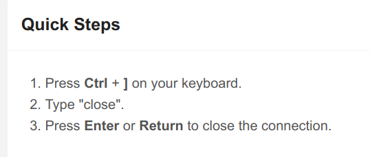

# Bandit

> Learning linux commands and security concepts for fun!

## Level 0

```bash
ssh bandit0@bandit.labs.overthewire.org -p 2220
password: bandit0
```

## Level 0 -> Level 1

```bash
cat readme
password: ZjLjTmM6FvvyRnrb2rfNWOZOTa6ip5If

# du - estimate file space usage
```

## Level 1 -> Level 2

```bash
# - is a special character as argument, representing stdin/stdout
# func1 | func2 - pipe the output of func1 as input to func2
cat ./-
password: 263JGJPfgU6LtdEvgfWU1XP5yac29mFx
```

## Level 2 -> Level 3

```bash
# spaces in filename: escape with '/' or use quotes
cat spaces\ in\ this\ filename
cat "spaces in this filename"
cat spaces*
password: MNk8KNH3Usiio41PRUEoDFPqfxLPlSmx
```

## Level 3 -> Level 4

```bash
# hidden files start with '.'
find . -name "*"
ls -a
password: 2WmrDFRmJIq3IPxneAaMGhap0pFhF3NJ
```

## Level 4 -> Level 5

```bash
# file - determine file type
file inhere/* # will get only one ASCII text file(others are data)
cat inhere/-file07
password: 4oQYVPkxZOOEOO5pTW81FB8j8lxXGUQw
```

## Level 5 -> Level 6

```bash
# find - search for files in a directory hierarchy
find inhere -size 1033c | xargs cat
password: HWasnPhtq9AVKe0dmk45nxy20cvUa6EG
```

## Level 6 -> Level 7

```bash
# find - search for files in a directory hierarchy
find / -user bandit7 -group bandit6 -size 33c 2>/dev/null | xargs cat
password: morbNTDkSW6jIlUc0ymOdMaLnOlFVAaj
```

## Level 7 -> Level 8

```bash
# grep - print lines matching a pattern
grep "millionth" data.txt
password: dfwvzFQi4mU0wfNbFOe9RoWskMLg7eEc
```

## Level 8 -> Level 9

```bash
# sort - sort lines of text files
# uniq - report or omit repeated lines
# sort | uniq - sort and remove duplicates
sort data.txt | uniq -u
password: 4CKMh1JI91bUIZZPXDqGanal4xvAg0JM
```

## Level 9 -> Level 10

```bash
# strings - print the strings of printable characters in files
strings data.txt | grep "=="
password: FGUW5ilLVJrxX9kMYMmlN4MgbpfMiqey
```

## Level 10 -> Level 11

```bash
# base64 - base64 encode/decode data and print to standard output
# base64 is a simple encoding scheme that encodes binary data as text, not encryption
base64 -d data.txt
password: dtR173fZKb0RRsDFSGsg2RWnpNVj3qRr
```

## Level 11 -> Level 12

```bash
# tr - translate or delete characters, use array inference to map characters
# tr 'A-Za-z' 'N-ZA-Mn-za-m' - ROT13
tr 'A-Za-z' 'N-ZA-Mn-za-m' < data.txt
password: 7x16WNeHIi5YkIhWsfFIqoognUTyj9Q4
```

## Level 12 -> Level 13

```bash
# xxd - make a hexdump or do the reverse
xxd -r data.txt > data
file data
# data is a gzip compressed data
mv data data.gz
gzip -d data.gz
file data
# data is a bzip2 compressed data
mv data data.bz2
bzip2 -d data.bz2
file data
# data is a gzip compressed data
mv data data.gz
gzip -d data.gz
file data
# data is GNU tar archive
mv data data.tar
tar -xvf data.tar
file data5.bin
# data5.bin is a POSIX tar archive
mv data5.bin data5.tar
tar -xvf data5.tar
# data6.bin is a bzip2 compressed data
mv data6.bin data6.bz2
bzip2 -d data6.bz2
file data6
# data6 is a POSIX tar archive
mv data6 data6.tar
tar -xvf data6.tar
# data8.bin is a gzip compressed data
mv data8.bin data8.gz
gzip -d data8.gz
# data8 is a ASCII text file
cat data8
password: FO5dwFsc0cbaIiH0h8J2eUks2vdTDwAn
```

## Level 13 -> Level 14

```bash
# ssh user@host -i keyfile -p port
# gain correct port
cat /etc/ssh/sshd_config
ssh bandit14@localhost -i sshkey.private -p 2220
password: MU4VWeTyJk8ROof1qqmcBPaLh7lDCPvS
```

## Level 14 -> Level 15

```bash
# nc - arbitrary TCP and UDP connections and listens
# telnet - user interface to the TELNET protocol
echo "MU4VWeTyJk8ROof1qqmcBPaLh7lDCPvS" | nc localhost 30000
telnet localhost 30000
password: 8xCjnmgoKbGLhHFAZlGE5Tmu4M2tKJQo
```

## Level 15 -> Level 16

```bash
# openssl - OpenSSL command line tool
echo "8xCjnmgoKbGLhHFAZlGE5Tmu4M2tKJQo" | openssl s_client -connect localhost:30001 -ign_eof 
# -ign_eof防止文件EOF关闭连接
password: kSkvUpMQ7lBYyCM4GBPvCvT1BfWRy0Dx
```

## Level 16 -> Level 17

```bash
# nmap - Network exploration tool and security / port scanner
nmap -p 31000-32000 localhost
echo "kSkvUpMQ7lBYyCM4GBPvCvT1BfWRy0Dx" | openssl s_client -connect localhost:31790 -ign_eof
password: private.key
chmod 400 private.key
ssh bandit17@localhost -i privatekey -p 2220
```

??? danger "private key"

    ```
    MIIEogIBAAKCAQEAvmOkuifmMg6HL2YPIOjon6iWfbp7c3jx34YkYWqUH57SUdyJ
    imZzeyGC0gtZPGujUSxiJSWI/oTqexh+cAMTSMlOJf7+BrJObArnxd9Y7YT2bRPQ
    Ja6Lzb558YW3FZl87ORiO+rW4LCDCNd2lUvLE/GL2GWyuKN0K5iCd5TbtJzEkQTu
    DSt2mcNn4rhAL+JFr56o4T6z8WWAW18BR6yGrMq7Q/kALHYW3OekePQAzL0VUYbW
    JGTi65CxbCnzc/w4+mqQyvmzpWtMAzJTzAzQxNbkR2MBGySxDLrjg0LWN6sK7wNX
    x0YVztz/zbIkPjfkU1jHS+9EbVNj+D1XFOJuaQIDAQABAoIBABagpxpM1aoLWfvD
    KHcj10nqcoBc4oE11aFYQwik7xfW+24pRNuDE6SFthOar69jp5RlLwD1NhPx3iBl
    J9nOM8OJ0VToum43UOS8YxF8WwhXriYGnc1sskbwpXOUDc9uX4+UESzH22P29ovd
    d8WErY0gPxun8pbJLmxkAtWNhpMvfe0050vk9TL5wqbu9AlbssgTcCXkMQnPw9nC
    YNN6DDP2lbcBrvgT9YCNL6C+ZKufD52yOQ9qOkwFTEQpjtF4uNtJom+asvlpmS8A
    vLY9r60wYSvmZhNqBUrj7lyCtXMIu1kkd4w7F77k+DjHoAXyxcUp1DGL51sOmama
    +TOWWgECgYEA8JtPxP0GRJ+IQkX262jM3dEIkza8ky5moIwUqYdsx0NxHgRRhORT
    8c8hAuRBb2G82so8vUHk/fur85OEfc9TncnCY2crpoqsghifKLxrLgtT+qDpfZnx
    SatLdt8GfQ85yA7hnWWJ2MxF3NaeSDm75Lsm+tBbAiyc9P2jGRNtMSkCgYEAypHd
    HCctNi/FwjulhttFx/rHYKhLidZDFYeiE/v45bN4yFm8x7R/b0iE7KaszX+Exdvt
    SghaTdcG0Knyw1bpJVyusavPzpaJMjdJ6tcFhVAbAjm7enCIvGCSx+X3l5SiWg0A
    R57hJglezIiVjv3aGwHwvlZvtszK6zV6oXFAu0ECgYAbjo46T4hyP5tJi93V5HDi
    Ttiek7xRVxUl+iU7rWkGAXFpMLFteQEsRr7PJ/lemmEY5eTDAFMLy9FL2m9oQWCg
    R8VdwSk8r9FGLS+9aKcV5PI/WEKlwgXinB3OhYimtiG2Cg5JCqIZFHxD6MjEGOiu
    L8ktHMPvodBwNsSBULpG0QKBgBAplTfC1HOnWiMGOU3KPwYWt0O6CdTkmJOmL8Ni
    blh9elyZ9FsGxsgtRBXRsqXuz7wtsQAgLHxbdLq/ZJQ7YfzOKU4ZxEnabvXnvWkU
    YOdjHdSOoKvDQNWu6ucyLRAWFuISeXw9a/9p7ftpxm0TSgyvmfLF2MIAEwyzRqaM
    77pBAoGAMmjmIJdjp+Ez8duyn3ieo36yrttF5NSsJLAbxFpdlc1gvtGCWW+9Cq0b
    dxviW8+TFVEBl1O4f7HVm6EpTscdDxU+bCXWkfjuRb7Dy9GOtt9JPsX8MBTakzh3
    vBgsyi/sN3RqRBcGU40fOoZyfAMT8s1m/uYv52O6IgeuZ/ujbjY=
    ```

## Level 17 -> Level 18

```bash
# diff - compare files line by line
diff passwords.old passwords.new
password: x2gLTTjFwMOhQ8oWNbMN362QKxfRqGlO
```

## Level 18 -> Level 19

```bash
# ssh -t command - force pseudo-tty allocation
ssh bandit18@localhost -t cat readme
password: cGWpMaKXVwDUNgPAVJbWYuGHVn9zl3j8
```

## Level 19 -> Level 20

```bash
# 类似于setuid，设置可执行文件的权限
./bandit20-do cat /etc/bandit_pass/bandit20
password: 0qXahG8ZjOVMN9Ghs7iOWsCfZyXOUbYO
```

### Level 20 -> Level 21

```bash
# nc - arbitrary TCP and UDP connections and listens
# nc -l - listen for incoming connections
# nc -l -p port - listen on port
# use tmux to keep the connection
nc -l -p 6666
./suconnect 6666

password: EeoULMCra2q0dSkYj561DX7s1CpBuOBt
```

### Level 21 -> Level 22

```bash
# cron - daemon to execute scheduled commands

cat /etc/cron.d/cronjob_bandit22
cat /usr/bin/cronjob_bandit22.sh
cat /tmp/t7O6lds9S0RqQh9aMcz6ShpAoZKF7fgv
password: tRae0UfB9v0UzbCdn9cY0gQnds9GF58Q
```

### Level 22 -> Level 23

```bash
cat /etc/cron.d/cronjob_bandit23
cat /usr/bin/cronjob_bandit23.sh
cat /tmp/$(echo I am user bandit23 | md5sum | cut -d ' ' -f 1)
password: 0Zf11ioIjMVN551jX3CmStKLYqjk54Ga
# easily get the next password as well
password: gb8KRRCsshuZXI0tUuR6ypOFjiZbf3G8
```

### Level 23 -> Level 24

```bash
# similar to Level 22 -> Level 23
```

### Level 24 -> Level 25

??? note "exit telnet"
    
    

```bash

# write a script to brute force the password

#!/bin/bash
# brute force script
for i in {0000..9999}; do
    echo $i
    res=$(echo "gb8KRRCsshuZXI0tUuR6ypOFjiZbf3G8 ${i}" | timeout -s SIGINT 0.01 nc localhost 30002)
    if [[ "$res" != *"Wrong"* ]]; then
        echo "Password found: ${i}"
        echo $res
        break
    fi
done

# run the script
./script.sh
password: iCi86ttT4KSNe1armKiwbQNmB3YJP3q4
```

### Level 25 -> Level 26

```bash
# use sshkey to login will be blocked
cat /etc/passwd | grep bandit26
# bandit26:x:11026:11026:bandit level 26:/home/bandit26:/usr/bin/showtext
cat /usr/bin/showtext
# the script changes the shell to more command and exits
# so we should resize the terminal and get into interactive mode to avoid the auto exit
ssh bandit26@localhost -p 2220 -i bandit26.sshkey
:e /etc/bandit_pass/bandit26
password: s0773xxkk0MXfdqOfPRVr9L3jJBUOgCZ
```

### Level 26 -> Level 27

```bash
# into vi
:set shell=/bin/bash
:shell
./bandit27-do cat /etc/bandit_pass/bandit27
password: upsNCc7vzaRDx6oZC6GiR6ERwe1MowGB
```

### Level 27 -> Level 28

```bash
git clone ssh://bandit27-git@localhost:2220/home/bandit27-git/repo
cat repo/README
password: Yz9IpL0sBcCeuG7m9uQFt8ZNpS4HZRcN
```

### Level 28 -> Level 29

```bash
# similar to Level 27 -> Level 28
git clone ssh://bandit28-git@localhost:2220/home/bandit28-git/repo
cat repo/README.md

# check git log
git log

# check details of the commit
git log -p

password: 4pT1t5DENaYuqnqvadYs1oE4QLCdjmJ7
```

### Level 29 -> Level 30

```bash
# similar to Level 27 -> Level 28
git clone ssh://bandit29-git@localhost:2220/home/bandit29-git/repo

# check git log
git log -p

# check hidden branches
git branch -a
git checkout dev
cat README.md

password: qp30ex3VLz5MDG1n91YowTv4Q8l7CDZL
```

### Level 30 -> Level 31

```bash
git clone ssh://bandit30-git@localhost:2220/home/bandit30-git/repo
cat repo/README.md
# just an empty file

# check git log
git log -p

# check hidden branches
git branch -a

# check the tag
git tag
git show secret

password: fb5S2xb7bRyFmAvQYQGEqsbhVyJqhnDy
```

### Level 31 -> Level 32

```bash
# wrte the demanding txt file
git add key.txt -f
git commit -m "add key.txt"
git push

password: 3O9RfhqyAlVBEZpVb6LYStshZoqoSx5K
```

### Level 32 -> Level 33

```bash
# UPPERCASE SHELL
# use $0 to get the shell
$0
cat /etc/bandit_pass/bandit33

password: tQdtbs5D5i2vJwkO8mEyYEyTL8izoeJ0
```

## Level 33

Hooraay! You have completed the Bandit challenges! 🎉
