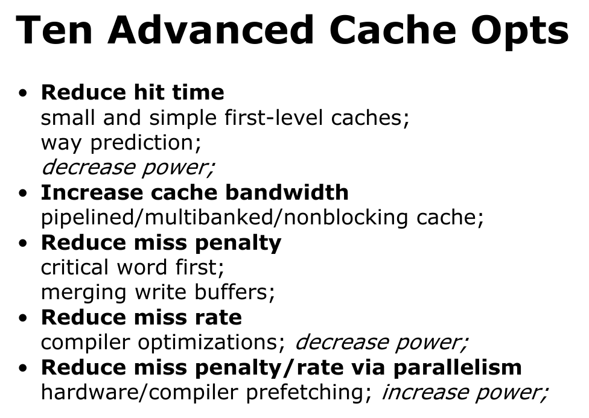
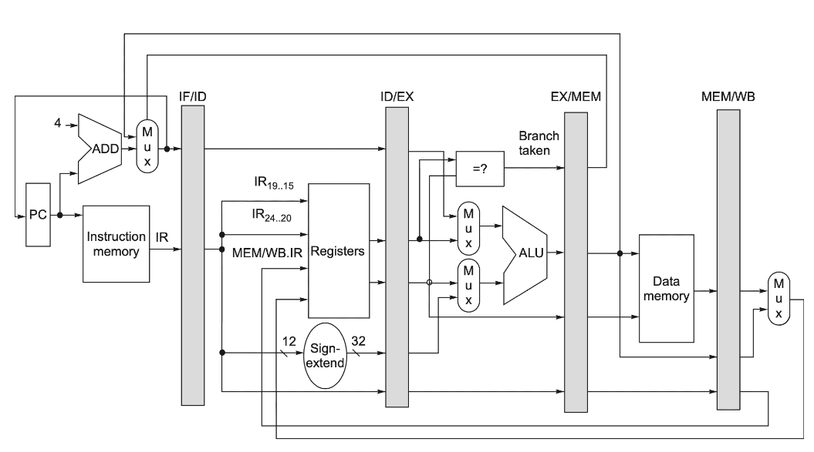
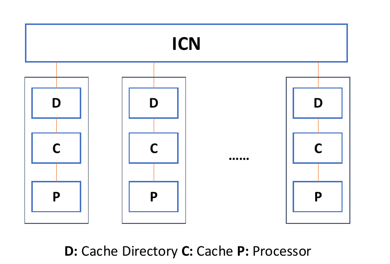
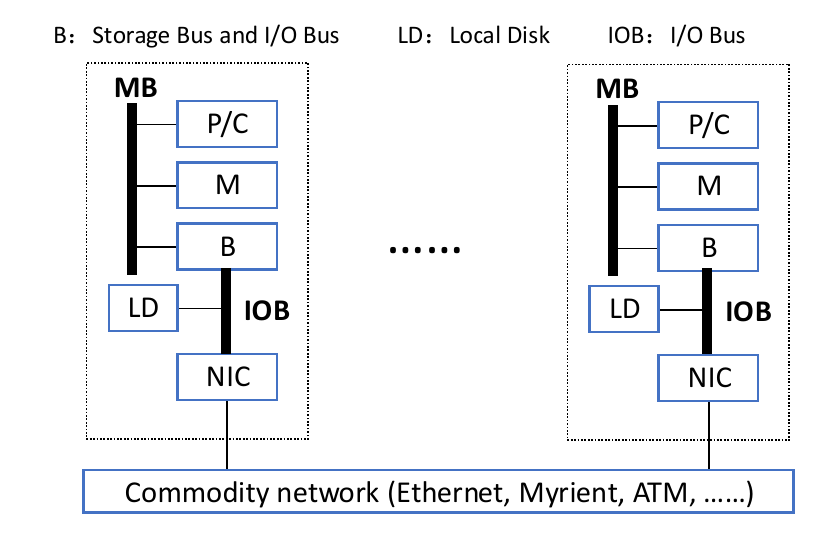
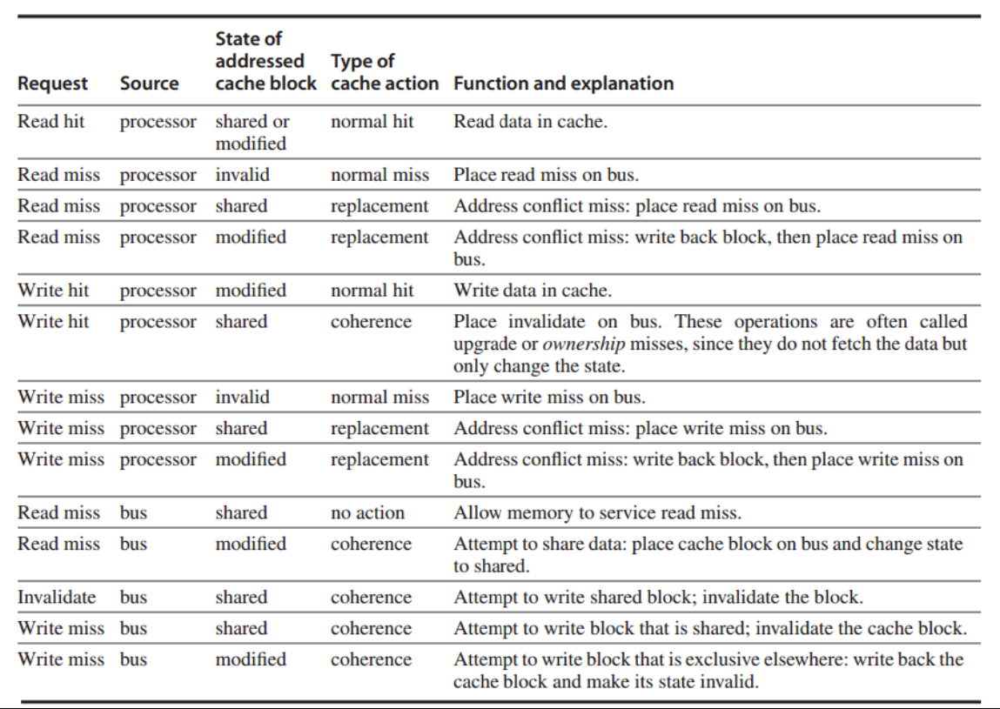
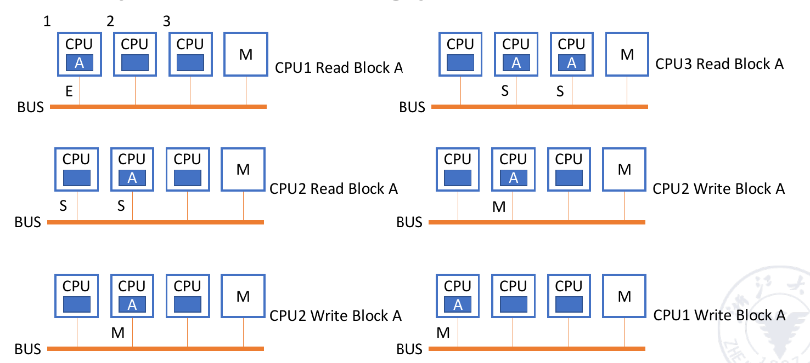

# 计算机体系结构

----

## Chapter 1

!!! note "一些公式"

    

    

### 芯片进化

- Moore's Law

- Dennard Scaling（微缩）

- Post-Moore's Era

    - 继续微缩
    
    - 封装技术
    
    - 高性能计算（如量子计算）

- Multi-Core parallelism

    - Amdahl's Law: $S = \frac{1}{(1-P)+\frac{P}{N}}$
    
    - Data-level parallelism
    
    - Task-level parallelism
    
    - Instruction-level parallelism
    
    - Thread-level parallelism    

### 种类

- PMD（便携式移动设备）

- Desktop

- Server

- Cluster / WSC(warehouse-scale computer)

- Embedded

### Power & Energy

> Power(功率) 代表单位时间的能量消耗，单位是瓦特
>
> Energy(能量) 代表总的能量消耗，是功率对时间的累积
>
> 因此，功率低不代表最终的能量消耗低

#### Energy-Save Strategy

- Do nothing well
    
    关闭不必要的任务

- DVFS(Dynamic Voltage and Frequency Scaling)

    动态调整电压和频率

- Design for typical case

    为典型情况设计

- Overclocking - Turbo mode

    超频，缩短任务时间来降低总消耗

### Reliability

!!! note "一些概念"
    - MTTF(Mean Time To Failure)
    - MTTR(Mean Time To Repair)
    - MTBF(Mean Time Between Failure) = MTTF + MTTR
    - Availability = MTTF / MTBF
    - FIT(Failures per billion hours) = $\frac{1}{MTTF}$
        
        

**Fault** （潜在BUG）-> **Error**（触发了潜在BUG） -> **Failure**（造成明显后果）

- Dependability V/S Redundancy

    - Time Redundancy

        多次重复执行同一个任务，来避免错误

    - Resource Redundancy

        多个资源，如多个disk, 来降低系统崩溃的概率

### RAID

[我的计组笔记](https://fightingff.github.io/notebooks/RiscV/#disk-storage-and-dependability)

### Performance

- CPU time
- Elapsed time(Wall-clock time / Response time)
- Benchmark

    > Benchmark是一种用来评估计算机性能的方法，通常是一段程序或者一组程序，用来测试计算机的性能

    - SPEC(Systerm Performance Evaluation Corporation)

### Quantitative Principle

- Parallelism

    - Amdahl's Law

- Locality

    - Temporal Locality(时间局部性)

    - Spatial Locality(空间局部性)

- CPU Performance

    - $CPU_{time} = IC \times CPI \times T$

        - $CPI = \frac{Cycles}{Instruction}$

        - $T = \frac{Seconds}{Cycle}$

        - $IC = Instruction Count$

    - $IPC = \frac{1}{CPI}$(CPU throughput)

## Chapter 2

!!! question "一些概念"

    - Latency
        - Access Time: 从CPU发出请求到数据返回的时间
        - Cycle Time: 两次连续的访问之间的时间
    - Bandwidth
        - Throughput: 每秒传输的数据量

!!! note "Miss"

    | 种类 | 解释 |
    | -- | -- |
    | compulsory miss | 冷启动失配，刚上电cache是空的，所以不论什么访问都要miss一次。cache越大compulsory miss越多。 | 
    | capacity miss | cache的容量大小不满足程序局部性时发生的失配，称为容量失配。cache的总大小增大，容量失配率减小，与关联度无关。 |
    | conflict miss | 在采用组关联和直接映像方式的cache中，主存的很多块都映射到cache的同一块，如果某块本来在cache中，刚被替换出去，又被访问到。有点像 OS 里页替换时讲到的“抖动”。关联度越大，Conflict失配越小。 |

### 优化DRAM

- Timing Signal： 连续访问不用再次激活
- Spatial Locality： 一次读取多个数据
- Wider DRAM: 提高贷款
- DDR: Double Data Rate
- Multiple Banks: 并行访问
- Dynamic Energy Saving: 动态调整电压和频率

### 优化Cache

Average Memory Access Time (AMAT) = Hit Time + Miss Rate x Miss Penalty

- **Larger Block Size**

    - 降低compulsory miss rate

    - 降低static power
    
    - 增加miss penalty（larger blocks)
   
    - 增加capacity/confilct miss rate (fewer blocks)

    {width = 80%}

- **Larger Cache Size**

    - 降低miss rate(capacity miss)
    
    - 增加hit time
    
    - 增加cost, power 

- **Higher Associativity**

    - 降低conflict miss rate
    
    - 增加hit time
    
    - 增加power

- **Multilevel Caches**

    - 减少 miss penalty
    
    - 减少power 

    - Multilevel inclusion
    
        L1 cache的所有块都在L2 cache中，L2 cache的所有块都在L3 cache中，以此类推

    - Multilevel exclusion 

        L1 cache的所有块都不在L2 cache中，L2 cache的所有块都不在L3 cache中，以此类推

    !!! tip

        AMAT = Hit time$_{L1}$ + Miss rate$_{L1}$ x(Hit time$_{L2}$ + Miss rate$_{L2}$ x Miss penalty$_{L2}$)

- **Prioritize Read Misses Over Writes**

    - 减少miss penalty

- **Avoiding Address Translation**

    - 减少hit time 

    - 手段

        - Virtual Address -> Physical Address

        - TLB(Translation Lookaside Buffer)

    !!! note "Virtual Memory"

        [计组笔记](https://xuan-insr.github.io/computer_organization/5_cache/#55-virtual-memory)

        本质上，初始的想法就是每次读取数据读两次，一次是到页表获取物理地址，一次是从物理地址读取数据

        为了减少开销，使用TLB这个高速cache（不在内存中，速度比内存快）来存储最近访问的数据的物理页地址，从而减少访问页表的次数

        {width = 80%}

        ??? tip "page size"
            
            - Small: 减少内存碎片带来的浪费
            - Large: 减少TLB entries 和 TLB miss rate
            - Multiple

### 超级优化

- **Small and Simple L1-Cache**

    - Small size
        - 增加时钟主频
        - 减少功耗
    - Lower associativity
        - 减少hit time
        - 减少功耗

- **Way Prediction**

    - 降低conflict miss 和 hit time
    - 添加block predictor bit，每次先通过预测的方式找到对应的block，同时并行进行正常的比较选择

- **Pipelined Access**

    - 通过pipeline的方式来访问cache
    - 增加带宽
    - 会导致更高的延迟和预测penalty

- **Multibanked Caches**

    - 通过多个bank并行访问，增大带宽，减少访问时间
    - 一般需要把地址“打散”到不同的bank中，从而可以并行访问

- **Non-blocking Caches**

    - 当出现miss时，不会阻塞后续的访问，从而提高效率
        - hit under miss
        - miss under miss
        - hit under multiple misses

- **Critical Word First**

    - 每次miss时总是从内存中读取一片数据，但CPU需要的只需要其中一部分。因此可以先返回cache line中需求的关键数据，然后再返回其他数据
    - 降低miss penalty

- **Early Restart**

    - 读到CPU需要的数据后，CPU可以先开始执行，而不用等到整个cache line都读取完毕（往往就是配合上面的Critical Word First）

- **Merging Write Buffer**

    - 把多个写请求打包成一个写请求，减少写请求的次数
    - 降低miss penalty

- **Compiler Optimization**

    - 通过编译器优化，增加局部性，从而减少miss rate
    - Loop interchange

        通过调整循环次序，使得内存访问更加连续

        ??? example

            
    
    - Blocking
    
        通过分块，使得内存访问更加连续，如矩阵乘法

        ??? example

            

- **Hardware Prefetching**

    - 通过预测CPU的访问模式，提前把数据读入cache
    - 降低miss rate和miss penalty（但是也可能造成额外的miss）
        - Instruction prefetch
        - Data prefetch

- **Compiler Prefetching**

    - 通过编译器预测CPU的访问模式，加入prefetch，提前把数据读入cache
        - Register prefetch
        - Cache prefetch 
    - 降低miss rate和miss penalty

- **HBM**

    - 先进封装技术，使用high-bandwidth memory作为L4 cache（对于一般的DRAM,需要多次访问才能读取完整的cache line，一次访问tag, 一次访问data）
        - 把 tag 和 data 放在同一行中
        - alloy cache, 把tag和data混合在一起

### Protection

#### Virtual Memory

!!! note "4 Tasks"

    - User Mode / Kernel Mode
    - Accessible Processor state
    - Mode Switch
    - Limit Memory Access

#### Virtual Machine

> VM: a protection mode with a much smaller code base than the full OS
>
> VMM: software that supports VMs
>
> Host: underlying OS

- 优势

    - 同一个物理机上可以运行多个虚拟机
    - 多个虚拟机可以共享硬件资源
    - 隔离性、安全性、隐私性高

- 劣势

    - 微小的性能下降

### ISA

## Chapter 3

### ILP (Instruction Level Parallelism)

??? "RiscV"

    

    

    

    

#### Pipelining

> 通过流水线并行提高总体的运行效率（latency hidding）
>
> 注意load balance，或者增加流水线层级来降低某一环节的延迟，因为流水线的频率取决于最慢的环节
>
> 

- Floating-Point Operation

    > 一般来说，浮点数运算的延迟比整数运算要长

    - 降低时钟频率：导致整个流水线其他指令的速度也会下降
    
    - 多个功能单元：增加硬件成本，从而加速浮点数运算 

- Structure Hazard

    - Hardware Bandwidth

        - 通过增加硬件资源，增加带宽，从而提高效率

    - Interlock Detection

        - ID、MEM冲突，进行重新排序
    
- Data Hazard

    - WAW（Write After Write）

        - 两个指令同时写入，后者会覆盖前者的结果，可能会由于指令运行速度不同而导致错误（比如前面的指令运行较慢，后面的指令先写入，导致最终留下了前面指令的写入结果）
    
    - RAW（Read After Write）

        - 一个指令读取了另一个指令的写入结果，但是另一个指令还没有写入，导致读取错误的结果，因此需要等待另一个指令写入完成再读取
    
    - WAR（Write After Read）

        - 一个指令写入了一个寄存器，另一个指令读取了这个寄存器，但是读取的指令先执行，导致读取错误的结果，因此需要等待写入完成再读取

- **Exploitation** 

    - Compiler-based static parallelism

        - Loop unrolling

            - 通过展开循环，增加指令级并行性

        - Software pipelining

            - 通过重组指令，增加指令级并行性
    
    - Hardware-based dynamic parallelism 

- Data Dependence（真依赖）

    只有RAW

- Name Dependence（假依赖）

    !!! question
    
        （假设指令i先于指令j执行 & i,j指令靠得很近）
    
        - Anti Dependence(WAR)：i读取Rx, j写入Rx，本质上没有依赖，但是i,j的执行顺序不能颠倒
        - Output Dependence(WAW)：i写入Rx, j写入Rx，本质上没有依赖，但是i,j的执行顺序不能颠倒
  
    Register Renaming: 通过重命名寄存器，使得不同指令可以使用相同的寄存器，从而避免数据冲突

- Control Dependence

    - Branch Hazard
    
        - Stall: 等待分支结果
        - Predict: 预测分支结果
            
            - Static Prediction
                固定预测策略

            - Dynamic Prediction
             
                > 越复杂，消耗越大，利用的历史信息越多
            
                - 1-bit predictor（last time BHT）：根据上一次的结果来预测
                    
                - 2-bit predictor（BHT）：根据多次的结果来预测
                     
                - Branch-target buffer（BTB）：存储分支目标地址，减少分支延迟
                    

                ??? tip "others"
                    - Local predictor：根据当前指令的历史来预测
                    - Correlating predictor：根据多个不同指令的历史来预测
                    - Two-level predictor：根据两个预测器的结果来预测，获得更多global信息
                    - Hybrid / Alloyed predictor：多种预测器混合使用
        
        - Delayed Branch: 延迟分支，即先执行后面一些无关指令，等待分支结果（尽早解决，减少延迟）

    - Loop Unrolling

        - 减少循环branch跳转
        - 但是要考虑Instruction Cache容量问题，不一定展开越多越好
    
    - Dynamic Scheduling

        - Out-of-order

#### Scoreboard

> 使用数据流的形式，通过硬件来解决数据冲突
>
> 本质上利用乱序执行来提高效率
>
> 

- Four Steps

    - Issue: 选择可以执行的指令(如果指令对应的功能部件空闲，且指令要写的目标寄存器没有别的指令将要写< WAW 冒险>)
    - Read Operands: 读取操作数(RAW 冒险)
    - Execution
    - Write Back: 结果写回(WAR 冒险)

- Functional Unit Status

    - Busy : 该功能单元是否被占用
    - Op : 该功能单元执行的指令
    - Fi : 目标寄存器
    - Fj, Fk ： 源寄存器
    - Qj, Qk ： **指向源寄存器的计算单元的指针**
    - Rj, Rk ： 源寄存器是否就绪，读完之后状态会改写成No

#### Tomasulo Algorithm

> 消除WAW, WAR依赖
>
> 通过添加RS（Reservation stations）存储操作数

- Register Renaming

    - WAR: rename latter/destination
    - WAW: rename former 

- Seven fields:
    - Op : 操作类型
    - Qj, Qk : 源操作数
    - Vj, Vk : **源操作数的值**
    - A : load/store地址
    - Busy : 是否被占用

- Three Steps

    - Issue: 选择可以执行的指令(唯一标准是指令对应通路的保留站是否有空余位置)
    - Execution: 从保留站中读取操作数，执行指令
    - Write Back: 结果写回

!!! danger

    Scoreboard由于是从寄存器堆读取数据，因此会有一个RO阶段，并且应该是等WB阶段完成后下一个阶段才能读

    Tomasulo由于保留站会听取CDB的广播，因此可以在WB阶段之后立即开始执行，不用再读（有些load指令这种等一个周期是为了计算地址）

### ROB

> 通过Reorder Buffer来解决数据冲突
>
> 3 fields: instruction type, destination address, value
>
> 本质上相当于给寄存器堆建立了一个缓冲区，用来存储指令的结果，给指令执行增加一个commit阶段，从而实现**乱序执行、顺序commit**

在Tomosulo算法的基础上，把Qj,Qk改为指向ROB的指针，并增加一个指向ROB的指针，用来指向下一个commit的指令

### Multi-Issue Processor

- SuperScalar

    > 通过多个流水线来提高效率，每次流出多个指令

- VLIM（Very long instruction word）

    > 将一个很长的指令拆分成多个

- Super Pipeline

    > 阶段数超级多的流水线，每个阶段进一步细分

## chapter 4

### DLP

#### SIMD

- Vector Processor

    D = A * (B + C)
    
    - Horizontal: 一行行做

        

    - Vertical： 一列列做

        

    - Horizontal + Vertical： 行分组，一列列算

        

    

    !!! tip "Improvemnt"

        - Parallelism: 通过多个不同功能单元并行
        - link：类似forwarding, 把结果直接传递，而不用重复存储
        - Segments： 把数据分成多个片段，分别计算
        - Multi-Processor: 多个处理器并行计算
            - Multiple-Lane: 多个lane并行计算
            - Gather-Scatter: 通过gather和scatter,即引用index来提高效率

- Array Processor

    - 通过多个处理器并行计算，每个处理器计算一个元素
    - 关键点是如何连接通信网络，实现数据的传递

- GPU： Multi-Thread SIMD

- LLP: Loop-Level Parallelism

    - 关节点在判断/解决循环能否并行化，“跨循环迭代”

    ??? example

        

### TLP

#### MIMD

!!! note "分类"

    - Multiple-Processor: Based on shared memory
        

    - Multiple-Computer: Based on message passing
         

- **Architecture**

    

    ??? info "SMP & DSP"

        

    - UMA: Uniform Memory Access（SMP）

        

        每个处理器地位均等，访问内存的时间相同

        每个处理器也可以有自己的cache、private memory等

    - NUMA: Non-Uniform Memory Access（DSP）

        

        访问本地内存的时间短，访问远程内存的时间长

        如果有Cache，就会有Cache Coherence问题，本质就是让所有处理器使用时好像在共用同一个Cache
    
    - COMA: Cache-Only Memory Access

        

        没有内存，只有cache，通过cache来访问数据, 本质上是NUMA的一种变种

    - *MPP: Massive Parallel Processing

        

    - *COW: 在MPP基础上，实现异构体系结构

        

!!! danger "Memory Consistence & Cache Conherence"

    

    - Memory Consistence: 多线程访问同一位置时，先写后读，保证读到的是最新的数据

    - Cache Conherence: 保证所有处理器使用的是同一个cache

### Cache Coherence

> UMA: Snoopy Protocol
>
> NUMA: Directory Protocol

#### Snoopy Protocol

- Write through

    

- Write back

    - CPU 层面
        

    - Bus 层面
    
        

- MSEI

    

    

    !!! example

        

#### Directory Protocol

本质上是对BUS的一种优化，通过Directory优化数据通信与传递

其中Shares就用来记录每个物理块在哪些处理器上有副本，从而方便查找

- CPU 层面

    

- Directory 层面

    

### *Memory Consistence

- Relax

    > allow reads and writes to complete out of order, but to use synchronization operations to enforce ordering

    

    ??? example

        - TSO

            

        - PSO

            