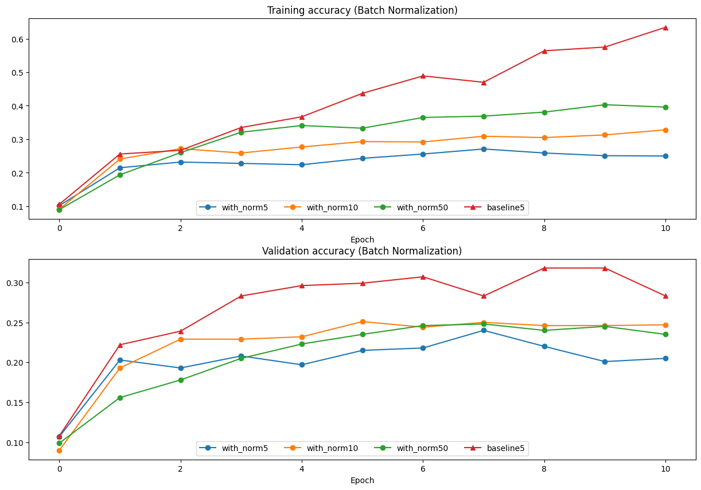
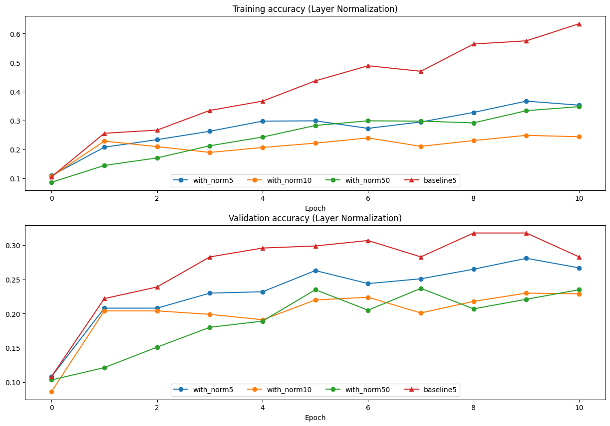
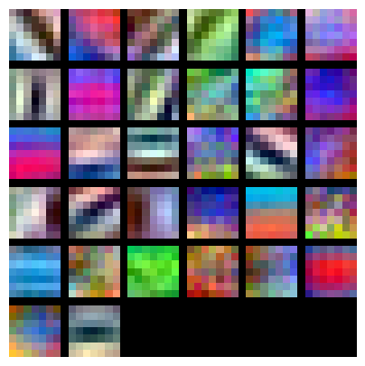
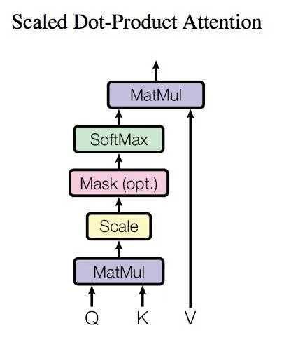
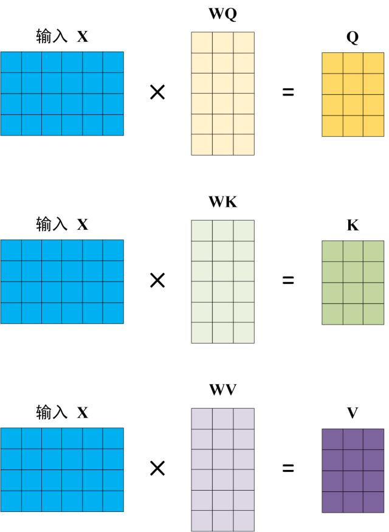

# CS 231n

> Systematical learning **Machine Learning in CV**

---

## Resources

- [My Repository](https://github.com/fightingff/CS231n)
- [Official Notes](https://cs231n.github.io)
- [Course Website](http://cs231n.stanford.edu/)

---

## Some newly-learned thoughts

### Training sets, validation sets & test sets

- We should isolate the test sets with the training process, "just test the final model at the very end" to avoid overfitting
- Often validation sets are extracted from training sets

### Parameters in Linear Model

- We can view the Weight Matrix as a set of templates, and the scores as the similarity between the input and the templates
- So when printing the weights, we can somehow visualize the templates we learned
- Picture below is what we learned from the CIFAR-10 dataset using SVM
  

### SVM (Support Vector Machine)

- **Hinge Loss**: $L_i = \sum_{j\neq y_i} \max(0, s_j - s_{y_i} + margin)$, so-called **max-margin loss** because it encourages the correct class to have a score higher than the incorrect class by at least a margin
- The hinge loss is "easy to be satisfied" since it only cares about the margin, not the exact value of the score (*e.g. [1,0] & [100,-100] both have the same loss when the margin is 1*)

### Differentiation on Vectors

- **Split**: Trying to do the differentiation on a smaller vector or even a single element instead of a matrix.

> For example, solving Softmax - Cross Entropy Loss:
> $x$ is a 1-D linear vector
> $\frac{\partial{Loss}}{\partial{x}}=\frac{\partial{Loss}}{\partial{score}} \frac{\partial{score}}{\partial{x}}= -\frac{1}{score_i} \frac{\partial{score_i}}{\partial{x_i}}=-\frac{1}{score_i} score_i (score_i - (y_i == i))$

- **Dimension**: Use Dimension to check or gain a overview of the result.

### Process

- **Preprocessing matters a lot.**

    - **Mean subtraction**: Subtract the mean of the data, thus the data should be centered around the origin
    - **Normalization**: Divide the data by the standard deviation, thus the data should be normalized to a similar scale
    - **PCA**: Reduce the dimension of the data, thus the data should be more efficient to compute.For example, SVD etc.
    - **Feature extraction**: Extract the features from the raw data, thus the data should be more informative to the model. For example, HOG, Color Histogram etc.
    - **Data Augmentation**: Generate more data from the original data, thus the model should be more robust to the noise. For example, flip, rotate, crop etc.

- **Training**

    - **Optimization**: The gradient descent, the stochastic gradient descent, the mini-batch gradient descent, the momentum, the RMSprop, the Adam etc.
    - **Hyparameter Debug**: The learning rate, the regularization strength, the number of hidden units, the number of layers, the number of epochs, the batch size etc.
    - **Monitor the Process**: The loss, the accuracy, the gradient, the weights, the features etc.
    - **Visualize the Result**: The weights, the features, the templates etc.

---

## Assignment

---

### Assignment 1

#### K-NN (K Nearest Neighbors)

- No training, just memorizing the data
- In prediction, compute the **Distance** with every sample (**Costly**)
- Use K-fold cross validation to find the best K. Concretely speaking, split the training sets into K folds, and choose each as validation set, and evaluate the model finally.

#### SVM (Support Vector Machine)

- **Hinge Loss**: $L_i = \sum_{j\neq y_i} \max(0, s_j - s_{y_i} + margin)$
- **Regularization**: $L = \frac{1}{N} \sum_i L_i + \frac{1}{2}\lambda |W|^2$, where $\lambda$ is the regularization strength
- **Gradient Descent**:

    - $W -= \alpha \nabla_W L$,
    - $\nabla_W L_{yi} = - \Sigma_{j \neq y_i}1(w_jx_i + \Delta > 0)x_i$
    - $\nabla_W L_i = 1(w_jx_i + \Delta > 0)x_i$

#### Softmax

- **Cross Entropy Loss**: $L_i = -\log(\frac{e^{score_{y_i}}}{\Sigma_j e^{score_j}})$
- **Gradient Descent**: $W -= \alpha \nabla_W L$, where $\nabla_W L_i = -x_i(\frac{e^{score_{y_i}}}{\Sigma_j e^{score_j}} - 1)$

#### 2-Layer Network

- Combination of the lessons above. Not so hard to complete.
- *Softmax gradient, however, seems hard to do right? But the final implement of training 2-layer network runs well and achieves the accuray of about 50%*
- 

#### Feature Extraction

- **Color Histogram**: Count the number of pixels in each color channel
- **HOG (Histogram of Oriented Gradients)**: Count the number of gradients in each direction
- **Training on raw pixel V/S on features**: After extracting the features, the model can outperform the raw pixel model a lot.

---

### Assignment 2

----

#### Fully Connected Neural Network

- Multi-layer packaged class
- **Optimization**
    - **SGD**(Stochastic Gradient Descent):

        > $W -= \alpha \ d_W$
        >

        - Simplest way (converge slowly)

    - **SGD_Momentum**:

        > $v = \beta v - \alpha \ d_W$
        >

        > $W += v$
        >

        - Simulate the physical process as ball rolling down the hill
    
    - **RMSprop**:

        > $cache = \beta cache + (1-\beta) d_W^2$
        >

        > $W -= \alpha \frac{d_W}{\sqrt{cache} + \epsilon}$ ($\epsilon$ avoids division by zero)
        >

        - Adjust the learning rate adaptively, but the gradient may become too small
    
    - **Adam**:

        > $m = \beta_1 m + (1-\beta_1) d_W$
        >

        > $v = \beta_2 v + (1-\beta_2) d_W^2$
        >

        > $mt = \frac{m}{1-\beta_1^t}$
        >

        > $vt = \frac{v}{1-\beta_2^t}$
        >

        > $W -= \alpha \frac{mt}{\sqrt{vt} + \epsilon}$
        >

        - Combine the advantages of **RMSprop** and **Momentum**

#### **Normalization**

- **Batch Normalization**:

    - Normalize the input of each layer, thus the model should be more robust to the noise and the gradient should be more stable, - But the performance depends on the batch size a lot.
    - [Gradient reference](https://kratzert.github.io/2016/02/12/understanding-the-gradient-flow-through-the-batch-normalization-layer.html)

- **Layer Normalization**:

    - Normalize the input of each sample, thus the model should be more robust to the noise and the gradient should be more stable.
    - But the performance may be influenced by the feature dimensions.
    - Gradient is easy. We can transpose the matrix and transform the problem into the batch normalization.
    - **(N,D) -> (D,N)**

- *Problem: The result of my code seems somewhat strange, like normalization works worse than without normalization. I think the problem may be the learning rate or the batch size, but I have no energy to debug it.*
  
  

#### **Dropout**

- Randomly set some neurons to zero, thus the model should be more robust to the noise and the overfitting should be avoided.
- `mask = (np.random.rand(*x.shape) < p) / p`
- `p` is the probability of keeping a neuron active, and thus the mean of the output (or mathematical expectation) should be the same as the input.

#### **Convolutional Neural Network**

- **Convolution Layer**

    - Filter

        - The learned template to extract the features
        - Often $3*3*C$ with stride 1
        - **Share parameters**. Using the same filter to do convolution on the whole input, thus the model should be more efficient to compute and the number of parameters should be highly reduced.
        - *Too large filter may lead to a linear model, and costs more memory.*
        - Examples of features

          

    - Padding

        - Add some zeros around the input, thus the output should be the same size as the input, which is convenient for the next layer to compute.
        - Avoid the information loss on edges.
        - $P = \frac{F-1}{2}$, where $F$ is the size of the filter

    - Pooling

        - Max Pooling: $max(x)$ (Popular in practice, often $2 * 2$)
        - Average Pooling: $mean(x)$
        - Reduce the size of the input, thus the model should be more efficient to compute and the number of parameters should be highly reduced.
        - Avoid the overfitting and the noise.
    
    - **Layer Strutcture**

        - Input: $N * C * H * W$
        - Filter: $F * C * HH * WW$
        - Output: $N * F * H' * W'$
        - Activation (often Relu): $N * F * H' * W'$
        - Pooling: $N * F * H'' * W''$
  
  - **Normalization**

      - Spatial Batch Normalization

          - Similar to Batch Normalization.
          - `X = x.transpose(0, 2, 3, 1).reshape(-1, C)`
      
      - Group Normalization

          - Similar to Layer Normalization.
          - `X = x.reshape(N*G, -1)`

#### **PyTorch**

- Useful tool to build the model and train the model
- [Tutorial](https://pytorch.org/tutorials/)
- [Docs](https://pytorch.org/docs/stable/index.html)
- **Structure**

    - `nn.Module`

        - Personalized model, more flexible
        - Implement `forward` function

    - `nn.Sequential`

        - Simple model, just concatenate the layers

- **Optimization**

    - `optim.SGD`
    - `optim.Adam`
    - `optim.RMSprop`
    - Backward Propagation
    
    ```

        optimizer.zero_grad() # clear

        loss.backward()       # backpropagation
        
        optimizer.step()      # update
    ```

- **Training**

----

### Assignment 3

----

#### Visualizing

- **Salicency Maps**

    - A **saliency map** tells us the degree to which each pixel in the image affects the classification score for that image. 
    - To compute it, we compute the gradient of the unnormalized score corresponding to the correct class with respect to the pixels of the image.
    - Or say, it visualizes the feature map of the input image.

- **Fooling Images**

    - We can perform **gradient ascent** on the input image to maximize the class score, stopping when the network classifies the image as the target class. 
    - In practice, the fooling images often just looks like blurring the original image a little bit.

- **Class Visualization**

    - We can also synthesize an image to maximize the classification score of a particular class 
    - Or say, visualizes what the network thinks various classes look like.
    - *Looks like AIGC images*

#### RNN Captioning

- **Vanilla RNN**

    - The simplest RNN, but the gradient may vanish or explode.
    - Use the hidden state to store the information of the previous time step, and use the input to update the hidden state.
    - > $h_t = \tanh(W_{hh}h_{t-1} + W_{xh}x_t)$
      >
      > $y_t = W_{hy}h_t$
    - *The gradient is easy to compute, but the performance is not so good.*

- **LSTM**

    - The most popular RNN, with the forget gate, the input gate, the output gate.
    - The gradient is easy to compute, and the performance is good.
    - > $f_t = \sigma(W_{hf}h_{t-1} + W_{xf}x_t + b_f)$
      >
      > $i_t = \sigma(W_{hi}h_{t-1} + W_{xi}x_t + b_i)$
      >
      > $o_t = \sigma(W_{ho}h_{t-1} + W_{xo}x_t + b_o)$
      >
      > $g_t = \tanh(W_{hg}h_{t-1} + W_{xg}x_t + b_g)$
      >
      > $c_t = f_t \odot c_{t-1} + i_t \odot g_t$
      >
      > $h_t = o_t \odot \tanh(c_t)$

#### Transformer

- [Attention Is All You Need](https://arxiv.org/abs/1706.03762)

- *Actually I havn't understood it well yet today, 2024.2.27*

- **Structure**

    - Basic structure in paper:

    

    - Abstract structure:

    

- **Attention Mechanism**

    - **Self-Attention**

        - Scaled Dot-Product Attention
        
          > $Attention(Q,K,V) = softmax(\frac{QK^T}{\sqrt{d_k}})V$
          >
          > Q is the query, K is the key, V is the value 

          

        - Use Dot-Product to compute the relationship between the query and the key, and use the softmax to normalize the result.
        
        - Finally multiply the value with the normalized result, converting the attention score to the output. 
    
    - **Multi-Head Attention**

        - Compute the attention score with multiple parallel attention mechanisms, and concatenate the result.
        
          

        - Thus the model should be more expressive and the performance should be better, for multiple attention mechanisms can capture different features.

- Embedding

    - **Positional Encoding**

        - Since transformer discards the sequential information, we need to add the positional encoding to the input embedding.

        - Just add the position embedding to the input embedding.
        
          > $PE(pos,\ 2i) \ \ \ \ \ \ = \sin(pos/10000^{2i/d_{model}})$
          >
          > $PE(pos,2i+1) = \cos(pos/10000^{2i/d_{model}})$

        - Use the sine and cosine function to encode the position information, because it's easy to add length when training length changes.

    - Word Embedding

        - Use the pre-trained word embedding, or train the word embedding with the model.

        - Similar to that of RNN.

- Other Tricks

    - Residual Connection

    - Normalization
    
    - Feed Forward Network
    
    - Optimizer 

- **Training**

    - **Input features**
        
        - **Embedding**

            - Embedding the features annd positional encoding
        
        - **Encoders** 
        
            - **Multi-Head Attention**
            
                - Compute the attention score with multi-head attention, where both the query, the key and the value are derived from the input features
                
                  

                - It looks like the input query with itself, or say, the input features are used to compute the attention score (relationships) with itself, so it's called self-attention. 

            - **Multi-layers** 
                
                - Multiple feed forward network with residual connection and normalization
        
    - Output words (Expected Answers)
    
        - **Embedding**

            - **Feed in the Output in parallel**
              
              > For example 
              >
              > Split a sentence into N datas where $O_i$ contains the first $i$ words, and is to predict the next one. 
              >
              > Thus the model should be more efficient to train in parallel.
          
            - **Mask**
            
                - To train the model in parallel, we need to mask the future words, otherwise the model may cheat.
                
                - A trilled matrix is great to mask the future words.
        
        - **Decoders**
        
            - **2 Multi-Head Attention**
            
                - Self. 
                
                    Compute the attention score with multi-head attention, where the query, the key and the value are all derived from the output features.

                - Combine.
                   
                    Compute the attention score with multi-head attention, where the query is derived from the output features, and the key and the value are derived from the input features.
                
            
            - **Multi-layers**

- **Prediction**

    - Output starts with a <start> token.

    - Use the model to pick the next most possible word, and feed it back to the model.

    - Repeat until the <end> token is picked.

- *Some thoughts of my opnion*

    - Compared to CNN, the transformer can access the global information, ganining the ability to capture the long-range dependencies, and thus the performance should be better.

    - Compared to RNN, the transformer can train in parallel instead of sequentially, and thus the model should be more efficient to train.

