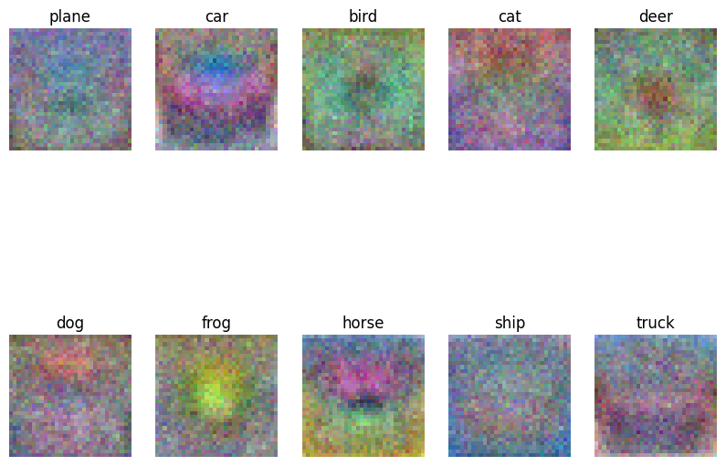

# CS 231n

> Systematical learning **Machine Learning in CV**

----

## Resources

- [My Repository](https://github.com/fightingff/CS231n)
- [Official Notes](https://cs231n.github.io)
- [Course Website](http://cs231n.stanford.edu/)

----

## Some newly-learned thoughts

### Training sets, validation sets & test sets

- We should isolate the test sets with the training process, "just test the final model at the very end" to avoid overfitting

- Often validation sets are extracted from training sets 

### Parameters in Linear Model

- We can view the Weight Matrix as a set of templates, and the scores as the similarity between the input and the templates

- So when printing the weights, we can somehow visualize the templates we learned 

- Picture below is what we learned from the CIFAR-10 dataset using SVM
    

### SVM (Support Vector Machine)

- **Hinge Loss**: $L_i = \sum_{j\neq y_i} \max(0, s_j - s_{y_i} + margin)$, so-called **max-margin loss** because it encourages the correct class to have a score higher than the incorrect class by at least a margin

- The hinge loss is "easy to be satisfied" since it only cares about the margin, not the exact value of the score (*e.g. [1,0] & [100,-100] both have the same loss when the margin is 1*)

### Differentiation on Vectors

- **Split**: Trying to do the differentiation on a smaller vector or even a single element instead of a matrix.
> For example, solving Softmax - Cross Entropy Loss:
> $x$ is a 1-D linear vector
> $\frac{\partial{Loss}}{\partial{x}}=\frac{\partial{Loss}}{\partial{score}} \frac{\partial{score}}{\partial{x}}= -\frac{1}{score_i} \frac{\partial{score_i}}{\partial{x_i}}=-\frac{1}{score_i} score_i (score_i - (y_i == i))$

- **Dimension**: Use Dimension to check or gain a overview of the result.

----

## Assignment

----

### Assignment 1

#### K-NN (K Nearest Neighbors)

- No training, just memorizing the data

- In prediction, compute the **Distance** with every sample (**Costly**)

- Use K-fold cross validation to find the best K. Concretely speaking, split the training sets into K folds, and choose each as validation set, and evaluate the model finally. 

#### SVM (Support Vector Machine)

- **Hinge Loss**: $L_i = \sum_{j\neq y_i} \max(0, s_j - s_{y_i} + margin)$

- **Regularization**: $L = \frac{1}{N} \sum_i L_i + \frac{1}{2}\lambda |W|^2$, where $\lambda$ is the regularization strength

- **Gradient Descent**: 
    - $W -= \alpha \nabla_W L$,
    - $\nabla_W L_{yi} = - \Sigma_{j \neq y_i}1(w_jx_i + \Delta > 0)x_i$
    - $\nabla_W L_i = 1(w_jx_i + \Delta > 0)x_i$

#### Softmax

- **Cross Entropy Loss**: $L_i = -\log(\frac{e^{score_{y_i}}}{\Sigma_j e^{score_j}})$

- **Gradient Descent**: $W -= \alpha \nabla_W L$, where $\nabla_W L_i = -x_i(\frac{e^{score_{y_i}}}{\Sigma_j e^{score_j}} - 1)$ 

#### 2-Layer Network

- Combination of the lessons above. Not so hard to complete.
- *Softmax gradient, however, seems hard to do right? But the final implement of training 2-layer network runs well and achieves the accuray of about 50%*
- 