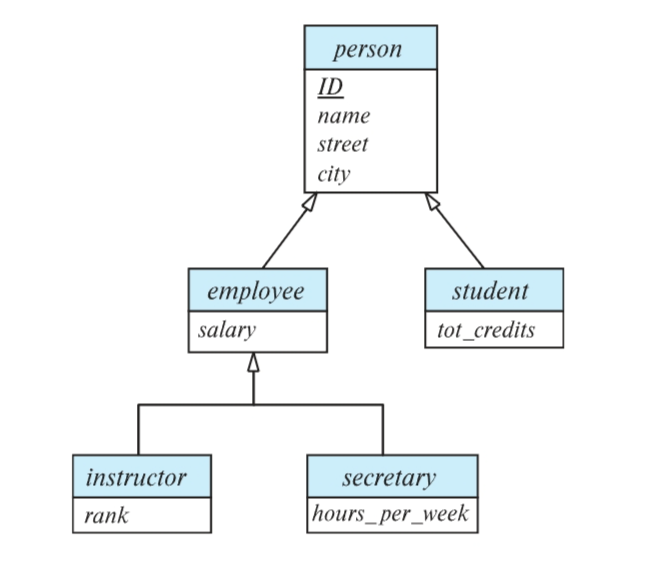
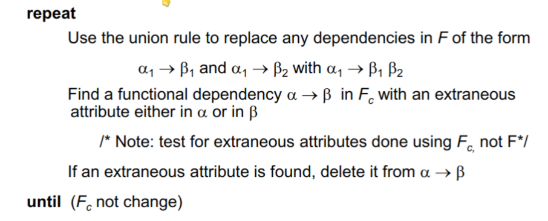
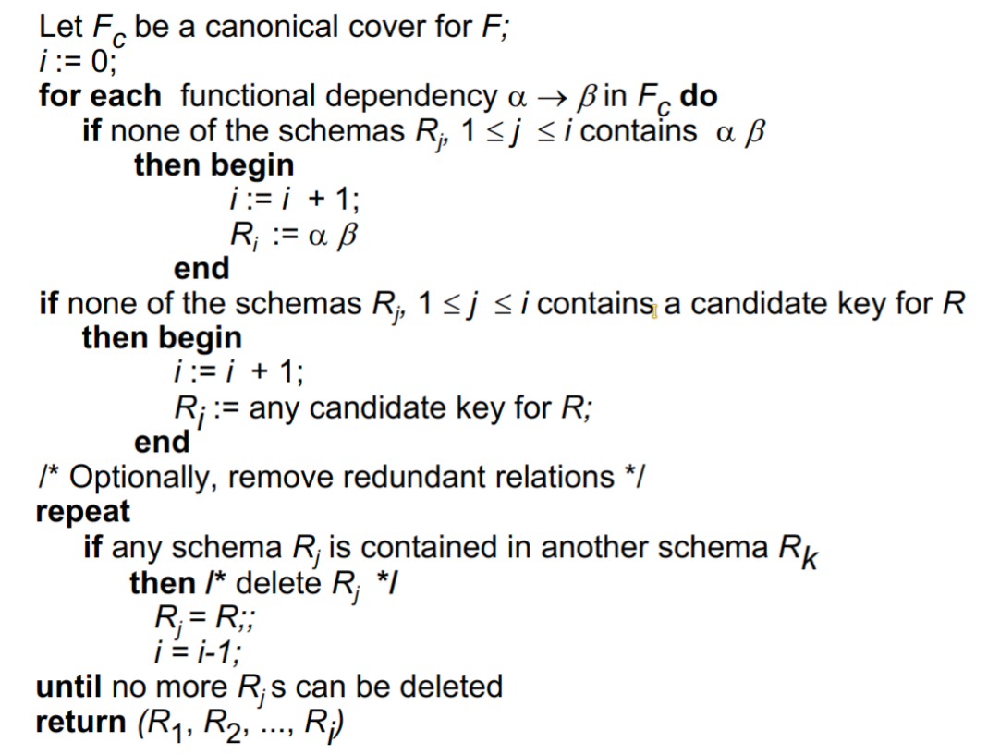

# DataBase

[Fork Yile Liu](https://github.com/yile-liu/ZJU_database_system)

----

## 第一章 引入

### 数据库重要问题

- data persistence: 数据持久化

- convenience in accessing data: 方便的数据访问

- data integrity: 数据完整性

- concurrency control for multiple user: 多用户并发控制

- failure recovery: 失败恢复

- security control: 安全控制

### 系统结构

- Physical Level: 数据在磁盘上的存储方式

- Logical Level: 数据在用户看来的存储方式

- View Level: 用户看到的数据

### 数据库语言

- **DDL** (Data Definition Language)

    - 数据定义语言，定义数据库的结构

        ```sql
            create table student(
                name varchar(20),
                ...
                primary key(name),
                foreign key(name) 
            );
        ```

    - DDL interpreter: 用于解释DDL语句，将其转化为内部数据结构

- **DML** (Data Manipulation Language)

    - 数据操作语言，对数据库中的数据进行操作

    - Procedural DML: 通过过程化语言进行操作

    - Declarative DML(nonprocedural): 通过声明式语言进行操作(例如SQL，更加常见)

    - DML compiler: 用于解释DML语句

- **Query Processor**

    - query -> parse and translate -> relational-algebra -> optimizer -> query plan -> execute plan

- **transaction management**

    - 事务管理，保证数据库的一致性

    - 事务：一系列操作，要么全部执行，要么全部不执行

----

## 第二章 数据库概念

### 概念引入

#### Table

可以类比excel，数据库以表的形式组织数据。表中的一列是某一类数据，一行是某一个事物具有的多类数据的集合。一张表是多个集合组成的大集合。

注意根据集合不能有相同元素的要求，一张表中不能出现数据相同的两行，也不能出现意义相同的两列。数据库课程一般不考虑空集。

#### Relation

表的一行是某一个事物具有的多类属性，反过来说多类属性由某个事物关联起来。从这个意义上，一个Relation一般指代一张Table。

Relation又可以分为两个部分：

- **Relation Schema**

    Relation Schema指一张表的逻辑设计，包括Table的名字，其中有哪些Attribute，每个Attribute各自的Domain等。Relation Schema不关心表中具体的数据，只关心整体设计。

    R = (A_1, A_2, A_3, ... A_n)

    例如：Student(Student_ID, Name, Phone_Number), in which Student_ID supposed to be ......这是一个Relation Schema。

- **Relation Instance**

    Relation Instance是一张表中具体某几个事物（某几行）的集合。出于集合的定义，Relation Instance是可拆分的，一个Instance从中的某几行组成集合是另一个新的Instance。

    r(R) = {(t_1), (t_2), ... (t_n)}

    例如：{(3200102708, Liu Siri, 13588089548), (3200102706, Su Houxian, null)}这是一个Relation Instance。

    **关于元组**：

    - Tuple

        直译为元组，指某个表中的一个事物，或者说一行。

    - Attribute

        直译为属性，指某个表中的某一类数据，或者说一列。

    - Domain

        某个Attribute的取值范围。

    - *Unordered Set*

        表中的行是无序的，即表中的行的顺序不影响表的定义。

- **Atomic**

    我们要求数据库中任意关系r，其Attribute的Domain必须是Atomic的。某个Domain是Atomic的指其中存储的数据已经是最小单元，不能进一步拆分。

    例如：对于Attribue(Phone_Number)，如果允许多个电话号的集合同时存储在该列某行中，那么这个Attribute就不满足Atomic，于是这张表也不满足数据库的设计规范，因为一般认为这个集合可以进一步拆分成一个个电话号。

    但是注意，你既可以认为单个电话号为不能继续拆分的最小单位，这时它Atomic；也可以认为电话号又包括了国家编码、区号、分机号等等，不满足Atomic。

    **因此Atomic是一个相对的概念**，“能不能继续拆分”取决于设计数据库的具体要求与你看待数据的方式。


#### Key

Key是某一个relation中某几个attribute的集合。它的每一个子集也都是不同的Key。

- Superkey

    如果在某relation instance中根据一个key能够单独确定一个tuple，它是Superkey

    因此，superkey 可以很大，如 *整个元组的所有属性就是一个superkey*

- Candidate Key

    如果一个Superkey，去掉任意一个attribute后不再是Superkey，他就是Candidate Key

    就相当于是**“最小”的Superkey**    

- Primary Key（默认not null）

    使用任意Candidate Key都可以方便的查找relation中的某个tuple，但是为了同一操作、规范接口，设计者应该为每个relation在Candidates中选出一个作为Primary Key (a.k.a. Primary Key Constraint)。

    Primary Key是relation的固有属性而不仅是attribute的集合，地位发生了变化。

- Foreign Key Constraint

    A是关系$r_{1}$的一个key，（B是关系$r_{2}$的Primary Key，）如果A中每个tuple都在B中都存在，就称
    
    A is a **foreign key** from $r_{1}$ referencing $r_{2}$
    
    $r_{1}$ is the **referencing relation** of this foreign-key constraint and $r_{2}$ Is the **referenced relation**

    `foreign key A referencing r2(B1)`

#### Schema Diagram

规定某个relation的Primary Key由下划线标出；有向箭头表示Foreign Key Constraint，从referencing relation指向referenced relation。

### 关系代数

#### 基础操作

- And Or Not(∧ ∨ ¬)

- Select

    $\sigma_{selection\  predicate}(relation)$：从relation中选出满足selection predicate的tuple组成一个新的relation。即选行。

- Project

    $\Pi_{A1,A2...}(relation)$：从relation中选出名称为A1、A2……的attribute组成一个新的relation,即选列。

    **注意这是集合操作，因此会自动去重**

- Union（$\cup$）

    - 待合并的两张表应该应该相同的属性元组（即属性完全相同）

- Intersection（$\cap$）

    - 待合并的两张表应该应该相同的属性元组（即属性完全相同）

- Set Difference（-）

    - 待合并的两张表应该应该相同的属性元组（即属性完全相同）

- Cartesian-Product（$\times$）

    - 开销很大，可以想办法先用选择条件降低表大小再做积（不过应该不用强求）

    - 两个表做笛卡尔积，会获得 N * M 行

- **Join** （后面章节重点）

    - $r\bowtie_{predicate}s=\sigma_{predicate}(r\times s)$

    - Inner Join: $r \bowtie s$
    
    - Outer Join
        
        - Left Outer Join: $r\ ⟕\ s$
        
        - Right Outer Join: $r\ ⟖\ s$
        
        - Full Outer Join: $r\ ⟗\ s$


- *Rename*

    - $\rho_{x(A_{1},A_{2}...)}(E)$
        
        将名为E的表重命名为x，并将其每一列重命名为A1、A2……

    - 下标$(A_{1},A_{2}...)$不是必须的，不写这一部分表示只改表名不改列名。


- *Assignment*

    - $d\leftarrow expression$
    
        将表达式的结果存放在临时“变量”d中，以便后续复用。这个操作一般用于简化公式和增强可读性。

    - 注意数据库所有的返回值都是**表**，包括代数操作或者单指操作等。

- *Division*

    - let $r(ID,course.ID)$ and $s(course.ID)$,  then $r\div s$ gives us ID who have taken all courses in the relation $s$.

- 代数操作

    - 常见的代数操作有avg, min, max, sum, count等

----

## 第三章 SQL基础

### SQL数据类型

**char(n)**: 定长为n的字符串

**varchar(n)**: variable-lenth char 最大长度为n的可变长字符串

**int/smallint**: 整数型，允许的数据范围由库和计算机架构决定。smallint占据的空间与可表示的范围都小于int。

**numeric(p, d)**: 十进制表示，总共有p位，其中小数点后有d位。例如对numeric(3, 1)，10.5、01.0是合法的，1.05、105、1都是不合法的。

**real/double precision**: 单精度和双精度浮点，大致对应C语言的float/double。允许的数据范围由库和计算机架构决定。

**float(n)**: 至少有n个数字的浮点数。注意区别SQL的float与常见编程语言的float。

**NULL**

- 代表未知，和 0 不相同

- **特殊运算规则**

    - and 有0为假

    - or    有1为真

    - 比较 / 算术等结果为unknown

    - not unknown = unknown

    - where 中认为 unknown 为 false

    - 筛选distinct时，null = null

    - NULL值不参与对列的代数函数，全NULL的tuple不会被count( )计数。没有非NULL元素时代数操作返回NULL，count( )返回0。

**注意：以上是教科书中的内容，其中char/varchar/int基本全世界通用，但是其他的数据类型在不同DBMS中语法及用法可能各有不同。**

----

### SQL语句

所有SQL语句以及**表名、列名**等标识符都是大小写不敏感的

但是表的**内容**，例如字符串等，大小写敏感。

以下只记录易错点，不涵盖所有语法。

#### Updates to tables

- `drop table r;`

- `alter table r add column_name data_type;`

- `alter table r drop column_name;`

#### select

select可以细分为select all与select distinct，区别是是否为结果去重，select不使用后缀时默认为select all

select选择的内容可以是表达式，例如select salary/1000 from teacher; 返回的是salary/1000的结果。

from子句可以包含多个表，用逗号分隔，例如from r1, r2, r3...，这样select的结果就是这些表的笛卡尔积。

后面一般有where子句，用于筛选表中的内容。

*因此select可以没有from子句，一般用于展示数据或者赋值并展示结果，例如select 12345/5; 单纯打印这个表达式的结果数字*

select结果可以使用order by ATTRIBUTE_NAME (desc/asc)子句排序，desc/asc表示按照降/升序，不写默认为asc。

order by后面可以跟多个attribute，以逗号分隔，靠前的优先。

*select 'k' from --->N行 一列'k', 属性'k'*

#### as

as可以为同一个对象赋两个别名以实现自我对比，但是别名的作用域仅限于单条语句，实际名称并不会被更改.

#### string

SQL 用一对单引号表示字符串，若要在字符串中使用单引号，可以用两个单引号表示一个单引号。

like是模糊搜索的关键字，可以用 % 表示任意多个字符，用 _ 表示任意一个字符

需要字符串查找内容本身包含特殊字符的，可以用逃逸符号+转义字符，如获得'%' ` '\%' escape '\'`

字符串内容匹配默认区分大小写。

#### set

- set operations

    - `union / intersect / except` 又有all和distinct两个版本，区别是结果是否去重

    - **但是他们默认作为集合操作是去重的**，这与select不同。

- set membership

    - `(not) in`

- set comparison

    - `some / all`

    - ( = some) == (in) 

    - ( != some) != (not in)

    - (!= all) == (not in)

    - ( = all) != (in)

- set empty test

    - `(not) exists`

- set unique test

    - `unique` to check if duplicates exist

#### aggregate functions

`avg, count, min, max, sum`

聚集函数，顾名思义，能把同一列不同值聚集到一起处理为一个值

#### group by

配合各类代数操作

group by先于select进行，创建一个仅包含代数操作列与group by列的临时表，select操作在这个临时表中进行。这带来两个特性：

- select...group by...可以在多个列名和列数不完全相同的表中进行，只要共有用于代数操作和group by的列就可以了。例如下面的表r1、r2……只要共有A1、A2（用于group by）和A3（用于sum）即可，其余列无所谓。

    ```mysql
    select A1, sum(A3)
    from r1, r2, r3...
    where P group by A1, A2
    ```

- 同时select代数操作和其他的列时，其他列必须同时放在group by里面，因为不能选择临时表中没有的列。下面是两个错误的例子，ID不能被选择：

    **即group by之后，每个group只能输出一行数据**

    ```mysql
    select dept_name, ID, avg (salary)
    from instructor
    group by dept_name;
    
    select ID, max(salary) from instructor;
    ```

#### where / having

**where在group by之前进行，不满足条件的tuble不会参与group by进入临时表**

**having在group by之后进行，在临时表中筛选（因此同样只有group by之后的数据栏），只返回满足的tuble**

因此引申出exists只能跟where；代数操作做条件只能跟having；同样的语句在where和having之后效果不一定相同。

#### with

```mysql
with 
temp_table_name1(attribute_name1, attibute_name2...) as (),
temp_table_name2(attribute_name1, attibute_name2...) as (),
...
```

建立一个作用域为一条语句的临时的表用于简化逻辑表达式增加可读性。
相当于关系代数中的Assignment。select可以不出现。

#### delete

`delete from table_name where ()`

#### insert

`insert into table_name values(...)`

`insert into table_name(attributes...) values(...)`

*values 也可替换成嵌套子查询*

#### update

- ``update table_name set attribute = () where ()``

- 有时操作会影响后续的判断，导致非常麻烦的拓扑序处理，因此复杂时可以使用case条件判断

    ```sql
    set () = case
        when condition1 then value1
        when condition2 then value2
        ...
        else value2
    end
    ```

## 第四章 SQL进阶

### Join

Join语句的基本功能是将两张表中的tuple按一定规则进行匹配，将他们相同的列拼起来，不同的列全部保留，合成一个大tuple。

它的控制符可以分为两类：

- Join Conditions（控制哪一些列或条件用于匹配两张表中的tuple）

    - **natural**：tuple所有同名列的值相等（默认），但是有**表结构未知错误合并**的风险

        - natural 会合并同名列，且using也是相当于默认为natural

    - **using (A1, A2...)**：tuple同名列中指定的部分列的值相等

    - **on \<predicate>**：按照特定的规则匹配，不限于同名列

- Join Types（控制如何处理没有匹配对象的tuple）

    - Inner Join：没有匹配对象则不返回（默认）

    - Left Outer Join：左侧表的tuple没有匹配对象，则为扩展的列填入NULL，一起返回（左边元素一定存在）

    - Right Outer Join：右侧表的tuple没有匹配对象，则为扩展的列填入NULL，一起返回（右边元素一定存在）

    - Full Outer Join：上面二者的并集

### View

```mysql
create view view_name(attributes...) as () 
```

view一般由于权限问题，遮掩部分数据用于查找以及接口，语法和with相同，作用也基本相同。唯一的区别是view一经定义则一直可用，而with的作用域仅有单条语句。

- view并不是实际存在的表，每次调用view时只是重复调用了筛选的条件。因此update table后，与之关联的view也会改变

- 我们一般不对view进行update，大部分SQL系统对update view有严格的限制。

- 部分SQL也支持materialize view，view此时是一张真实存在的表，这一般是为了用空间换时间，物化视图相关的表发生变化时，它自己也必须同时更新，以维持一般view的特性。

- view dependecy: 可以嵌套定义，甚至自我递归定义？ 

### Index

```mysql
CREATE INDEX index_name ON table_name ( column1, column2.....);//创建
ALTER TABLE table_name DROP INDEX index_name;//删除
```

索引的原理类似于书的目录，要查找某个词不需要从头开始阅读书籍，可以从目录查到页码直接跳转，于是加快了查找的速度。其具体实现方式不需要深究。一个表可以创建多个索引，一个索引可以包含多个列（复合索引）。

但索引并不是尽善尽美，例如update之后，索引需要同步维护；同时索引是一种物理数据结构，有额外的空间与IO开销。不适当的索引设置反而会降低效率。

### Integrity Constraint

完整性约束即对attribute内容的约束，不满足约束条件的tuple不能被插入。

*对数据类型的约束既可以在定义表时规定，也可以后期通过domain关键字增删改*

一般有4类约束方法：

- **not NULL**：非空。

- **Primary Key**：构成主键的tuple不能重复。

- **Check(Predicate)**：自定义检查的条件，在数据表有改变时便会自动检查，例如 `CHECK (semester in ("spring", "autumn") )`。

- **Foreign Key** : 外键约束，（*原则上，可以不是*）自定的若干个attribute组成的tuple一定是table_name的主键之一

    `foreign key (attribute_name1, attribute_name2 ...) references table_name(attribute)`

约束被破坏时的处理方法：

- cascade: 级联，更新与删除等操作违反完整性约束，便会将影响的子数据一并处理掉（一般没有 insert cascade）

    - *还可以set null, set default等*

- assertion: 断言，always satisfy

- trigger：Events & Actions
    - 有效但少用

### 特殊数据类型

- 时间相关

    - date：日期

    - time：SQL自带时间相关的特殊数据类型

    - timestamp：date + time

    - interval：时间间隔

- 大对象

    - large number：对于尤其空间尤其巨大的值，传指针比直接传数据本身高效得多。在此理解即可。

    - large-object types

        - blob: binary 

        - clob: character

- user-defined

    - e.g. `create type dollar as numeric(10, 2);`

- domain

    - 和 type类似，不过可以加上约束条件

### 权限

- 授予/收回权限的基本语法：

    权限：`select, insert, update, delete, references, all privileges`

    ```mysql
    grant <priviledge list or role name> 
    on <relation name or view name> to <user list>;//授予

    revoke <priviledge list or role name> 
    on <relation name or view name> to <user list>;//收回
    ```

- 权限可以来自多个上级用户，相互可以重叠，例如有两者都为第三方授予了读取权限，此时即使有一方撤回了权限，第三方仍然可以正常读取。

- 权限可以级联下放，例如A为B授予了某些权限，B可以继续向其他人授予不高于他自己的权限。当A撤回对B的权限时，B下放给他人的权限也会同时被收回。

- 权限的基本单位是relation，需要授予某个数据库内所有relation的权限时可以使用 DB_name.*

- 多次授权，一次只能收一个

- public收回，所有非特殊指明的人的权限都被收回

- *视图上的权限效果类似*，但是视图的权限不能获得对基表的权限

- **role**

    - 有多个同类用户需要做统一的权限调整时，列出\<user list>的使用方式显然不便，此时就需要role。
    
    - role是权限组成的集合，可以像面向一个用户一样赋予role各种权限，然后像赋予单个权限一样将role赋予用户。修改某个role对应的权限集合时，所有被赋予这个role身份的用户权限都会同时被修改。

        ```mysql
        create role role_name;
        grant <priviledge list> on <relation name> to role_name;
        grant role_name to <user list>;
        ```

## 第五章 高级SQL

### SQL Injection

SQL用户端常常需要将用户的输入拼接为完整的sql语句。借助用户端输入框直接输入未预期的sql指令，又由于字符串拼接的缘故这条语句能够被后台执行，这称为sql注入。

比变sql注入的办法是，不要将用户的输入直接作为数据库语句，而是套用一定的模板。

### Stored Procedure

通过用户界面的前后端构建、传递、执行、回传sql代码带来大量的开销，所以现代sql都支持Stored Procedure。你可以将它理解为一种内建的小型编程语言，支持if-else、for、while等简单编程逻辑，用于构造执行一些sql语句，最终返回结果。sql还支持function，作用与之基本类似。

因为它们是内建的，且大多采用类似C语言的编译执行方式，性能往往远高于在用户端拼接字符串构建并执行sql语句。

Stored Procedure与function中还可以创建cursor，以完成一些复杂的数据库操作。

例如：

```mysql
create procedure
dept_count_proc (in dept_name varchar(20), out d_count integer)
begin
select count(*) into d_count
from instructor
where instructor.dept_name = dept_count_proc.dept_name
end

declare d_count integer;
call dept_count_proc('physics', d_count)
```

### Trigger

trigger是在满足某些条件后自动执行的sql，可以视为对数据库操作的监视或者说副作用。但是现代sql数据库流行的风格是不写trigger。

----

## 第六章 数据库设计范式一

本章主要介绍**Entity-Relationship Model**设计方式。不同于直接建表的做法，实际开发中我们更喜欢先用entity和relationship两类概念构建逻辑关系，再建表。

- Entity的每一行应该是一个实体，例如学生信息表，教师信息表。

- Relation的每一行是多个实体间的某种关联，例如导师-学生关系表。

### Design phases

- Initial phase: 

    - 了解用户需求，确定数据库的目标

- Second phase: 

    - 选择一个数据模型，设计数据库的概念结构

- Final phase: 

    - 将概念结构转化为物理数据库模式，即建表

### Design Alternatives

- Redundancy

    - 数据冗余，即同一数据在多个地方重复出现。冗余数据的存在还会导致数据不一致，增加了数据的修改难度。

- Incompleteness

    - 系统不完整，导致某些功能无法实现。

### E-R Diagram

- Entity

    - 由多个属性 Attribute 构成，属性的取值范围是 Domain

    - *用实体集的外延 extension 表示实际的实体集合*

- Attribute

    - **复合**：用缩进表达层级关系

    - **多值**：（**同一个属性可能有多个取值**）用大括号表示

    - **派生**：（**可由其他属性推导出来**）在后方加上括号抽象为函数

- **Entity-Relation**

    > 菱形表示，其中的文字是Relationship的名字，实体间的这种关联称为 **参与联系集R（participation）**

    - **度 （Degree）**

        > 参与联系集的实体集的个数

        一般二元关系（binary）为主，有时有三元关系，再多元不常见

    - **额外属性(Discriptive Attribute)**

        用**方框 + 虚线**表示

        

    - **Role**

        > Role是连线或者箭头的标签。

        关系对应的Entities应该是唯一的，当关系与某个实体有多重逻辑联系 (Recursive) 时就需要为表达逻辑联系的线或箭头加上标签作为区分。

        

    - **Mapping Cardinality Constraints（映射基数约束）**

        > **箭头表示“一”，直线表示“多”**
        >
        > *多关系时只允许至多一个箭头避免歧义*

        - One-to-One：双向单直线箭头

        - One-to-Many：单向单直线箭头

        - Many-to-One：单向单直线箭头

        - Many-to-Many：单直线

        - **Participation Constraints**

            - total participation

                > 每个实体至少参与一个关系

                用**双直线+双直线框菱形**表示

            - partial participation

                单直线

            - **More accurate notation**

                在单直线上使用数字标注 min...max

                

    - **Primary Key**

        

    - **Weak Entity Set**

        > 没有独立主键的Entity Set称为Weak，它一般是为了增加复用性

        - 要求存在至少一个非Weak的**Identifying Entity Set**，通过一个**完全参与的、一对多的**关系，指认Weak Entity Set中的元素，这个关系就称为**Identifying Relationship**。

        - 弱实体集的属性中与Identifying Relationship相关的属性称为**Discriminator (partial key, 需要找一个强实体集的键一同构成主键)**

            例如下图中section的主键为 (course_id, sec_id, semester, year) 。

        

        （*画E-R图时，虚实体用双线矩形，Discriminator用虚下划线，因为这是完全参与关系，用双线菱形标记关系，同时弱实体集一侧必须完全参与，所以用双线连接）*

    - *重复属性可以通过relation消除冗余*

        

#### 特殊的E-R图

- 可以继承（Top-Down 特化 / Bottom-Up概化）

    

    - Overlapping: 可重叠，即一个实体可以同时属于多个类别

        （既是student，也是employee）

    - Disjoint：不相交，即一个实体只能属于一个类别

        （只能是instructor或者secretary一种身份）

    **减少了冗余信息，但是增加了查询的复杂度（需要多表的笛卡尔积）**

- 可以聚合（Aggregation）

    - 将一个部分组合成一个整体，减少关系

*两者一般都是为了减少冗余，但这都只是特殊逻辑关系的简化表达，并不常见，完全可以用常规的图代替*

### Reduction to Relational Schemas

> 根据E-R图建立数据库表结构，下面为推荐的实现方式，但是途径并不唯一。

- Entity

    - 每个实体至少一张表

    - 复合属性扁平化(选择级别最底层的)

    - 多值属性单独建表，外键连回去

- Relationship

    - 带额外属性的Relationship单独建表

    - Many to Many必须单独建表

    - One to Many在Many侧加上One的主键，外键连回去

    - One to One任选一侧作为上面情况中的Many，同上

----

## 第七章 数据库设计范式二

如果说前一章节描述了如何建立一个表，那么本章将着重于如何根据函数依赖判断一张表的好坏，以及如何拆分一张表

### Function Dependency

前面说到派生属性可以理解为函数，重点在于一对一的映射关系。相同的A一定有相同的B，记为$A\rightarrow B$，A可以是B的一个主码，B可以视为A的派生属性，或者说B是A的函数依赖。

$$tuple \ t_1, t_2 \in r, t_1[A] = t_2[A] \Rightarrow t_1[B] = t_2[B]$$ 

函数依赖可以根据集合关系分为下面3类：

- **完全函数依赖：** A的任何一个真子集，或者说去掉任何一个列之后，对B不构成函数依赖，则称其为完全函数依赖，**反之为部分函数依赖**。

- **传递函数依赖：** 显然函数依赖具有传递性。通过传递间接得到的依赖称为传递依赖，例如closure中$A\rightarrow B$。

- **Trival平凡函数依赖：**
    $$
    In\ general,\ A\rightarrow B\ is\ trival\ if\ B\subseteq A.\\
    For\  example,\ (ID,\ name)\rightarrow name.
    $$

对函数依赖组成的集合F，若一个relation满足F+中的所有依赖关系，称为：

- R(relation schema) **holds on** F

- r(relation instance) **satisfyies** F

对R holds on F，取R1为R的一个子集，F中左右两侧的属性都在R1中的函数依赖组成的集合称为F在R1上的投影。

#### Closure of Function

给定一个由函数依赖组成的集合$F$，它与它的所有推论组成的集合称为Closure of F，记为$F^+$，例如：
$$
F(A\rightarrow B,\ B\rightarrow C)\\
F^+(A\rightarrow B,\ B\rightarrow C,\ A\rightarrow C, AB \rightarrow C ...)
$$

找函数闭包一般是**Armstrong's Axioms**三条轮着套：(Sound(有效) & Complete(完备))

书上算法：先用自反律和增补律添加新的依赖关系，再用传递律连接


#### Closure of Attribute

给定一个由属性组成的集合$A$，它由函数集$F$中的依赖关系能够关联的属性组成的集合称为Closure of A under F，记为$A^+$

算法：每次枚举所有依赖关系，若满足左侧条件则将右侧属性加入闭包，直到闭包不再增大

属性的闭包的作用有：

- 验证一组属性是否是superkey（它的闭包是否包含所有属性）

- 验证一组属性是否是candidate key（它的真子集的闭包是否包含所有属性）

- 验证函数依赖是否成立（依赖属性是否在被依赖属性的闭包中）

- 找函数的闭包（遍历属性的子集，挨个找闭包，闭包中多出来的属性就对原属性构成依赖）

#### Canonical Cover

- **Redundancy**

    - 在一个函数依赖集中，如果某一个依赖关系可以由其他依赖推得，那么他就是冗余的。

    - 在单个依赖关系中，如果去掉一个属性（左右两侧至少要留下一个），仍然可以由其关系集中的其他依赖推得原式，那么就称这一个属性是冗余的。冗余的属性也可以用**extraneous**形容，直译为多余的。

    **需要注意这里逻辑蕴含 “$\implies$” 的方向始终为弱$\implies$强，左侧减少加强，右侧减少削弱**

    **对应的检查就是删除掉假设的无关属性后，能否推出原来的函数依赖**

    

    

- **正则覆盖**
    
    > 记为$F_c$，指给定一组函数依赖F，去除所有冗余的函数依赖与属性后剩余的部分，相当于函数依赖F的化简集合
    >
    > - 不含冗余函数依赖
    >
    > - 与原函数依赖集F等价，即$F^+ \Leftrightarrow F_c^+$
    >
    > - 函数依赖的左侧属性不重复

    求最小函数依赖集的步骤（**正则覆盖可能不唯一**）：

    

#### Lossless(-join) Decomposition

假设表R被拆分为若干个表R1、R2……Rn，当且仅当R1 nature join R2…… nature join Rn等于R时，称这个这个拆分操作是无损的。

- 当分解为两个表时，证明无损拆分常用的一个**充分非必要条件**是：

    **两张拆开的表取交集，交集是至少一张表的superkey，或者说可以通过F+中的函数依赖推得取交集之前的表**

    $$R1\cap R2 \rightarrow R1\ or\ R2$$

- 当分解为超过两个表时，使用判定表法：https://blog.csdn.net/weixin_42492218/article/details/106218720

#### Dependancy Presevation

在数据库更新时，我们希望依赖关系不会被破坏，即依赖保持

假设表R被拆分为若干个表R1、R2……Rn，函数依赖集F中左右两侧的属性都在R1、R2……中的子集为F1、F2……，称为F在R1、R2……上的投影(书中称为restriction)。

当$F^+=F_1^+\cup F_2^+\cup...$时称这个拆分满足依赖保持(**注意这仅仅是个充分条件**)

同样的，由于函数闭包的计算代价过高，可以使用如下**属性闭包**来代替。相当于每次计算某条依赖限定在 $F_i$ 上的属性闭包，再合并起来，检查是否将这条依赖保持 


*第三范式是满足依赖保持的最高范式, BC范式不能保证依赖保持*

### 第三范式

#### 三大范式

- 第一范式

要求每一个attribue的domain都是atomic的，不能继续分割（如CS-101即可继续分割成课程种类和标号，给更新带来麻烦），同时每一个relation都应该有primary key。

这是所有关系型数据库最基础的范式要求。

- *第二范式（不重要）*

在第一范式的基础上，要求非主属性对所有candidate key不能有部分依赖。例如下面这个关系：

（学号，课名）是一个candidate key，但是姓名、系名都是对学号的函数依赖，即对候选键的部分依赖，所以上面这个数据库不满足第二范式，但是满足第一范式。

- 第三范式

在第二范式的基础上，要求非主属性对所有候选键不能有传递依赖。例如下面这个关系：


学号->系名->系主任是一个传递依赖关系，所以上面这个数据库不满足第三范式但是满足第二范式。

#### 定义：


#### 3NF 检查

只需要根据定义，利用属性闭包检查 **F** 中的函数依赖关系

#### 分解为3NF

> Lossless decomposition & Dependence preservation

3NF synthesis algorithm



### BCNF(Boyce-Codd Normal Form)


在第三范式的基础上，要求主属性对所有候选键不能有部分依赖，或者通俗地说，对F+中的任意一组依赖关系$X\rightarrow Y$，X一定是candidate key之一。

对下面这个例子：

- 关系模式：仓库（仓库名，管理员，物品名，数量）

- 已知函数依赖：
    
    - 仓库名->管理员
    
    - 管理员->仓库名 （一个仓库只有一名管理员，一名管理员只能负责一个仓库）
    
    - （仓库名，物品名）->数量
    
    - （管理员，物品名）->数量

- candidate key有：
    
    - （仓库名，物品名）
    
    - （管理员，物品名）

- 所以主属性有：仓库名，物品名，管理员

这个关系满足3NF，但是注意到存在 **仓库名->管理员** 依赖，这是主属性对候选键的部分依赖，或者说仓库名（X）不是candidate key，所以这个例子不满足BCNF。满足BCNF的分解是：

- 管理（仓库名， 管理员）

- 储存（仓库名，物品名，数量）

#### 检查BCNF

- 对于一个函数依赖集F的检查：

    检查 **F**（**不需要F+**）内所有非平凡的函数依赖，计算左侧属性的闭包，如果闭包包含所有属性，就说明这个依赖满足BCNF

- 对于分解后的关系的检查：

    此时上一种情况的条件不满足，必须检查 **F+** 中所有的非平凡的函数依赖

- 另一种通用方法：

    对于某个分解后的关系 $R_i$ 的每个子集 $\alpha$，确保 $\alpha ^+$ 要么包含 $R_i$ 的所有属性，要么不包含 $R_i - \alpha$ 的任何属性

    否则，函数依赖 $\alpha \rightarrow (\alpha^+ - \alpha) \cap R_i$ 违反了BCNF

#### 分解为BCNF

> Lossless decomposition but may not dependence preservation

本质上，就是将一个不满足BCNF的关系从表中拆出去，单独建表

**其中 $\alpha \cap \beta = \emptyset$ 的条件很重要，否则 $R_i - \beta$ 会将 $\alpha \cap \beta$ 部分的属性拆出去，破坏了 $\alpha \rightarrow \beta$ 的函数依赖**


### 多值依赖 & 4NF

#### 多值依赖

> $\alpha \rightarrow \rightarrow \beta$ 表明 $\alpha$ 的每个值都对应于 $\beta$ 的一个或多个值，另一种说法是 $\alpha$ 与 $\beta$ 之间的联系是一对多且独立于其他属性的。
> 
> （因此函数依赖本质上是一种特殊的多值依赖，多值依赖的处理方法和函数依赖也基本一致）
>
> *若关系r不满足给定的多值依赖，可以通过向r中增加元组来得到一个满足多值依赖的关系*

函数依赖&多值依赖的闭包 D+：

- $\alpha \rightarrow \beta \implies \alpha \rightarrow \rightarrow \beta$

- $\alpha \rightarrow \rightarrow \beta \implies \alpha \rightarrow \rightarrow R - \alpha - \beta$

#### 4NF

- 定义
    4NF 一定是 BCNF，但是反之不一定成立

    

- 检查

    

- 分解

    

### More

#### More NFs

- 5NF(Project-Join Normal Form)

- DKNF(Domain-Key Normal Form) 

#### Temporal data

- Temporal functional dependency: 在任意时间快照上满足的函数依赖

- 实际操作：给数据加上start time和end time，然后用时间戳来查询

#### *How to Find Candidate Key*

- Primary Attribute

    出现在至少一个candidate key中的属性称为主属性。反之为非主属性。

- 第一步-先找主属性

    先找出$F_c$或$F_m$，然后将所有属性分为以下四类：

    - **L类：**仅存在于依赖左侧，一定是主属性
    
    - **R类：**仅存在于依赖右侧，一定不是主属性
    
    - **N类：**没有在任何函数依赖中出现过，一定是主属性，且存在于任何一个候选码中
    
    - **LR类：**同时出现在了依赖两侧，**待定**

- 第二步-找Candidate Key

    这里是根据$F_c\ or\ F_m$分类，可以直接将L类和N类属性合并，检查其是不是candidate key。如果是根据原始关系集F分类，那么还需要逐一对N类属性与L类的所有子集的并集检查是不是candidate key，并不建议这么做。

    - 如果仅靠L类和N类就可以确定candidate key，则不需要考虑LR类。
    
    - 如果L类与N类的并集不是candidate key，那么这个并集与LR类的所有子集逐一取并集检查是不是candidate key。确定一个candidate key后，真包含它的所有集合都不是candidate key，可以减少一些运算量。

#### Design Guidelines

- Nice E-R design -> Good relational schema -> Less normalization

- Duplicated name & relation if properties have some relation

- Allowing some redundancy for performance(denormalization & materialized view)


## 十二章 物理储存介质


### 储存的评价


### 储存的分类

- **储存可以根据易失性分为：**

    - volatile 掉电失去数据，一般容量小速度快

    - non-volatile 掉电不会失去数据，相对容量大速度慢

- **也可以根据层级分类：**

    - primary storage 最快、一般用volatile介质实现

    - secondary storage 较快、非易失

        - 也叫on-line storage，常见的flash memory、magnetic disks都属于此类

    - teriay storage 慢、非易失
        
        - 也叫off-line storage，magnetic tape、optical storage属于此类

- **也可以根据原理分类：**

    

- **Measures**

    - Disk block: logical unit for storage allocation and retrieval
    
        - Too small : **more transfer**
        
        - Too large : **space wasted**   
    
    - Sequential access pattern: seek required only for first block
    
    - Random access pattern: each access require a seek
    
    - I/O opeartions per second(IOPS)    

### 磁盘性能评价

**磁盘性能从以下维度评价：**

- **Access time** 访问时间

    - 对HDD又可以细分为Seek time寻道时间(4 ~ 10 milliseconds)和Rotation latency旋转延迟(5 ~ 20 milliseconds)

- **Data-transfer rate** 数据传输速率(25 ~ 200 MBps)

- **IOPS** 每秒I/O操作数

- **Mean time of failure** 平均故障时间(MTTF, 3 ~ 5 years)

根据所访问数据的储存位置，可以将访问分为随机访问和顺序访问。顺序访问的上限主要由传输速率决定；随机访问的上限主要由IOPS决定，IOPS又主要由访问时间决定。

**优化磁盘性能的常见方式：**

- Buffering 缓冲区，避免重复读写相同数据

- Read-ahead 预读取

- Disk-arm-scheduling 针对HDD，相比让磁头来回横跳，适当重排IO请求,像电梯一样，使磁头有序移动能减少平均寻道时间

- File Organization 针对HDD，文件整理，使数据分布尽可能有序

- Wear Leveling 针对NVM和SSD，因为擦写寿命相对有限，需要实现负载均衡

- Non-volatile write buffers 延迟后大批量一同写入

- Effective query processing algorithm (high-level optimization)

## 十三章 数据储存结构

一方面，你如何储存一个数据库，是每一张表对应一个文件，还是一个数据库对应一个大文件，还是其他的实现方式？在特定实现方式上怎么优化增删查改？

另一方面你的数据结构怎么与储存介质相配合优化，比如最重要的怎么以扇区为单位大小读写？

### 单条记录

#### 定长数据

按行存放（**Row-Oriented Storage**）的定长数据的增查改都容易实现（一般不允许跨block存储），删除一般有三种方式：

- 删除后将后面的数据前移（可以保持某些键的顺序）

- 删除后的空位用链表（free list）串联供下次插入用

- 删除后将最下面的一个数据移到删除后的空位

但是数据还可以按列存放，称为**Columnar Representation或Column-Oriented Storage**：

- 增删查改的实现与上面类似

- 按列存放更有利于向量运算以及数据分析、运算、压缩等操作

- 如果按属性访问多于按tuple访问，这种储存方式会更快

#### 不定长数据

- 用null-bit map解决允许为NULL的数据储存。n个允许为空的属性需要n个bit的空位图，空位图中某一bit为0/1意味着对应的属性不是/是空的。

    需要注意的是memory一般不允许以bit为单位的读写，需要用n不能被8整除时需要补齐到8的整倍数以实现Byte为单位的读写。

- 用定长的数据，如长度或者偏移量，间接表达长度不定的数据，而将具体的数据存在定长的属性值的后面。

最常见的结构如图所示：

- 定长的数据和不定长数据的定长表示放前面

- 空位图放中间

- 不定长数据的本体放后面
  
例如图中(21, 5)表达了一个变长属性的从21号bit开始且长度为5。（65000为一个定长的属性，放在前面）


### 数据页

定长数据非常容易构建数据页。

不定长数据的数据页一般采用两头夹击的结构便于对齐。最常见的实现方式如图，**Slotted page（分槽页）** Header包含本页中records相关信息：

- record数量，方便下一次插入record指针，防止将free space中的数据视为record指针

- free space末尾位置，方便下一次插入record

- 指向各record的指针（一般是偏移量形式）


### 文件组织

需要设计单条数据和数据页如何分布在文件内部。下图是几种常见的结构：


#### Heap

Heap常用的优化方式是Free-space map，剩余空间图中的元素表示对应的block中剩余空间的比例，即$\frac{x}{2^{bit}}$的部分为空闲的

当数据页比较多时，可以将连续K个map的最大值作为键值，建立起二级索引，以加快查找速度


#### Sequential

这里的Sequential不是指储存空间上有序，而是指每一条数据逻辑关系（**即搜索码**）上有序。在数据经常按某种排序先后取用时，可以考虑顺序文件系统。

先后逻辑一般用类似指针的结构实现，但是会导致数据逻辑存储顺序和物理存储顺序不一致，效率低下，因此需要适时Reorganize。

- 插入：先定位到对应插入位置，若当前block内有剩余空间可以直接插入，否则将数据存入“溢出块”中，利用指针结构连接起来。

- 删除：改变指针指向以改变逻辑先后关系。空余位置的处理视单条数据的结构而定。

#### Multitable Clustering

同一个文件页中存储不同的数据表，可以利用链表结构连接起来，以加快单表查询速度。

- 优点：

    加快了多表查询，特别是join操作

- 缺点：

    不同的数据格式，降低了存储效率，并且访问单表时需要读取更多的block

    一旦有一张表需要更新，整个文件页都需要更新，导致了大量的I/O操作

#### Table Partitioning

某一些表可以从物理上分为多个文件以配合实际使用情况，降低表的大小，提高数据库效率。

!!! example
    
    例如选课信息表，虽然从逻辑上所有学年的选课信息都在同一张表上，但是因为往年的数据几乎不需要增删查改，数据操作集中于当前学年，所以可以进行拆分，将历史信息存储到磁盘中，只保留当前学年的数据在内存中，从而加速查询。

#### B+ Tree File Index

B+树不仅可以作为索引的结构，还可以直接作为文件组织的结构。在下一章中会进行详细介绍。

### Data Dictionary（System Catalog） Storage

上面的三类文件组织都是对库中的实例而言的，但是数据库还有一些框架性的全局的信息需要储存，我们称为元数据Metadata。


为了简化系统的设计，可以直接使用前面的文件组织结构，使用数据表的方式储存元数据。

### Buffer Management

数据库系统的一个重要目标就是 **减少内存和磁盘之间的I/O操作**，这就需要一个缓冲区管理器。

#### Pin

钉住正在读写的数据块直到操作完成，防止被替换出去影响数据的一致性。

实现时可以用一个pin count来记录当前被钉住的次数也即承载的操作数，当pin count为0时，可以被替换出去。

#### Lock

- **Exclusive Lock**

    一般用于写操作，防止其他事务读写该数据块，因此同一时间只能有一个事务对该数据块加上Exclusive Lock。

- **Shared Lock**

    一般用于读操作，防止其他事务写该数据块而影响数据读取，因此同一时间可以有多个事务对该数据块加上Shared Lock

#### Buffer Replacement

每次向缓存请求数据时，若该数据已在缓存中，直接返回；若不在缓存中，需要替换一个数据块来存放新数据，即将一个数据块写回磁盘，再将新数据块读入缓存。

操作系统最常用的是LUR策略，（**L.east R.ecently U.sed Stratergy**），即根据“最近访问过的内容更有可能再次被访问”的原则管理缓存内容，将最久未使用的数据块替换出去。

但数据库系统一般基于历史信息和数据情况进行预测，使用更复杂更高效的混合策略

- 其他策略、


#### Force Output

一般用于处理系统崩溃时的数据一致性问题


## 十四章 索引

索引是数据库中的一个重要概念，它可以加速数据库的操作，提高数据库的性能。

但是索引会增加数据库的存储空间，并且需要实时维护。

### 顺序/无序索引

指key有一定顺序的索引。与之对应的，典型的非顺序作引例如哈希索引。顺序索引可以根据不同的排序规则进一步分类：

- Primary Index (clustering index):

    索引的顺序与物理储存的顺序对应。（物理储存顺序往往是根据Primary key，当然这里的search key不一定要求是primary key）

- Secondary Index (non-clustering index):

    索引顺序与物理储存顺序不同，根据使用需求设计。

    由定义可以知道，辅助索引一定是下面提到的稠密索引，因为他无法通过物理存储顺序进行检索数据。

!!! note

    可以看出，当需要线性扫描时，Primary Index的效率更高，因为它的顺序与物理存储顺序一致；而辅助索引可能需要在多个数据块间跳跃

### 稠密/稀疏索引

- Dence Index 稠密索引

    > 指每一个search key的值都在索引列表中出现

    - 插入

        - 若插入的key值在索引中不存在，直接插入到合适的位置

        - 若插入的key值在索引中存在，根据索引情况判断：

            - 若索引存储所有记录的指针，直接插入到合适的位置

            - 若索引仅存储相同搜索码值的第一个记录的指针，则把插入的记录插入到该组记录的后面

    - 删除

        - 若删除的索引唯一，直接删除

        - 同样考虑索引存储情况

            - 若索引存储所有记录的指针，直接删除；

            - 若索引仅存储相同搜索码值的第一个记录的指针，直接删除记录，若恰好为第一个记录，则删除后将指针指向下一个记录
    
- Sparse Index 稀疏索引

    > 指只有部分search key的值在索引列表中出现

    - 插入

        - 直接将记录插入到合适的位置，若恰好为当前块的第一条，则更新索引

    - 删除

        - 直接删除记录

        - 若该记录有索引指向：

            - 若该记录的搜索码值唯一，则用下一个搜索码值的指针替代（若下一个搜索码值已经存在索引中，则直接删除当前索引） 

            - 若该记录的搜索码值不唯一，则将索引指向下一个记录
 
稀疏索引可以多级嵌套，配合顺序索引就是B+树（当然还要附加其他一些约束）

### *多值索引（Composite Search Key）*

一般按照类似字典序的方式进行排序

### B+树索引

和ADS课上的版本略有不同，要非常小心


!!! note

    根节点：$[2, n]$ 个孩子指针

    内部节点：$[\lceil \frac{n}{2} \rceil, n-1]$ 个孩子指针

    叶子节点：$[\lceil \frac{n-1}{2} \rceil, n-1]$ 个记录对（搜索码+记录指针），最后一个指向下一个叶子节点，从而将底层记录串联成线性表

    一个页中可以存放的B+树索引个数为：
    $$
    单页中索引个数n=\frac{页大小-指针大小}{索引数据大小+指针大小}+1
    $$

    树的高度

    $$h \leq \lceil \log_{\lceil \frac{n}{2} \rceil} K \rceil$$

??? 计算

    

- Operations
    
    与ADS课上所学基本一致，略

- Extensions

    - 对于**Non-Unique**的搜索码，可以附加记录的主键将其组成一个复合搜索码，从而实现Unique索引。

    - **B+树文件结构**，叶节点不是指针而是记录本身即可
    
    - ****辅助索引的记录重定位**代价较高，可以让辅助索引的叶结点直接存储搜索码而不是记录指针，这样可以减少重定位代价
    
    - **字符串索引**，进行前缀压缩，从而减少索引的大小
    
    - **多码访问**
    
        - 多个单码索引
        
        - 使用多值索引
        
        - 覆盖索引，即在索引中直接存储一些数据，这样直接查询索引即可，不需要再去查询数据表

### 相关优化

- 批量插入BULK LOADING：

    - 一个一个插入显然代价过高

    - 插入之前先进行排序，比乱序插入更新索引的代价小，尤其对于B+树索引而言。

    - 对B+树，批量插入还可以直接建叶节点，然后自叶向根Bottom-up插入，减少了插入时的IO操作

- 内存索引：

    - 对disk而言，与磁盘页大小相匹配的size的索引更快，因为磁盘IO的最小单位是扇区
    
    - 而对mem和cache而言，小节点size更快因为随机访问性能高得多并且没有扇区大小限制

- **写优化** - LSM-Tree(Log Structured Merge Tree)：

    - 多级树型索引分别放在不同层次的储存上

        

        - 保证了写入的速度，并充分利用了空间（先往更快的mem写，写满后再一次性向下合并完成写入）

        - 减少了磁盘的写入量（因为磁盘IO的最小单位是扇区，单次大量写入对磁盘的消耗远小于多次少量写入）

        - 但是损失了查询的速度（要在多棵树里找），并且同一数据可能在多棵树中被拷贝

    - 如果每一层级允许同时存在多棵树，称为**Setpped-merge index**。进一步用编程难度、空间复杂度和查询速度换写速度。
    
    - 其他操作：
    
        - 删除： 采用打标记的懒惰删除，只有在合并时才真正删除
        
        - 更新： 采用插入新值+删除旧值的方式

- **写优化** - Buffer Tree

    - 与LSM-Tree有些类似，在每个节点上都有一个buffer，用于缓存写入的数据，当buffer满了之后继续向下写入
    
        
    
    - 同样可以实现大规模写入优化，并且查询速度也不会受到太大影响
    
    - 但是相比LSM-Tree，Buffer Tree的Random I/O还是会相对多一些，因为没有严格保持有序 

### Hash索引

- 静态散列

    - 使用溢出桶来解决桶溢出（桶不足、偏斜）
    
    - 解决冲突可以用链表、开放寻址法等
    
    - 可以周期性rehash, 相当于重建整个哈希表，但是代价较高 

- 动态散列

    - Periodic ReHashing，周期性翻倍
    
    - Linear Hashing， 增大rehash的条件

    -  Extendable Hashing，生成的哈希值为多位，但使用的偏移地址的位数是逐渐增加的

### Bitmap索引

- 本质上就是一个简单数组，适用于数据量大，取值范围小的情况，此时可以降低索引的空间代价

- 核心优势在于**位操作**，可以快速进行**位运算**，如AND、OR、NOT等，因此适用于**多值查询**，如多值查询、范围查询等

## 十五章 查询操作

对数据库的任何一个查询操作都大致可以分为一下三个步骤：

1. 解析和翻译：检查所输入语句的语法正确性，并将其翻译成机器能够读懂的形式。

2. 优化：从众多可选的执行方法中选择最优的一种方法。

3. 执行：按照前一步决定的方法执行并返回结果。

考虑的参数：


（一般来说seek时间大于transfer时间）

### Selection

#### Equations

- A1 (Linear Scan)

    线性扫描，通过一次寻道找到起始位置，然后扫描所有数据块（同样很容易应用到任何条件的查询）

    所需的时间是$b_r\times t_T+ 1 \times t_s$（$b_r$为数据表所含的数据块个数）

    *当属于键值记录查找（找到就停）时，平均时间为$\frac{b_r}{2} \times t_T+ 1 \times t_s$*

- A2/A3 (Primary Index Scan)

    利用索引优化查询速度，同样考虑单点key查询与多数据查询

    - 单点查询，先通过索引树结构定位到数据库，再通过一次定位+读取获得对应数据内容

        时间代价为$(h_i+1)\times (t_T+t_s)$，其中$h_i$是索引的层数

    - 多点查询，最后可能要到多个数据库读取数据，因此要额外的一次定位+多次读取数据块

        时间代价为$h_i \times (t_T + t_s) + t_s + b \times t_T$，$b$为涉及的数据块

- A4 (Secondary Index scan)

    利用辅助索引进行搜索。

    - 单点查询与聚集索引相同，为$(h_i+1)\times (t_T+t_s)$

    - 多点查询，无法通过一次定位后顺序扫描，因此需要在索引树上多次定位+读取数据块

        时间代价为$(h_i + b)\times (t_T + t_s)$，$b$为涉及的数据块 

#### Comparison

- A5（Clustered Index Scan）

    首先在索引树上定位到 起始的/结束的 满足条件的数据块，再进行顺序扫描获得所有满足条件的数据

- A6（Non-Clustered Index Scan）

    同样首先在索引树上定位到 起始的/结束的 满足条件的数据块，然后在索引树上进行扫描和获取数据（非聚集索引，每次都必须重新seek+transfer）

#### Conjunction

- A7

    获取满足部分条件的数据存入缓冲区，检查其他条件是否满足

- A8

    通过复合索引进行直接查询

- A9

    每次将结果集合做交集


#### Disjunction

- A10

    对结果集合求并集

    容斥原理求补集


#### Bitmap Index Scan

平衡索引查询（散点查询快）与直接扫描（多数据时快）的效率


### External Sort

> 数据的转移需要在buffer中进行，但可能数据过大，无法完整写入buffer,因此需要分段进行多路归并排序

具体步骤：

1. 将数据按照 缓冲区block数目M 分成N段run，每段内可以调用内部排序算法进行排序

2. 将至多M-1段存入缓冲区（此时可以将理解为存了M-1段的指针），剩下一段作为输出指针，执行多路排序算法

    对当前所有的run进行一轮merge, 此时每M-1段合并成了一段

3. 重复过程2直至所有段合并成一段

复杂度分析：

> 考虑到合并时每一段使用一个block所耗费的seek的数量太多，效率下降，可以考虑$b_b$个block作为初始的段长

- 每次合并的段数：$\lfloor \frac{M}{b_b} \rfloor - 1$

- 合并的总轮数（pass）：$\lceil \log_{\lfloor \frac{M}{b_b} \rfloor - 1} (\lceil \frac{b_r}{M} \rceil) \rceil（这里实际上是N = \frac{b_r}{M}）$

- **Transfer**

    - 每轮的transfer（线性，读+写）：$2b_r$

    - 总transfer（忽略最后一次的写，因为可能作为某个输出而不写）：$b_r \times (2\lceil \log_{\lfloor \frac{M}{b_b} \rfloor - 1} (\lceil \frac{b_r}{M} \rceil) \rceil + 1)$

- **Seek**

    - 生成初始的run（线性读+写）：$2 \lceil \frac{b_r}{M} \rceil$

    - 每轮的seek：$2 \lceil \frac{b_r}{b_b} \rceil$

    - 总seek（同样忽略最后一次写）：$2 \lceil \frac{b_r}{M} \rceil + \lceil \frac{b_r}{b_b} \rceil \times 2(\lceil \log_{\lfloor \frac{M}{b_b} \rfloor - 1} (\lceil \frac{b_r}{M} \rceil) \rceil - 1)$  

### Join

#### Nested-Loop Join


Worst Case： buffer只有2个block, 一个用于读取R，一个用于读取S

- transfer: $b_r + n_r \times b_s$

- seek: $b_r + n_r$

!!! note

    这里需要考虑所谓的连续性 本质上是磁盘的物理结构决定的，seek即磁盘的磁头寻道

    比如这里内层循环后磁头的位置已经改变了，因此回到外循环时要重新寻道回去

Best Case： buffer可以全部存下

- transfer：$b_r + b_s$

- seek: $1 + 1 = 2$

#### Block Nested-Loop Join

仍然是循环结构，但是以block为外关系的单位。


Worst Case：buffer小
  
- transfer：$b_r + b_r \times b_s$

- seek: $2 b_r$

Best Case: buffer足够

- transfer: $b_r + b_r$

- seek: $1 + 1$

!!! note

    折中的优化方法：**注意到外循环的$b_r$作为乘积项影响很大，考虑将buffer中M-2个block作为外循环的单位，降低外循环的复杂度**

    这样相当于将外部循环的次数变为了$\lceil \frac{b_r}{M-2} \rceil$

    - transfer: $b_r + \lceil \frac{b_r}{M-2} \rceil \times b_s$
    
    - seek: $2 \lceil \frac{b_r}{M-2} \rceil$  

#### Indexed Nested-Loop Join

考虑使用索引来加速内层循环的查询

Worst Case：buffer小

由于索引查询有前面提到的各种策略，这里用一个常数$c$来代表一次查询操作的代价

则总代价为：$b_r \times (t_T + t_s)+ n_r \times c$

可以看出，这里的代价受外循环的影响较大，**因此应该尽量选择数目较小的表作为外循环**

#### Sort-Merge Join

> **只适用于取等号（自然连接）这种的**

用类似归并算法的双指针方法，对两个有序表进行join

若**不考虑排序**，可以做到线性时间复杂度，显然效率非常高

- transfer: $b_r + b_s$

- seek: $\lceil \frac{b_r}{b_{br}} \rceil + \lceil \frac{b_s}{b_{bs}} \rceil$

!!! Hybrid-Merge Join

    若其中一个表有序，而另一个表具有辅助索引，可以将有序表与辅助索引的叶子节点进行合并，得到一个混合的地址数据表

    然后按地址进行排序，加快读取的速度，完成join

#### Hash Join

> 同样只适用于取等号的情况，本质利用相同属性值的哈希值相同的特点（相同哈希值不一定属性相同），对数据进行分块处理

- 分块：将两个表分别使用hash进行分块

- 其中一个表作为build input，用**另一个hash函数**对每一块建立hash索引

- 另一个表作为probe input，对每一块进行hash，然后在build input的索引中查找相应的join目标


注意到划分后每个hash块的大小应该控制在buffer的大小内，因此有$n_h \geq \lceil \frac{b_s}{M} \rceil \times f$，$n_h$为hash块的个数，$f$（fudge factor）为避让系数用于降低下述散列表溢出的概率

- **Recursive Partition**

如果$n_h$太大，$M \leq \sqrt{b_s}$，划分时就无法一趟完成，这时就需要使用多层级的递归划分

每次不够就划分成M-1个子块，然后对每个子块再进行递归划分，直到整个子块可以全部放入buffer

- **Overflowing**

    > 散列划分出现**偏斜**，导致部分过满，部分过空

    - 避让因子：$f = 1.2$

    - 溢出分解：将溢出的部分再次进行散列划分，直到全部放入buffer

    - 溢出避免：划分时划分成小块，在不溢出的情况下再合并成大块

    !!! danger

        当属性值大量重复时，上述策略可能都会失效，此时可以考虑前面的其他join方法  

- **代价分析**

    - 不需要递归

        - transfer: $2(b_r + b_s)（初始划分） + (b_s + b_r)（索引中探查） + 4 n_h（三个阶段的多余块）= 3(b_r + b_s) + 4 n_h$

        - seek: $2(\lceil \frac{b_r}{b_{br}} \rceil + \lceil \frac{b_s}{b_{bs}} \rceil) （划分\&写回）+ (n_h + n_h)（索引中探查）= 2(\lceil \frac{b_r}{b_{br}} \rceil + \lceil \frac{b_s}{b_{bs}} \rceil) + 2n_h$

    - 需要递归

        每次递归划分将大小变为原来的$\frac{1}{M-1}$直至到$M$，因此需要$\lceil \log_{M-1} (b_s) - 1\rceil$次递归

        - transfer: $2(b_r + b_s) \times \lceil \log_{M-1} (b_s) - 1\rceil + b_r + b_s$

        - seek: $2(\lceil \frac{b_r}{b_{br}} \rceil + \lceil \frac{b_s}{b_{bs}} \rceil) \times \lceil \log_{M-1} (b_s) - 1\rceil$ 

    - 最优情况，buffer足够大，直接退化为简单的O(1)对应：

        - transfer: $b_r + b_s$

        - seek: $1 + 1$

- *Hybrid Hash Join*
    
    - 当内存较大又不是超级大时，可以考虑将一部分内存用来存第一个划分$s_0$不用写回，并且在处理$r_0$划分时直接当场解决，又少了一次写回的代价
    
    - 一般当$M >> \sqrt{b_s}$时，可以考虑使用这种方法

#### Complex Join

循环嵌套一起做，或者每次做一个条件后进行集合运算


### Other Operations 

- Duplicate Elimination

    - 排序去重，相邻的相同元素直接跳过

    - Hash去重，直接避免重复插入 

- Projection

    每个元组做投影，然后去重

- Aggregation

    - 类似去重的方法，对相关属性进行聚合处理

    - 还可以考虑从部分聚合开始，逐步向上聚合

- Set Operations

    同样利用 排序/哈希等方法处理
  
- Outer Join

    - 先计算出所有的内连接，然后再将外连接的部分补充进去

    - 修改连接算法，如嵌套循环连接处理单侧外连接很方便，归并算法处理外连接都很方便

### Expression

#### Materialization

> 每个子查询结果都作为一个临时表存储，然后再进行下一步操作

可以使用double buffering模型，一部分计算，一部分写出加快速度

**时间代价 = 两子查询的时间代价 + 两子查询的结果合并写入时间代价**

#### Pipeline

> 减少临时文件数，而是将多个关系操作组合成一个流水线，一个操作的输出直接作为下一个操作的输入

**同一阶段的操作并行运行，但是必须要前面的所有操作都完成后才能进行下一步**

- Demand-Driven (Lazy) Pipeline - Pull

    

- Producer-Driven (Eager) Pipeline - Push

    

- 执行算法

    - 阻塞操作

        如sort等，需要等待所有数据到达后再进行操作

    - 一些操作可以并行进行处理输入流，如projection和selection

        ??? "double-pipelined join"

            

??? "Cache Conscious Algorithm"

    

----

## 十六章 查询优化

对数据库的任何一个查询操作都大致可以分为一下三个步骤：

1. 解析和翻译：检查所输入语句的语法正确性，并将其翻译成机器能够读懂的形式。
2. 优化：从众多可选的执行方法中选择最优的一种方法。
3. 执行：按照前一步决定的方法执行并返回结果。

本章的目的是具体实现如何选择执行语句的最优方案，大致又可以分为两步：

1. 列出与当前语句等价的内部执行方案

    这里的执行方案既包括例如交换结合等逻辑层面的内容，也包括具体使用哪一种索引方法等实现层面的内容。

2. 快速估算每一种执行方案的复杂度并选其中最优的一种

### Equivalence Rules

常用的逻辑层面的等价关系有：

- **$\sigma$条件的分解和交换**
    $$
    \sigma_{\theta_1 \wedge \theta_2}(E) = \sigma_{\theta_1}(\sigma_{\theta_2}(E)) =  \sigma_{\theta_2}(\sigma_{\theta_1}(E))
    $$

- **$\sigma$选择笛卡尔积等价于条件连接（后者一般更快）**
    $$
    \begin{aligned}
    \sigma_\theta(E_1\times E_2) & =E_1\Join_\theta E_2
    \end{aligned}
    $$

- **$\sigma$的条件可以和条件连接合并，有时也可以分配给连接的对象**
    $$
    \sigma_{\theta_1}(E_1\Join_{\theta_2} E_2) = E_1 \Join_{\theta_1 \wedge \theta_2}E_2\\
    \\
    \sigma_{\theta_1 \wedge \theta_2}(E_1 \Join_\theta E_2)=(\sigma_{\theta_1}(E_1))\Join_\theta(\sigma_{\theta_2}(E_2))\\
    when\ \theta_1,\theta_2\ involve\ attributes\ only\ in\ E_1, E_2\ perspectively.
    $$

- **不分内外关系的连接可交换**
    $$
    E_1 \Join_{(\theta)}E_2 = E_2 \Join_{(\theta)}E_1
    $$

- **自然连接可结合，条件连接有时可结合**
    $$
    (E_1 \Join E_2) \Join E_3 = E_1 \Join (E_2 \Join E_3)\\
    \\
    (E_1 \Join_{\theta_1} E_2)\Join_{\theta_2 \wedge \theta_3} E_3 = 
    	E_1 \Join_{\theta_1 \wedge \theta_3} (E_2 \Join_{\theta_2} E_3)\\
    when\ \theta_2\ involves\ attributes\ only\ in\ E_2\ and\ E_3
    $$

- **$\Pi$条件可分配**
    $$
    \Pi_{L_1 \cup L_2}(E_1 \Join_{(\theta)}E_2)=(\Pi_{L_1}(E_1))\Join_{(\theta)}(\Pi_{L_2}(E_2))\\
    when\ L_1, L_2\ involve\ attributes\ only\ in\ E_1,E_2\ perspectively.
    $$

- **$\Pi$条件可合并**
    $$
    \Pi_{\theta_1}(\Pi_{\theta_2}(\Pi_{\theta_3}...(\Pi_{\theta_n}(E)))) = \Pi_{\theta_{commom}}(E)\\
    \theta_{commom}是\theta_1到\theta_n的交集
    $$

- **还有各种集合的运算律推广**

常用的套路有

- 选择提前做，减少不需要的列
- 连续的join先做结果较少的，减少中间结果需要的空间

实际使用中往往是引用经验式的规则，想要列出所有可能的实现逻辑一般是不可能的。

### Statistical Cost Estimation

以下是常用的用于估算复杂度的表信息，对数据库中的表这些数据往往是现成并且定期更新的，难点在于中间结果的信息估算。

#### Selection Size Estimation

- 单个属性选择认为数据均匀分布：
    - 等于条件查询，$\frac{返回Size}{整个表Size}=\frac{1}{查询条件总数}$
    - 范围条件查询，$\frac{返回Size}{整个表Size}=\frac{查询的范围}{总范围即max-min}$
- 多个属性选择时认为属性之间独立分布：

#### Join Size Estimation

- 两张表没有用于匹配的列时，返回大小是两者大小之积

- 一般情况下估算如下

- 两张表存在外键约束时，返回值不大于被约束的表的大小

- 两张表用于匹配的列是其一的Key时，返回值不大于另一张表的大小

#### Other Estimations

#### Estimation of Distinct Value

### Cost Base Optimize

主要思想如下：

1. 局部最优解不一定是整体最优解
    - hash-join一般更快，但merge-join得到的结果是有序的
    - 嵌套的语句计算量不一定最小，但是可以配合流水线提高执行效率，最终时间复杂度反而小
2. 适当的选择计划途径，可以列出所有选项还是使用启发式搜索

#### Join-Order Selection

连续Join的顺序选择是最经典的一类优化问题。

往往采用动态规划方法，**伪代码要会**：

下面是一些已经证明的复杂度结论。

#### Heuristic Optimize

使用一般性的经验做启发性的优化，本节了解常见的优化习惯即可。

#### Nested Subqueries Optimize

首先了解**相关变量**和**相关执行**两个词的含义：

对嵌套查询语句优化，需要学习**半连接**的用法：

- 检查一个结果集（外表）的记录是否在另外一个结果集（字表）中存在匹配记录，半连接仅关注”子表是否存在匹配记录”，而并不考虑”子表存在多少条匹配记录”，半连接的返回结果集仅使用外表的数据集，查询语句中IN或EXISTS语句常使用半连接来处理。
- 与之对应的还有反半连接，检查一个结果集（外表）的记录是否在另外一个结果集（字表）中存在匹配记录，当且仅当字表中没有匹配记录时在返回结果集中包含仅使用外表的数据集。

借半连接即可将嵌套子查询拆成单级的结构，回到一般的优化问题。

### Materialized View Maintainance

差分维护：只需要处理更新的tuple与其他表的数据关系即可，不需要全体重新计算。下图中ir、dr指新加入、新删除的tuple，有其他关系代数的view处理逻辑也是相同的，在此仅用最简单的Join做例子。

维护含Aggregate Operation的view注意有时需要额外维护过程量，例如view中有平均值时可以额外维护sum和count便于后续有插入和删除时能够差分更新而不需要全表重新统计。

## 十七章 Transaction

Transaction直译为事物，是一次数据库操作若干执行操作组成的抽象概念。Transaction的提出是为了维护数据的完整性。

### ACID

Transation的实现要求四个特性**ACID**：

- **Automicity原子性**：要么Transaction内的所有操作都成功要么都失败回滚，不允许部分成功部分失败。
- **Consistency一致性**：Transaction的发生前后应该保证数据与操作逻辑一致。
- **Isolation隔离性**：Transaction应该对上层隐藏并发实现，无论并发的Transaction在内部以什么顺序执行，都要保证返回的结果正确且具体实现过程和并发信息与上层隔离，操作的中间结果对上层也是隐藏的。
- **Durability持久性**：数据必须被安全的保存后Transaction才能结束，例如断电等等意外不能对已结束的Transaction的结果数据造成任何影响。

为了实现ACID，我们为Transaction定义了多种状态：

- Active：正在执行
- Failed：出现错误，终止
- Aborted：发生错误之后，正在尝试善后
    - 可能是restart，例如读写的数据页和其他Transaction冲突
    - 可能是kill，例如这个Transaction本身不满足一些要求，不可能被顺利执行
    - 两种可能的操作在下图中未画出
- Partially Committed：逻辑操作已经执行完毕，但是相关数据可能还在buffer或者正在进行写回
- Committed：数据完整写回，Transaction正式结束

**ACID中最难实现的是并发控制**，这也是本章的重点内容。

### 并发控制

首先引入**Schedule**的概念：指并发Transaction的各个子操作在DBMS内部的具体执行步骤。

现在给出两个并发的操作：Let *T*1 transfer $50 from *A* to *B*, and *T*2 transfer 10% of the balance from *A* to *B*，可能的Schedule有：

- 串行调度：几个一起来我都一个一个执行，非常容易保证数据一致但是性能低下。注意在严格的并发语境下，只要没有破坏数据一致性，两个操作无论先执行哪一个都可以认为是正确的。

- 并行调度：实际内部并不是先完整执行一个再另一个，性能上限高但是数据很容易不一致。例如下图中S3是一个好的并行调度但是S4不是，它破坏了一致性。

    - 好的并行调度与串行调度的结果应该相同（S3与S1），意味着上层始终可以按照严格串行来理解和调用数据库即使其内部并不一定是串行调度。这就是**Isolation**。

### Schedule Serialize

本书并不考虑多条指令并发的“真·并行调度”，只关注我们以什么策略来生成单条执行序列。

每个Transaction可以分为若干次读、运算、写，其中会发生数据不一致（**Conflict**）的只有多个Transaction并发读写同一个数据这一种情况（全部只读不会发生冲突，运算由CPU而不是DBMS负责）。所以下面我们只关注有读有写这一种情况。

#### Conflict Serializability

- 如果S可以通过交换相互不冲突的语句转换为S‘，或者说S与S‘所有相互冲突的Instructions以相同的顺序排列，称S和S‘是**冲突等价（conflict equivalent）**的。

- 如果S冲突等价于一个串行调度序列，称S是**冲突可串行的（conflict serializable）**。

- 如果并发调度下某一个Transaction失败需要回滚会带动其他Transaction一起回滚，称为**级联回滚（cascading rollback）**，如果一个调度序列不会引起任何级联回滚，称它是**非级联序列（cascadeless schedule）**。下图中是一个反面例子，这样的序列被认为是不好的。

    - 实现非级联序列的具体要求是，并发Transaction们对同一个数据有读有写时，任意做了写入的Transaction必须commit，下一个Transaction才能从中读。例如下图序列有写但是没有commit，所以不满足cascadelessness。

- 当以一个并发调度序列中，如果一个txn从另外一个调txn的结果中读取数据，那么它应该在另外txn的commit之后commit。满足这一条件的调度称为**Recoverable可恢复的**。

### Precedence Graph

当且仅当Precidence图中无环（注意这是有向图的环）时，某个schedule是冲突可串的。

下面是一个具体的例子：

### Trade Off

第一节中就提到了，串行调度数据安全性强而性能弱，并行调度反之。实际使用中这往往不是一个选择题，而是取折中的问题。下面列出了常见的四种并行化的层次。

## 十八章 并发控制

前一章从调度原理上介绍了并发控制，而本章是讲解其具体的实现步骤。

### Lock-Based Protocols

锁是Transaction对某个数据的权限申请，由并发管理器控制。

- **exclusive (X) mode**: Data item can be both read as well as written. X-lock is requested using  **lock-X** instruction.
- **shared (S) mode**: Data item can only be read. S-lock is requested using  **lock-S** instruction.

根据上述逻辑，对某一块数据，没有X锁时可以分享多把S锁给不同Transaction，但是存在一把X锁后就不能再有任何其他锁。这种做法一定程度上避免了混乱的读写。

#### 内部实现

锁策略一般的是Lock Table实现，用哈希表归类数据，每个数据下辖链表储存当前锁的情况。例如下图中17数据派锁给T23，123数据派锁给T1、T8而T2在等待。

#### 常见问题

- **Dead Lock**：锁协议最大的问题是死锁不能被完全避免。

- **Startvation**：另一种常见的情况是，派出了过多的S锁，导致出现一个X锁请求时，必须等待此前S锁全部收回，造成时间浪费。

#### Two-phase Lock Protocols

为了解决各个Transaction在任意时刻随意加锁解锁带来前一节中提到的问题，出现了二阶段的锁策略：

- 二阶段锁策略2PL是对单个Transaction而言的
- 两阶段锁强调的是加锁（增长阶段，growing phase）和解锁（缩减阶段，shrinking phase）这两项操作，且每项操作各自为一个阶段。
    - 不管同一个事务内需要在多少个数据项上加锁，所有的加锁操作都只能在同一个阶段完成，在这个阶段内，不允许对已经加锁的数据项进行解锁操作。
    - 反之，任何一次解锁即视为这个Transaction进入解锁期，此后不允许该Transaction新加任何锁。

又因为锁是对单个数据而言的，这种策略保证了schedule serializability，例如下图中：

- Transaction1对数据B有读有写，因此在第2条操作时T1会申请X锁。
- Transaction2对数据B也有读有写，但是因为X锁不能共存，所以在T1完成对B的所有操作并主动解锁B之前，T2无法申请到对B的锁，也就无法进行对B的操作。
- 所以下图中T1、T2对B的环形关系在2PL中是不存在的，即2PL保证了Conflict Serializable。

二阶段锁策略保证了冲突可串行性，但是不能保证得到的序列是非级联回滚的，因此有了两种衍生策略：

- 默认2PL：只要Transaction不需要再申请新锁，并且对某个数据的所有操作都已经完成，那么对这个数据的锁就可以被释放，即使此时Transaction内还有其他操作没有进行。
- **Strict Two-phase Locking**：一个Transaction会保留它的X锁直到commit/abort之前。

- **Rigorous Two-phase Locking**：一个Transaction会保留它的所有锁直到commit/abort之前。 

#### Tree-Based Protocol

树协议的要求是：

- Transaction只能申请X锁，并且对一个数据只能申锁一次。
- Transaction的第一把锁可以是任何数据项的；接下来，只有该事务持有了数据项的父节点的锁，才可以给数据项加锁。
- 数据项可以在任何时候解锁。

下图是一个数据树的例子。

特性：

- **保证冲突可串行化**
- **保证无死锁**（优于2PL）
- 不保证无联级回滚，但可通过增加限制**“排他锁只有到事务结束时才可以释放”**来实现
- 相比二阶段锁协议解锁时间自由

问题：

- 有时会给不需要访问的数据项加锁（要求先给父节点加锁），会增加锁开销

### Multiple Granularity

Granularity译为粒度。锁协议相关内容中，我们将加锁的对象泛指为“数据”，但是实际上“数据“指代的内容量可大可小，下图便是一个例子，从整个数据库到每一个tuple，可以用一个树型结构表示。其中的每一个节点都可以视为“数据”。

对“数据”加锁时应该遵循如下原则：

- 对某节点加或解S/X锁时，**自上而下的**
    - 对它的所有孩子节点加或解S/X锁
    - 对它的所有祖先节点加或解IS/IX锁（Intention Share/eXclusive 意向锁 用于标识）
- 加解锁遵循2PL原则。
- 不同锁之间的共存关系如下图
    - IS/IX可以共存。某数据上IS、IX两把锁都存在时，习惯上合并写为SIX
### Handling Deadlock

死锁是锁协议必须要解决的问题。解决思路一般有：

- 一次性申请Transaction需要的所有锁，全部申请完成后再执行
    - 效率低下，一般不用
- 使用树策略进行加解锁
    - 前一节中已经提到
- **Timeout-Based Scheme**：等待加锁达到一定时长后整个事务回滚，从头来过

- **Wait-die Scheme**：两个事务相互死锁，后开始的回滚给先开始的让路
    - 缺点是回滚后重新计先后，于是后开始的回滚后仍然是后开始的，这有可能导致某个事务一直得不到执行
- **Wound-wait Scheme**：两个事务相互死锁，先开始的回滚给后开始的让路
    - 缺点是先开始一般意味着已经执行的操作更多，所以回滚的成本更高

### 检测死锁

用类似前序图的等待图关联各个事务。箭头从Ti指向Tj意味着Ti正在等待Tj解锁某个数据，自己才能加锁以继续执行操作。注意与前序图不同的是，前序图随Schedule的确定而确定，执行过程中不会变化；而等待图在运行过程中时时可能改动。

## 十九章 错误恢复

### 日志

对每一个事务的每一个write做记录：

- Transaction开始时，记录（Ti start）
- 对每一个写操作，记录（事务编号Ti，写数据的位置D，原值V0，新值V1）
- 提交时，记录（T1 commit/abort）

在更新时机上又有两种选择：

- **deferred-modification**：
    - 写操作在commit以前都是在临时变量中做，commit后一次写入buff/disk
- **immediate-modification**：
    - 允许在commit之前将值写入buff/disk
    - **注意写log一定要在写buff/disk之前进行**

本书中我们只讨论immediate的做法。

### 日志恢复

- **Undo**：指Transaction未Commit时的回滚，需要对每一个写操作利用上面的四元组做回滚，它保证了数据库的原子性。
    - **Undo按时间倒序做**
    - Commit之后相关日志即可从Undo List中移除

- **Redo**：指Commit之后的重做。例如Commit即认为数据应该被持久的保存了，但Commit后一段时间里新数据可能还在buff里没有写入Disk，这时如果发生断电就需要利用Redo Log来保障数据持久性。
    - **Redo按时间顺序做**
    - Commit后事务相关记录进入Redo List
    - Redo只有Physical的

- **WAL (Write-Ahead Logging Rule)**：为了保证可恢复，Log必须比Data先写磁盘。
    - Schedule中必须先写Log到Disk再改动数据
    - Commit后数据可以在buff中停留但是Log必须立刻进入Disk

- **Compensate Log**：Undo和Redo也是写操作，为了防止“恢复时出错，需要从恢复中恢复”的套娃情况，Undo/Redo也需要写Log，这种Log称为补偿日志。
    - 一般只需要（事务编号Ti，写数据的位置D，恢复值V）三个信息
    - 同时恢复的恢复应该具有**幂等性**，保证在套娃恢复时可以得到正确的结果
        - A从950恢复到1000。这是幂等的，无论恢复多少次结果都是1000，因此是合适的恢复策略。
        - A加50。这不是幂等的，多次恢复可能导致A的值反复相加。这是不好的恢复策略。

多个Transaction同时回滚时先将未完成的Undo再将已完成的Redo。

#### Check Point

上面说到，一种需要Redo的典型场景是Commit后一段时间里新数据可能还在buff里没有写入Disk，这时如果发生断电就需要利用Redo Log来保障数据持久性。但是这也带来一个问题，数据在buff中的时间是有限的，迟早会进入非易失的存储器中，Redo已经进入Disk的事务是浪费。

所以每隔一段时间，我们停止schedule并强制将buff中的所有内容写入disk，并在Log中留下一条记录。记录的内容是当时还没有Commit的事务编号（已经Commit的事务再此之前都保证被写入disk了）。下图中假设在执行第18行前发生了断电需要回滚：

- 由12行的checkpoint信息确定出T1、T3已经被持久保存，因此Redo只需要从12行开始
- 由14-16行的补偿日志判断T2发生了回滚，因此不需要再次Undo
- 所以Undo List中只有T4

#### Fuzzy Check Point

常规Check Point写disk时会停止Schedule造成性能浪费，因此有了Fuzzy Checkpoint这一改进策略：

1. 停止Schedule
2. 写Checkpoint Log
3. 记录Commit但是还没有写回Disk的数据的信息到表M中
4. 继续Schedule

这样省下了写Disk的时间，Schedule暂停时长会比常规做法短。但是这样做的话最新的Checkpoint Log并不保证数据可恢复，所以需要补充操作：

5. 设计一个指针，指向保证可恢复性的最后一条Checkpoint Log（不一定是最新的一条）
6. 追踪M中数据的写入情况，实时更新指针

从指针指向的Check Point作为恢复的起点即可。

#### Log Buffer

上面提到我们总是希望日志被写到Disk中以保证数据可靠，但是这样会对Disk造成很大的压力，所以Log也需要Buffer。

一般的策略是：

- 一般的Log可以存Buffer，定期转移到Disk中
- **Check Point时将Log Buffer中所有内容写入DIsk，同时Check Point Log直接写Disk**
- 数据写回Disk释放延后，只有对应的Log写进Disk才能写数据

这样仍然保证了Log一定先于Data进入磁盘，所以不影响安全性。

### 磁盘恢复

前一节主要解决回滚的实现和易失性存储入Mem的恢复。现在非易失性储存入Disk失效时的恢复：

- 定期拷贝磁盘作为备份，称Dump
- 类似于Check Point之于内存，恢复时找到最近的Dump和恢复Log，只做Redo

### Logical Undo

例如插入索引，新建表等操作，是不能用此前提到的记录数据块新旧值的方法来做Undo的。要Undo这些操作，我们需要为每一个操作定义一个反操作，例如插入索引对删除索引，新建表对Drop表等，Undo某个操作即执行它的反操作。这就是Logical Undo。**因为反操作是一个相对独立的操作，所以有Logical Undo对提前释放锁有帮助。**

Logical Undo一定不是幂等的，所以回滚时如果看到Operation-abort，意味着已经逻辑撤回过，不能再次Undo。

Logical Undo和Physical Undo又可以相嵌套。

### ARIES

**Log Sequence Number (LSN)** 可以看作是Log的身份证号。 

#### Physiological Redo

合并多次Redo。例如两个事务将A从500改到600，又从600改到800，两者都commit后Redo Log可以合一为A从500到800，这对恢复没有影响。这种做法被称为半逻辑Redo，指不像逻辑Undo一样独立，但也不是完全物理的Redo。

#### ARIES Data Structure

- Buff和Disk中的每一个页都保存其数据对应的最新的LSN。
- Dirty Page Table中PageID是当前所有的脏页，PageLSN是更改PageID数据的最新LSN，**RecLSN是写Disk之后改Buff的最早的一条Log的LSN。**

在Log中添加指针加速遍历。

#### ARIES具体步骤

1. 一般的Check Point

   - redo已经提交的，从上往下，从check point到commit或abort

   - undo没有提交的，从下往上，从最后一条log到start
2. ARIES：

   - Analysis Pass：
     - 第一步 读出所需的数据
       - 读出数据
       - RedoLSN=min(RecLSN)
       - UndoList=all not-commit txn in check point log
     - 第二步 从Check Point向后扫描
       - 有新的txn start 加入UndoList
       - 有写入 更新Dirty Page Table和该txn对应的LastLSN
       - 有txn end（commit或abort） 把这个txn从UndoList放到RedoList
   - Redo Pass：
     - 从RedoLSN开始顺序扫描直到RedoList内所有txn都commit
       - 如果RedoList内txn某update对应的页不在Dirty Page Table中或者其LSN小于对应页RecLSN，说明已经写入DIsk，不用操作
       - 否则重做写入
   - Undo Pass：
     - 从下往上Undo
     - 记得Undo要写log
     - 如果需要的话补充记录CRS，重点是UndoNextLSN指向该txn下一条需要Undo的Log

思路和常规的恢复相同，但是利用上面介绍的指针和数据结构进行了加速。
