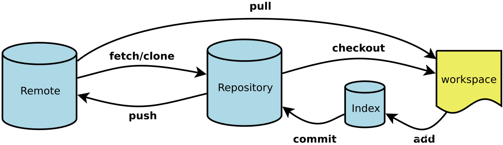

# Git

> *断断续续地使用了git的部分功能，稍稍做一些系统性的整理*

## 理解

git 是一个分布式版本控制系统，即每个人的本地都是一个完整的版本库，可以进行版本控制。

而且git的版本库记录的不是每个文件的增量，而是所有文件的快照，这样可以方便地进行版本回退。

常用git一般是通过一个远程仓库来进行协作，每个人都可以从远程仓库克隆一份到本地，然后在自己的分支上进行修改，最后再推送到远程仓库，通过冲突处理合并到主分支。（~~或者当成远程备份库~~）

## git架构



- workspace：工作区，实际工作目录

- index：暂存区，通过add添加

- repository：版本库

- remote：远程仓库

- branch：分支

- HEAD：指向当前分支的指针

- *origin：默认远程仓库*

- *master: 默认主分支*


## 常用命令

- git pull <remote> <branch> 
> 约等于 git clone + git merge,一般用于将远程仓库克隆到本地
 
- git push (-u) <remote> <branch>
> 将本地的仓库（repository）推送到远程仓库的分支上，-u参数表示将本地分支与远程分支关联起来

- git add <file>
> 将工作区的文件添加到暂存区（index） 

- git commit -m <message>
> 将暂存区的文件提交到本地仓库（repository）
> message是提交的说明，一般是对本次提交的精简描述

- git init
> 初始化一个本地仓库

- git clone
> 将远程仓库克隆到本地

- git branch
> 查看分支
> -a 查看所有分支
> -r 查看远程分支
> -d 删除分支
> 后加分支名可新建分支

- git checkout <branch>
> （新建且）切换分支

- git merge <branch>
> 将<branch>分支合并到当前分支

- git rebase
> 将当前分支的提交记录移动到<branch>分支的最后
> 使得提交记录更加清晰

## 常用操作

- 新建一个本地仓库并与远程仓库关联

```bash
git init
git remote add origin <url>
git pull origin master
...
git add *
git commit -m "..."
git push -u origin master
```

- 从远程仓库克隆到本地

```bash
git clone <url>
```

- 从远程仓库拉取分支并完成合并

```bash
git pull origin <branch>
git merge <branch>
git add *
git commit -m "..."
git push -u origin master
```
