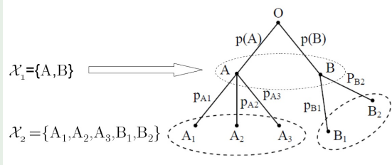
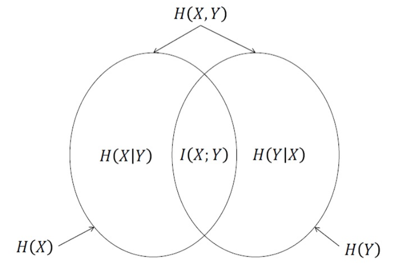

# 信息理论

~~高级的概率论与数理统计~~

## 信息的定义

- **信息是一种用来消除不确定性的东西**

    - 信息来源于物质，但不等于物质
    
    - 信息必须有一个载体，信息是载体的内容

## 信息的度量

> $I(A) = -\log_2 P(A)$

- 信息的度量单位是比特（bit），正对应于当前的计算机系统 (*以e为底则称为奈特nat*)

- 香农信息量相当于将信息论和概率论联系起来、

    - 概率越小，信息量越大
  
    - 非负数
  
    - 可加性

### 事件的自信息

- 事件的自信息的本质

    - **事件发生后**所提供的信息量
    
    - **事件发生前**为确证事件发生的不确定性所需要的信息量

- 条件自信息的本质

    - 事件Y发生后，X再发生需要的“新的信息量”
    
    - 事件Y发生后，X又发生了，提供给观察者的“新的信息量”

### 事件的互信息(Mutual Infomation)

- $I(x ; y ) = I(x) - I(x | y)= -log P(x) - ( - log P(x | y) ) = log \frac{P(x, y)}{P(x)P(y)}$

- 单一事件Y发生后对事件X的不确定性减少的程度

    也就是

    **已知 Y 发生的情况下，X 发生带来的不确定性**

    **不知道 Y 是否发生的情况下，X 发生带来的不确定性**

    之差

- 对称性：$I(x ; y ) = I(y ; x )$

- 链式法则：$I(x ; y, z ) = I(x ; y ) + I(x ; z | y )$

### 熵

- $H(X) = \sum P(x_i) I(x_i) = - \sum P(x_i) \log_2 P(x_i)$

- 熵定义为随机变量各个事件的平均自信息，也就是随机变量的不确定性

- 熵针对随机变量，自信息针对的是具体事件（随机变量取值）

- 联合熵的链式法则：$H(X, Y) = H(X) + H(Y | X)$

    - 特殊的，X,Y统计独立时，$H(X, Y) = H(X) + H(Y)$

    - 多变量，$H(X_1, X_2, \cdots, X_n) = \sum H(X_i | X_1, X_2, \cdots, X_{i-1})$

- 熵的性质

    - 本质上是K维概率空间上向量的函数

    - 基本简单性质

        - 非负性：$H(X) \ge 0$
        
        - 确定性：当且仅当X是确定性的随机变量时，$H(X) = 0$
        
        - *可扩展性*：维度扩展

    - 可加性

        - 即上面的联合熵的链式法则推广
        
        - 证明:

        

        $H(X_1,X_2) = H(X_2) + H(X_1 | X_2) = H(X_2)$  ($X_2$确定后，$X_1$也确定了，所以$H(X_1 | X_2) = 0$)

        $H(X_1,X_2) = H(X_1) + H(X_2 | X_1)$

        两式相等，所以 $H(X_2) = H(X_1) + H(X_2 | X_1)$

    - 极值性

        - $H_K(p_1,p_2, \cdots p_K) \leq H_K(\frac{1}{K},\frac{1}{K}, \cdots \frac{1}{K}) = log K$

    - 条件熵 <= 熵

        - $H(X|Y) \leq H(X)$
        
        - $H(X|y) <> H(x)$

    - 凸函数性质

        - 熵是定义在凸集上的上凸函数
        
            - 凸函数性质：
            
                - Hessian矩阵正定/负定
                
                - Jensen不等式成立

                    $\Sigma \theta_i f(x_i) \leq f(\Sigma \theta_i x_i)$  
        
        - $H(\theta \alpha + (1-\theta) \beta) \geq \theta H(\alpha) + (1-\theta) H(\beta), \theta \in [0,1]$
        
    - 互信息 与 熵
    
        - $I(X;Y) = H(X) - H(X|Y) = H(Y) - H(Y|X) = H(X) + H(Y) - H(X,Y)$
        
        - 互信息等于事件Y（整个随机变量）发生后对事件X的不确定性减少的程度

             

- 相对熵（KL散度）

    - $D(p||q) = \sum p(x) \log \frac{p(x)}{q(x)} = E(\log \frac{p(x)}{q(x)})$
    
    - 性质：
    
        - 非负性
        
        - 不对称性
        
        - 与互信息的关系
        
            $I(X;Y) = D(p(x,y)||p(x)p(y))$

        - 与熵的关系
        
            $H(x) = H(U) - D(X||U)$ 

        - “链式”法则（P=P1P2相互独立, Q=Q1Q2相互独立                      ）
      
            $D(P||Q) = D(P1||Q1) + D(P2||Q2)$       

## 信息论 & 通信

- 信源编码

    - 一定损失比率下，通过编码技术减少信息的传输量
    
    - 因为不同样本出现概率不同，可以通过编码技术（例如哈夫曼编码）来减少信息的传输量

- 信道接收

    - 抗干扰信号，提高信息传输的可靠性

- 理论极限
