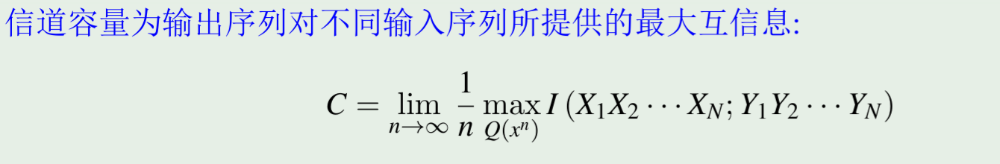

# 信息理论

~~高级的概率论与数理统计~~

## 信息的定义

- **信息是一种用来消除不确定性的东西**

    - 信息来源于物质，但不等于物质
    
    - 信息必须有一个载体，信息是载体的内容

## 信息的度量 (离散)

> $I(A) = -\log_2 P(A)$

- 信息的度量单位是比特（bit），正对应于当前的计算机系统 (*以e为底则称为奈特nat*)

- 香农信息量相当于将信息论和概率论联系起来、

    - 概率越小，信息量越大
  
    - 非负数
  
    - 可加性

### 事件的自信息

- 事件的自信息的本质

    - **事件发生后**所提供的信息量
    
    - **事件发生前**为确证事件发生的不确定性所需要的信息量

- 条件自信息的本质

    - 事件Y发生后，X再发生需要的“新的信息量”
    
    - 事件Y发生后，X又发生了，提供给观察者的“新的信息量”

### 事件的互信息(Mutual Infomation)

- $I(x ; y ) = I(x) - I(x | y)= -log P(x) - ( - log P(x | y) ) = log \frac{P(x, y)}{P(x)P(y)}$

- 单一事件y发生后对事件x的不确定性减少的程度(有点像衡量两事件的相关性，可能为正、负、0)

    也就是

    **已知 y 发生的情况下，x 发生带来的不确定性**

    **不知道 y 是否发生的情况下，x 发生带来的不确定性**

    之差

- 对称性：$I(x ; y ) = I(y ; x )$

- 链式法则：$I(x ; (y, z) ) = I(x) - I(x | (y,z) ) = I(x ; y ) + I((x ; z) | y )$

    (事件y , z 给 事件 x 带来的信息量 = 事件 y 给事件 x 带来的信息量 + y已知的条件下事件 z 给事件 x 额外带来的信息量)

### 熵

- $H(X) = \sum P(x_i) I(x_i) = - \sum P(x_i) \log P(x_i)$

- 熵定义为随机变量各个事件的平均自信息，也就是随机变量的不确定性

- 熵针对随机变量，自信息针对的是具体事件（随机变量取值）

- **条件熵**

    - 单一事件的条件熵 即 简单地替换对应的p(x)为p(x|y)

        $$ H(X|y) = - \sum_{x_i} P(x_i|y) \log P(x_i|y) $$

    - 随机变量的条件熵，定义为**对条件随机变量的熵的期望**，本质是**随机变量Y确定后随机变量X还剩下的不确定度**，理解上可以参考条件数学期望的定义

        $$ H(X|Y) = \sum_{y_i} P(y_i) H(X|y_i) = - \sum_{x_i} \sum_{yj} P(x_i,y_j) \log P(x_i|y_j) $$

- 联合熵的链式法则：$H(X, Y) = H(X) + H(Y | X)$

    - 特殊的，X,Y统计独立时，$H(X, Y) = H(X) + H(Y)$

    - 多变量，$H(X_1, X_2, \cdots, X_n) = \sum H(X_i | X_1, X_2, \cdots, X_{i-1})$

- 熵的性质

    - 本质上是K维概率空间上向量的函数

    - 基本简单性质

        - 非负性：$H(X) \ge 0$

        - 确定性：当且仅当X是确定性的随机变量时，$H(X) = 0$

        - *可扩展性*：维度扩展

    - 可加性

        - 即上面的联合熵的链式法则推广

        - 证明:

        

        $H(X_1,X_2) = H(X_2) + H(X_1 | X_2) = H(X_2)$  ($X_2$确定后，$X_1$也确定了，所以$H(X_1 | X_2) = 0$)

        $H(X_1,X_2) = H(X_1) + H(X_2 | X_1)$

        两式相等，所以 $H(X_2) = H(X_1) + H(X_2 | X_1)$

    - 极值性

        - $H_K(p_1,p_2, \cdots p_K) \leq H_K(\frac{1}{K},\frac{1}{K}, \cdots \frac{1}{K}) = log K$

    - 条件熵 <= 熵

        - $H(X|Y) \leq H(X)$

        - $H(X|y) <> H(x)$

    - 凸函数性质

        - 熵是定义在凸集上的上凸函数

            - 凸函数性质：

                - Hessian矩阵正定/负定

                - Jensen不等式成立

                    $\Sigma \theta_i f(x_i) \leq f(\Sigma \theta_i x_i)$  

        - $H(\theta \alpha + (1-\theta) \beta) \geq \theta H(\alpha) + (1-\theta) H(\beta), \theta \in [0,1]$

    - 互信息 与 熵

        - $I(x, y) = I(x) - I(x | y) = -log \frac{p(x)p(y)}{p(x,y)}$

        - $I(X;Y) = E(I(x,y)) = H(X) - H(X|Y) = H(Y) - H(Y|X) = H(X) + H(Y) - H(X,Y)$

        - 互信息等于事件Y（整个随机变量，有多种结果）发生后对事件X的不确定性减少的程度

             

        - 数学上说，I(X;Y) 是输入的分布矢量 和 转移概率矩阵 的信息函数   

        - 互信息的凸性

- 相对熵（KL散度）

    - $D(p||q) = \sum p(x) \log \frac{p(x)}{q(x)} = E_p(\log \frac{p(x)}{q(x)})$

    - 性质：

        - 非负性

        - 不对称性

        - 与互信息的关系

            $I(X;Y) = D(p(x,y)||p(x)p(y))$

        - 与熵的关系

            $H(x) = H(U) - D(X||U)$ （U为均匀分布）

        - “链式”法则（P=P1P2相互独立, Q=Q1Q2相互独立）

            $D(P||Q) = D(P1||Q1) + D(P2||Q2)$

- 疑义  

    - $X \in \{x_0, x_1, ... x_{n-1}\}$为真实变量，$\hat X$为估计变量，使用$\hat X$来估计$X$

    - 疑义度定义：

        $$ P_E = \Sigma_{k=0}^{n-1} \Sigma_{i=0}^{n-1} P(X = k, \hat X = i) (i \neq k) $$

    - Fano 不等式

        $$ H(P_E) + P_E \log(n-1) \geq H(X| \hat X) $$

        

### 马尔可夫链

- 马尔可夫链的定义

    - 一个随机过程，具有马尔可夫性质
    
    - 马尔可夫性质：$P(X_{n+1} | X_1, X_2, \cdots, X_n) = P(X_{n+1} | X_n)$

    - 数据处理定理：增加数据处理次数，不会增加数据量

        $$ X -> Y -> Z $$

        $$ I(X;Y) \geq I(X;Z) $$

        $$ I(X;Y) \geq I(X;Y|Z) $$

    - 互信息的凸性

        

        

## 信息的度量（连续）

> 求和 --> 积分

- 互信息

    $$ I(X;Y) = \int \int p(x,y) \log \frac{p(x,y)}{p(x)p(y)} dx dy $$

    - 二维正态变量的互信息

        $$ I(X;Y) = - \frac{1}{2} \log (1-\rho^2) $$

- 微分熵
  
    $$ H_c(X) = - \int p(x) \log p(x) dx $$

    - 一些说明：

        - 微分熵实际上不是连续变量的不确定度，因为那个一般是无穷大

        - 微分熵是一种保证前面离散变量性质的”龟腚“，实际可正可负

        - 微分熵不具有线性不变性  

    - 峰值性

        - 取值一定时，均匀分布的微分熵最大，为 $H_c(X) = \ln L$

        - 方差一定时，高斯分布的微分熵最大，为 $H_c(X) = \ln (\sqrt{2 \pi e} \sigma)$ 

    - 熵功率的定义

        $$ \bar \sigma_x^2 = \frac{1}{2 \pi e} e^{2 H_c(X)} $$

        此时高斯分布的熵功率恰为$\sigma^2$

## 平稳离散信源

- **平稳随机过程**

> 连续T时间段内的概率分布是相同的
>
> $E(X_t) = E(X_{t+k}) = E(X_0) = Const.$

- 离散信源

    - 平稳信源

        $$ P(x_1, x_2, \cdots, x_n) = P(x_{1+k}, x_{2+k}, \cdots, x_{n+k}) $$

    - 简单无记忆信源

        $$ P(x_1, x_2, \cdots, x_n) = P(x_1)P(x_2) \cdots P(x_n) $$

    - m阶马尔可夫信源

        $$ P(x_1, x_2, \cdots, x_n) = P(x_1)P(x_2|x_1) \cdots P(x_n|x_{n-1}, \cdots, x_{n-m}) $$

- 平稳信源的熵

    - $H = - \sum P(\vec{X}) \log P(\vec{X})$ (会趋近于无穷大)

    - 平均每符号熵 $H_n(X) = \frac{H(X)}{n}$

    - 熵速率$H = \lim_{n \to \infty} H_n$

    - 性质

        - $H(X_N | X_{N-1}, \cdots, X_1) $单调不增

        - $H_N(X)$单调不增

        - $H_N(X) \geq H(X_N | X_{N-1}, \cdots, X_1) \to \lim_{n \to \infty} H(X_N|X_{N-1}X_{N-2}\cdots X_1)$

- 熵的相对率

    - $\eta = \frac{H}{\log n}$

- 信源的冗余度

    - $R = 1 - \eta$

- **马尔可夫源的熵率**

    - $$ H_{\infty} = \lim_{n \to \infty} H_n = H(X | S) = \sum_{s_i \in K^m} P(s_i) H(X | S = s_i) $$

## 信息论 & 通信

### 核心

### 信源编码

> 在代价最小(最小的比特数)的意义上来最有效地**表示**一个信源

- 等长编码

    - 比较好理解，对于所有可能输入的$K^L$字段都分配一个等长的编码，因此有 $D^N \geq K^L$，即 $N\geq \frac{L log K}{log D}$

- 香农编码定理(渐进无损压缩的极限)

    > $N = \frac{LH(U)}{log D}$

    - $L \to \infty,\frac{I(u^L)}{L} \to H(U)$

    - 利用典型列（大数定律型）进行直观证明(不严格)

        

    - 由切比雪夫不等式，可严格证明

        - $2^{-n(H-\epsilon)} \leq P(\vec{X}) \leq 2^{-n(H+\epsilon)}$

- 不等长编码
    
    > $\bar L = \sum n_k p_k$
    >
    > **不等长编码定理：**
    >
    > $$\exists\bar{L}_{best}, \ \frac{H(U)}{logD} \leq \bar{L} \leq \frac{H(U)}{logD} + 1$$
    >
    > **证明：**
    >
    > 
    >
    > 
    >
    > **定理扩展：**
    >
    > 

    - **唯一可译性**
    
        

        - Sardinas & Petterson 判据（后缀分解）

            > 一个码是唯一可译码的充分必要条件是除$S_0$外没有任何一个后缀分解集中包含码字
            
            

            

        - Kraft 不等式(异字头码)

            > $\sum D^{-l_i} \leq 1$

            - 等长码时，等号成立

            - 不等长码时，不等号成立

            - 相当于所有码字都放在一棵D叉树的叶子上，树的深度为码字的最长长度，每一层只能选择一个分支
          
            - *唯一可译码不一定是异字头码，但唯一可译码必定满足Kraft不等式*

                

            - **重要关系：唯一可译码 --> Kraft 不等式成立 --> 存在同样长度分布的异字头码**

    - **即时可译性** 
    
    - Huffman 编码（最优，略）
    
        - D 元
            
             
    
    - Shannon 编码

        

        - 前缀码

               

        - 与 Huffman编码 相比，Shannon 编码逼近香农极限，但是收敛性能不如 Huffman 编码

    - *Fano 编码*

        

    - *离散有记忆信源*

        

    - *马尔可夫信源的编码*

        

### 信道接收

> 在代价尽量小、**尽量正确可靠**地接收信号的意义上来最有效地**传输**一个信源（信道传输是概率性的）

#### 信道容量

- 无记忆信源DMS

    $$I(X_1,X_2,\cdots X_N;Y_1,Y_2,\cdots Y_N) \leq \sum_{i=1}^{N} I(X_i, Y_i)$$

    $C = max I(X,Y)$

- 平行信道

    

- 对称信道

    - 输入对称：行置换
    
    - 输出对称：列置换
    
    - 准对称：按列划分得到的若干子信道是对称矩阵 

#### 香农信道编码定理

> 如果信息传输速率R小于信道容量C，则总存在一种编码方法，使信
息在该信道上无错误地可靠传输。

### 理论极限

