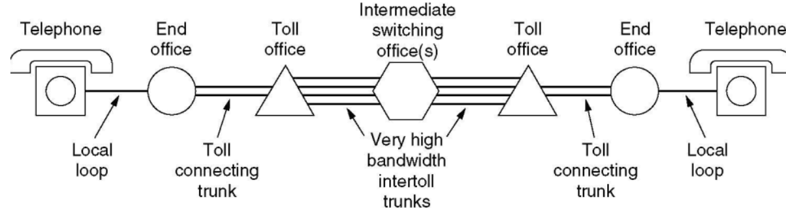

# 计算机网络

> Forked [Zhang Each前辈](https://github.com/Zhang-Each/My-CS-Notebook)

## Chapter1.  Introduction

!!! note "Network Scales"
    - Personal Area Network (PAN)
    - Local Area Network (LAN)
    - Metropolitan Area Network (MAN, city级别)
    - Wide Area Network (WAN，country级别)
        
        ??? tip "WAN"
            > 主机和通信子网构成
            
            - Wired telephone network (PSTN)
            - Cellular telephone network(NG)
            - SD-WANs (Software-Defined WANs)

### 1.1 网络模型

- OSI 七层模型：
  - **物理层**：在一条通信信道上传输比特
    - 要确定用什么电子信号表示0和1，一个比特持续多久，传输是否可以双向，连接如何建立等等
  - **数据链路层**：发送方将输入数据拆分成若干数据帧(frame)，然后按照一定的顺序来发送这些数据帧
    - 接收方必须确认收到的每一帧，保证数据的顺序和完整性，然后发回确认帧
    - 为了防止发送方淹没慢速的接收方，需要对流量进行调节
    - **介质访问控制子层**则是控制对共享信道的访问，没有拥塞控制的功能
  - **网络层**：控制子网的运行，将数据包从源端发送到接收方，需要处理拥塞
    - 允许异构的网络相互连接成互联网络
  - **传输层**：接受会话层的数据，将数据分割成小单元，然后传到网络层
    - 传输层是真正的端到端的层，始终将源数据从源端带到接收方
    - OSI模型中1-3层是链式连接的，而4-7层是端到端的
  - **会话层**：负责管理主机间的会话进程，利用传输层提供的端到端的服务，向表示层提供增值服务，主要表现为**表示层实体或者用户进程**建立连接并在连接上传输数据
    - 这一过程也称为建立同步
  - **表示层**：关注传递信息的语法和语义，主要是实现数据的格式转换和压缩
  - **应用层**：包含了各种各样的协议，提供了用户和网络的接口
    - 软件开发基本都是应用层的工作

  

  - **几种常见设备所处的OSI七层模型的层级：**
    - 路由器：网络层
    - 交换机：数据链路层
    - 集线器：物理层

- TCP/IP
  - 原本是Linux/Unix下的一个网络通信栈，比较OSI七层模型简单
  - **没有表示层和会话层**，物理层和数据链路层Host-to-network
  - 因为开放，所以用的人多，成为了互联网的标准
  - 混合模型 hybrid model——本课程讨论的模型
    - 物理层
    - 数据链接层
    - 网络层：可能分为内层和外层
    - 传输层
    - 应用层

### 1.2 协议架构

!!! note "设计目标"
    - Reliability 可靠性
    - Scalability 可扩展性
    - Evolvability 可演化性
    - Security 安全性

- 几个关键词：
    - **Protocol** 协议
    - **Layer** 层
    - **Peers** 对等——不同的host之间存在对等的协议层
    - **Interface** 接口——传输的过程中上层协议会调用下层协议的接口
    - **Protocol Stack** 协议栈
- 数据传输的过程：
    - 在source machine中，数据自顶向下传输，每一层会给上一层传输的数据包添加一个header，如果传输的数据包过大则会把数据包进行拆分，但是**header不会进行拆分** 
    - 在destination machine中，则一步步去掉底层的header，并将小的数据包合并

### 1.3 服务 Service

- 服务类型
    - 面向连接的服务 connection-oriented
        - Reliable message stream 可信信息流，比如page的序列
        - Reliable byte stream 可信字节流，比如远程登录，TCP/IP协议向应用层发送的是字节流
        - Unreliable connection 不可信连接，比如数字化语音
    - 不需要连接的服务 connection-less
        - Unreliable datagram 不可信数据报，比如垃圾邮件
        - Acknowledged datagram 共识数据包，比如注册邮件
        - Request-reply 请求回复，比如数据库查询
    - QoS 服务的质量

- 服务原语 Service Primitives

    - 面向连接服务的5个服务原语

    | Primitive  | Meaning                    |
    | ---------- | -------------------------- |
    | LISTEN     | 等待一个还没来的连接       |
    | CONNECT    | 和一个等待的对等层进行连接 |
    | RECEIVE    | 等待一个还没来的message    |
    | SEND       | 向对等层发送一个message    |
    | DISCONNECT | 结束一个连接               |

    - Request--Indication--Response--Confirm

### 1.4 C/S模式

- Client-Server Model 客户端主动连接，服务端被动连接
    - 客户端之间不能直接通信，客户端的通信也需要经过服务器
    - 新技术：服务器分配端口，让两个客户端直接通信，不需要所有数据经过服务器
    - 当客户端升级的时候需要更新整个客户端，手机APP就是C/S模式
- Browser-Server Model 从C/S体系发展而来
    - 通过浏览器来实现用户和服务端的交互，只需要升级浏览器
- Peer-to-peer Model(P2P模式)——对等网络
    - 每个客户端同时又是服务端，没有固定的客户端和服务端  

- wireless network 无线网络
    - 注意和移动计算mobile computing的区别，移动计算可以是有线的，可以是无线的
    - wifi就是一种无线网络

### 1.5 网络传输

- 三种传输方式：
    - Broadcast links 广播式传输
        - 传输模型类似于**总线**，总分式结构
        - 以太网的原理都是基于广播的
    - Point-to-point limks 点对点传输
        - 传输模型是一张复杂的网——网络拓扑结构
        - 一次只发给一台计算机
    - multicasting 多点广播
        - 传输模型是一个环，一次发给一组计算机
        - 不是天然存在的，需要通过软件系统来实现多点广播机制
- 网络的类型：按照规模来划分
    - 个人区域网 Personal area network(PAN)
    - 局域网 Local area network(LAN)
    - 层域网Metropolitan area network(MAN)
        - 技术的可替代性比较强，局域网大一点就可以作为层域网，广域网小一点就可以作为层域网
    - 广域网Wide area network(WAN)
        - 特点是会有很多router和subnet
    - 最大的网络就是因特网 The Internet

### 1.6 性能指标

这一部分来自XXR版计网，作为基础知识了解一下

- 数据率和比特率：表示数据传送的速率，单位是bit/s，也写作bps
- 带宽 bandwidth
  - 带宽本来是指某个信号具有的频带宽度，也就是某个信号所处频率区间的长度，这种意义上的带宽单位是HZ
  - 但是在计算机网络中也可以指某个信道的最大传输速率，此时的单位也是bit/s
  - 事实上两种说法一种是频域称谓，另一种是时域称谓
- 吞吐量：表示单位时间内某个网络每秒的实际数据量，并不是实际数据总量

----

## Chapter2.  Physics Layer

### 2.0 物理层的基本概念

- 物理层存在的意义正是要尽可能地屏蔽不同的传输媒体和通信手段之间的差异，使得物理层上面的数据链路层感受不到这些差异
  - 物理层的协议也常常称为规程 procedure，这个词比协议要出现的早
- 一个数据通信系统分为如下几个部分
  - 源系统，也叫发送端和发送方：包含源点和发送器
  - 传输系统，也叫传输网络
  - 目的系统，也叫接收端，包含接收器和重点

### 2.1 有线通信和无线通信

- 物理层用到的几种线
  - 双绞线 Twisted Pair
  - 同轴电缆
  - 光缆 Fiber Cables
    - 利用了光的全反射原理，在特定入射角度下不会发生折射
- 接口线 Interface Line
- 无线通信：
  - 卫星通信
  - 微波通信：常见于移动通讯，微波会穿过遮挡物继续传播，但可能会被吸收
- 物理层要做的就是把计算机中的电信号转化成上面这些可以传播的信号
  - 信号 signal是数据的电气或者电磁表现，分为模拟信号和数字信号
    - 模拟信号也叫连续信号，代表消息的参数的取值是连续的
    - 数字信号也叫离散信号，代表消息的参数取值是离散的，比如计算机和解调器的通信就是数字信号
  - 信号分为数字信号和模拟信号，比如：
    - 电话是将模拟信号转换成模拟信号
    - Modem是模拟信号转换成数字信号
    - Codec是把数字信号转换成模拟信号

### 2.2 信道channel和传输 Transmission

- 信道：表示向某一方向传送信息的媒体
  
    - 信道和电路的概念不相同，电路往往包含了发送信道和接受信道各一条
    - 信道的通信方式也分为单向通信、双向交替通信和双向同时通信

- 基带传输 Baseband Transmission 信号分为0和1，分为若干种传输方式：

  - Non-return to zero 用高频代表1，低频信号代表0
      - 存在时钟恢复问题，应该从中间处采样
  - NRZ Invert 
      > 在发生10切换的时候信号突变，高低电平进行切换
      - 被USB使用
  - Manchester 曼切斯特编码：
      > 0的时候信号在时钟边沿由高变低，1的时候信号在时钟边沿由低变高
      - 被Ethernet 以太网使用

  - 二级编码：AMI
  - 4B/5B编码：每四位一组，按照规则扩展成32位，共有32种组合，其余的16种作为控制码

  - 宽带传输和基带传输的**区别**：
    - 宽带传输是把基带信号调制之后形成频分复用模拟信号，在模拟信道上传输
    - 调制是将数字01转换为信号的过程

- **通带传输 Passband Transmission**

    - 调制的三种主要方法：
        - 调幅(ASK) Amplitude shift keying
        - 调频(FSK) Frequency shift keying
        - 调相(PSK) Phase shift keying
    
    !!! note "QPSK"
        使用相位正交的两个载波进行线性组合，理论上可以调制出I-Q平面上的任意点，因此可以传输更多的信息

        本质上就是同时调幅+调相

        

- 信道的**最大数据传输速率**：

    - Nyquist定理：带宽为W，则**信号传输速率**不超过2W
        - 对于一个信道，并且没有噪声的情况下才适用
        - W的单位是赫兹，表示每秒信号变化次数
    - Bilevel 编码：数据传输速率 = 2倍的带宽，单位是bps
    - 多进制编码：数据传输速度 =  $2W\log_2M$ 其中M是进制，结果的单位是bps
        - 没有理论值的上限，但是会产生损失

- 香农定理 Shannon's Theorem

    - 带宽是H(HZ)，信噪比是S/N，信噪比的计量单位是dB
    - 最大的数据传输速率是：$H\log _2(1+\frac SN)$ 
        - 也就是说信噪比越大，最大的可能传输速率就越高
    - 信噪比的计算公式：$信噪比=10\log_{10}(\frac SN)$  

### 2.3 公共电话系统 PSTN

- PSTN用于传输人声，但是更加难以辨别，结构如下图所示：

  - 主要组成部分：
    - 本地回路：传输模拟信号的双绞线
    - 干线 Trunk：数字光缆，连接了各个交换局
    - 交换局 Switching office：进行通话的交换，从手动切换变成了计算机切换
  - 模拟信号在end office通过设备使用codec进行数字化
    - 每秒采样8000次，每次采样量化成8bit的二进制数，这项技术叫做PCM脉冲编码调制
    - T1信道有24个PCM信号，数据传输速率是**1.544Mbps** 
    - E1信道有32个PCM信号，数据传输速率是**2.048Mbps** 
  
  
  - 信道的**开销cost**：
    - T1信道每一帧传输的193bit中，有7*24=168bit是有效信息，有25bit是开销，因此开销率是25/193=13%
    - E1信道的32个信道中30个传输数据，2个传输信号，因此开销是2/32=6.25%

### 2.4 信道复用

#### 2.4.1 频分复用(FDM, Frequency Division Multiplexing)

- 利用通带传输的优势使得多个用户共享信道，每个用户拥有一个自己的频段来发射自己的信号

  - OFDM 正交分频复用

#### 2.5.2 时分复用 TDM

- 每个用户周期性地获取整个带宽非常短的一个时间段，每个输入流中的bit从一个固定的时间槽中取出，并输出到混合流中

  - TDM被广泛应用在电话网络和蜂窝网络中

#### 2.5.3 码分复用 CDM

- 码分多址 CDMA：在CDMA中，每个bit时间被分为m个更短的时间间隔，称为码片chip
  - 如果要传输一个1就发送分配的码片序列，如果要传输0就发送码片序列的反码
  - 发送站的任意两个chip都正交，也就是归一化的内积为0

### 2.6 习题

-  If a binary signal is sent over a 15-kHz channel whose signal-to-noise ratio is 15 dB, what is the maximum achievable data rate?
  - 首先需要根据信噪比的分贝数算出S/N，再算出香农定理下的最大传输速率，但是要注意另一种算法下的最大传输速率是30，因此取比较小的应该是30
- 14 signals, each requiring 5000 Hz, are multiplexed on to a single channel using FDM. How much minimum bandwidth is required for the multiplexed channel? Assume that the guard bands are 200 Hz wide.
  - n个信号，每个所需要的宽度是x，guard band是y，则一共需要的带宽是nx+(n-1)y HZ
- A simple telephone system consists of two end offices and a single toll office to which each end office is connected by a 1-MHz full-duplex trunk. The average telephone is used to make four calls per 8-hour workday. The mean call duration is 6 min. Ten percent of the calls are long-distance (i.e., pass through the toll office). What is the maximum number of telephones an end office can support? (Assume 4 kHz per circuit.)
  - 每天工作8小时，平均一台电话机要打4个电话，每个电话6min，一共是24min所以每小时只需要3min，因此可以一次支持20台远程通话，又因为只有10%是远程通话，所以一个信道可以支持200台
  - 1MHZ的干线，每个信道的带宽是4KHZ，一共有250个，因此答案是50000个
