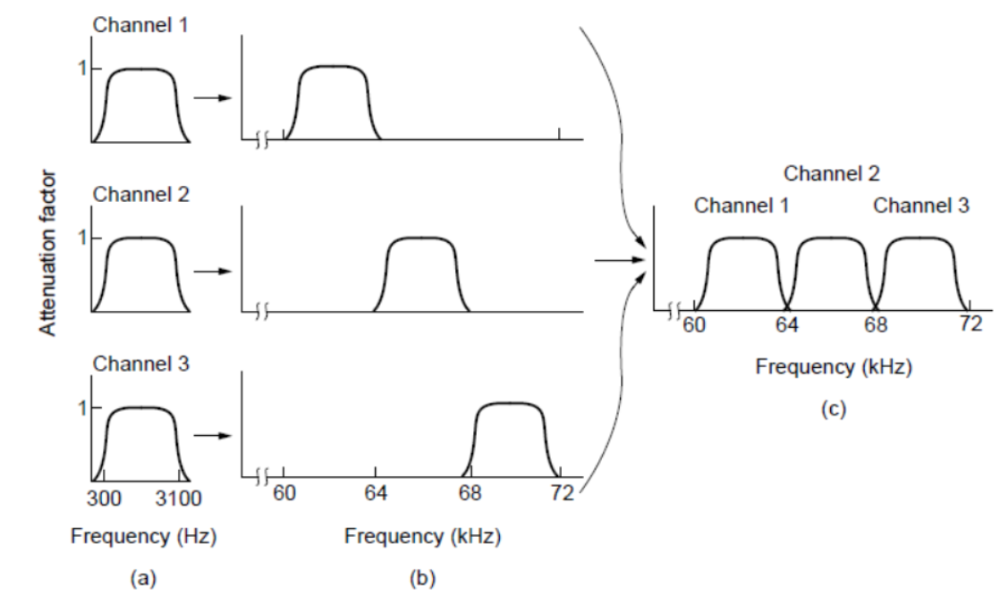
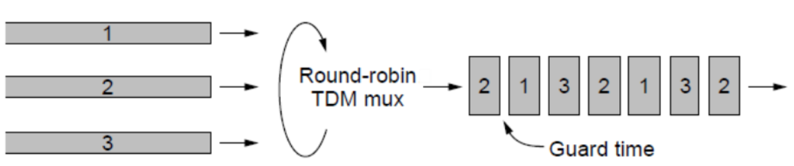
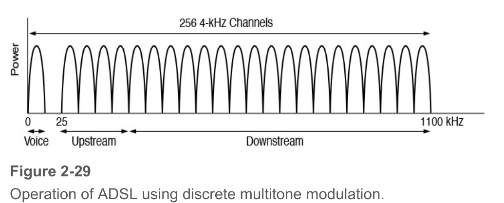
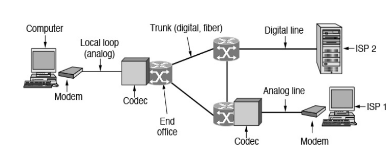
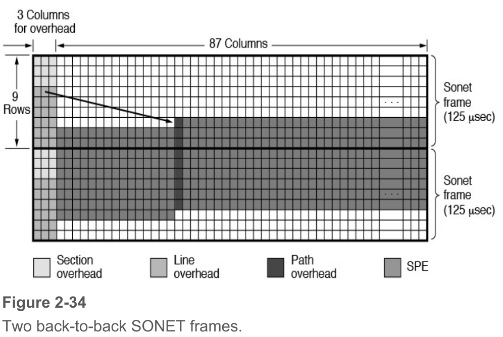
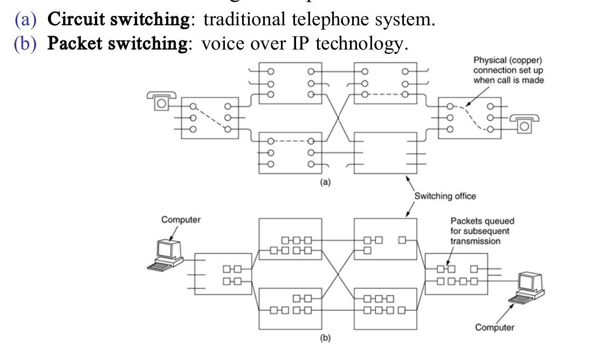
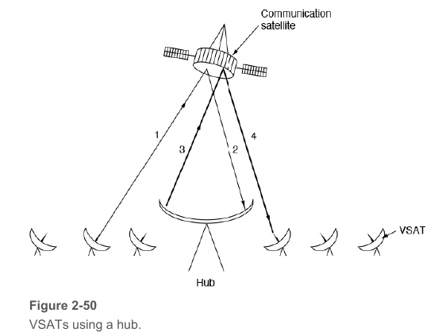

### 2.0 物理层的基本概念

- 物理层存在的意义正是要尽可能地屏蔽不同的传输媒体和通信手段之间的差异，使得物理层上面的数据链路层感受不到这些差异
    - 物理层的协议也常常称为规程 procedure，这个词比协议要出现的早
- 一个数据通信系统分为如下几个部分
    - 源系统，也叫发送端和发送方：包含源点和发送器
    - 传输系统，也叫传输网络
    - 目的系统，也叫接收端，包含接收器和重点

### 2.1 有线通信和无线通信

#### Guided Media 有线通信

!!! info "Twisted Pair"

    双绞线，通过两根线螺旋的方式减少电磁干扰，型号为Category 5e，Cat6，Cat7等

    - UTP（无屏蔽双绞线）：没有屏蔽层，常用于家庭和办公室
    - STP（屏蔽双绞线）：有屏蔽层，常用于工业环境

    一般传递的数据为两根线之间的电压差，这样可以减少噪声影响（噪声影响对两根线一致）

    - 常用于电话线，以太网等
    
    - 传输模拟/数字信号

!!! info "Coaxial Cable"
  
      同轴电缆，由一根中心导线，一个绝缘层，一个屏蔽层和一个外层绝缘层组成

      - 常用于有线电视等，抗干扰强，带宽大（6GHz）

      - 传输模拟/数字信号

!!! info "Power Line"
  
      电力线通信，通过电力线传输数据，将高频信号叠加到低频电力信号上

      - 常用于家庭网络，智能家居等

      - 传输数字信号 

!!! info "Fiber Optics"
  
    光纤，通过光的全反射原理传输数据，速度快，带宽大，抗干扰强，而且材质轻，易于铺设

    {width=40% align=right}

    - 连接方式：
        - socket 连接插座，损失10% ～ 20%
        - splice 直接连接，损失10%
        - melted 熔接，损失小
    
    - 光源：
        
        |Item|LED|Laser|
        |---|---|---|
        |Data Rate|Low|High|
        |Fiber type|Multi-mode|Single-mode / Multi-mode|
        |Distance|Short|Long|
        |Lifetime|Long|Short|
        |Temperature sensitivity|Low|High|
        |Cost|Low|High|

    - 传输数字信号

    ??? tip "信号衰减图"
    
        

----

#### Wireless Transmission 无线通信

??? info "电磁波谱"

    

    !!! note "发送形式"

        - Frequency hopping spread spectrum 
            
            频率跳变扩频，通过在不同频率上发送数据，以避免干扰
        
        - Direct sequence spread spectrum

            直接序列扩频，通过编码将数据转化为一个冗余序列，以增加抗干扰能力

        - Ultra-Wideband Communication

            发送低能耗的脉冲信号，在大带宽上稀疏分布，对其他信号干扰小

!!! note "Radio Transmission"

    无线电波传输，传输衰减小，无方向，但是容易受到干扰

    一般低频传输在地面传播，高频传输通过大气反射传播

    

!!! note "Microwave Transmission"

    微波传输，有方向性，传输速度快，传输距离远，但会受到障碍物影响

!!! note "Infrared Transmission"

    红外传播，没法穿墙，常见于遥控器

!!! note "Light Transmission"

    使用光束传播，如激光通信等

    广义上也可以指任何有关光的通信，如LED灯展示的信息

- 物理层要做的就是把计算机中的电信号转化成上面这些可以传播的信号
    - 信号 signal是数据的电气或者电磁表现，分为模拟信号和数字信号
        - 模拟信号也叫连续信号，代表消息的参数的取值是连续的
        - 数字信号也叫离散信号，代表消息的参数取值是离散的，比如计算机和解调器的通信就是数字信号
    - 信号分为数字信号和模拟信号，比如：
        - 电话是将模拟信号转换成模拟信号
        - Modem是模拟信号转换成数字信号
        - Codec是把数字信号转换成模拟信号

### 2.2 信道channel和传输 Transmission

- 带宽

    > The width of the frequency range transmitted without being strongly attenuated is called the bandwidth

    指的是信号稳定传输的频率范围，单位是赫兹

- 信道
    
    > 表示向某一方向传送信息的媒体  
    
    信道和电路的概念不相同，电路往往包含了发送信道和接受信道各一条

    !!! note "信道类型"

        - **simplex** 单向通信
        - **half-duplex** 半双工通信, 通信双方可以交替发送和接收, 但是不能同时发送和接收
        - **full-duplex** 全双工通信, 通信双方可以同时发送和接收

??? tip "傅里叶级数与通信"

    任何一个周期信号都可以用一系列正弦波的和来表示，这些波的频率是基频的整数倍，这个原理叫做傅里叶级数

    通过傅里叶变换，我们可以将信号从时域转换到频域，这样我们就可以看到信号的频率分布

    

- **Nyquist Theorem**

    如果我们以2B的速率采样一个模拟信号，那么我们就可以完全恢复这个模拟信号，而不会有“混叠”现象  

    Max Data Rate = $2B\log_2V$

    其中V是信号的电平级数，B为带宽

- **Shannon's Theorem**

    - 带宽是B(HZ)，信噪比是S/N，信噪比的计量单位是dB
    - 最大的数据传输速率是：$B\log_2(1+\frac SN) = 2B \log_2\sqrt{1+\frac{S}{N}}$ 
        - 也就是说信噪比越大，最大的可能传输速率就越高
    - 信噪比的计算公式：$信噪比=10\log_{10}(\frac SN)(dB)$  

- 基带传输 Baseband Transmission

    > 常用于有线传输

    - **NRZ(Non-return to zero)** 
        
        >  用高频（电平）代表1，低频（电平）信号代表0
      
        - 存在时钟恢复问题，应该从中间处采样
  
    - **NRZI(NRZ Invert)**
        
        > 在1的时候信号突变，高低电平进行切换
      
        - 被USB使用
  
    - **Manchester** 曼切斯特编码：
        
        > 0的时候信号在时钟边沿由高变低，1的时候信号在时钟边沿由低变高;同时通过XOR来恢复时钟
        
        - 被Ethernet 以太网使用

    - **AMI(Alternate Mark Inversion)**

        > 双极编码，如1在+1/-1间跳变，0就为0,从而均值为0（Balanced Signals）

    

    !!! danger "解决连续0问题"
        - **Scrambling**：将数据XOR伪随机产生的序列，使得连续0的情况变少(但是有种子被破解导致出现killing packet的可能)
        - **Block coding**：将数据分块，然后进行编码，使得连续0的情况变少

            !!! note "4B/5B编码"
                4B/5B编码是一种将4bit数据编码成5bit数据的编码方式，这样可以减少连续0的情况

                *8B/10B编码主要用于解决balanced 问题*

- **通带传输 Passband Transmission**

    > 通带传输是指将基带信号转换成通带信号，然后通过信道传输，常用于无线传输
    
    - 调制的三种主要方法：
        - 调幅(ASK) Amplitude shift keying
        - 调频(FSK) Frequency shift keying
        - 调相(PSK) Phase shift keying
        
        {width=50% align=right}
    
    !!! note "QPSK"
        使用相位正交的两个载波进行线性组合，理论上可以调制出I-Q平面上的任意点，因此可以传输更多的信息

        本质上就是同时调幅+调相

        
    
    !!! note "Gray Code"
        格雷码是一种二进制编码方式，相邻的两个数只有一个bit不同，这样可以减少误码率，也减少噪音影响

        

### 2.3 信道复用

#### 2.3.1 频分复用(FDM, Frequency Division Multiplexing)

利用通带传输的优势使得多个用户共享信道，每个用户拥有一个自己的频段来发射自己的信号

  
??? info "OFDM"

    正交频分复用，是一种多载波调制技术，将一个高速数据流分成多个低速数据流，每个低速数据流分配一个子载波，这样可以减少频谱间的干扰

#### 2.3.2 时分复用 TDM

每个用户周期性地获取整个带宽非常短的一个时间段，每个输入流中的bit从一个固定的时间槽中取出，并输出到混合流中，类似轮询机制

TDM被广泛应用在电话网络和蜂窝网络中

#### 2.3.3 码分复用 CDM

码分多址 CDMA：在CDMA中，每个bit时间被分为m个更短的时间间隔，称为码片chip
    - 如果要传输一个1就发送分配的码片序列，如果要传输0就发送码片序列的反码
    - 发送站的任意两个chip都正交，也就是归一化的内积为0
    - 这样利用向量积的性质，就可以利用chip的正交性来解析出不同的用户的信息

#### 2.3.4 波分复用 WDM

波分复用是一种光纤通信技术，通过在不同波长上发送不同的信号，从而实现多用户共享一个光纤

### 2.4 公共电话系统 PSTN

!!! info "演变过程"

    完全图显然不可行，因此需要有有交换局，甚至多层次的交换局，这样就可以实现电话的互联

    {width=50%}

- 主要组成部分：

    - 本地回路 Local Loop：传输模拟信号的双绞线，因此需要模拟数字转换器

        ??? note "xDSL"

            数字用户线路，是一种利用电话线传输数字信号的技术，可以实现高速的网络接入

            {align=left width=40%}

            {align=right width=40%}
        
        ??? note "FTTX"

            将fibre线尽可能地推到用户家中，这样可以提供更高的带宽

            {align=right width=40%}

        
    
    - 干线 Trunk：数字光缆，连接了各个交换局，通过PCM(脉冲编码调制)和Codec(编解码器)进行数字化并同时传输多个数字信号

        - 采样频率：8000Hz
  
        - 采样位数：8bit
        
        - 传输速率：64kbps

        - 模拟信号在end office通过设备使用codec进行数字化
    
        !!! tip

            - T1信道有24个PCM信号，数据传输速率是**1.544Mbps** 
            
            - E1信道有32个PCM信号，数据传输速率是**2.048Mbps** 
          
            {width = 80%}

            - 信道的**开销cost**：
                
                - T1信道每一帧传输的193bit中，有7*24=168bit是有效信息，有25bit是开销，因此开销率是25/193=13%
                
                - E1信道的32个信道中30个传输数据，2个传输信号，因此开销是2/32=6.25%

        ??? note "T-Carrier"

            T1信道有24个PCM信号，数据传输速率是**1.544Mbps** 

            可以层层叠加，形成T2，T3等，从而提供更高的带宽

            
        
        !!! note "SONET/SDH"

            光纤传输系统，提供了更高的带宽，更高的可靠性，更高的灵活性

            可以看成一个多维的阵列，每个维度都有自己的带宽

            如STS-1，9行90列，前3行是控制信息，故共有87 * 9的带宽，总有效带宽 87 * 9 * 8 bit / symbol * 8000 symbol / s = 50.1Mbps

            如果多个STS-1叠加，就可以得到更高的带宽，成为OC-k

            {width=50% align=right}

    - 交换局 Switching office：进行通话的交换，从手动切换变成了计算机切换，交换局之间通过高带宽的 interoffice trunks 连接
        
        {width = 80%}

### Cellular Networks

> 蜂窝网络是一种无线通信网络，它将整个覆盖区域分成许多区域，每个小区域都有一个基站，基站是一个无线电发射器和接收器的组合，它们负责与移动设备通信
>
> 每个区域内的频段被划分为若干个频道，供给不同的用户使用，并且保证相邻的基站使用不同的频道，以避免干扰

!!! info "基本概念"
    
    - **Cells**：每个小区域都是一个cell，每个cell都有一个基站，基站负责与移动设备通信
    
    - **Handoff**：当一个移动设备从一个cell移动到另一个cell时，通话会被转移到新的cell，这个过程叫做handoff
    
    - **Paging**：当一个电话呼叫另一个电话时，基站会广播一个消息，告诉所有的手机有电话呼叫，这个过程叫做paging

- **1G**
    - 1G是模拟信号，使用AMPS模拟蜂窝系统

- **2G**
    - 2G是数字信号，使用GSM全球系统移动通信（以及D-AMPS, CDMA等系统），TDM技术

- **3G**
    - 3G是数字信号，IMT-2000标准，使用CDMA2000和WCDMA技术

- **4G**
    - 4G是数字信号，使用EPC（Evolved Packet Core）和LTE技术进行packet switching

- **5G**
    - 5G是数字信号，使用NR（New Radio）技术，支持更高的频率和更高的带宽

### Cable Networks 

- Community Antenna Television：社区天线电视，是一种通过有线电视网络传输电视信号的技术

- Hybrid Fiber Coax：混合光纤同轴，是一种通过光纤和同轴电缆传输数据的技术

- Data Over Cable Service Interface Specification：DOCSIS，是一种通过有线电视网络传输数据的技术

### Satellite

> 通过卫星传输数据，可以覆盖全球，但是延迟高，带宽低

- **Geostationary Satellites**：地球同步卫星，位于地球赤道上空，高度约为36000km，周期为24小时，因此可以固定在一个地点上

    - VSAT：Very Small Aperture Terminal，小型卫星终端，通过地面的基站Hub进行通信，因此一次通信需要4次传输

        {width=80%}

- **Medium-Earth Orbit Satellites**：中地球轨道卫星，高度约为20000km，周期为12小时，因此可以覆盖极地

    - GPS：全球定位系统，通过多个卫星的信号来定位

- **Low-Earth Orbit Satellites**：低地球轨道卫星，高度约为2000km，周期为2小时，因此延迟低，带宽高

    - Iridium：通过66颗卫星覆盖全球，提供电话和数据服务

### 2.6 习题

-  If a binary signal is sent over a 15-kHz channel whose signal-to-noise ratio is 15 dB, what is the maximum achievable data rate?
  
     - 首先需要根据信噪比的分贝数算出S/N，再算出香农定理下的最大传输速率，但是要注意另一种算法下的最大传输速率是30，因此取比较小的应该是30

- 14 signals, each requiring 5000 Hz, are multiplexed on to a single channel using FDM. How much minimum bandwidth is required for the multiplexed channel? Assume that the guard bands are 200 Hz wide.
  
    - n个信号，每个所需要的宽度是x，guard band是y，则一共需要的带宽是nx+(n-1)y HZ

- A simple telephone system consists of two end offices and a single toll office to which each end office is connected by a 1-MHz full-duplex trunk. The average telephone is used to make four calls per 8-hour workday. The mean call duration is 6 min. Ten percent of the calls are long-distance (i.e., pass through the toll office). What is the maximum number of telephones an end office can support? (Assume 4 kHz per circuit.)
    
    - 每天工作8小时，平均一台电话机要打4个电话，每个电话6min，一共是24min所以每小时只需要3min，因此可以一次支持20台远程通话，又因为只有10%是远程通话，所以一个信道可以支持200台
    
    - 1MHZ的干线，每个信道的带宽是4KHZ，一共有250个，因此答案是50000个