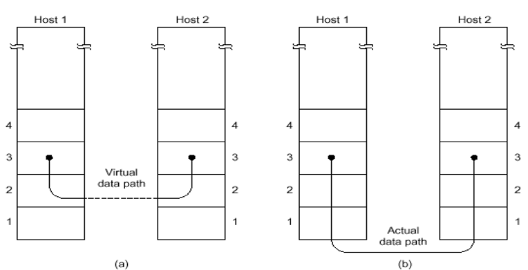
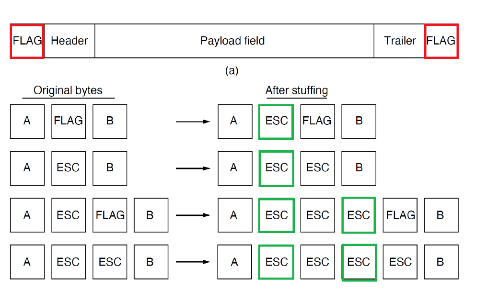
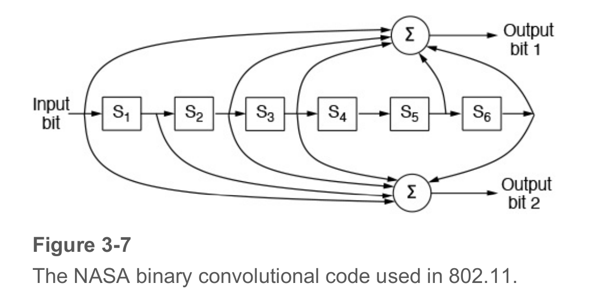
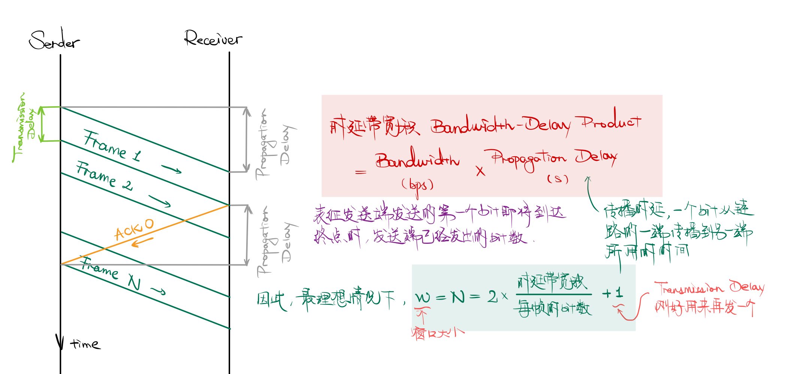
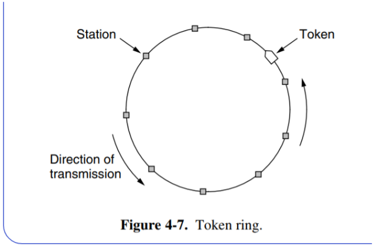
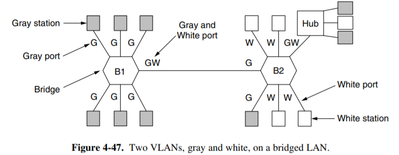

### 3.1 基本概念

#### 数据链路层

> 构建数据链路和逻辑链路，区别于物理层，物理层构建的是物理链路

- **物理层和数据链路层**的本质作用都是用来构建网络通信、访问通道
    - 物理链路是真实存在的物理线路和设备，数据链路层是一些必要的硬件(比如网络适配器)和软件(传输协议)组成的
    - 数据链路层向上提供网络层的服务，处理传输的错误(因为物理层不能发现传输错误)，调节数据流，确保接收方不会被淹没

- 提供的一些服务：
    - **无确认，无连接**的服务：对丢失的帧不负责重发而是交给上一层处理，适用于实时通信或者误码率低的信道，比如以太网
    - **有确认的，无连接**的服务，比如无线通信
    - **有确认的，面向连接**的服务：帧的传输需要建立数据链路、传输帧、释放数据链路，适用于长距离的不可靠链路
    - *无确认，面向连接的服务（现实中无用）

- 提供“虚拟的交流”：实际上就是通过协议和查错，避免需要通过物理层的通信产生的差错，就好像绕过了物理层一样
    
    

#### Frame

> 数据链路层**发送数据的单位** 

- Packet和Frame的关系

    

- 特殊格式：

    - **time gaps：** 显然网络不能确定时间gap稳定，因此无法使用

    - **character count：** 不常用的方法，很容易出错，一个错了后面的就都错了

    - **字节填充法**：开始和结束使用特定的字符，如果正文中出现，则需要转义

        

    - **比特填充法**：通过在帧头和帧尾各插入一个特定的比特串（如 01111110) 来标识-一个数据帧的起始与结束

        - 为了保证传输的内容不被错误解析，可以在传输的数据中每出现连续的5个1就在后面添加一个0，这样就不会出现连续的6个1，就算后面有0也要加一个0

          
    
    !!! danger
        实际工程应用中，往往采用混合的方法，相当于保留一定的冗余来提高数据的可靠性

### 3.2 数据链路层的错误检测

!!! tip "常见错误控制"
    - `Error correcting` 纠错功能
    - `Feedback` 反馈
    - `Error detecting with retransmission` 错误检测和定时重发
    - `Frame numbering` 帧编号
    - `Flow control` 流控制

#### 纠错码 Error correcting code

- 假设一帧由 $m$ 个数据位和 $r$ 个冗余位组成，记 $n=m+r$， 并将该编码描述成$(m,n)$码

- **海明码**：设置一系列校验码和校验位

    - 海明距离：两个码字(codeword)中不同的位的个数，如果两个码字的海明距离为 $d$ ，则需要 $d$ 个1位错误才能把一个码字转换成另一个码字
        - 也就是一个码字中最多可能错误的位数
    - 纠错能力：
        - 如果我们想可靠地检测可能的 e 个错误，我们需要一个海明距离为 e + 1 的编码方案（即，任意两个合法码字之间的距离不小于 e + 1）。因为这样任意 e 个错误不可能将一个合法码字变成另一个合法码字；当我们发现一个非法码字时，我们就知道出现了错误。
        - 如果我们想可靠地纠正可能的 e 个错误，我们需要一个海明距离为 2e + 1 的编码方案。因为这样任意的 e 个错误发生后，原来的码字仍然是现在的码字距离最近的那一个。
    
    - 构造：
        - 对于每$2^m$个合法消息，任何一个消息都有n个非法码字，即海明距离为1的非法码字有n个，因此每个合法消息都需要用n+1位来标识，由于总共有$2^n$种位模式，也就是$(n+1)\le 2^r$ 
        - 用2的幂次的位置作为校验码，其他位置依次放数据
        - 海明码的海明距离为3，可以发现2bit的错误，可以纠正1bit的错误，将码字内的位编号为1到n，其中是2的幂次的位就是校验码，其余的都是数据码
        
         

- **卷积码**：根据设计的卷积状态机，可以很容易地生成码字，但是解码的时候需要用到Viterbi算法

    

??? info "others"

    - Reed-Solomon码：用于CD、DVD等存储介质
    - LDPC码：低密度奇偶校验码，用于蓝光光盘

!!! warning
    只有卷积码是线性码不是块码，其他的都是线性块码

#### 检错码 Error detecting code

- **奇偶校验** parity

    - n-1 位信息，1 位冗余。奇校验码：在加上该位后 1 的个数为奇数；偶校验码则为偶数。
    - 交错校验 interleaving 技术可以一定程度上防止突发的若干比特范围内的错误。将数据块作为 k 行 n 列处理，每列计算一个 parity bit 后附在数据块最后发送。这样除非突发错误持续 n 个 bit 以上，否则仍然可以被检测出来

      

- **校验和 checksum**
    - 对数据进行一些求和运算（奇偶校验位也可以看做校验和的一个例子）
    - 另一个实际例子是 Internet Checksum。规则是：首先将数据分割成 16 bit 的若干段（最后一段不足 16 bit 则在末尾补 0）；然后将这些段相加，最高位进位 wrap around（见下图）；最后将结果按位取反 (?) 作为校验。检查时再次计算数据之和，加上校验，如果结果不为全 1 则发生过错误。

      

- **循环冗余校验 Cyclic Redundancy Check**  

    - 基本思路：并在数据帧的末尾添加若干位作为校验码，**要使所生成的新帧能与**发送端和接收端**共同选定的某个特定数整除** 
      
        - 约定一个生成多项式$G(x)$ （需要首位和末尾的系数都是1）
      
            - 所选定的除数二进制位数（假设为 k 位），然后在要发送的数据帧（假设为 m 位）后面加上 k- 1 位0，接着以这个加了 k-1 个0的新帧（一共是 m+k-1 位）**除**以上面这个除数
      
        - 所得到的余数（也是二进制的比特串）就是该帧的 CRC 校验码，又称 FCS（帧校验序列）
            - 余数的位数比除数位数只能少一位，不能省略前导0
            - 这里的除法是特殊的计算方式，除法中用到的减法是异或XOR，也就是不会借位
        
        - 再把这个余数附加在原数据帧的末尾(覆盖之前的0)，构建一个新的帧发送到接收端，在接收端除以第二步中的除数，如果没有余数就说明没有差错 
      
            

### 3.3 数据链路层的协议

#### Simplex Link-Layer Protocols

- 乌托邦式的单工协议 A Utopian Simplex Protocol(Protocol 1)

    发送方不断地从网络层获取数据包并构造一个帧，通过物理层发送该帧；接收方不断等待唯一可能的事件 FRAME_ARRIVAL 发生，将该帧从物理层取得，并将数据部分发送给网络层。
    
    这种方案的问题是，如果发送方发送帧的速度大于接收方处理的速度，接收方就会被淹没 (flood)。

- 无错信道上的单工停-等协议 A Simplex Stop-and-Wait Protocol for an Error-Free Channel(Protocol 2)

    接收方每当接收一个帧并处理完成后，发回一个确认帧；发送方在收到确认帧后（不需要处理，因为此时唯一的可能就是确认帧），则可以发送下一帧。这种协议在数据传输上是单工的，但是接收方需要发回消息，因此需要使用半双工信道。
    
    这种方案的实际问题在于，没有考虑出现错误的情况

    

- 有错信道上的单工停-等协议 A Simplex Stop-and-Wait Protocol for a Noisy Channel(Protocol 3)

    这种协议在上一种的基础上考虑 3 种可能的错误 
        
    1. 接收到的帧检出错误。为了解决第 1 种错误，我们引入一个新的事件 CKSUM_ERR 表示校验和有误；因而接收方在收到一个帧后应当校验正确性，发回一个表示正确或者错误的确认帧；如果检出错误，则直接抛弃该帧等待重传。如果发送方收到了表示错误的确认帧导致事件 CKSUM_ERR 发生，那么发送方将重新发送上一帧。

    2. 发送方发送的帧完全丢失。对于第 2 种错误，接收方完全没有接到一个帧，因而也不可能对此作出确认。为了避免这种情况，发送方每次发送一个帧后启动或重置一个计时器，这个计时器的时间应当长于预期正常情况下收到确认帧的时间。如果计时器超时发送方仍未收到确认帧（事件 TIMEOUT），那么第 2 种错误有可能发生，此时发送方会将（缓存下来的）刚刚发出去的那一帧重新发出一次。直至发送方收到一个积极的确认帧，此时发送方再加载下一帧，上一帧的缓存即可以被覆盖掉。
    
    3. 接收方的确认帧丢失。发送方没有收到确认帧，因此可能会将一个正确收到（没有被抛弃）的帧重发，导致接收方收到两个该帧；如果不加限制，接收方的网络层则可能收到重复两次的该数据段，引起错误。我们需要防止这种重复的发生。考虑到发送方发送第 i + 1 帧的充要条件是第 i 帧已经收到了正确的确认，而这一确认的必要条件是接收方已经正确收到了第 i 帧。因此我们只需记录每一帧序号的奇偶性，并将其包含在帧头中（称为字段 seq）。如果接收方接收到了预期的（与前一帧相反的）奇偶标记，那么就将其保存；否则就说明前一帧被重复发送了，此时则直接抛弃该帧，同时发回一个确认（作为对前一个丢失确认帧的补充）。
    
    这种在接收到肯定确认之前定时重传的协议也称为 自动重复请求 ARQ, Automatic Repeat reQuest 或 带重传的肯定确认 PAR, Positive Acknowledgement with Retransmission。


    - 基本思路：每次发送完毕，停止，等到接收方收到**表示发送成功的数据包(ACK)**之后再进行下一次的发送
        - 如果收到了NAK包，表示不确认，此时需要发送方重新发送一次数据包
        - 如果产生了数据丢失，就会Time Out，即发送方迟迟等不到接收方的回复，就会尝试**主动重发** 
        - 如果产生了ACK丢失，也会导致发送方重发，这时就会丢弃收到的数据，并再发送一个ACK提醒发送方已经收到
    
    - 效率的衡量
        - $T_{frame}$ 表示发送方**发出去完整的一个帧**需要的时间，$T_{prop}$ 表示传输到接收方需要的时间
            - $T_{prop}=\frac{distance}{\mathcal {speed}}$ 而且 $T_{frame}=\frac{frame\_size}{bit\_rate}$ 
            - 令$\alpha = \frac{T_{prop}}{T_{frame}}$ 则链路利用率 $U=\frac{B \times T_{frame}}{B \times (2 \times T_{prop} +T_{frame})} = \frac 1 {2\alpha +1}$ 
    
    - 停止等待协议的编程实现——重要的数据结构

        ```c++
        #define MAX_PKT 1024
        typedef unsigned int seq_nr;
        typedef struct packet {
            unsigned char data[MAX_PKT];
        };
        typedef enum {data, ack, nak} frame_kind;
        typedef struct {
            frame_kind kind;
            seq_nr seq, ack;
            packet info;
        } frame;
        ```

#### Full-Duplex Link-Layer Protocols

- 捎带确认 `piggybacking`
  
    - 需要注意的一个问题是，前面两种带有确认的协议都需要使用半双工传输，而这种传输和全双工传输一样都需要往返两条信道；因此实际上同一条链路最好用来往返传输数据。这种情况下，某一帧的接收方就可以把该帧的确认包含在它发回的另一帧的帧头中，**从而减少总帧数，降低数据头的开销**，这种方式就称为捎带确认。

    - 捎带确认引入的另一个问题是，需要发回确认的那一方并不知道网络层什么时候会让它发送下一个数据包，以便它将确认包含在其帧头中（称为字段 ack）。为了解决这个问题，发回确认的那一方也可以设置一个计时器，在计时器结束前如果网络层交付了一个数据包让它发送，那么就将确认包含在其中；否则就直接发送一个单独的确认帧。

- 滑动窗口协议 `Sliding Window Protocols`(Protocol 4, 1 bit receiver window)

    - 窗口就是一系列用于收发数据的**序列号的集合** 

        - 发送方维持一组连续的允许发送帧的窗口，称为发送窗口；发送方每次收到一个ACK就把窗口移动一个位置
      
        - 接收方维持一组连续的允许接收帧的窗口，称为接收窗口；接收端收到一个数据帧之后就把接收窗口移动一格，并发回确认帧ACK，落在接收窗口之外的数据帧一律丢弃
      
        - 当发生错误时，丢弃错误帧后所有的帧，不发回确认，要求发送方重传开始错误之后的帧
      
    - 滑动窗口协议的利用率$U=\min (\frac{N}{2\alpha +1}, 1)$ 但是仅存理论可能

        - Line Utilization = Frame Length / (Frame Length + 2 * Bandwidth * Propagation Delay)

        - Line Utilization = Frame Length / (Frame Length + Bandwidth * Round-Trip Delay)

        

  - 几种不同的**重新发送**的协议

    - Go-Back-N(Protocol 5)

        - N 代表 sending window 的大小。当当前 sending window 的第一帧的计时器（实际上每一帧发出后都启动一个独立的计时器）超时仍未得到 ACK 时，回退 N 位到 sending window 的开头重新发送这 N 帧。
        
        !!! note "累计确认"

            累计确认 cumulative acknowledgement，这种确认方式为：当接收方发回 ACK n 的确认，其中表示 n 和 n 之前的所有帧都已经收到；如果 n 之前有任何没有收到的帧，则 ACK n 不会被发出。 

        !!! danger "窗口大小"

            对于N-bit的窗口，窗口可用大小最多为$2^N-1$，否则若窗口大小为$2^N$，则接收方无法区分序号为0的帧是新的还是重发的

        

    - Selective Repeat Protocol 选择重复协议
    
        > 如果错误很少发生，那么 GBN 是一个良好的策略；而当错误频繁发生，GBN 的重发方式会浪费大量的带宽。GBN 协议可以有两种思路的优化。
        >
        > - 第一种是，当接收方发现了发来的帧有错误或者不是所期待的那个帧时，发送一个否定的确认信息 NAK, Negative Acknowledgement 并说明想要的下一帧，这样可以不用等到 timeout 再回退重发；
        >
        > - 第二种是，增大 receiving window size，这样当错误发生时可以先缓存一部分发来的后面的帧，这样发送方只需重发 NAK 的帧即可。
        
        ??? warning "特殊规定"

            一个窗口只能发送一次NAK，但这样服务器可能会在ACK丢失的情况下不断发送相同的正确帧。因此可以使用一个额外计时器，当计时器超时时，接收方重新发送ACK

        - 在滑动窗口的基础上，不需要发送丢失之后的所有数据帧，只需要发送缺少的数据帧就可以
        
        - 为了保证没有序号重叠，窗口的最大尺寸不应该超过序号空间的一半，即(MAX_SEQ+1)/2
            - 接收方和发送方的窗口size一样，接收方的缓冲区=窗口的size
        
        - 相比于GO-Back-N需要更大的缓冲区
        
        

- PPP协议(Point to Point Protocol) 

    > 

    - 用于在链路中发送数据包的协议，包含光纤链路和ADSL
    
    - 是一个点对点的协议，需要提供身份验证，会动态分配IP地址，具有简单的差错功能，包含了链路控制协议LCP和网络控制协议NCP
      
        - 链路控制协议会激活数据链路，并进行测试，当不需要的时候再关闭
      
    - 有若干种状态
  
          
  

### 3.4 HDLC帧格式

> HDLC 是一种 bit-oriented protocol，使用全双工通信；有顺序编号和校验，传输可靠性高

- 起始和结束都是8bit的01111110+8bit address + 8bit control + 若干位data + 16位checksum 
    - 不同类型的帧的控制位数不一样
    - 对于信息帧而言，8bit = 1bit 0 + 3bit seq序号 + 1bit P/F + 3bit next序号
    - 监督帧：10+2bit type + P/F + 3bit next
    - 无符号帧： 11+2bit type + P/F + 3bit modifier
    - (如前面提到的，发送方的数据链路层在数据中每发现连续的 5 个 1，发送时就在其后面添加一个 0)

    


## Chapter4：Medium Access Sublayer

### 4.1 回忆

- 数据链路的两种类型：
    - P2P的连接
    - 使用广播信道进行连接
        - 多路访问信道 Multiaccess Channel
        - 随机访问信道 Random Access Channel
- 介质访问控制子层 Medium Access Control(MAC)
    - 用于确定多路访问信道中下一个使用者的协议

### 4.2 信道分配协议

- 信道分配的方式：
    - 静态分配：比如物理层中介绍的频分复用，波分复用，码分复用等等
        - 在用户少，信道充足的情况下简单高效
        - 单个信道的帧平均延迟时间：K是帧的到达速率，$\frac{1}{\lambda}$是帧的长度，C表示信道的总数，则$T=\frac{1}{\lambda C-K}$，在频分复用的时候时间延迟变成NT，其中N是子信道的个数
    - 动态信道分配：又叫多点接入，特点是信道并非在用户通信的时候固定分配给用户
        - 5个基本的假设：
            - 流量独立：帧的传输是独立的，一旦生成了一帧，这个站就会被阻塞，直到帧被成功发送出去
            - 单信道假设：所有站点使用一个信道
            - 帧的发送冲突可以被观察到
            - 发送的时间是连续的或者有间隔的发送
            - 载体感知或者无载体感知：站点在发送之前可以知道信道是否在使用
        - 多路传输协议：ALOHA，CSMA等等

#### 4.2.1 竞争性的协议

- ALOHA协议
    - Pure ALOHA：有需要的时候就可以发送帧，不需要全局时间的同步。当发现有冲突时（发送方追踪或根据ACK/NAK），等待一个随机的时间再次发送，从而尽可能减少冲突。
        - 协议的效率 $S=Ge^{-2G}$ 其中G表示每个帧发送所需的时间内new和resend的帧的数量，一个帧时间内希望有G帧，但是生成K帧的概率服从泊松分布
        - 协议最高的效率大约是：$\frac{1}{2e}$(18.4%)——因为所有的站点都可以随机发送，因此冲突非常多
    - Slotted分槽ALOHA：将时间分成离散的间隔，用户遵守统一的时间槽边界，即只能在每个时间槽的开始处发送。同一个时间槽内的冲突同样会随机分配给不同的时间槽重新发送。
        - 效率是$S=Ge^{-G}$，最高效率约为$\frac{1}{e}$(36.8%)

- CSMA协议(Carrier Sense Multiple Access Protocol)
    - 特点：在发送数据之前一直监听信道，如果冲突了就等待一段随机的时间之后再试一次
    - 分为多种情况：
        - 1-persistant CSMA：
            - 先监听，一有空闲时间就发送，如果信道繁忙就持续监听
            - 如果发生冲突就等待一段随机的时间，如果带宽延迟乘积大，协议的性能就差
            
            !!! warning
                
                如果信道忙时两个站点同时侦听，信道空闲的时候两个信道就会同时试图发送，从而出现冲突。
                
                另外，我们还需要考虑信道上的传播延时 propagation delay：如果 A 已经开始发送数据，但是数据暂时没有传播到 B，此时 B 侦听到的信道是空闲并开始发送数据，也会引起冲突。

        - non-persistant CSMA：
            - 如果信道正在使用则不持续监听，改成随机等待，冲突就随机等一段时间
            - 信道的利用率高但是延迟大

        - p-persistant CSMA：
            - 持续监听信道，如果空闲就以一定的概率p发送数据，否则推迟到下一个时间槽，如果信道繁忙就持续监听
            - IEEE 802.11使用优化后的p-CSMA

        - 有冲突检测的CSMA(CSMA/CD)
            - 如果最远的两个站之间传播用时是 t，那么一个站发送后 0~t 秒内冲突才有可能会发生；而这个冲突会花费同样多的时间传播回去。也就是说，如果一个站发送信息后 2t 时间仍然没有侦测到冲突，那么它发送的这一帧就不再可能出现冲突了。

        {width=80%}

#### 4.2.2 非竞争和有限竞争

- 无冲突协议 CFP
    - **基本位图法(Basic Bit Map Protocol)**：竞争槽中表示哪个station需要传输，假设数据的传输所需的时间长度为d，每个竞争期包含的槽的个数是N
        - 在低负载的情况下，低序号的站发送的平均等待时间是1.5N，高序号的站的平均等待时间是0.5N，对所有站而言平均等待时间是N，即每一帧的额外开销是N位，因此低负载的情况下信道的利用率是$\frac{d}{N+d}$ 
        - 在高负载的情况下，N个竞争位被分到了N个帧上面，此时利用率是$\frac{d}{1+d}$ 

        {width=80%}
    
    - **令牌传递(Token Ring Protocol)**
        - 令牌环：用于向下一个站点发送令牌
        - 令牌总线：利用总线发送帧
        - 只有拥有令牌的站才能发送数据，发送完数据后将令牌传递给下一个站

        {width=80%}

    - **二进制计数** Binary CountDown
        - 高序站的优先级比较高，利用率是$\frac d {d+\log_2 N}$ 

        {width=80%}

- 有限竞争协议：
    - 低负载的时候使用竞争协议降低延迟，高负载的时候采用无冲突的方法提高信道效率
    - 自适应树遍历协议：二叉树中的节点表示各个站点，当节点冲突的时候，左子树下面的节点才有竞争权，否则直接用当前节点作为发送站点
    
    {width=80%} 

### 4.3 以太网 IEEE802.3标准

!!! tip

    10Base2, 10Base5 用的是同轴电缆；Base 指基带传输，前面的数字表示是多少 Mbps（除了 10GBaseT 这样的表示 10Gbps）
    
    *BaseT* 或者 *BaseC*（比如 100BaseT4, 1000BaseCX）差不多都是双绞线；
    
    其他的差不多都是光纤

- 以太网的分类：

    - 经典以太网 Classsic

        {width=80%}

    - 交换式以太网 Switched：用交换机来连接不同的计算机，是目前主要使用的以太网类型

        {width=80%}

#### 4.3.1 经典以太网的MAC子层协议

> 以太网是无连接的，也并不提供确认，使用 1-persistent CSMA/CD 算法进行传输；它通过侦听有没有冲突来判断是否发送成功。如果站侦听到了冲突，则发一个短的冲突加强信号 (short jam signal) 确保另一个发送站也听到了冲突；如果没有侦听到冲突则假设这个帧发送成功。传输过程中发生的错误只会通过校验和检出并由高层负责恢复。

- 802.3的数据帧格式：

    - 前导码是8个字节，前7个字节是10101010，最后一个字节是10101011（SOF, Start of Frame），不算在checksum中
    - 目标地址和源地址都是6字节的长度
        - 目标地址的第一位是0/1分别表示普通地址和组播地址
        - 目标地址全是1则是广播

        ??? tip "MAC address"

            Src addr 是全球唯一的；由 IEEE 统一分配。前 3 个字节称为 OUI, Organizationally Unique Identifier，分配给网络设备制造商；网络设备制造商再分配到网络设备，并写入 网络接口卡 NIC, Network Interface Card，即网卡。

    - 类型用2个字节来标识，取决于协议的类型

        ??? tip "Type"

            这 2 个字节，在 DIX 中表示类型，因为接收方的操作系统需要知道用哪个网络层协议来处理数据包；而在 IEEE 802.3 中这两个字节存储 Data 的长度（在 DIX 中，这个长度只能保存在 Data 中；但这违反了分层的思想），具体的类型则存储在 Data 中的 逻辑链路控制 LLC, Logical Link Control 协议头 中。但是实际上在 IEEE 802.3 提出时，DIX 设备已经在使用了；因此最终选择了兼容：值不大于 0x600 的字段解释为 Length，而大于 0x600 则解释为 Type。

    - 数据字段最多可以有1500个字节
    - 以太网要求有效帧的长度至少是64bit，因此需要有0-46字节的填充区
        - 这是为了满足2t的传输时间
    - 校验和是4字节，一般是32位的CRC

    

    - 采用曼切斯特编码的方式

- **二进制指数后退算法** `Binary Exponential Backoff`： 

    - 在第i次的冲突之后，随即等待$0\rightarrow 2^i-1$ 个时间槽，但是最大不超过1023
    - 如果只有少量的站冲突可以确保比较低的延迟，但是冲突的站点比较多的时候也可以保证一个合理的时间来解决冲突
  
- 以太网的信道效率：假设每个时间槽的间隔时间是2t，并且传送一帧平均需要P秒，获得某个信道的概率为$A=kp(1-p)^{k-1}$ 则信道效率=$\frac{P}{P+2t/A}$

??? example

    考虑这种冲突侦听的可靠性。假设两个最远的站 A, B 之间需要的传播时间为 τ，A 站开始发送一个帧后的 τ-ε 时间，即即将到达 B 站时，B 发送了一个帧并产生了冲突；这个冲突在 2τ-2ε 时间被 A 侦听到。那么，我们必须保证 2τ-2ε 时间时 A 还没有发送完这个帧；否则如果它就有可能已经发送完前一个帧并开始发送下一个帧，并且会不知道这个冲突信号代表哪一帧发生了冲突。即，我们需要让帧时间不低于 2τ。根据物理层中我们规范的 2.5km、4 个中继器的最大限制，往返时间 2τ 大约是 50μs；在 10Mbps 的速率下可以发送 500bit。考虑一个安全余量，我们规定最小帧时间为 51.2μs，最小帧长为 512bit，即 64 字节。

#### 4.3.2 交换式以太网

- 以太网的结构

    - 集线器：传统的接线模式不太方便设备的增减，出现断裂等情况也很难定位。因此人们开发出了一种设备 Hub，这种设备有很多接口，每个接口之间简单地连接起来，这样任何一个接口发送来的帧会被传播到其他所有端口。端口的设置也方便了设备增减和定位问题。但是集线器不能增加容量，逻辑上等于一根电缆组成的经典以太网
    - 交换机：包含一块连接所有端口的**高速背板**，每个端口都有一个**缓冲区**，用于存储接收到的帧。交换机的工作方式是：当一个帧到达交换机，交换机会查看帧头中的目的地址，然后将这个帧转发到对应的端口上。如果目的地址是广播地址，那么交换机会将这个帧转发到所有端口上。交换机的优点是可以同时传输多个帧，而且不会发生冲突，因此可以提高信道的利用率。

    

#### 4.3.3 Fast Ethernet

{width=50%}

{width=50%}

### 4.4 WLAN协议

#### 4.4.1 WLAN的特点

- 无线通信系统通常不能检测出正在发生的冲突，站点接收到的信号可能非常微弱
- WLAN的站点可能无法给所有其他的站发送帧，也可能无法接受来自所有来自其他站的帧

!!! warning "一些问题"

    - 隐藏终端问题 hidden terminal problem如下图 (a)，如 C 想要给 B 发送数据，实际上此时 A 正在给 B 发送数据；但由于 C 在 A 的无线传播距离之外，并没有监听到 A 发送的信号，因此它发送出数据并在 B 处与 A 的数据冲突，双方发送失败。
    - 暴露终端问题 exposed terminal problem如下图 (b)，B 正在给 A 发送消息；此时 C 试图给 D 发送消息，但是它侦听到了来自 B 的信号，认为此时应该等待。而事实上，此时 C 给 D 发送信号并不会受到干扰；因此这种等待引发了无意义的时延。

    

    这两个问题的根本原因在于，发送端只能知道发送处是否有其他无线电信号；但是实际上影响信号接受结果的是接收端附近有无其他无线电信号干扰。在有线通信中，由于不存在传播范围这个限制，这两个概念是等同的；但是在无线通信中只要接收方互不干扰，多个传输可以同时发生。我们也应当利用这种并发性。

#### 4.4.2 MACA 冲突避免多路访问协议

A 想要给 B 发送数据前，先发送一个 RTS, Request to Send，并在其中包含目标 B 和想要发送的数据帧的长度；B 在收到这个 RTS 后，回复一个 CTS, Clear to Send，其中也包含从 RTS 中得知的这个长度；A 在收到 CTS 后开始传输。

需要注意的是，A 的传播范围内的所有站都会听到这个 RTS；听到 RTS 的站就会得知：它们离 A 足够近，因此为了避免与 A 收到的 CTS 发生冲突，它必须保持沉默，直到 A 开始发送信息。同样的，听到 CTS 的所有站都将会知道：在未来的一段时间（可以从 CTS 中的长度推测）内，它们必须保持沉默，否则就会与 B 收到的信息发生冲突。


#### 4.4.3 IEEE 802.11


- 802.11 使用类似 CSMA/CA 协议，即监听信道，如果信道空闲则发送数据，否则等待一段随机的时间再次发送。不过它有一个 random backoff window，即在等待时间的基础上再加上一个随机的时间，这样可以避免同时发送的情况。

- 发送前侦听。The station waits until the channel is idle, by sensing that there is no signal for a short period of time (called the DIFS), and counts down idle slots, pausing when frames are sent.

- 确认。If the frame gets through, the destination immediately sends a short acknowledgement. Lack of an acknowledgement is inferred to indicate an error, whether a collision or otherwise.

- 使用分布式协调功能 DCF，即分布式协调功能，来避免冲突。DCF 有两个部分：基本的分布式协调功能 DCF 和 有限竞争功能 PCF，即基于轮询的协议。

#### 4.4.4 Virtual channel sensing

### 4.5 Bluetooth


以Piconet为单位，一个Piconet由一个主站和最多7个从站组成，主站负责同步和调度，从站负责接收和发送数据。

- Radio Layer：负责无线传输，包括调制解调、频率选择、信道编码等

- Baseband Layer：负责数据的传输，包括数据的分组、错误检测、纠错等

- L2CAP Layer：负责数据的传输，包括数据的分组、错误检测、纠错等


### 4.6 DOCSIS

> Data Over Cable Service Interface Specification
>
> 用于在有线电视网络中传输数据的标准
>
> 有线电视网络是一种广播信道，因此需要一种方法来避免冲突。DOCSIS 使用CMTS（Cable Modem Termination System）来协调所有的调制解调器，CMTS 会给每个调制解调器分配一个时间槽，这样就可以避免冲突。

### 4.5 网桥


> 网桥工作在 混杂模式 promiscuous mode 下；也就是说，它捕获所有发给它的数据。
> 
> - 如果发送方和接收方连接在网桥的同一个端口上，那么网桥立刻丢弃该包（如 A 发给 C）；
> 
> - 如果不在一个端口，那么网桥将这个帧从接收方对应的端口转发出去。
> 
> 为了提高效率，我们也可以让网桥的每个接口独立地连接一个站点对于每个端口，如果它连接的是全双工的点到点链路，那么它就不再需要 CSMA/CD 等冲突处理算法，因为它不会发生冲突。

??? warning "冲突域"

    考察上图这种情况发生冲突的可能。容易发现，此时 ABC 三个站以及网桥的端口 1 之间是有可能互相冲突的；DEFG 和网桥的端口 2 之间也可能冲突。但是，由于网桥的转发作用，这些站被隔离为左右两边，它们之间不会发生冲突。我们称可能会相互冲突的节点的集合称为 冲突域 collision domain。可以看到，网桥也有隔离冲突域的作用；连接在网桥同一端口上的所有站属于一个冲突域。

!!! note "算法实现"

    这种转发的前提是，网桥应当知道每一个站点连接在哪个端口。因此，网桥中配备了一个哈希表，包含了每一个可能的目的站点以及它对应的端口。当网桥的某个端口接收到一个帧，它查看这个帧的发送站点，这样它就得知通过这个端口能够联系到这个站点（这种自学习方法称为 后向学习法 backward learning）。同时，它检查这个帧的目的站点是否在表中；如果在，则如前述那样转发或丢弃；如果不在，则网桥使用 flooding algorithm，将这一帧发送给除了发送端口以外的所有端口。

    

    当机器或网桥被打开、关闭或移动时，网络的拓扑结构会发生变化。为了处理这种动态的拓扑结构，表中还保存了这一项产生或更新的时间（亦即这一帧到达的时间）。网桥中还有一个进程定期扫描这个表，并将那些时间值在几分钟以前的表项清除。

    查找和更新表项的工作在每个帧到来时都需要进行一次；因此网桥使用了专用的大规模集成电路芯片完成这一工作，每次只需要几微秒就能完成。网桥一看到目的 MAC 地址就知道如何转发帧；因此一旦其看到目的地址字段就可以开始转发，此时帧的其余部分可能还在输入。这种方式降低了帧通过网桥的延迟，也降低了网桥需要缓冲的帧数。这种转发方式称为 直通式交换 cut-through switching 或 虫孔路由 wormhole routing。

### 4.6 虚拟局域网 VLAN



> VLAN的基本思想是将一个局域网划分为多个逻辑上的局域网(即物理拓扑与逻辑拓扑分开)，这样可以提高网络的安全性和管理性

VLAN 基于 VLAN-aware switches，我们用不同的颜色标识不同的 VLAN，颜色按端口为单位划分，由高层协议决定。例如在上面这个图中有白色 W 和灰色 G 两个 VLAN。当一个来自灰色端口的帧发送给交换机时，它将这一帧转发给所有标记为 G 的端口。需要注意的是，一个端口可能被标记为多个颜色。

!!! note "帧协议"

    这样简单的思路可能带来一些问题。例如，来自图中 Hub 的帧连接在 B2 一个标为 GW 的端口，那么交换机应当如何转发这一帧？类似地，如果 B1 收到了来自 B2 的一个帧，又应该如何转发？我们可以认识到，为了解决这些问题，我们必须传递一些附加的信息。

    我们希望 VLAN 使用在以太网上，但是以太网的帧结构没有什么空闲的字段可供我们附加一个帧的 VLAN 信息。因此一个新的帧结构被提出了，发表于 IEEE 802.1Q 标准中；同时为了适应这个帧结构，帧长的上限被调整到了 1522 字节：

    