# OOP

----

## 整理

### 声明 & 定义

声明不分配内存，定义分配内存

如 extern（*除了 `extern const` 这个比较特殊*）, struct, class 内都是声明

### varibles scope & lifetime

||scope|lifetime|storage|
|---|---|---|---|
|local|{}|{}|stack|
|global|global|program|global|
|static local|{}|program (init when called)|global|
|member(private)|class|object|object|
|static member|class|program|global|
|malloc|passed in-out|malloc-free|heap|

### Tricks

- 编程复杂度 与 现实要求 冲突时，一般选择服从现实要求比较“顺”

- `assert` 用于调试，不会在release版本中执行，其本质是一个宏，如果条件为假，则输出错误信息并终止程序（`#define NDEBUG` 可以关闭）

- 没有成员变量的类 的 size 为1，用来区分，但是在其子类中不会有这个区分，即为0

- 计算类的大小时要求 各成员变量**对齐**，即每个变量的地址都是其大小的整数倍，并且按照声明的顺序排列。

    如果有虚函数，会多一个指针，指向虚函数表，大小为8（64位系统）

    此外，还要求类的大小是最大成员变量的整数倍，因此最后可能还会有一些**填充**字节。

    ```cpp
    class A {
        char a; // 1 byte, assume start at 0
        int b;  // 4 bytes, but need to start at 4, so 3 bytes padding
        char c; // 1 byte, start at 8, but 3 bytes padding
    };
    
    // sizeof(A) = 12
    ```

    !!! info

        注意这里的各成员变量指的都是基本数据类型，如果类内有其他对象，也是将其拆开计算

        比如经过实验可以得到 `sizeof(string) = 32`，并且其内部有一个指针，导致对齐大小为8

- 函数传入 & 传出

    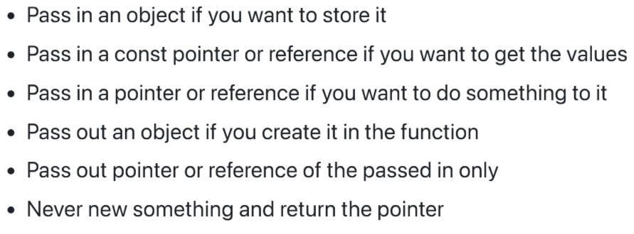

----

## Buzzwords

- Encapsulation: 封装

- Inheritance: 继承

- Polymorphism: 多态

- Overriding: 覆盖

- Interface: 接口

- Cohesion: 內聚, 一个类内的功能高度相关

- Coupling: 耦合， 不同类之间的关联程度

- Collection classes: 容器

- Template: 模板

- Responsibility-driven design: 责任驱动设计

- Generic: 泛型

- Field: 字段

- Parameter: 函数参数

----

## STL

> **Standard Template Library**

- *工程中慎用\<bits/stdc++.h\>头文件，降低编译压力*

- Containers

    - vector
        
        - 内部实现：
            
            - 动态内存分配，当容量不足时，会将容量扩大为原来的两倍，然后将原来的元素复制到新的内存空间中，释放原来的内存空间。
            
            - 插入均摊时间复杂度为 O(1)
            
            - 删除元素时，会将后面的元素向前移动，时间复杂度为 O(n) 
      
        - vector\<int\>p(capacity,(k)) (capacity 个 k) 
        
        - vector [] “可以”越界访问，（因为实际上的容量可能大于它显示的capacity），.at() 会抛出异常

            *（乱穿马路违法，但是一般没人会来管你。没撞死算幸运，撞死活该。）*  
    
    - deque (double ended queue) 
    
        - 内部实现： 
    
            - 使用缓存区块存取元素，使用 map 建立缓存区块的索引，当缓存区块不足时，会重新分配内存空间。
            
            - 两端插入和删除均摊时间复杂度为 O(1)，但实现上比 vector 复杂
            
            - 缓存区内部实现与 vector 类似 

    - list  (doubly linked list)
    
        - `list.begin() != list.end()` (不推荐使用 < ，可能会出错)
        
        - `copy(L, R, vector<>it)` 链表展平为 vector 
    
    - forward_list
  
    - *string  
  
    - set
    
    - map    

- Algorithms

- Iterators

    - 输入迭代器：只能读取数据，不能修改数据
    
    - 输出迭代器 
    
    - 前向迭代器
    
    - 双向迭代器
    
    - 随机访问迭代器   

----

## Container

> 容器，collection of objects that can store an arbitrary number of other objects.

- 通常用 size 来表示其中 object 的数量 

----

## Class

> 类，一种用户自定义的数据类型，用于封装数据和方法
>
> *关于内部数据存储，具有地址对齐性，即一个短变量只会在一行内读出，不会跨行读取*

### 构造

- 全局变量构造在main函数之外，main函数之前构造，main函数之后析构，按书写顺序构造，反序析构

- 类内构造

    1. 调用父类构造函数
    
    2. 按顺序调用成员构造函数（检查调用的构造函数的初始化列表内是否有相应代理构造，若没有则调用默认构造）
    
    3. 调用自身构造函数   

- 初始化变量时 `= x, (x)` 都会调用构造函数，没有区别

- *但是全局变量处在多文件时，构造顺序是不确定的*                                            

- 进入函数时，所有本地变量所占据空间已经分配完毕，并且**实参量会调用拷贝构造函数（const Tp &x）来传值**

- 构造列表只能初始化 non-static 的成员，包括可以初始化const常量 

- **Delegating Constructor**

    - 一个构造函数可以调用另一个构造函数，减少代码重复

    - `A(int x, int y): A(x) {}`

### 析构
  
- 编译器控制，当变量结束生命周期时自动调用

- 同等条件下，析构函数的调用顺序与构造函数的调用顺序相反（栈一样，避免依赖关系影响） 

### 权限

- private

    - 仅在**类**内部可见
    
    - **边界是类, 不是对象（类内可以访问其他同类对象的私有成员），并且由编译器控制（可以绕过，如利用指针为所欲为）**  

- public

    - 都可以访问，与 structure 类似 

- protected

    - 与private的区别是子类可见（*留给子类的遗产*） 

- default

    - class 默认是 private 的，struct 默认是 public 的 

- friend

    - 权限授权，可以访问该类的私有成员 和 保护成员
    
    - 友元不是成员函数
    
    - 友元的友元不一定是友元，即友元关系不可继承

### overload 重载

- 函数名相同，参数不同

- 不能使用 auto-cast, 会造成二义性

### Embedded Objects

> A class **has** other classes

- Storage：按照书写顺序在内存中存储 

- Constructor & Deconstructor：同样是顺序构造，逆序析构
  
- Fully v/s **By Reference**

    - logical relationship
    
    - size of is not known
    
    - resource is to be allocated / connected at run-time
    
    - *Only C++ can use fully* 

----

### Inheritance

> 继承性，面向对象的重要思想

- Advantage

    - Avoid code duplication
    
    - Code reuse
    
    - Easier maintenance: 修改模块对其他模块影响小
    
    - Extendibility： 易于添加新功能

- 可继承的成员

    > 本质上内存里父类对象会放在子类对象的前面（*可以将子类指针赋给父类指针*）

    - **public / protected** member data
    
    - **public / protected** member functions
    
    - *static* 仍然为class-wide，依赖它的属性 

- Constructor & Deconstructor
  
    - 构造先父类后子类
    
    - 析构同样反向 

- **Name Hiding**

    - 一旦出现overload，则所有同名的函数都得覆写，否则父类的会被隐藏

    - 可以使用 `using base::f;` 把它找出来

- **Inheritance Access Protection**

    - public / protected / private: 定义继承的父类成员的访问权限

    - private: default(并不是OOP语意)

----

### Polymorphism

> 多态性，静态声明 & 动态类型

- Subtyping
  
    子类对象可以赋给父类对象, 所有父类具有的派生类都有

    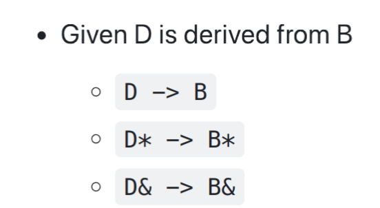 
    
- Up-casting

    向上造型，子类对象赋给父类对象（指针 / 引用），不会丢失子类的信息

    但是只能调用父类的成员，不能调用子类的成员

- **virtual**

    - 定义一个接口，让编译器知道该函数将会被子类覆写，从而可以在Up-casting时用父类指针/引用调用子类函数
  
    - 本质上是动态变量的绑定（dynamic binding），即在运行时根据dynamic type才确定调用的函数，而非编译时的静态绑定。因此速度会相对慢一点，除非编译器发现是静态绑定，会自动转为静态绑定
    
        有个特殊的情况是默认参数，因为默认参数是在编译时确定的，因此会使用静态绑定，也就是调用**当前指针**类型的默认参数，而不是动态绑定的子类的默认参数
  
    - 编译器执行静态检查，因此父类内的接口不可省略（只要父类定义为虚函数，子类中该函数就自动成为虚函数）

    - **构造函数和静态函数（没有类的vptr等）不能是虚函数，但是析构函数可以是虚函数**

        类似的，一般虚函数无法内联，因为需要在运行时才能确定调用的函数；除非编译器发现是静态绑定 
  
    - 内存存储：

        **头部**存一个vptr指针，且为实例构造时存入，具体如下：

        - **vptr**：虚函数表指针，指向虚函数表，存储虚函数的地址
        
        - **vtable**：虚函数表，存储虚函数的地址
        
        - **vfunc**：虚函数，存储函数的地址
        
        ```cpp
        class A {
            virtual void f();
            virtual void g();
        };
        class B : public A {
            virtual void f();
            virtual void h();
        };

        int main() {
            A *p = new B();
            long long **vptr = (long long **)p;
            long long *vtable = *vptr;
            void (*f)() = (void (*)())vtable[0];    //B::f
            void (*g)() = (void (*)())vtable[1];    //A::g
            void (*h)() = (void (*)())vtable[2];    //B::h

            // 关于函数调用，可以直接调用，也可以通过指针调用
            // 但是注意到这样调用是没有传入this指针的，因此在函数内无法访问成员变量，但是函数调用本质上是指针还是可以的
            //(*f)();
            //f();
        }
        ```

    - 纯虚函数：

        - `virtual Type F() = 0`

        - 只要存在一个纯虚函数，整个类成为抽象类，不能定义对象；其继承类必须实现所有纯虚函数，否则也成为抽象类
    
- 多继承

    - virtual inheritance 处理菱形继承关系，不将父类放到子类中，而利用指针索引

----

### Copy & Move

- **copy constructor**

    > `T::T (const T&)`
    >
    > 复制一份

    - 函数调用的赋值
    
        - 用函数本地变量返回赋值只会调用拷贝构造一次

        - 直接返回构造不需要调用拷贝构造（将相应内存直接放在函数体上方）

        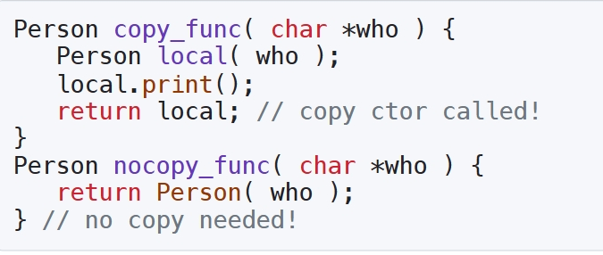

    - member-wise copy: 拷贝指针小心，否则可能会影响源对象

- **move constructor**

    > `T::T (const T&&)`
    >
    > 传递指针，销毁原对象

    - 使用 `std::move()` 转为右值

----

### Overloading Operator

- Can

    

- Can't

    

- Don't
  
    `&&` `||` `,`

#### ProtoTypes

- Tips

    

- Member operator

    *注意，调用时左边应该为对象（左结合）*

    - binary

        - `T operator+(const T &x)`

    - unary

        - `T operator-()`

- Global operator

    *为了访问私有变量，可以使用 public / friend*

    - binary

        - `T operator+(const T &x, const T &y)`

    - unary

        - `T operator-(const T &x)`

- Some

    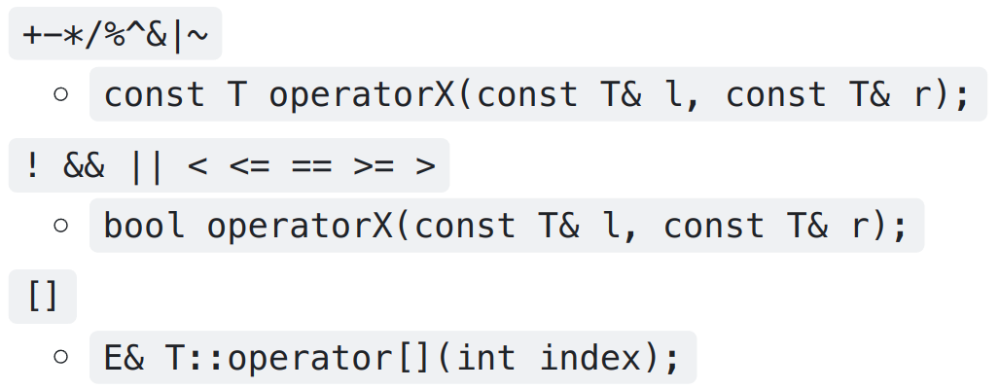

    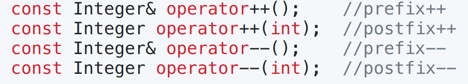

    (Relational, just need define `==` & `<`)

    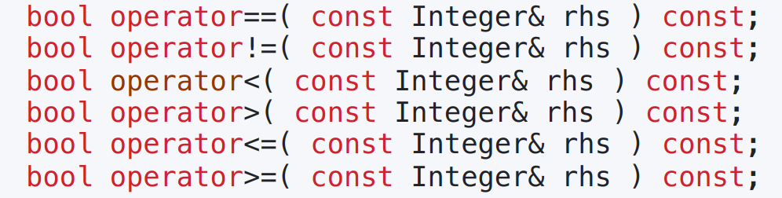

    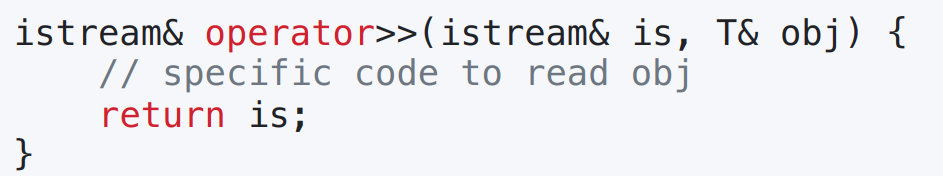

    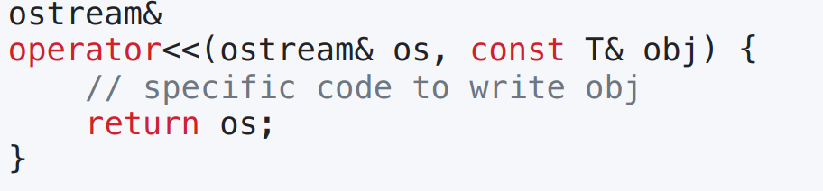

    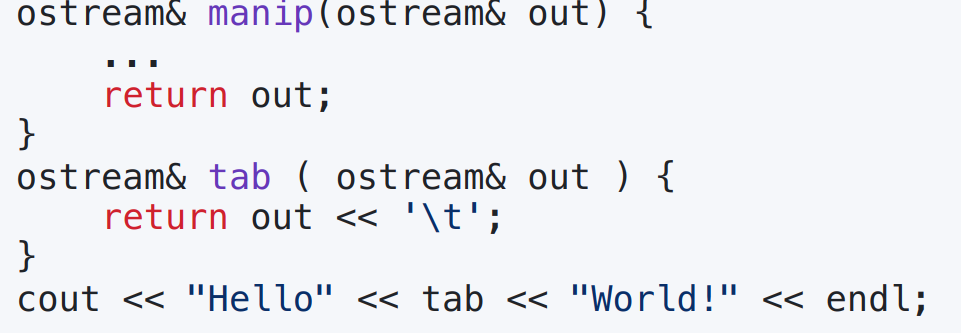

    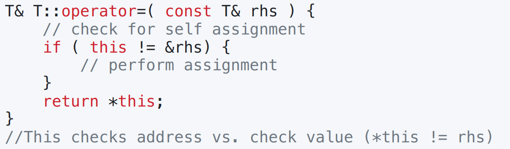

    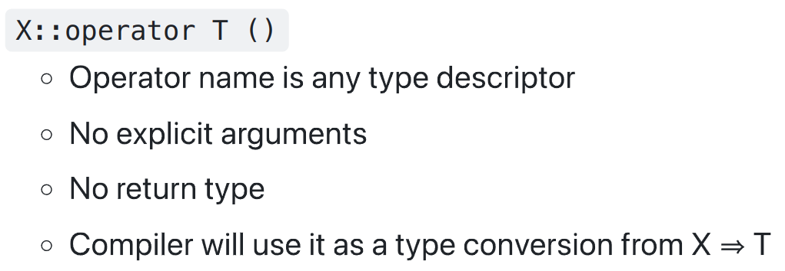

#### Argument passing

- read-only argument: `const T &x`

- const member function(not change `this`): `const T`

- const result(can't be L-value): `const T`

- always use reference

#### Type conversion

> `explicit` to avoid `implicit conversion`

??? info "explicit"

    当加上 `explicit` 时，只能通过 `T(x)` 显示转换，不能通过 `x` 隐式转换

    *可以避免一些不必要的隐式转换，如 `T a = 1;`，必须严格调用*

    ```cpp
    class A {
        int x;
    public:
        explicit A(int x): x(x) {}
    };
    A a = 1; //Error
    A a(1); //OK
    ```

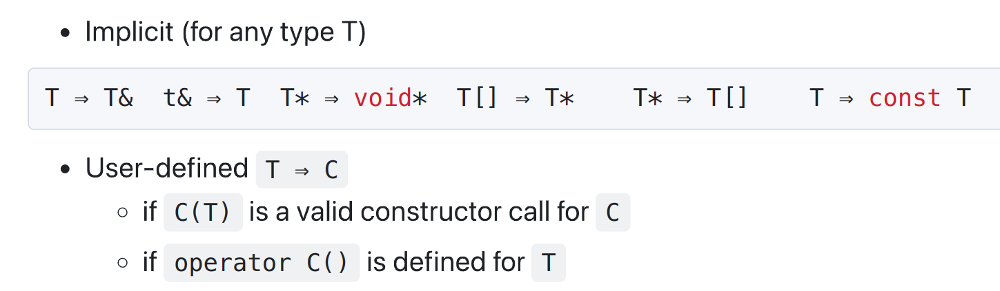

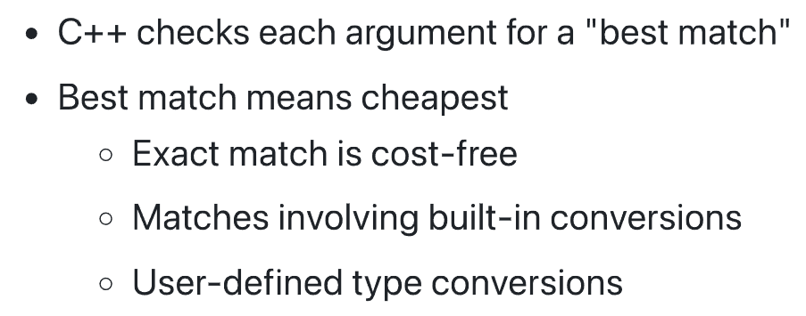

----

## Static

- deprecated：（过时）

    > 限制外部访问

    - static free function
    
    - static global variables
    
- static local variables

    - 持久存储，多次调用保存上次的值    
    
    - 本质上是 **访问受限的全局变量**，在函数被第一次调用时构造，在程序结束时析构(如果被构造了) 

- static member variables

    - 所有对象共享，不属于对象，属于类
    
    - 不能在类内初始化，需要在类外初始化，并且一定要初始化（相当于定义一个全局变量）
    
        **static variable 需要全局定义申请内存空间（包括private / public）** 

        ` Tp ClassName::StaticVariable = x;`

    - 可以通过类名访问，也可以通过对象访问
    
- static member function 

    - 只能访问 static member variables
  
    - 可以使用 `ClassName::Function()` 调用，也可以通过对象调用（`.` / `->`）  

----

## Reference

`Tp &x = v`

**本质上相当于给变量起了一个别名，方便变量的引用，不会分配内存空间（否则对于一个对象的拷贝可能开销过大）**

**实质上就是使用指针实现的**

- 在定义时初始化为一个左值，且不能改变指向 (左值引用`&`)

- 在定义时初始化为一个右值，且可以改变指向，相当于记下了一个临时变量 (右值引用`&&`)
  
> No pointers to references `(Tp&) *p`
>
> References to pointers OK `(Tp*) &p`

- *Left value & Right value*

    - Left value: `.` `[]` `->` `*`
    
    - Right value: others  

----

## Const

> **不可赋值（可以在创建时初始化一次）**

- const & pointer

    观察`*`位置
    
    - const 在 `*` 前，说明指向的内容不可修改
    
    - const 在 `*` 后，说明该指针不可修改

    !!! note

        可以将一个变量的地址赋给一个指向常量的指针，但是不能将一个指向常量的指针赋给一个普通指针

        原因是显然的，不能通过指针修改常量的值

- 声明 const function

    - `const` 修饰函数，表示该函数不会修改成员变量  (const *this)
    
    - 因此，const object 只能调用 const function, 使编译器能够检查错误

    - *建议能加 const 的函数都加上，比如const对象默认只能调用const/static函数，本质上类的成员函数的附带指针 `this` 就是 `Class *const` ，加了const后就是 `const Class *const` *

- 关于定义数组 [const size]：

    - 本地变量可以直接使用，因为在函数内可以自由分配栈空间

        ```cpp
        void f(int n) {
            int a[n];//OK
        }
        ```

    - 对象成员的数组定义不能用size，哪怕已经直接初始化，因为编译器不能确定（const 常量可能在初始化列表中被重新初始化）
    
        ```cpp
        class A {
            const int n = 10;
            int a[10];  //Error
            A():n(6){}  // Legal and powerful
            // Thus "change" the n to 6 when the object is constructed
        };
        ```
    
    - enum & static 可以用来定义数组大小

        ```cpp
        class A {
            static const int m = 10;
            enum {n = 10};
            int a[n];  //OK
            int b[m];  //OK
        };
        ```

    !!! note

        如果要使用其他文件中的 const 变量，并且没有引用相应的头文件，需要在**定义**（赋初值）时加上 `extern` 关键字

----

## new & delete

> new 动态申请空间，返回指针
>
> delete ([]) p 释放空间，[] 取决于单一对象还是数组
>
> 本质上是运算符

- new的实质 

    - 申请的空间没有默认初始值（直接给内存中的垃圾值），可以用 `{}` 初始化
  
    - 对于对象，需要有默认构造函数才能满足默认构造 

    - 前面有一个标记头，记录了口令和大小，用于 delete 时检查; 之后是实际申请的空间

- delete的实质

    - 检查对象的析构函数，**并调用析构（在释放内存前）**
    
    - 往前走一个单位，检查口令和空间大小，不对会抛出异常

    - 不加 [] 只会释放第一个对象的空间，而不会释放记录的空间大小，同时系统也会失去这部分内存的信息（最后不再调用剩余的析构）

## default argument（默认参数）

- 默认参数“从右往左连续写”
    
- 默认参数值是静态的（编译器处理），**在声明中写默认值，不能在定义中写** 

    - 因此本质上是定义了一个带参函数，小心重载时的重复错误

    - *头文件内定义的默认值可能会被篡改*

----

## Inline（内联）

> 本质上相当于将函数代码直接拷贝到当前代码块中（**直接添加到当前文件的.obj中，而不是后续通过link连接**），避免函数调用的开销
>
> **inline 函数（包括body）相当于声明，不是定义（也可以理解成 `inline` 一定要在定义上使用），因此要整个放在头文件中，让编译器处理。编译器不会分配函数空间，而是直接将对应指令“抄下来”，在需要的地方直接填上去。**

- 会增长代码，本质上是用“空间换时间”

- inline 函数复杂时可能会被编译器放弃 inline
  
    一般是比较短小且频繁调用的函数

    ~~递归不适合~~

- class 成员函数加上 body 直接默认 inline，无需特殊标记

    *当长度过长时，可以在头文件内用 inline 声明， 然后直接将定义写在下方（都在头文件内，都加inline）*

!!! note "虚函数"

    虚函数也可以成为内联函数，但由于内联函数是在编译时展开，而虚函数是在运行时动态绑定，因此虚函数内敛只有在编译器可以确定调用的函数时才会展开（如对象直接调用，而不是指针调用），否则会按照虚函数的方式动态调用。

----

## namespace

> Expresses a logical grouping of classes, functions, variables, etc.
>
> *{}末尾没有 分号 作为结束*

- using 简化

    - `using namespace Name;`
    
        `using Name::Func;`
    
        `using Name::Class;`

    - using 可能会导致同名成员冲突，但是只有调用冲突成员时才会报错，using并不会马上报错。为了解决冲突问题，可以通过显式指明命名空间。

- alias 重命名

    - `namespace NewName = OldName;`

- openness

    - 同一个命名空间可以分布在多个文件中

----

## Template

> generic programming（泛型编程）

- Function Template

    本质上也是声明，由编译器发现相关调用后创建，因此需要在头文件中定义

    ```c++
    template <class / typename T>
    T func(T x, T y) {
        return x + y;
    }
    //强制类型调用
    func<T>();
    ```
    !!! danger

        模板函数必须保证调用的参数类型完全一致，自动类型转换无效！
    
    ??? 函数调用顺序

        1. 精确类型
        
        2. 精确模板
        
        3. overloading  

- Class Template

    ```c++
    template <class T>
    class A {
        T x;
        T f(T x);
    };
    template <class T>
    T A<T>::f(T x) {
        return x;
    }

    // 调用
    A<type> a;
    ```

- 拓展用法

    - 多个模板参数

        ```c++
        template <class T, class U ...>
        ```
    
    - 嵌套模板

        ```c++
        template <Class<T> >    //现代编译器无所谓那个空格了
        
        template <int (*)(Class<T> ) > //函数指针
        ```
    
    - 默认参数

        ```c++
        template <class T, int para = default>  // 内部相当于一个字面量
        ```
    
    - 继承模板

        ```c++
        template <class T>
        class B : public A<T> {
            ...
        }
        ```
    
    - friend

        ```c++
        template <class T>
        class A {
            friend T;
        }
        ```

    - static member

        相当于每种类型都有一个独立的 static member
        
        ```c++
        template <class T>
        class A {
            static int x;
        }
        template <class T>
        int A<T>::x = 0;
        ```

!!! warning

    **一般模板（类）函数的定义和声明必须在同一个头文件中，因为模板在编译阶段实例化，否则会报错**

    *还有一种很笨的方法可以将他们分开：直接在头文件中挨个定义相关的模板类*

----

## Exception

??? danger "处理异常办法"

    1. 直接终止程序
    
    2. 返回错误码(简单可行)
    
    3. 抛出异常  

- **throw**

    可以用`throw`关键字来声明过程可能发生的异常(实际在C++11开始已经不推荐使用了，因为不是在编译时检查)

    若抛出非法异常，程序会终止，触发`std::bad_exception`，调用`std::unexpected()`函数(默认终止程序，可以人为覆写`std::set_unexpected(func)`)

    ```c++
    function() throw(Type1, Type2); //只能抛出Type1, Type2
    function() throw(...); //可以抛出任何异常,貌似会报错，不如不写
    function() throw(); //不抛出异常
    function() noexcept; //不抛出异常
    ```

- **try-catch**

    handler 选择原则：

        - 对于一般类型，会选择精确的匹配，一般不会自动转换
        
        - 对于类，会使用**“is-a”**关系进行逐条判断，因此子类的异常处理应该放在父类前面

    ```c++
    try {
        ...
    } catch (Type &e) { // 一般用引用，避免拷贝
        ...
    } catch (...) { // ... 表示捕获所有异常
        ...
        throw;  // propagate, 继续向上层抛出同样的异常，只能在catch中使用
    }
    ```

- std::exception

    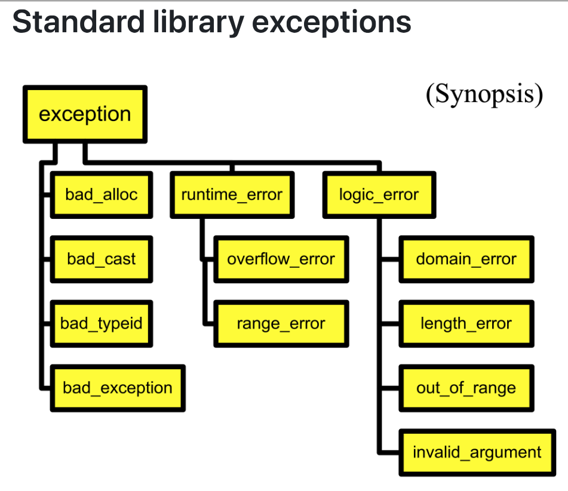

- special case

    - constructor

        分两步：先进行成员基本初始化（**指针赋0**），再申请内存空间等资源，如果失败则抛出异常

        否则若中途抛出异常，如内存分配了一半，指针还未赋值，析构函数无法释放内存，造成内存泄漏
 
    - destructor

        会触发`std::terminate()`函数，因此析构函数不应该抛出异常，应该在设计时避免

## Smart Pointer

> A reference count is a count of the number of times an object is shared
>
> UCObject: Use-Count Object
>
> UCPointer: Smart Use-Count Pointer point to UCObject

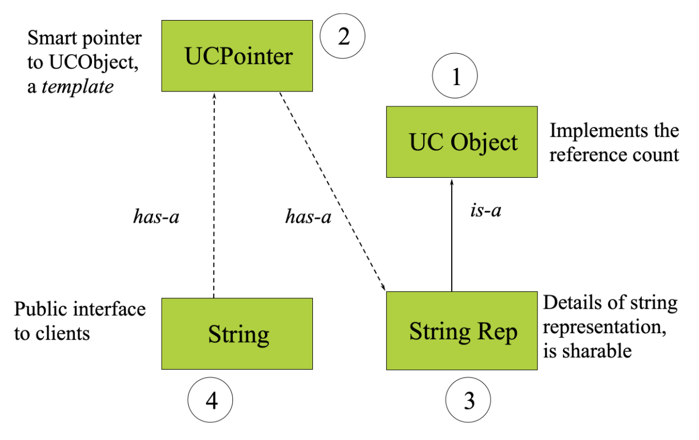

新建对象：新建临时UCP -> UCP赋值 -> UCP 析构

- `static_cast`

    静态转换，如默认类型间，子类指针当父类

    *不会进行运行时类型检查，不安全*

- `dynamic_cast`

    动态转换，如多态类型间，子类指针当父类等down-casting

    *会在cast时进行动态类型检查*

- `const_cast`

    用于修改（去掉）类型的const和volatile（必须与内存交互，不可暂存寄存器）属性

- `reinterpret_cast`

    重新解释类型，如指针和整数间的转换，几乎支持所有类型的转换

    *不会进行类型检查，可能会破坏结构，不安全*

### Stream

??? note "background"

    

!!! danger

    一般C类（scanf/printf）与C++类（cin/cout）不要混用，因为各自的缓冲区不同，可能会出现问题

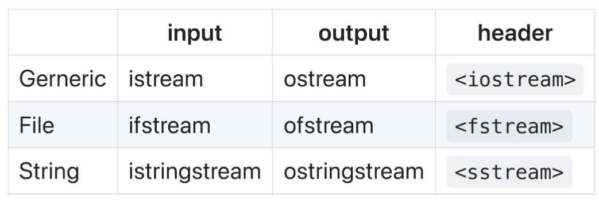

（都是 istream/ostream 的子类）

- 流的特性

    - 单向流动

    - 一维

    - 不停流动，只能读取暂时的片段

- Operations

    - Extractor

        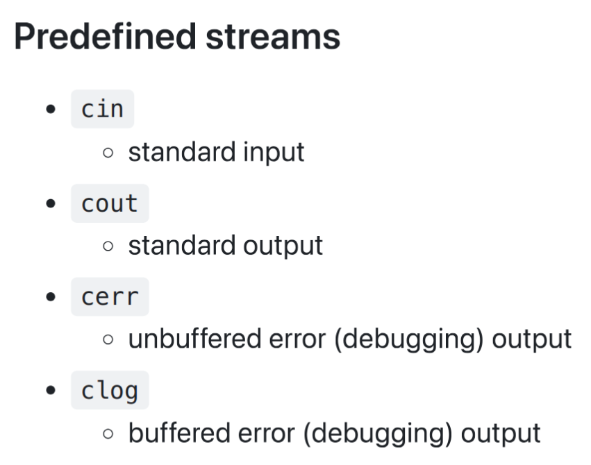
        （cerr由 2> 重定向）

        - Text Stream

            - 可读

            - 以行为单位

            - 可能会被操作系统等进行翻译（如unix的\n）

        - Binary Stream

            - 二进制流

            - 以字节为单位，不会被翻译修改

        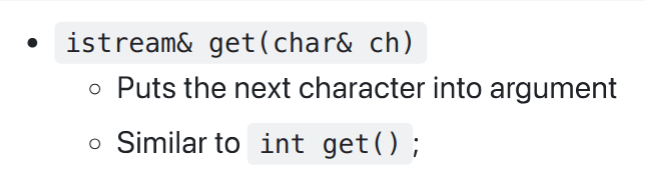

        （相当于把cin.get()的参数写到了get函数参数里）

        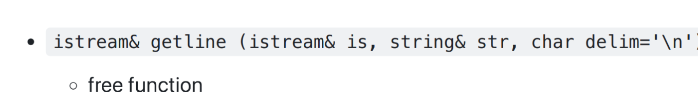

        (一般不使用cin.getline(char*, int)，因为要预先构造一个char数组，不如直接用string)

    - Inserter

        

        （Flush只能刷新当前文件的缓冲区，不一定刷新系统缓冲区）

    - Manipulators

        `#include <iomanip>`

        !!! warning

            一般 manipulator 都是一直有效的，直到下一个 manipulator 出现

        - manip

            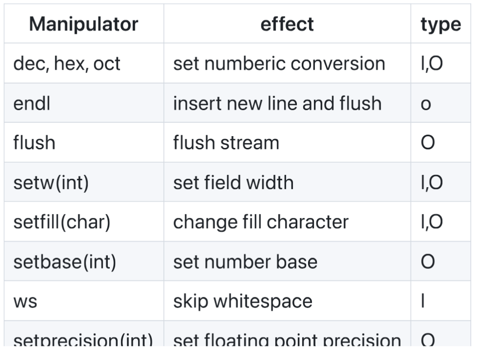

        - create manip

            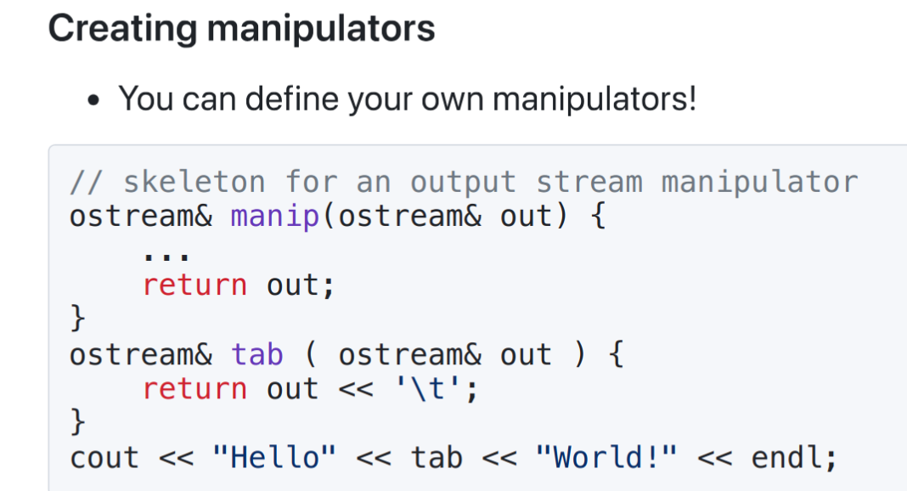

        - flag

            每一个 flag 都用一个 word 里的一个 bit 表示，因此可以直接用 `setf()` 和 `unsetf()` 来设置

            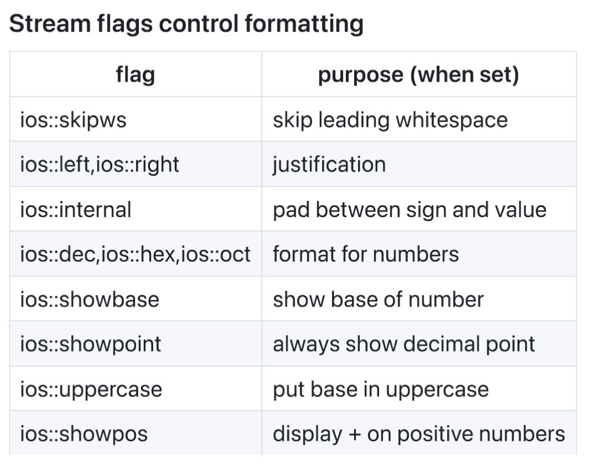

            

            ??? example

                

            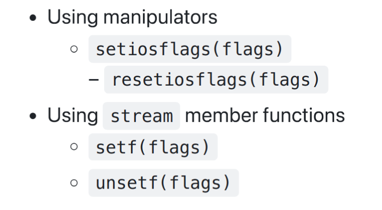

            ??? example

                

    - Others

        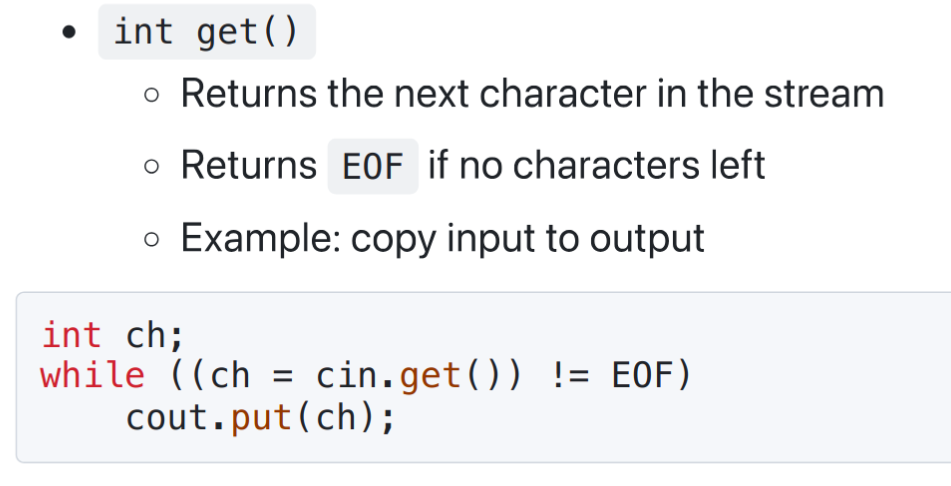

        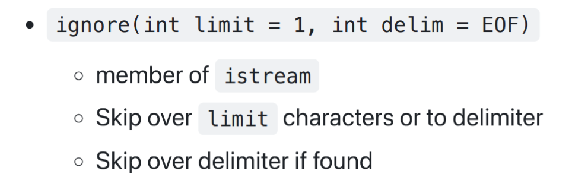

        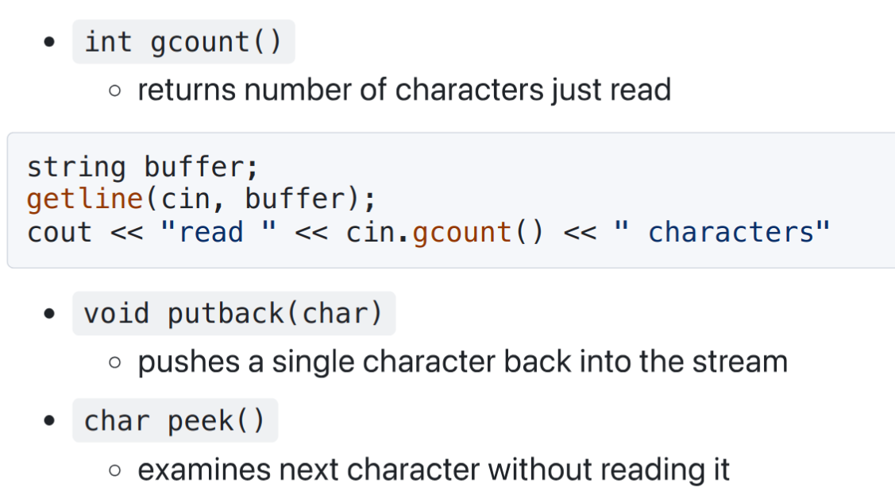
- States

    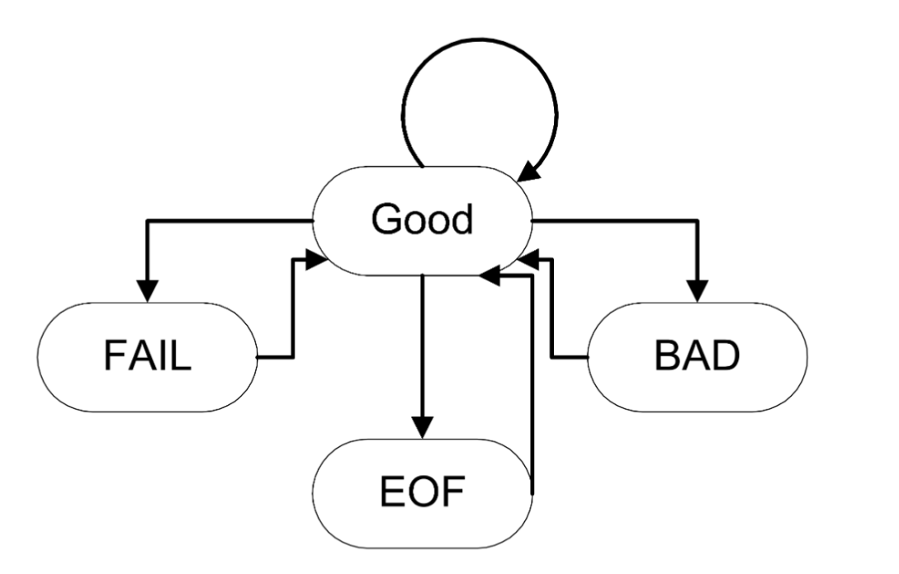

    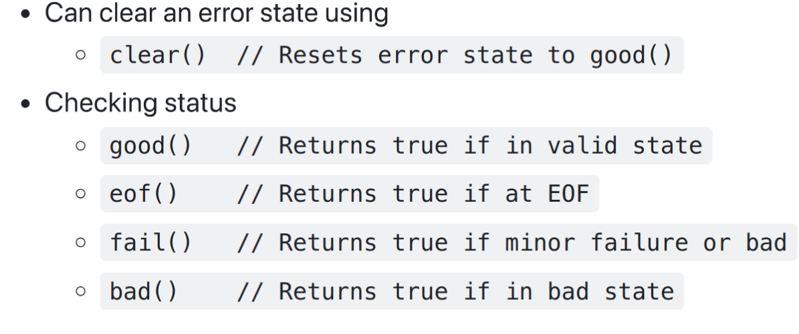

    ??? example

        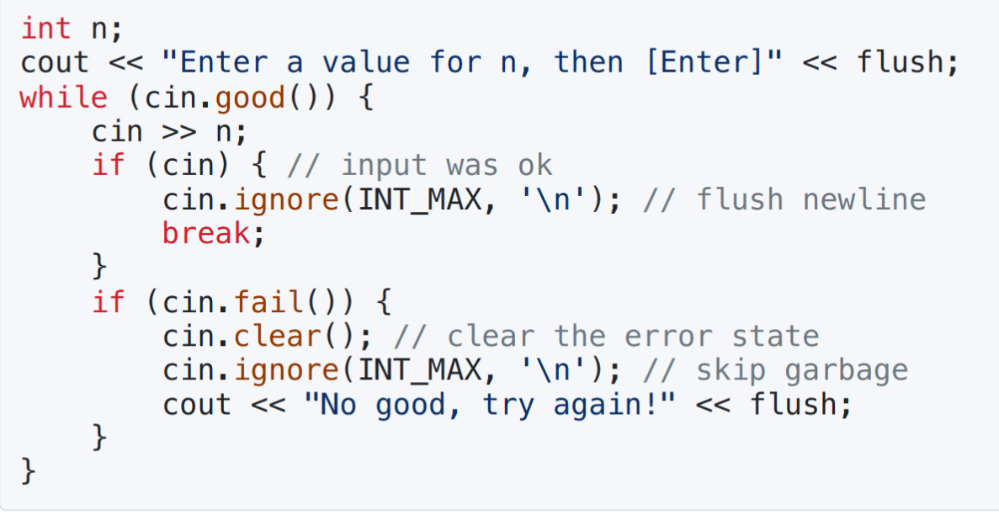

## Design

- Class Design:

    - understandable

    - maintainable

    - reusable

- Software Change:

    - extended, maintained, ported, adapted

- Code quality:

    - Coupling（耦合）

        模块联系的紧密程度，越低越好（loose coupling），从而提高可维护性

        - 不需要知道对方的内部实现

        - 修改一个模块不会影响其他模块(会影响所有依赖于当前模块的模块)

    !!! note "解耦"

        - call-back
        
            Actor依赖于Button, 从而Button不再依赖于Actor，可以重用

            ```c++
            class Listener {
                virtual void onEvent() = 0;
            }
            class Event : public Listener{
                Listener *listener;
                void setListener(Listener *l) {
                    listener = l;
                }
                void onEvent() {
                    ...
                }
            }
            class Actor{
                Actor(Button *button) {
                    button->setListener(this);
                }
                void onEvent() {
                    ...
                }
            }
            class Button{
                Event *event;
                void onClick() {
                    event->onEvent();
                }
            }
            ```
        
        - message mechanism

            常用两种方式：

            1. 通过中央媒介进行字符串消息传递，不知道具体模块信息

            2. 由一个中间模块统一注册各个角色

    - Cohesion（内聚）

        一个模块所承担的功能聚焦在一起，功能的多样性越少越好

        一个模块只负责一个业务逻辑 -> high cohesion

- Code Duplication

    - 设计问题，且非常难以维护

- Responsibility-driven design

    - 新增功能时，应该考虑哪个类应该负责这个功能

    - 每个类应该只能负责处理自己的数据（**应该从数据出发设计类**），从而 localizing change

- Refactoring

    - 重构代码，使代码更易于理解和维护，重构的目的是为了提高代码质量，使代码更易于理解和维护

    - 重构的原则是：不改变代码的功能，只改变代码的结构

    - **回归测试：**重构后的代码要进行回归测试，确保重构后的代码没有引入新的bug

----

----

## *volatile

表示变量可能会在外部被修改（如外部中断等），因此编译器不会对其进行优化，每次都会重新读取，而不会使用寄存器缓存

甚至指针、const等都无法保证其不被修改

## *extern 特殊用法

- 由于C与C++ `*.o` 文件的不同，C++由于支持函数重载会在编译时将函数名改变来附带参数信息，而C不会，因此在C++中调用C函数时需要使用 `extern "C" {}` 来避免这种情况

    ```cpp linenums="1"
    //xx.h
    extern int add(...)

    //xx.c
    int add(){

    }

    //xx.cpp
    extern "C" {
        #include "xx.h"
    }
    ```

- 反过来，如果C中调用C++函数，也需要在CPP文件中使用 `extern "C" {}` 来避免这种情况

    ```cpp linenums="1"
    //xx.h
    extern "C"{
        int add();
    }
    //xx.cpp
    int add(){

    }
    //xx.c
    extern int add();
    ```

需要注意的是，上面这两种方法编译时都需要先编译成 `*.o` 文件，然后再链接，否则会出现找不到函数的情况

## *Union

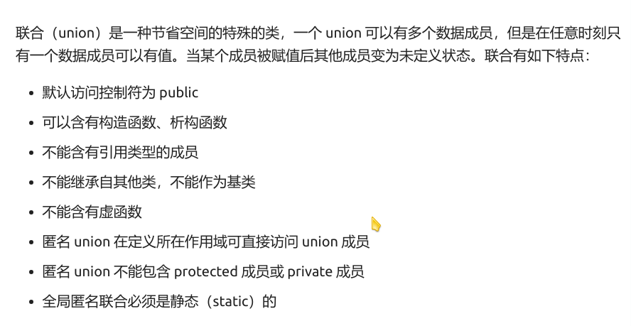
