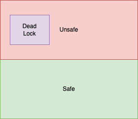

# U2 Part 3: 死锁 | Deadlocks

!!! info "引入"

    死锁问题广泛存在于计算机软件系统中，而我们本节**只讨论操作系统中的死锁问题**。

## 死锁建模

我们在[上一节](./Unit2-Part2.md#the-dining-philosophers-problem){target="_blank"}中已经提到了一个死锁情况。本节我们专注于如何解决操作系统中的**死锁(deadlock)**问题。

!!! definition "deadlock"

    A **deadlock** is a situation in which every process in a set of processes is waiting for an event that can be caused only by another process in the set.

    即存在一个进程/线程的集合，它们**互相**等待对方持有的资源。

    > 与之对应的，其实还有一个叫活锁(livelock)[^1]的东西。

死锁产生于资源的使用过程，而且通常只在特定情况下才会发生，而正是因为这种不确定性，死锁问题才异常棘手。为了解决死锁，我们首先需要理解死锁产生的原因，以方便对它进行建模，进而更好地描述死锁。

从资源使用的角度来看，我们可以将系统的行为分成三个部分：

1. 申请资源；
2. 使用资源；
3. 释放资源；

其中，申请资源和释放资源通常通过不同的系统调用实现。而部分资源是有限且互斥的，因而如果在缺乏资源的情况下，进程/线程仍然想要申请资源，就只能陷入等待。而正在等待的资源也可能持有一些资源，一旦恰好出现了互相等待的情况，就会出现死锁。例如，互斥锁和信号量这些东西就是死锁产生的一大重要来源。

> 计算机资源分为很多类，每一类中可能有若干**平等**的“实例(instance)”。对于一个合理的“资源分类”来说，一个进程/线程需要某种资源时候，这个资源类别中的任意空闲实例都应当可以被用于满足这个进程/线程的需求。

!!! info "导读"

    下面两个部分并不会很快就被用到，尤其是[安全状态与不安全状态](#安全状态与不安全状态){target="_blank"}是被我提前放到这里来的，读者可以自行考虑是直接顺序阅读，还是暂时跳过（之后用到的时候我会给出跳回链接）。
    
    我个人认为结构上这样安排更清晰，但考虑到两个内容存在一定间隔，所以往后放置也有往后放置的道理。

### 资源分配图

根据上面的描述，我们可以知道，建模死锁可以从讨论进程/线程与资源的求取关系入手。我们可以用**资源分配图(resource-allocation graph)**来描述这件事。

!!! section "静态"

    
 { width=30% align=right } 

    资源分配图是一种有两类节点的有向图，我们用圆节点 $T_i$ 表示进程/线程，用方节点 $R_j$ 表示资源，方节点中的实心点表示一个资源类别的一个实例。同时，我们称从进程/线程指向**资源类别**的有向边为**请求边(request edge)**，表示进程/线程 $T_i$ 正在等待这种资源；称从**资源实例**指向进程/线程的有向边为**分配边(assignment edge)**，表示资源 $R_j$ 被分配给进程/线程 $T_i$，即目前进程/线程 $T_i$ 持有一个（一条边表示一个）资源 $R_j$ 的实例，例如下图：

    - 当资源分配图中不存在环时，说明不会出现死锁状态；
    - 当资源分配图中存在环时，系统可能处于死锁状态，也可能不处于死锁状态；
        - 特例：如果与环相关的节点都只有一个实例时候，系统处于死锁状态；

    换句话来说，资源分配图中存在环，是系统处于死锁状态的**必要条件**。

!!! section "动态"

    - 进程/线程申请某个资源时，在图中添加一条对应的 request edge；
    - 当资源索取成功时，这条 request edge 被替换为 assignment edge；
    - 当进程释放这个资源时，则需要将该 assignment edge 消除；

> 在之后的内容中，我们还将看到一些资源分配图的变体：引入 claim edge 的[资源分配图算法](#资源分配图算法){target="_blank"}以及只保留进程/线程等待关系的 wait for graph。

由于唯一实例这个性质被破坏后，死锁在资源分配图上不再那么直观了，所以我们需要引入新的工具来描述死锁。

### 安全状态与不安全状态

> 该部分内容被书本安排在[死锁避免](#死锁避免){target="_blank"}中，被我提前，可以考虑不直接深入而是等之后遇到了再看。

**安全状态(safe state)**指存在**安全序列(safe sequence)**的状态，系统按照 safe sequence 的顺序执行进程/线程和分配资源，就不会出现死锁；相对应的，不是安全状态的状态称为不安全状态(unsafe state)。具体来说，safe sequence 的定义如下：

!!! definition "safe sequence"

    首先 high level 地讲一下 safe sequence 的思路，safe sequence 中的每一项 $T_i$ 所需要的资源，都能通过现有资源或其之前的进程/线程 $\forall j < i T_{j}$ 执行完毕释放的资源来满足。

    具体来说，对于 safe sequence $<T_1, T_2, \dots, T_n>$，我们定义每一项还需要的 $R_j$ 资源为 $need_{i,j}$、已经被分配的 $R_j$ 资源为 $allocated_{i,j}$，以及资源 $R_j$ 中还空闲的资源的量 $available_{j}$，则应当有：

    $$
    \begin{aligned}
        \forall i \in \{1, 2, \dots, n\},\quad
        \forall j \in \{1, 2, \dots, m\}, \\
        available_{j} + \sum_{k=1}^{i-1} allocated_{k,j} \geq need_{i,j}
    \end{aligned}
    $$

    > 对于第 $i$ 个进程/线程来说，实际运行时的空闲资源可能来自于 $allocated_{k,j}$，但这里是用来做判断的，并不是一个在线的计算过程，所以用 $available_{j} + \sum_{k=1}^{i-1} allocated_{k,j}$ 这个式子来维护此时 $T_i$ 的最大可用资源。

    !!! question "思考如何寻找一个 safe sequence"

        这个问题我们在之后[死锁检测](#死锁检测){target="_blank"}的部分会给出答案，但不妨简单思考一下怎样寻找一个 safe sequence 呢？能否贪心地来求算这样一个序列呢？

但是，safe state 是一个相对较强的约束，不安全状态不代表死锁一定会发生，用韦恩图来表示它们的关系就是：

  

如果我们能保证系统只运行在 safe state，也就能充分地避免死锁的发生。

## 死锁的条件

要想死锁出现，下面四个条件必须**同时满足**：

1. **互斥(mutual exclusion)**：死锁中的资源必须是非共享的，即一次只能被一个进程/线程使用；
    - 正因为互斥资源无法被同时使用，所以需要资源的进程/线程需要等待持有目标资源的进程/线程释放该资源以后才能使用目标资源；
2. **持有并等待(hold & wait)**：死锁中的进程/线程在等待资源的同时，也必须持有至少一个资源；
    - 为了促成循环等待，一个等待其它资源（有出边）的进程/线程必须持有至少一个资源，这样才能让其它资源也等待它（有入边）；
    - 说白了就是：持有导致可能被等待，等待就是等待，而一旦一个节点既等待又被等待，就有可能促成循环等待
3. **非抢占(no preemption)**：死锁中的进程/线程只能在使用完资源后主动释放资源，其持有的资源无法被其它进程/线程抢占；
    - 为了保证等待关系不会被强行破坏；
4. **循环等待(circular wait)**：死锁中的进程存在环状的等待资源关系，即 wait for graph 中存在环；
    - 逻辑上导致死锁出现的直接原因，互相等待导致没有资源会被释放，导致死锁状态无法被打破；

> 可以发现，这四个关系并不完全独立。

## 死锁的处理

很容易认识到，死锁的危害是巨大的，那么如何处理**操作系统中的**死锁问题呢？主要有这么几个思路：

1. 不做额外处理，要求程序员保证逻辑上不会出现死锁；
2. **死锁预防(deadlock prevention)**：使用某种规范或协议来保证死锁不会出现；
3. **死锁避免(deadlock avoidance)**：禁止可能产生死锁的行为的发生；
    - 与 2. 的最主要的区别是，2. 在规范下的所有行为都不会出现死锁问题；而 3. 则是不约束行为，但是禁止可能产生死锁的行为执行，在稍候介绍具体内容后会更容易理解；
4. **死锁检测(deadlock detection)和死锁解除(deadlock recovery)**允许死锁的出现，但是当检测到死锁时，需要去消除死锁问题；

> 事实上，在主流操作系统中，一般选择使用第一种，即将问题交给开发者去解决。

接下来我们来介绍上面提到的后三个方法中的四块内容。其中有部分内容有较大交集，它们可能属于同一纲领下在不同时刻做的处理。

## 死锁预防

**死锁预防(deadlock prevention)**的核心思路是破坏死锁产生的必要条件。由于「要想死锁出现，四个条件必须**同时满足**」，所以我们如果能保证四个条件中某一个一直不成立，那么死锁将永远不会产生，而既然死锁不会产生，那也就不需要去处理死锁问题。接下来我们对四个必要条件逐一分析：

1. 破坏**互斥(mutual exclusion)**：
    - 这个条件几乎是无法破坏的，很多资源天然是互斥的；
    - 有些资料里也有写一些方法来破坏这个条件[^2]，但是我感觉还是有局限性的，反正书本里说的是没法破坏；
2. 破坏**持有并等待(hold & wait)**：
    - 在我们前面的分析中知道：「持有导致可能被等待，等待就是等待，而一旦一个节点既等待又被等待，就有可能促成循环等待」；
    - 但是，如果我们只允许一个节点只能在“被等待”和“等待”中二选一，也就是说<u>让一个线程/进程**一旦申请资源就一次性获取所有资源**，如果没法一次性获取所有资源就**释放已经申请到的资源**，通过这种方法避免了循环等待的产生</u>；
3. 破坏**非抢占(no preemption)**：
    - <u>通过允许进程/线程强行抢占另外一个进程/线程持有的资源，可以破坏被动的等待关系，从而避免死锁</u>；
    - 但是和互斥其实是类似的，非抢占也具有一定的天然性，强行抢占一部分资源可能导致进行到一半的任务失败，甚至一些更严重的后果，所以这并不是一个很好的办法；
    - 而且，允许“抢占”也会带来饥饿问题，总体来说难以实现而且效率不高；
4. 破坏**循环等待(circular wait)**：
    - <u>通过给资源编号，规定进程/线程只能按特定的顺序申请资源，就不会出现循环等待的情况</u>；
    - 由于进程/线程只能按照特定顺序申请资源，而资源的申请应当是个动态的过程，所以可能会出现「进程大半部分只需要用到 $R_3$，但是由于最后需要用一下 $R_1$，所以必须先申请 $R_1$ 再申请 $R_3$，导致过程中 $R_1$ 一直被持有但一直未被使用」的情况，效率堪忧；
    - 为了解决上面这个问题，可以尝试在设计编号时将资源使用的常规顺序等因素纳入考虑，但精心设计的资源序号遇到无穷无尽的资源类型时，又当如何呢？由于需要大量设计，所以带来了资源的扩展性较差的问题；

## 死锁避免

**死锁避免(deadlock avoidance)**通过阻止可能让系统进入死锁状态的行为，来解决死锁问题。即：如果这么做可能导致死锁，那我就不这么做，以此来避免死锁。

### 资源分配图算法

**前置**：[资源分配图](#资源分配图){target="_blank"}！

资源分配图算法较为直接，它与安全状态的概念无关，直接检测某种分配是否会导致死锁发生，如果该分配会导致死锁发生，则不进行该分配。但是需要注意，该算法只适用于**每个资源类别中都只有一个实例**的情况。（因为它以资源分配图中的那个特例为原理！）

我们之前已经引入了[资源分配图](#资源分配图){target="_blank"}这个工具，现在我们要在资源分配图的基础上，引入一条**诉求边(claim edge)**，用虚线表示，它从进程/线程 $T_i$ 指向资源 $R_j$，表示进程/线程 $T_i$ 会在未来申请资源 $R_j$。

于是，在动态过程中，资源分配图按照如下规则反应分配过程：

1. 进程/线程 $T_i$ 被添加到资源分配图中时候，需要连好**所有**相关的 claim edge；
    - > 要求最初就知道需要的所有资源，这也构成这类方法的一个局限性；
2. 进程/线程 $T_i$ 申请资源 $R_j$ 时候，如果这条边变为 assignment edge 不会导致成环，则将 claim edge 转化为一条 request edge $T_i \rightarrow R_j$；
    - > 请注意，这里需要判断的是 assignment edge，而转化的是 request edge；
3. 进程/线程 $T_i$ 获得资源 $R_j$ 时候，将 request edge 转化为一条 assignment edge $R_j \rightarrow T_i$；
4. 进程/线程 $T_i$ 释放资源 $R_j$ 时候，将 assignment edge 删去；

我们在上面也说了：「该算法只适用于**每个资源类别中都只有一个实例**的情况」，那么如何解除这个限制呢？该问题我们早在[资源分配图](#资源分配图){target="_blank"}小节就已经讨论，我们使用[安全状态与不安全状态](#安全状态与不安全状态){target="_blank"}来描述一个约束较强的、不会产生死锁的状态。

### 银行家算法

**前置**：[安全状态与不安全状态](#安全状态与不安全状态){target="_blank"}！

**银行家算法(Banker's algorithm)**弥补了[资源分配图算法](#资源分配图算法){target="_blank"}只适用于每个资源类别中都只有一个实例的情况的缺陷，它支持每个资源类别不止一个的情况，但是效率不如分配图算法。类似于[资源分配图算法](#资源分配图算法){target="_blank"}需要在最开始给出所有 claim edge，银行家算法要求每个进程/线程给出执行过程中所需要的各类资源的最大量，同时维护一些数据以动态地计算安全状态。High level 地来讲，就是需要动态地检测某个资源申请是否会导致系统进入不安全状态，如果会导致系统进入不安全状态，则等待资源足够再分配。

更具体的来说，需要维护这些东西（假设问题中有 n 个进程/线程和 m 种资源）：

!!! section "data structure"

    - `Available[m]`: number of available resources of each type.
    - `Max[n][m]`: maximum demand of each thread.
    - `Allocation[n][m]`: number of resources of each type currently allocated to each thread.
    - `Need[n][m]`: remaining resource need of each thread.
        - `Need[i][j] = Max[i][j] - Allocation[i][j]` always holds true.
        - > 所以逻辑上这个式子应当是冗余的，但是取名有利于之后的流程阐述，所以我在这里保留；

银行家算法分为两个部分，分别是**安全算法(safety algorithm)**和**资源请求算法(resource request algorithm)**。前者检测当前状态是否处于不安全状态，后者以前者为基础，判断是否允许当前资源请求发生。

#### 安全算法

安全算法通过寻找是否存在一个安全序列来判断当前状态是否处于安全状态。先前在[安全状态与不安全状态](#安全状态与不安全状态){target="_blank"}一节中我留下过一个问题：「能否贪心地来求算这样一个序列呢」，答案是可以，我们<u>以一种近似贪心地策略去**模拟**安全序列的资源分配过程</u>，就可以判断是否存在安全策略。

> 因为对于所有可以作为安全状态下一项的 $T_{i_k}$，由于执行它们后，等到进程/线程运行结束，余下的资源只会更多不会更少（对比运行前后，会多出来原本分配给这些进程/线程的那些资源），因而只要符合条件，就可以作为下一项，步步可行最终也可行。
> 
> **请仔细思考这个过程的合理性，尤其是我为什么在这里提到了“贪心”，我感觉我查到的资料几乎都忽略了这个问题。**

具体来说，安全算法的步骤如下：

!!! section "algorithm"

    1. 初始化：
        - `Work[m]` <- `Available[m]`，`Work[m]` 表示当前状态的剩余资源量；
        - `Finish[n]` <- `#!cpp false`，表示所有进程/线程都还没运行；
    2. 找到一个 `i` 使得：
        - `#!cpp (Finish[i] == false) && (Need[i] <= Work)`（注意，第二个 term 是 vector 比较，要求每一项都满足），满足该条件表示该进程/线程所需要的资源可以被满足；
        - 如果没有这个 `i`，则 goto 3.；
        - 如果有这个 `i`，则更新状态：
            - `Finish[i]` <- `#!cpp true`，表示该进程/线程执行完毕；
            - `Work` <- `Work + Allocation[i]`，表示进程/线程执行完毕后释放资源；
            - repeat 2.；
    3. 如果所有进程/线程都满足 `#!cpp Finish[i] == true`，则系统处于安全状态，否则系统处于不安全状态；

#### 资源请求算法

有了[安全算法](#安全算法){target="_blank"}作为基础，我们就可以在它的基础上，判断某个资源请求是否会导致系统进入不安全状态，进而得到完整的银行家算法了。

[安全算法](#安全算法){target="_blank"}通过模拟的方式判断一个状态是不是安全状态，而资源请求算法则是负责维护这个“状态”，并根据[安全算法](#安全算法){target="_blank"}返回的结果来判断某个请求是否应当被接受。

具体来说，资源请求算法的步骤如下：

!!! section "algorithm"

    1. 用 `Request[n][m]` 来维护进程/线程想要请求的资源的数量；
    2. 在每个请求中，如果 `Request[i] <= Need[i]`（注意向量比较），则继续；否则抛出异常，因为此时它请求的量超过了它预期需要的资源的最大量；
    3. 如果 `Request[i] <= Available`，说明资源足够，继续；否则，进程/线程必须等待足够的资源；
    4. 假设系统分配了资源，则需要更新模拟状态（此时资源还未实际分配！只是为了从数值上测试是否安全而临时构造的虚拟局面！）：
        - `Available` <- `Available - Request[i]`，即模拟剩余资源量；
        - `Allocation[i]` <- `Allocation[i] + Request[i]`，即模拟分配得到的资源；
        - `Need[i]` <- `Need[i]` - `Request[i]`，即模拟预期需求量；
    5. 使用[安全算法](#安全算法){target="_blank"}判断：
        - 如果当前状态是安全的，则请求被接受；
        - 如果当前状态是不安全的，请求不被允许，同时需要将这些矩阵回滚到模拟之前的状态[^3]；

!!! warning "Limitations"

    > Like the other algorithms, the Banker's algorithm has some limitations when implemented. 
    > 
    > Specifically, it needs to know how much of each resource a process could possibly request. In most systems, this information is unavailable, making it impossible to implement the Banker's algorithm. 
    > 
    > Also, it is unrealistic to assume that the number of processes is static since in most systems the number of processes varies dynamically. 
    > 
    > Moreover, the requirement that a process will eventually release all its resources (when the process terminates) is sufficient for the correctness of the algorithm, however it is not sufficient for a practical system. Waiting for hours (or even days) for resources to be released is usually not acceptable.
    > 
    > From [Banker's algorithm | Wikipedia](https://en.wikipedia.org/wiki/Banker%27s_algorithm){target="_blank"}.

## 死锁检测

**死锁检测(deadlock detection)**和**死锁解除(deadlock recovery)**搭配使用，其核心思路是不对资源请求做过多约束，而是在检测到系统中存在死锁时，去处理死锁。其中的第一步就是检测到死锁。

### 面向单实例资源

**等待图(wait-for graph)**是[资源分配图](#资源分配图){target="_blank"}的化简，该算法只能解决每个资源类别中**只有一个实例**的情况。

在[资源分配图](#资源分配图){target="_blank"}一节中我们知道，对于每个资源类别中只有一个实例的情况，只要有环就会有死锁，而只要能检测这个环，就能检测死锁。而实际的资源分配图中资源和进程/线程的节点从是成对出现在环中，而 wait-for graph 则是抓住主要矛盾，只保留进程/线程的节点（请读者思考为什么可以这样）以减小点的数量，提高效率。

我们将[资源分配图](#资源分配图){target="_blank"}一节中的资源分配图改为等待图，即为：

 { width=30% } 

通过动态地维护这个 wait-for graph 和定期调用一个环检测算法，来实现死锁检测。

显而易见的，就算抛开它只支持每个资源类别仅能有一个实例的缺点，频繁地维护图和定期调用环检测算法，都会带来较大的开销。所以，该方法其实表现并不理想。

### 面向多实例资源

从单实例向多实例的迁移思路和[死锁避免](#死锁避免){target="_blank"}中使用的迁移思路是类似的，使用安全状态来判断而非找环。因而这个算法的实现和[银行家算法](#银行家算法){target="_blank"}的实现也是类似的（但是有一定区别，参考书本 P339），jjm 表示一般只考银行家算法，所以我在这里也不讲这个算法了。

## 死锁解除

**死锁解除(deadlock recovery)**虽然是 "recovery"，但是实际上是破坏死锁而并没有恢复到一个死锁不存在的状态，所以翻译为解除。对于已经产生的死锁，至少得死一个，我们需要作出决断。书本中提到了终止和资源抢占两种方法，但我认为本质上是一样的，所以并列地给出：

1. 都别活，杀死所有死锁中的进程/线程；
    - 开销很大，因为所有这些工作都相当于白费了，而且并不是随随便便就能杀的；
2. 一个一个杀，杀到没有死锁；
    - 以特定顺序杀这些进程，可以优化表现，例如按照优先级从低到高杀； 
3. 留活命，但是需要回滚部分进程，强行抢占占有的资源；
    - 很难界定应该回滚到哪里，回滚也难实现，为了回滚也需要存储更多的信息，开销很大；
    - 又看到抢占这两个字，所以这里也会有饥饿问题，解决方法也和之前一样，通过考虑优先级，并将被抢占（被迫回滚）的次数纳入优先级的考虑范畴。

[^1]: [What's the difference between deadlock and livelock?](https://stackoverflow.com/a/6155978/22331129){target="_blank"}
[^2]: [Deadlock Prevention](https://www.javatpoint.com/os-deadlock-prevention){target="_blank"} 一文中提到了使用**假脱机(spooling)**的方法来解除打印机资源的互斥性。
[^3]: [Banker's Algorithm in Operating System (OS)](https://www.javatpoint.com/bankers-algorithm-in-operating-system){target="_blank"} 一文中提到了要恢复矩阵状态，书上貌似没写这个。