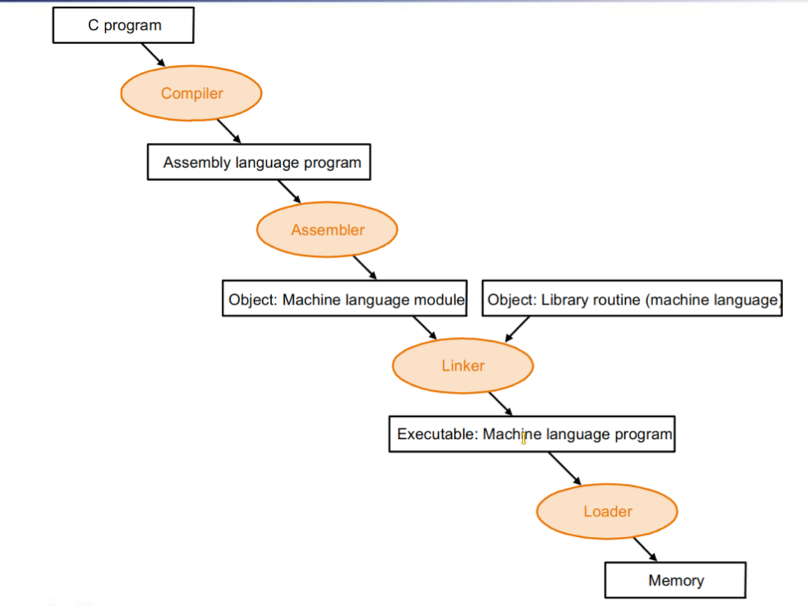
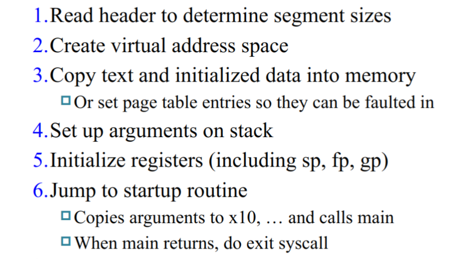
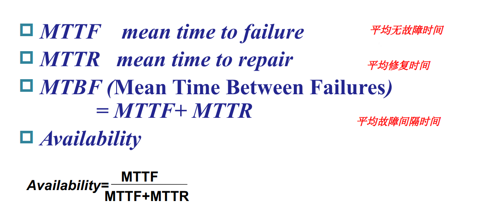
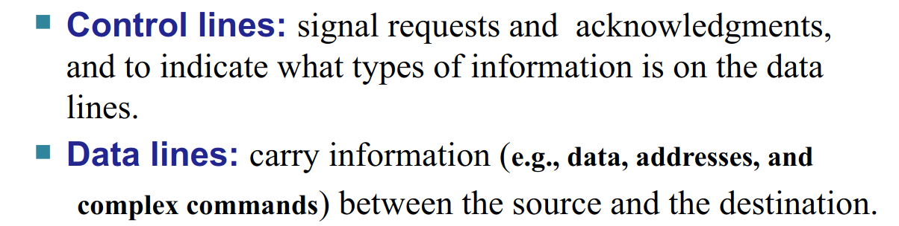

# 计算机组成

[超详细前辈笔记](https://xuan-insr.github.io/computer_organization/)

因此我只记录了一下自己遇到的重难点，以及自己的一些其他思考

----

## Chapter 1

### Eight Great Ideas in Computer Architecture

- Design for Moore's Law
    
    > Moore's Law: The number of transistors on a chip will double about every 18 - 24 months. 

    - 为了追求更高的性能，我们可以通过增加晶体管的数量来提高计算机的性能。但是，随着晶体管数量的增加，计算机的功耗和散热问题也会变得越来越严重，遇到功耗墙等问题。

- Use Abstraction to Simplify Design

    - 计算机的多层次抽象结构：数字逻辑、指令集架构、操作系统、编程语言、应用程序等。

- Make the Common Case Fast

    - 通过优化运行最多的操作来提高计算机的性能。

- Performance via Parallelism

    - 并行加速

- Performance via Pipelining

    - 流水线加速

- Performance via Prediction

    - 通过预测操作提高性能，如分支预测，缓存预读等
  
- Hierarchy of Memories

    - 计算机的存储器层次结构，如下：
        
         

- Dependability via Redundancy

    - 利用冗余提高系统可靠性，即多保险，如备份等

### Performance

主要要知道专有名词的定义，计算方法相对还是简单的

- Performance = 1 / Execution Time

- Execution Time = Clock Cycles * Clock Cycle Time

- CPI (Cycles Per Instruction) = Clock Cycles / Instructions

- MIPS (Million Instructions Per Second) = Frequency / CPI / $10^6$

----

## Chapter 2

### Risc-V 的指令集架构

- 以字节（1 byte = 8 bit）为最小寻址单位

- Little-Endian 小端存储

- words align 对齐不需要（虽然会影响效率）

- 指令（程序）被当作数据存储在内存中

- 寻址方式

    

### 指令汇总

- 指令格式

    

- 指令集

    

- 寄存器使用

    > Fast locations for Data

    

### 一些应用

- **RISC-V 的跳转指令**

    - offset 是基于当前指令的地址的偏移，这不同于其他一些汇编是基于下一条指令的偏移的。**即如果是跳转语句 PC 就不 +4 了，而是直接 +offset**
    
    - **branch/jal指令的跳转为自动加上 imm * 2，因此手写参数时可以视为以4为基数** 

- **switch case**

    - 通过记录一个跳转表实现多个分支的跳转

- **basic block**
  
    - 没有分支结构的代码块，可以通过一些优化手段提高性能

- **procedure call**

    - caller: jal ra, procedure (PC + 4 -> ra, PC -> procedure)
    
    - callee: jalr x0, 0(ra) (ra -> PC)
    
    - 使用 sp 栈指针开辟栈空间，将参数保存在栈中并在调用结束后释放栈空间，恢复相应的寄存器。
    
        - ra 保存返回地址

        - 通过 sp + offset / fp（进入程序时的栈顶） + offset 的方式访问栈中的数据
        
        - a0 - a7 用于传递参数，返回值通过 a0 传递
        
        - t0 - t6 为临时变量，可以不用管
        
        - s0 - s11 必须保存
    
    - *leaf procedure(没有递归调用): exhaustively use temporary registers then must-saved registers*
    
    - *atomic operation*
    
        - 锁存指令对，如

            ```riscv 
            lr.d rd1, (rs) (load reserve)
            
            sc.d rd2, (rs1), rs2 (store conditional)
            ```

            在读取数据的同时，将数据锁定
            
            在写入数据的时候，检查数据是否被修改(rd1 = 0)，如果没有则写入
            
            最终结果为（rd2 = 0）则写入成功(rd1 = rs, rs1 = rs2)，否则写入失败

            ```riscv title="atomic swap"
            again:
                lr.d x10, (x20)     // load-reserve Mem[x20] to x10(x10 = 0 now)
                sc.d x11, (x20), x23// store-conditional x23 to Mem[x20]
                bne x11, x0, again  // if x11 != 0, failed
                add x23, x0, x10    // swap x23 and Mem[x20]
            ```
### 程序编译



- Compiler -> Assembly Language

- Assembler -> Object Module

    
    
    

- Linker -> Executable Program

    - Static Linking

        - 将所有的库文件都链接到一个可执行文件中
    
    - Dynamic Linking

        - 在运行时再链接使用到的库文件函数
 
    

- Loader

    
    
----

## Chapter 3

### 数的表示

- 在各种课程内已经出现过好多次了，没什么特别好说的
  
### 运算

- 关于 overflow （同号相加出异号）的处理 （最后一位 Cin xor Cout = 1）

    - ALU detection
      
        - Exception
    
    - Overflow log
    
        - Store instruction address in a special register EPC
        
    - Jump to exception handler
    
        - Correct & Return
        
        - Return with error code
        
        - Abort program

- **Addition**

    - Carry Ripple Adder (数逻讲过，略)
    
    - Carry Lookahead Adder (CLA)
    
        - Generate: Gi = Ai & Bi
        
        - Propagate: Pi = Ai | Bi
        
        - Carry: Ci = Gi | (Pi & Ci-1) 

            将递推式不断展开，可以得到每一个Ci的表达式，这样就可以并行进行每一位的计算，大大提高了速度

            不过随着位数的不断增加，硬件复杂度也会不断增加，因此实际上将会每4位或者8位作为一个单元，然后再进行并行计算

            

            如上图，根据输入，通过每个小单元里的CLA 可以算出每个小 pi, gi

            同时，可以计算得出每个大的 Pi, Gi, 然后通过大的 CLA 可以得出每个大的 Ci

            这个Ci再传入每个小的 CLA， 就可以并行算出最终的结果了

    - Carry Select Adder (CSA)
    
        - 利用 预测 & 冗余的方法
        
        - 相当于对上述CLA的一个改进，预先将 Cin = 0 / 1 的可能值都算出来，然后根据输入的 Cin 选择其中一个  
    
    - slt (set less than)
    
        - a < b --> a - b < 0 

- **Multiplier** && **Division**

佬的笔记很详细了

核心就是充分利用结果寄存器，将 乘数 / 被除数 放到寄存器的右半冗余部分进行运算，并且变乘除法为加减法

*Booth 算法，减少“1” 的个数，提高效率，每一串”1“只需要运算两次*

- **Float**

    各种课讲过很多次了，略

    特殊标记：

    

    - **Accurate Arithmetic**

        - guard bit
            
            - 精确位数右边的一位

        - round bit
        
            - 精确位数右边的第二位 
        
        - sticky bit 
        
            - 精确位数右边的第三位及以后的位数，只要有一个为1，就置为1
            
        - method

            

----

# Chapter 4

关于 **单周期和流水线** 佬的笔记已经很详细了，这里记录一下后面的ILP和Int相关的内容

### ILP（Instruction Level Parallelism）

为了提升指令级并行程度，一般有以下两种方法：

- Deeper Pipeline

    增加流水线级数，从而可以同时执行更多指令，同时时钟周期变短

- Multiple Issue

    一次发射多条指令，或者说同时运行多条流水线

    主要处理两个问题：

    - 指令打包（packaging）并放入发射槽（issue slot）
    
    - 数据和控制冒险

??? tip

    

#### Static Multiple Issue


> Packet：VLIW（Very Long Instruction Word），一般要求对齐（可以加nop）

!!! example "常用的双发射"

    

- Ex harzard:

    只能分开到不同的Packet中，不能同时使用

- Load-Use Hazard:

    要把并行的流水线全部停掉，等待Load完成

- Unrolling Loop:

    通过展开循环，可以提高性能

    !!! "Register Renaming"

        循环展开后，为每一层循环引入新的寄存器，消除一些数据冒险

        即消除反相关（anti-dependence）（name dependence）

#### Dynamic Multiple Issue


> 由动态多发射处理器（Superscalar processors）动态调度来提高性能，抛弃编译器的一些静态调度，形成动态调度流水线


- 发射时会将指令存到保留站（reservation station）中，等待相关数据准备好，相当于完成寄存器重命名

- 中间执行单元（execution unit）会根据数据的准备情况，随时准备执行

- 一般**取值**和**译码**按序进行，内部的执行单元乱序执行，最后提交阶段一般也常用**按序提交**

#### Speculation

不管是静态还是动态，都会使用一些预测技术来提高性能，如编译阶段、硬件执行阶段预测分支、预测载入等

当预测错误时，需要一定手段进行回滚：


当预测时出现异常，一般会推迟异常：


### Interruption & Exception

广义上，可以粗略分成下面两种：

- Exception: Undefined Instruction & Arithmetic Overflow

- Interrupt: System Call & I/O Interrupt

#### 架构支持

- Risc-V mode

    

    

- Control and Status Registers (CSR)

    分为两类：

    - 普通程序控制
    
    - 为一些高级权限的指令提供支持

    !!! quote

         

        

#### 中断实现（M-mode为例）

??? info "相关寄存器"

    

??? info "流水线CPU结构"

    

- MEPC

    - WARL (Write Any Read Legal): 任何模式都可以写不会出异常，但是只有Machine模式可以读

    - 发生异常等`ecall / ebreak`，`MEPC <= PC`
    
    - 发生中断，`MEPC <= PC + 4`
    
    - 从中断返回 `MRET`，`PC <= MEPC` 

- MSTATUS

    确定当前的权限模式和中断使能

- MIE(Enable)/MIP(Pending)

    - 中断使能
   
    - 当前被挂起的中断

- MTVEC(Machine Trap Vector Base Address)

    

    - 中断处理程序的基地址
    
    - 当前的mode

    - 查表方式：

          

- MCAUSE

    

    - WLRL（Write Legal Read Legal）：非法读写都会触发异常

    - Exception Code与mtvec的向量模式相对应，在异步中断时，不同的模式会跳转到不同的入口

!!! note "具体步骤"

    

    *多个中断发生时：

    - 暴力选择处理最早的
    
    - 精确定位
    
    - 复杂多发射乱序执行：GG，太复杂  

#### 中断级别


----

## Chapter 6

*考试应该涉及的不多，这里简单的记录一下一些零碎的公式和概念*

!!! note "Amdahl's Law"

    > 说明了串行部分对并行化效率的影响

    - $Speedup = \frac{1}{(1 - f) + \frac{f}{s}}$

    - f: 被并行化的部分的比例

    - s: 并行化部分的加速比

### Disk Storage and Dependability

- **Disk**

    - 特征

        

    - 结构

        - Platter (盘片)，一般为堆叠的多个盘片

        - Track (磁道)，盘片上的一圈

        - Sector (扇区)，磁道上的一个片段  

        

    - 操作

        $$ latency = seek + rotation + transfer + controller $$

        - Seek Time (寻道时间)

            minimum、**average**（一般给出这个常数）、maximum

        - Rotational Latency (旋转延迟)

            $$ 平均延迟_{旋转} =  \frac{0.5 圈}{转速} $$

        - Transfer Time (传输时间)

            $$ 传输时间 = \frac{数据大小}{传输速度} $$

        - Disk Controller（控制器耗时）

            一般为给定常数

??? note "Flash"

    Nonvolatile semiconductor storage（非易失性半导体存储器）

    相比磁盘，更小更快更好用，不过有擦写上限

    

- 性能优化：

    - 人为调整访存顺序以减小seek time

    - 更好的控制器

    - 加缓存

- **有效性：**

    

    - Fault Avoidance：生产结构上尽量避免

    - Fault Tolerance：通过冗余设计，在出现故障时可以恢复正常运行

    - Fault Forecasting：尝试预测故障发生

- **可靠性：**

    !!! warning "粗略估计"

        如果使用 n 个独立的小磁盘来充当一个大磁盘，那么大磁盘的可靠性认为是小磁盘可靠性的$\frac{1}{n}$

    - **RAID(Redundant Array of Inexpensive Disks)**

        

        - RAID 0：No Redundancy

            - 无冗余，提高性能

        - RAID 1：Disk Mirroring/Shadowing

            - 直接镜像复制一份，最高代价，最高可靠性

        - *RAID 2

        - RAID 3：Bit-Interleaved Parity Disk

            为每一位数据添加一个奇偶校验位，用于检测错误和恢复数据

            这样可以恢复一个磁盘的数据，但是无法恢复多个磁盘的数据

            

        - RAID 4：Block-Interleaved Parity Disk

            类似于 RAID 3，但是是以块（stride）为单位进行奇偶校验（一列为一个磁盘）

            little read只要读取一个磁盘就可以了，而不需要读取所有的磁盘

            little write需要根据数据变化重新计算奇偶校验位（两次异或），然后写入

            large write会写入一整行，可以直接重新计算整个校验块

            

        - RAID 5：Block-Interleaved Distributed Parity

            由于每次写入操作都会修改校验块，但是 RAID 4 的校验块是在一个磁盘上，因此会造成阻塞瓶颈

            因此 RAID 5 将校验块分布到所有的磁盘上，这样每次写入操作都会修改不同的校验块，提高了性能

            

        - RAID 6：P+Q Redundancy

            容易发现，前面的方法都只能恢复一个磁盘的数据，因此 RAID 6 引入了两个校验块，可以恢复至多两个磁盘的数据

### Buses and Other Connections

- 类型

    

- 内存

    

    ??? note "history"

        

        

- Synchronous vs. Asynchronous

    - 同步：时钟信号同步

    - 异步：无需时钟信号同步  

        

        1. I/O发出读请求，内存读到信号，从数据总线读取地址，并发出Ack信号确认

        2. I/O 读取到Ack信号，停止发出请求，等待数据

        3. 内存发现请求信号消失，完成一次握手，停止Ack信号

        4. 内存读取对应数据，写入数据总线，并发出Data Ready信号

        5. I/O 读取到Data Ready信号，从数据总线读取数据，并发出Ack信号确认读取完毕

        6. 内存读到Ack信号，停止发出数据，并不再发出Data Ready信号

        7. I/O 发现Ack信号消失，完成一次握手，停止Ack信号，整个数据读取过程结束

    ??? example

        异步带宽没有同步高，但是可以同时进行多个操作，因此在一些场景下异步更加适用

        

         

- **Bus Arbitration**

    为处理多任务，Bus可能会有多个请求，因此需要一个仲裁器来决定哪个请求优先

    

- **Increase Bandwidth**

    

    !!! note "transfer time（同步）"

        - 传输地址时间
        
        - 读数据时间
        
        - 传输数据时间(这里一般与数据总线的宽度有关)
        
        - 传输间隔时间等特殊时间

- Interfacing

    ??? note "I/O 交互的特征"

        

        

- **交互方式**

    

    - Interrupt-Driven I/O mode

        - 通过中断请求信号，CPU可以暂停当前操作，处理中断请求

        - 可以处理高并发性

        计算：相当于在polling的基础上乘以操作比例

    - Direct Memory Access (DMA)

        

        不需要 CPU 参与，直接通过 DMA 控制器进行数据传输，不会占用 CPU 的功效

        计算：关注数据传输时间

    - Polling

        - CPU 不断查询 I/O 状态，直到 I/O 完成

        - 会浪费 CPU 的功效

        计算：频率 * polling 时间

- bottleneck计算

    - min(Maximum I/O rate of CPU, Maximum I/O rate of bus)

        

    - Time per I/O

        

        从而可以获得所需disk的吞吐量，从而计算得最少disk个数

    - Bus

        