# UCB-Linux System Administration Decal

> 系统地学习一下linux, 记录一些知识点，包括课程讲义、实验等
>
> [官网](https://decal.ocf.berkeley.edu/)

----

## Lectures

----

### License

- Copyleft(GPL)

    > All versions of the software remain free

    通过GPL协议，要求源程序必须公开，任何人都可以使用、修改、复制、分发源代码，但是必须保持开源，并且任何修改后的代码也必须遵守GPL协议。

    !!! tip

        A quote from Richard Stallman, the founder of the Free Software Foundation, emphasizes his goal to maintain the freedom of GNU software: "I want to make sure that all versions of GNU remain free."

        Steve Ballmer, former CEO of Microsoft, referred to the GPL as "a cancer that attaches itself in an intellectual property sense to everything it touches." 

        由此可见，GPL的完全开源会对衍生的商业软件产生不可忽视的“威胁”

- Permissive（MIT,BSD,Apache,WTFPL）

    > You can do whatever you want with the software, as long as you include the original copyright and license notice in any copy of the software/source.

    这类协议允许用户自由使用、修改、复制、分发源代码，但是不需要保持开源，可以闭源，只要在源代码中包含原始版权和许可通知即可。

----

### Shell Scripting

- `#!`：Shebang，指定解释器(执行器)，如 `#!/bin/bash`

- variable

    在shell中没有变量类型的概念，任何变量都是字符串，若要进行数学运算，需要使用`expr` `$(( ))`（中间直接写变量名，不用加额外符号）等命令

    - `var=value`：赋值，注意等号两边不能有空格
    
    - `echo $var`：引用
    
    - `""`：引用变量，可以用于区分变量名 
    
    - `expr $var1 + $var2 / $(($var1 + $var2))`：加法
    
    - `let var1=var2+var3`：加法，`let`命令可以直接进行数学运算，不用加`$`,但是同样不能有空格

    ??? note "bc"

        bc是一个用于数学运算的命令行工具，可以进行高精度计算，支持浮点数运算，可以用于shell脚本中的数学运算

        - `echo "var1+var2" | bc`：加法
        
        - `echo "scale=2;var1/var2" | bc`：除法，保留两位小数   
    
    ??? tip "copilot教的"
    
        - `export var`：导出
        
        - `unset var`：删除
        
        - `readonly var`：只读
        
        - `var1=var2`：引用
        
        - `var1=${var2}`：引用
        
        - `var1=${var2:-value}`：如果`var2`为空，则赋值为`value`
        
        - `var1=${var2:=value}`：如果`var2`为空，则赋值为`value`，并且`var2`也被赋值为`value`
        
        - `var1=${var2:+value}`：如果`var2`不为空，则赋值为`value`
        
        - `var1=${var2:?message}`：如果`var2`为空，则输出`message`并退出

- `$`

    - `${}`：引用变量，可以用于区分变量名

    - `$(command)`：subshell 命令替换，即内部命令的执行结果

    - `$0`：脚本名称
    
    - `$n`：第n个参数
    
    - `$#`：参数个数
    
    - `$*`：所有参数
    
    - `$@`：所有参数
    
    - `$?`：上一个命令的返回值
    
    - `$$`：当前进程号
    
    - `$!`：后台运行的最后一个进程号

- conditions

    ??? note "comparison"
        
        - `-eq`：等于
        
        - `-ne`：不等于
        
        - `-gt`：大于
        
        - `-lt`：小于
        
        - `-ge`：大于等于
        
        - `-le`：小于等于
    
    ??? note "operators"

        - `&&` `||`：shell中的逻辑运算符
        
        - `-a` `-o`：`test / []` 命令中的逻辑运算符 
    
    - `test / []`：测试表达式
    
        - `test expression / [expression]`：返回0（真）或1（假）
        
        !!! tip "常用命令"

            - `-f file`：文件存在且为普通文件
            
            - `-d file`：文件存在且为目录
            
            - `-e file`：文件存在
            
            - `-r/w/x file`：文件存在且可读/写/执行
            
            - `-s file`：文件存在且大小不为0
      
    - `if`：条件语句
    
        ```bash
        if [ condition ]; then
            command
        elif [ condition ]; then
            command
        else
            command
        fi
        ```

    - `case`：多条件语句
    
        ```bash
        case $var in
            pattern1)
                command
                ;;
            pattern2)
                command
                ;;
            *)
                command
                ;;
        esac
        ``` 

- loop

    - `for`
    
        ```bash
        for var in list; do
            command
        done
        ```

        !!! tip "About list"
        
            - `(a b c)`：数组
            
            - `{x..y} {1..3}`：范围 

    - `while`
        
        ```bash
        while [ condition ]; do
            command
        done
        ```

- function

    ```bash
    # 引用参数 $1 $2 ...
    # 返回值没有相关的机制，一般只能使用echo转移到标准输出调动，或者exit有一个返回值
    function_name() {
        command
    }
    ```

    ??? example "Reccursive Fibonacci"
    
        ```bash
        #!/bin/zsh
        
        # contents of fibonacci

        if [ $# -eq 0 ]; then
            echo "fibonacci needs an argument"
            exit 1
        fi

        fib() {
            N=$1
            if [ -z "${N##*[!0-9]*}" ]; then
                echo "fibonacci only makes sense for nonnegative integers"
                exit 1
            fi

            if [ "$N" -eq 0 ]; then
                echo 0
            elif [ "$N" -eq 1 ]; then
                echo 1
            else
                echo $(($(fib $((N-2))) + $(fib $((N-1)))))
            fi
        }

        fib "$1"
        ```

----

### Package

> An archive containing binaries and libraries of an application, along with metadata for installation
>
> 

一般来说，一个软件包包含以下内容：

- 控制文件：描述软件包的元信息，如名称、版本、依赖等

- 数据文件：软件包的实际内容，包括二进制文件、库文件、配置文件等

    - `/usr/bin`：可执行文件
    
    - `/usr/share`：documenation, manpage, locale 等
    
    - `/etc`：全局配置文件
    
    - `md5sums`：文件校验和  

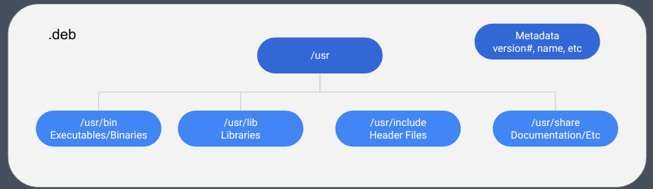

!!! note "Package Manager"

    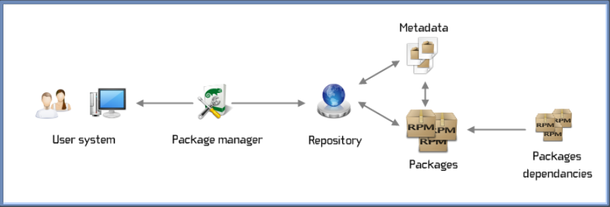

----

### Service

!!! note "关于终端中运行程序"

    - `&`：后台运行
    
    - `nohup`：忽略挂断信号，即使终端关闭也不会停止运行
    
    - `ctrl + z`：暂停
    
    - `bg`：后台运行
    
    - `fg`：前台运行
    
    - `jobs`：查看后台任务，以任务号区分

----

### Process

process是一个正在运行的程序的实例，每个process都有一个唯一的进程号（PID），可以通过`ps`命令查看当前系统的进程，每个进程都有一个父进程，可以通过`pstree`命令查看进程树，其中`init`是所有进程的祖先，其PID为1

每个进程都可以有多个线程thread，线程是进程的一个执行单元，线程共享进程的资源，包括内存、文件描述符等，但一般每个线程也有自己的栈空间存储状态，可以通过`ps -eLf`查看线程

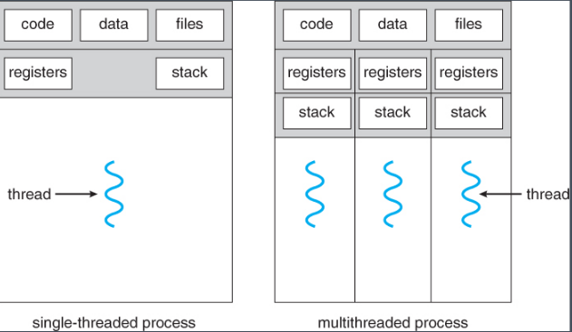

一个进程可以fork出一个子进程，可以通过`wait()`函数等待子进程结束。子进程会继承父进程的资源，但是有自己的PID，还可以通过`exec()`函数替换自己的内存空间，从而执行其他程序

- 特殊情况：

    - `zombie`（僵尸进程）：子进程结束`exit`，父进程还没有回收子进程的资源，此时子进程的状态为`Z`，属于资源浪费（泄漏）。可以通过`kill`命令杀死父进程，使子进程成为孤儿进程，被`init`进程回收

    - `orphan`（孤儿进程）：父进程结束，子进程还在运行，此时子进程的父进程变为`init`进程，`init`进程会回收子进程的资源 

- 进程通信

    - `exit code`：进程退出码，一般0表示正常退出，其他值表示异常退出
    
    - `signal`：信号，一种异步通信方式，可以向进程发送信号

        可以使用`kill`命令向进程发送信号，可以通过`kill -l`查看信号列表

        ??? note "常用信号"
        
            - `SIGKILL(9)`：强制立即终止，不会发送信号给子进程
            
            - `SIGTERM(15)`：终止信号，程序正常退出，但不会发送信号给子进程
            
            - `SIGSTOP(19)`：暂停
            
            - `SIGCONT(18)`：继续
            
            - `SIGINT(2)`：中断，`ctrl + c`
            
            - `SIGHUP(1)`：挂断信号，终端关闭，会将信号发送给所有子进程

    - `pipe`：管道，可以实现进程间通信，一般用于父子进程间通信，如STDIN /STDOUT / STDERR等
    
    - `socket`：套接字，可以实现不同主机间的双向通信，一般用于网络通信TCP/IP等
    
    - `message bus`：消息总线，可以实现不同进程间的通信，如`dbus`等    

----

### Service

`Daemon`是一种特殊在后台运行的守护进程，可以通过`systemctl`命令管理，包括启动、停止、重启、查看状态等

`systemd`是一个Linux系统的初始化系统和服务管理器，可以通过`systemctl`命令管理服务，`systemd`会在启动时自动启动服务

每个服务都有一个`unit`文件，描述服务的元信息，如名称、描述、依赖等，`unit`文件一般存放在`/etc/systemd/system`目录下

!!! example "Unit File"

    ```bash
    [Unit]
    Description=My Service

    [Service]
    ExecStart=/path/to/executable
    User=username
    Restart=always

    [Install]
    WantedBy=multi-user.target
    ```

----

### Network

- TCP/IP 4-layer model

    - `Application`：应用层，真正接受处理数据，如HTTP、FTP、DNS等
    
    - `Transport`：传输层，管理协议，如TCP（可靠但慢）、UDP（快但不可靠）
    
        - `TCP`(transmission control protocol)：传输控制协议，三次握手协议，只有得到对方的确认才会发送数据，保证数据的可靠传输，常用于HTTP、FTP等应用
        
            ??? note "工作流程"
            
                1. 客户端发送SYN请求，请求建立连接
                
                2. 服务器发送SYN+ACK，确认连接
                
                3. 客户端发送ACK，确认连接建立
                
                4. 数据传输，每次发送数据的时候都会等待对方的确认ACK信号，保证数据的可靠传输
                
                5. 断开连接，四次挥手协议，保证数据的可靠传输
                
                    1. 客户端发送FIN，请求断开连接
                    
                    2. 服务器发送ACK，确认断开连接
                    
                    3. 服务器发送FIN，请求断开连接
                    
                    4. 客户端发送ACK，确认断开连接
        
        - `UDP`(user datagram protocol): 用户数据报协议，不保证数据的可靠传输，但是速度快，相当于直接发送数据包，不管对方是否收到，因此有可能丢包，常用于实时通话、视频等低延时应用
      
        - `ICMP`(Internet Control Message Protocol)：网络控制报文协议，用于网络故障诊断 
    
    - `Internet`：网络层，由路由器进行全局IP地址之间的转发

        - `IP`：网络地址，可以更改，用于在全球范围内唯一标识主机，IPv4（32位）/IPv6（128位）
        
        - `Port`：端口，用于在主机内唯一标识应用程序，16 bit(0-65535)，一个端口在同一时间只能被一个应用程序使用
        
            - 0-1023为系统保留端口，一般用于特殊服务，如HTTP（80）、FTP（21）、SSH（22）、HTTPS（443）、DNS（53）等
            
            - 1024-49151为注册端口，一般用于常见服务，如NFS（2049）、MySQL（3306）、Tomcat（8080）等 
            
            - 49152-65535为动态端口，可以临时分配给应用程序使用，一般用于客户端，如NAT、防火墙等 
        
        - `Subnet`：子网，将IP地址划分为多个子网，可以减少广播域，提高网络性能
        
            具体地，斜杠后面的数字表示掩码前面1的个数，或者说是网络位数，剩下的是留给主机的位数，其中第一个和最后一个IP地址是网络地址和广播地址，一般不能使用

            也就是说，IP地址与子网掩码进行与运算，可以得到网络起始地址

            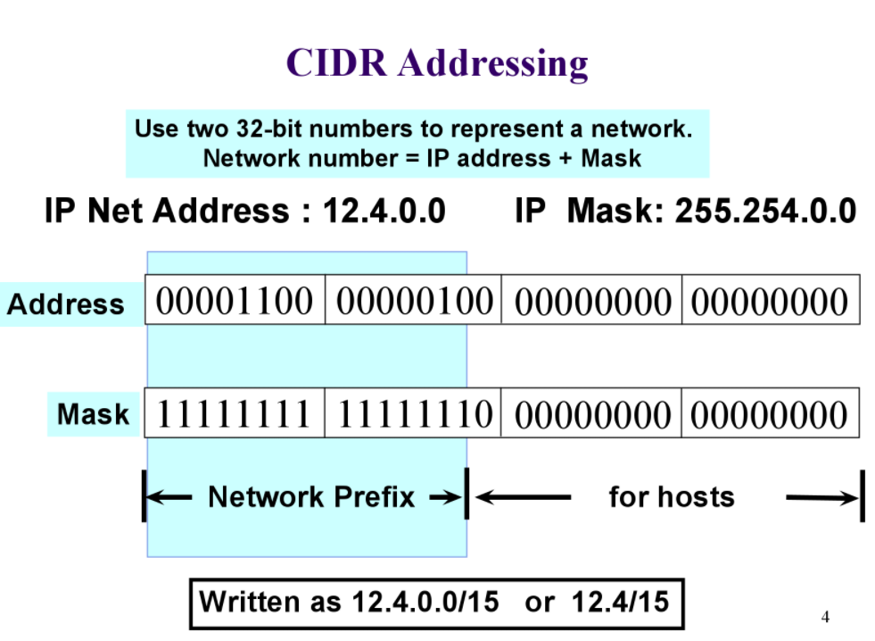
        
        - `NAT`：网络地址转换，将内部IP地址转换为外部IP地址，使多个设备共享一个公网IP地址，从而节省IP地址
        
        - `ARP`：地址解析协议，用于将IP地址解析为MAC地址
        
            !!! tip "工作流程"

                1. 如果目标IP地址在本地网络表中，直接发送
                
                2. 否则，发送ARP请求，获取目标IP的MAC地址，然后发送数据包
        
        - `Routing`：路由，根据数据包的目标IP地址选择最佳路径
        
        - `DNS`(Domain Name System)：域名解析系统，将域名（URL）解析为IP地址
        
            ??? note "DNS Record"

                一般包括 **name, value, type, TTL**等字段

                TTL(time to live)表示记录的生存时间，一般为秒，过期后需要重新解析

                - A records(IPv4)
                 
                    `name = value = ip address`

                - AAAA records(IPv6)
                
                    `name = value = ip address` 
                
                - NS records
                
                    重定向到另一个DNS服务器，一般用于子域名

                    - `name = domain name`
                    
                    - `value = name server` 
    
                - CNAME records
                
                    别名记录，将一个域名解析为另一个域名，一般用于负载均衡

                    - `name = alias`
                    
                    - `value = canonical name`
                
                - MX records
                
                    邮件交换记录，指定邮件服务器

                    - `name = domain name`
                    
                    - `value = mail server`
                
                - *TXT records
                
                    用于存储任意文本信息，一般用于验证域名所有权

                    - `name = domain name`
                    
                    - `value = text`
                
                - *SRV records
                
                    服务记录，指定服务的位置

                    - `name = service`
                    
                    - `value = protocol, port, target`
                
                - *SOA records
                
                    开始授权记录，指定域名的授权服务器

                    - `name = domain name`
                    
                    - `value = primary name server, email, serial number, refresh, retry, expire, minimum TTL` 

            !!! danger "DNS poisoning"

                DNS污染，攻击者通过篡改DNS服务器的记录，将合法域名解析为恶意IP地址，从而实现中间人攻击

                ~~比如我国的封闭外网的Great Firewall~~
        
            !!! danger "DNS hijacking"

                DNS劫持，攻击者通过篡改DNS服务器的记录，将合法域名解析为恶意IP地址，从而实现重定向攻击

                通常由钓鱼网站、广告商等实施
 
    - `Link`：链路层，往往为直接连接的硬件设备，不需要路由转发
    
        - `MAC address`（Media Access Control）：物理地址，用于在本地网络唯一标识设备, 48位二进制数，前24位为厂商识别码，后24位为设备序列号

             
        
        - `ARP`：地址解析协议，用于将IP地址解析为MAC地址
        
        - `NDP`：邻居发现协议，IPv6中的ARP协议   

- [Tools（见下方Lab 5）](#lab-5)

----

### Web Server

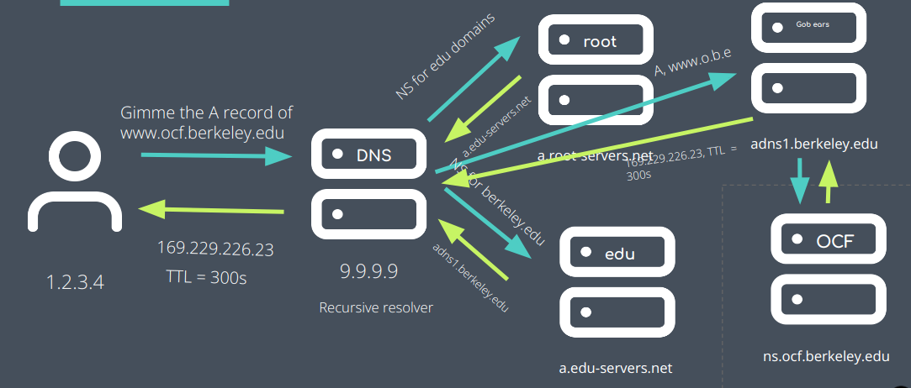

- Scale

    - `Vertical`：垂直扩展，增加单个服务器的性能，如增加CPU、内存等，但是成本高，性能有限
    
    - `Horizontal`：水平扩展，增加服务器的数量，如负载均衡、分布式存储等，成本低，性能高

- Load Balancer

    通过负载均衡器，将请求分发到多个服务器，可以提高性能，减少单点故障

----

### Security

- **Confidentiality**

    > 只有授权用户可以访问数据

    - Cypertext替代明文，利用加密算法保护数据

        - `Encryption`：加密，将数据转换为密文，只有授权用户才能解密
        
        - `Decryption`：解密，将密文转换为明文，只有授权用户才能解密 

    - 加密算法

        - `Symmetric`：对称加密，加密和解密使用相同的密钥，如DES、AES等
        
            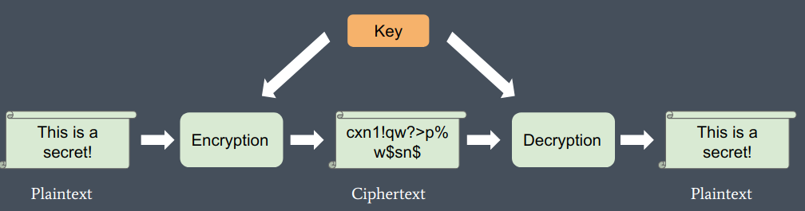
        
        - `Asymmetric`：非对称加密，加密和解密使用不同的密钥，一般加密使用可以公开的公钥，解密使用私钥，如RSA、DSA等

            

- **Integrity**

    > 数据没有被篡改

    - `Hash`：密码学哈希函数，根据数据计算为固定长度的哈希值，并且无法通过哈希值回推原来的数据，一般用于校验数据完整性

        - `MD5`：128位哈希值，不安全
        
            ```bash
            md5sum filename
            ``` 
        
        - `SHA`：安全哈希算法，如SHA-1（160位）、SHA-256（256位）等
        
            ```bash
            sha1sum filename
            sha256sum filename
            ```

        !!! example

            - MAC(Message Authentication Code)：消息认证码，使用密钥对哈希值进行加密，保证数据的完整性和真实性
            
            - Checksum：校验和，对数据进行校验，一般用于校验数据传输的完整性
            
            - 存储密码：一般不存储明文密码，而是存储密码的哈希值

- **Authentication**

    > 确认数据来源/作者的真实性

    - Signature：数字签名，将私钥附在数据上。由于私钥只有本人持有，因此可以结合公钥验证数据的真实性
    
        - **file + private key → signature**

        - **signature + public key → verification**

        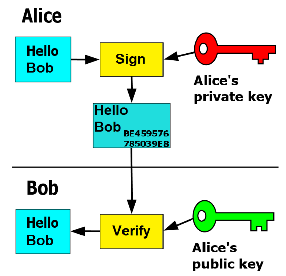

    - Certificate：数字证书，由CA（Certificate Authority，权威第三方）颁发，用于证明公钥的真实性

        - **public key + CA → certificate**

        !!! note "CA"
            
            - `Root CA`：根证书，权威第三方，用于签发其他CA的证书
            
            - `Intermediate CA`：中间证书，用于签发终端用户的证书
            
            - `End Entity`：终端用户，用于签发终端用户的证书
          
            证书链：终端用户的证书由中间证书签发，中间证书由根证书签发，因此终端用户的证书需要包含中间证书和根证书，且终端证书验证依赖于根证书

- **Availability** 

    > 数据可用性，保证数据的可靠性和持久性

    - **Filtering**: 过滤，防止恶意攻击
    
    - **Load Balancer**: 负载均衡，分发请求，提高性能
    
    - **Redundancy**: 冗余，备份数据，防止数据丢失
    
    - **Backup**: 备份，将数据复制到其他设备，以防数据丢失   

----

### Version Control

[我的Git笔记](https://fightingff.github.io/notebooks/Git)

----

## Labs

----

[My Labs Repository](https://github.com/fightingff/Sysadmin-Decal)

### Lab 1

- `.tgz`(`tar.gz`)文件

    - 压缩：`file --(tar)--> file.tar --(gzip)--> file.tar.gz`
    
    - 解压 

        ```bash
        tar -xvzf filename.tgz
        ```

        - `-x`：解压
        
        - `-v`：显示详细信息
        
        - `-z`：使用`gzip`解压
        
        - `-f`：指定文件

- `xargs`

    常和管道符`|`一起使用，将前一个命令的输出作为后一个命令的参数，注意`xargs`默认以空格分隔参数，将换行符转换为空格，并且要写在后一个命令的前面

    ```bash
    # command1 | xargs command2
    cat * | xargs echo # 将所有文件内容以一行输出
    ```

- `tr`

    替换字符

    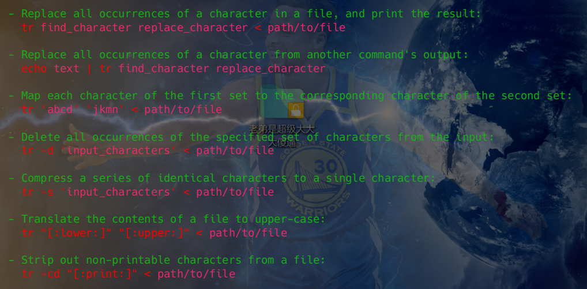

- `grep` 高级用法

    - `-v`：取反，显示不包含关键字的行
    
    - `-i`：忽略大小写
    
    - `-c`：统计匹配行数
    
    - `-n`：显示行号
    
    - `--context|before|after n`：显示匹配行前后的行数

- 文件权限

    ??? note

        - `r`：读权限
        
        - `w`：写权限
        
        - `x`：执行权限
        
        - `d`：目录
        
        - `l`：链接文件
        
        - `s`：套接字文件
        
        - `p`：管道文件
        
        - `c`：字符设备文件
        
        - `b`：块设备文件
          
    一般来说，文件权限第1个字符表示文件类型，后面的9个字符分为三组，分别是`u`（所有者）、`g`（所属组）、`o`（其他用户），每组权限分别是`rwx`，用数字表示则为`421`

    使用`chmod`命令修改文件权限，如`chmod 777 filename`，其中`777`表示所有用户都有读写执行权限

    使用`chown`命令修改文件所有者，如`chown user:group filename`

- `head / tail`

    - `head / tail`

    显示文件头/尾

    - `--lines n`：显示前/后n行

- `less / more`

    分页显示文件内容，`less`比`more`更强大

    - `space`：下一页
    
    - `b`：上一页
    
    - `q`：退出

    - `/`：搜索

- `find`

    查找文件

    - `-name`：按文件名查找
    
    - `-type`：按文件类型查找
    
    - `-size`：按文件大小查找
    
    - `-exec`：执行命令

----

### Lab 2

- [vim](https://fightingff.github.io/notebooks/Vim)

- `wc -l` 会默认输出文件名，目前使用的方法是使用 `cat filename | wc -l`

----

### Lab 3

- `.deb` 文件打包（ex1）

    - 使用 `fpm` 工具打包

    - `dpkg -i filename.deb`：安装
    
    - `dpkg -r package`：卸载
    
    - `dpkg -l`：列出已安装的软件包
    
    - `dpkg -L package`：列出软件包的文件列表
    
    - `dpkg -S file`：查找文件属于哪个软件包

- `.deb` 文件解包（ex2）

    - `dpkg -c filename.deb`：列出文件

    - `dpkg -x filename.deb`：解包，只能得到数据文件
    
    - `dpkg -e filename.deb`：提取控制文件
    
    最终可以得到这样的文件结构，其中`DEBIAN`文件夹中存放控制文件, `ocfspy`文件中为提取出的数据文件 

    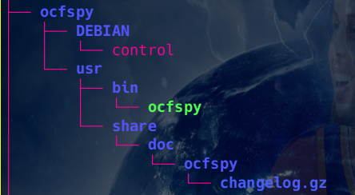

    对`control`文件进行检查，会发现其中dependency显然不对，不能自己依赖自己

    

    修改完成后，在上图所示的文件结构下，使用`dpkg -b ocfspy`  `fakeroot dpkg-deb --build ocfspy` 打包，得到新的`.deb`文件

- arch linux package

    *（目前自己在使用arch，因此也借此机会学习一下）*

    - `PKGBUILD`：描述软件包的元信息，如名称、版本、依赖等

        [官方文档](https://wiki.archlinux.org/title/PKGBUILD)

        arch的PKGBUILD文件将对应的软件包信息使用URL或FTP地址的方式进行记录，在下方的四个函数`prepare` `build` `check` `package`中进行下载、解压、编译、打包等操作

    - `makepkg`：打包

        如果将生成的`.pkg.tar.xz`文件进行解压，可以看到和`.deb`文件类似的文件结构，其中包相关的元信息一般以隐藏文件的形式存放

        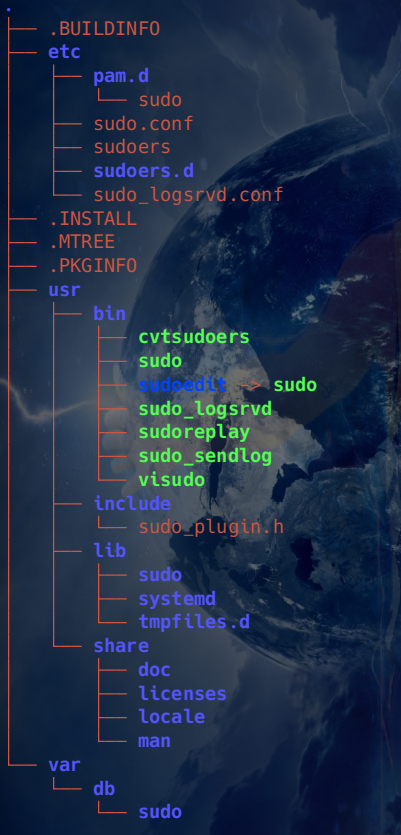

    - `pacman -U filename.pkg.tar.xz`：安装

----

### Lab 4

- `systemd`

    !!! warning "存放位置"

        `/lib/systemd/system`：系统服务
    
        `/etc/systemd/system`：用户服务，具有最高的优先级，一般自定义服务都放在这里

        *`/run/systemd/system`：运行时服务，一般不直接操作，优先级介于上面两者之间

    ??? question "管理的unit种类"

        !!! danger "还没有仔细研究"
    
        - `service`：后台服务进程
        
        - `socket`：套接字，往往用于监听端口等
        
        - `target`：可以视为一个组，用来定义系统的运行状态
        
        - `device`：硬件设备
        
        - `mount`：管理挂载点
        
        - `automount`：自动挂载，首次访问时挂载，节省资源
        
        - `path`：监视文件或目录
        
        - `timer`：定时器
        
        - `snapshot`：快照，用于回滚
        
        - `swap`：管理交换空间
        
        - `scope`：作用域，临时聚合进程组
       
        - `slice`：切片，用于资源隔离
    
    - Unit File

        [tutorial](https://www.digitalocean.com/community/tutorials/understanding-systemd-units-and-unit-files)

        - `[Unit]`：描述服务的元信息，如名称、描述、依赖等
        
            - `Description`：描述
            
            - `Requires`：依赖，即启动当前服务前，需要启动的其他服务 
            
            - `After`：假依赖，即先启动列表中的服务，再启动当前服务
            
            - `Before`：假依赖，即先启动当前服务，再启动列表中的服务   
        
        - `[Service]`：描述服务的执行信息，如启动命令、用户、环境变量等
        
            - `ExecStart`：启动命令
            
            - `Restart`：重启策略，如`always`表示总是重启，`on-failure`表示失败时重启，`never`表示不重启  
            
            - `RestartSec`：重启间隔 
        
        - `[Install]`：描述服务的安装信息，如启动级别、依赖等
        
            - `WantedBy`：启动级别，即在哪个级别启动服务

- process

    - `ps`：查看进程
    
        默认情况下只会显示当前终端的进程

        - `-e`：显示所有进程
        
        - `-f`：显示详细信息
        
        - `-u`：显示用户进程
        
        - `-a`：显示所有终端的进程     
        
        ...  

----

### Lab 5

- `host`：查看域名解析信息

- `hostname`：查看主机名，主机ip地址等

- `ping`：测试网络连接，发送ICMP包

- `traceroute`：跟踪路由，显示数据包经过的路由器

- `arp`：显示ARP缓存

- `dig`：DNS查询，显示域名解析信息  

- `netstat`：显示网络连接、路由、接口等信息

- `ip`：显示网络接口信息，很强大，可以替代`ifconfig` `route`等命令，[sheet](https://access.redhat.com/sites/default/files/attachments/rh_ip_command_cheatsheet_1214_jcs_print.pdf)

- `nc`：网络工具，可以用于端口扫描、端口监听等

----

### Lab 6

- DNS 暂时略过

- Load Balance

    - *`nginx`：反向代理服务器，同时可以实现负载均衡、缓存、反向代理等功能

    - `haproxy`：负载均衡器，可以实现负载均衡、健康检查等功能
    
        - `frontend`：前端，接收请求
        
        - `backend`：后端，处理请求

            - `mode`：工作模式，如`http` `tcp` `health`等

            - `balance`：负载均衡算法，如`roundrobin` `leastconn` `source`等
            
            - `server`：服务器列表，包括`name` `address` `port`等
            
            - `option`：选项，如`httpchk` `check`等
            
                可以设置健康检查的方式，如`httpchk GET /health` `check port 80`，在`server`后面加上`check`即可，并且可以设置`inter` `rise` `fall`等参数来调整健康检查的频率和判定接口的健康程度的标准   

            !!! note "algorithm"
            
                - `roundrobin`：轮询
                
                - `leastconn`：最少连接
                
                - `source`：源IP的哈希值除以总权重进行分配
                
                - `uri`：URI的哈希值除以总权重进行分配
                
                - `url_param`：URL参数，使用参数的哈希值除以总权重进行分配

        - `listen stats`：监听端口  
        
            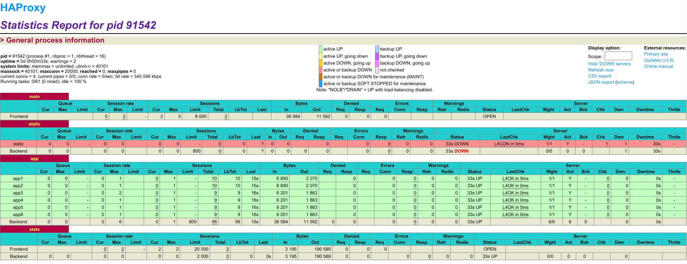

----

### Lab 7

- GPG

    > GnuPG allows you to encrypt and sign your data and communications; it features a versatile key management system, along with access modules for all kinds of public key directories.

    - Symmetric
    
        - `gpg --symmetric filename`：加密，需要输入密码，生成`.gpg`文件
        
        - `gpg -decrypt filename`：解密，需要输入密码，生成原文件
        
    - Asymmetric

        gpg使用keyring对密钥进行管理，一般有两个ring，一个是公钥ring，一个是私钥ring，可以通过`gpg --list-keys` `gpg --list-secret-keys`查看

        - `gpg --gen-key`：生成密钥对，需要输入姓名、邮箱等信息，从而获得公钥和私钥
        
        - `gpg --export -a "User Name" > public.key`：导出公钥
        
        - `gpg --import key`：导入公钥/私钥
        
        - `gpg --delete-key "User Name"`：删除公钥
        
            `gpg --delete-secret-key "User Name"`：删除私钥 
        
        -  `gpg --encrypt -r "User Name" filename`：加密，需要此用户的公钥，生成`.gpg`文件

    - Sign

        - `gpg --sign filename`：签名，生成`.gpg`文件
        
        - `gpg --verify filename.gpg`：验证签名，需要公钥
        
        - *要解密签名文件，需要两次解密，一次验证签名，一次解密文件

- Hash（Checksum）

    - `md5sum file`：生成MD5校验和
    
    - `sha1sum file`：生成SHA1校验和
    
    - `sha256sum file`：生成SHA256校验和

### Lab 8

- **Pull Request**

    - 先fork到自己的仓库
    
    - 在这个仓库中进行修改
    
    - 提交PR  

- `rysnc`

    同步文件（夹），相比`cp` `scp`等命令，`rsync`可以实现增量同步（比较最后修改的时间戳），只同步修改的文件，而不是整个文件夹，并且可以保证文件的元信息，更适合大文件、多服务器同步等场景

    - `rsync -avz source destination`：同步文件夹

    - `rsync -avz --delete source destination`：同步文件夹并删除多余文件

    - `rsync -avz -e ssh source destination`：通过ssh同步文件夹

    - `rsync -avz -e ssh --delete source destination`：通过ssh同步文件夹并删除多余文件