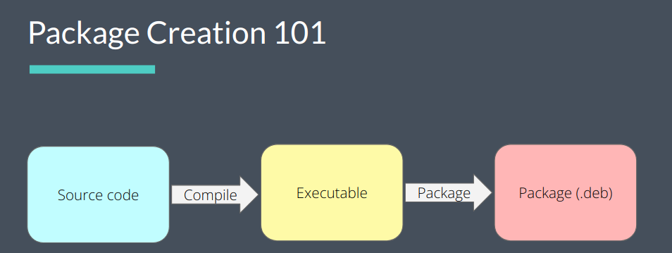
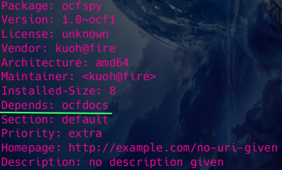

# UCB-Linux System Administration Decal

> 系统地学习一下linux, 记录一些知识点，包括课程讲义、实验等
>
> [官网](https://decal.ocf.berkeley.edu/)

----

## Lectures

----

### License

- Copyleft(GPL)

    > All versions of the software remain free

    通过GPL协议，要求源程序必须公开，任何人都可以使用、修改、复制、分发源代码，但是必须保持开源，并且任何修改后的代码也必须遵守GPL协议。

    !!! tip

        A quote from Richard Stallman, the founder of the Free Software Foundation, emphasizes his goal to maintain the freedom of GNU software: "I want to make sure that all versions of GNU remain free."

        Steve Ballmer, former CEO of Microsoft, referred to the GPL as "a cancer that attaches itself in an intellectual property sense to everything it touches." 

        由此可见，GPL的完全开源会对衍生的商业软件产生不可忽视的“威胁”

- Permissive（MIT,BSD,Apache,WTFPL）

    > You can do whatever you want with the software, as long as you include the original copyright and license notice in any copy of the software/source.

    这类协议允许用户自由使用、修改、复制、分发源代码，但是不需要保持开源，可以闭源，只要在源代码中包含原始版权和许可通知即可。

----

### Shell Scripting

- `#!`：Shebang，指定解释器(执行器)，如 `#!/bin/bash`

- variable

    在shell中没有变量类型的概念，任何变量都是字符串，若要进行数学运算，需要使用`expr` `$(( ))`（中间直接写变量名，不用加额外符号）等命令

    - `var=value`：赋值，注意等号两边不能有空格
    
    - `echo $var`：引用
    
    - `""`：引用变量，可以用于区分变量名 
    
    - `expr $var1 + $var2 / $(($var1 + $var2))`：加法
    
    - `let var1=var2+var3`：加法，`let`命令可以直接进行数学运算，不用加`$`,但是同样不能有空格

    ??? note "bc"

        bc是一个用于数学运算的命令行工具，可以进行高精度计算，支持浮点数运算，可以用于shell脚本中的数学运算

        - `echo "var1+var2" | bc`：加法
        
        - `echo "scale=2;var1/var2" | bc`：除法，保留两位小数   
    
    ??? tip "copilot教的"
    
        - `export var`：导出
        
        - `unset var`：删除
        
        - `readonly var`：只读
        
        - `var1=var2`：引用
        
        - `var1=${var2}`：引用
        
        - `var1=${var2:-value}`：如果`var2`为空，则赋值为`value`
        
        - `var1=${var2:=value}`：如果`var2`为空，则赋值为`value`，并且`var2`也被赋值为`value`
        
        - `var1=${var2:+value}`：如果`var2`不为空，则赋值为`value`
        
        - `var1=${var2:?message}`：如果`var2`为空，则输出`message`并退出

- `$`

    - `${}`：引用变量，可以用于区分变量名

    - `$(command)`：subshell 命令替换，即内部命令的执行结果

    - `$0`：脚本名称
    
    - `$n`：第n个参数
    
    - `$#`：参数个数
    
    - `$*`：所有参数
    
    - `$@`：所有参数
    
    - `$?`：上一个命令的返回值
    
    - `$$`：当前进程号
    
    - `$!`：后台运行的最后一个进程号

- conditions

    ??? note "comparison"
        
        - `-eq`：等于
        
        - `-ne`：不等于
        
        - `-gt`：大于
        
        - `-lt`：小于
        
        - `-ge`：大于等于
        
        - `-le`：小于等于
    
    ??? note "operators"

        - `&&` `||`：shell中的逻辑运算符
        
        - `-a` `-o`：`test / []` 命令中的逻辑运算符 
    
    - `test / []`：测试表达式
    
        - `test expression / [expression]`：返回0（真）或1（假）
        
        !!! tip "常用命令"

            - `-f file`：文件存在且为普通文件
            
            - `-d file`：文件存在且为目录
            
            - `-e file`：文件存在
            
            - `-r/w/x file`：文件存在且可读/写/执行
            
            - `-s file`：文件存在且大小不为0
      
    - `if`：条件语句
    
        ```bash
        if [ condition ]; then
            command
        elif [ condition ]; then
            command
        else
            command
        fi
        ```

    - `case`：多条件语句
    
        ```bash
        case $var in
            pattern1)
                command
                ;;
            pattern2)
                command
                ;;
            *)
                command
                ;;
        esac
        ``` 

- loop

    - `for`
    
        ```bash
        for var in list; do
            command
        done
        ```

        !!! tip "About list"
        
            - `(a b c)`：数组
            
            - `{x..y} {1..3}`：范围 

    - `while`
        
        ```bash
        while [ condition ]; do
            command
        done
        ```

- function

    ```bash
    # 引用参数 $1 $2 ...
    # 返回值没有相关的机制，一般只能使用echo转移到标准输出调动，或者exit有一个返回值
    function_name() {
        command
    }
    ```

    ??? example "Reccursive Fibonacci"
    
        ```bash
        #!/bin/zsh
        
        # contents of fibonacci

        if [ $# -eq 0 ]; then
            echo "fibonacci needs an argument"
            exit 1
        fi

        fib() {
            N=$1
            if [ -z "${N##*[!0-9]*}" ]; then
                echo "fibonacci only makes sense for nonnegative integers"
                exit 1
            fi

            if [ "$N" -eq 0 ]; then
                echo 0
            elif [ "$N" -eq 1 ]; then
                echo 1
            else
                echo $(($(fib $((N-2))) + $(fib $((N-1)))))
            fi
        }

        fib "$1"
        ```
----

### Package

> An archive containing binaries and libraries of an application, along with metadata for installation
>
> 

一般来说，一个软件包包含以下内容：

- 控制文件：描述软件包的元信息，如名称、版本、依赖等

- 数据文件：软件包的实际内容，包括二进制文件、库文件、配置文件等

    - `/usr/bin`：可执行文件
    
    - `/usr/share`：documenation, manpage, locale 等
    
    - `/etc`：全局配置文件
    
    - `md5sums`：文件校验和  


!!! note "Package Manager"

    

----

## Labs

----

[My Labs Repository](https://github.com/fightingff/Sysadmin-Decal)

### Lab 1

- `.tgz`(`tar.gz`)文件

    - 压缩：`file --(tar)--> file.tar --(gzip)--> file.tar.gz`
    
    - 解压 

        ```bash
        tar -xvzf filename.tgz
        ```

        - `-x`：解压
        
        - `-v`：显示详细信息
        
        - `-z`：使用`gzip`解压
        
        - `-f`：指定文件

- `xargs`

    常和管道符`|`一起使用，将前一个命令的输出作为后一个命令的参数，注意`xargs`默认以空格分隔参数，将换行符转换为空格，并且要写在后一个命令的前面

    ```bash
    # command1 | xargs command2
    cat * | xargs echo # 将所有文件内容以一行输出
    ```

- `tr`

    替换字符

    

- `grep` 高级用法

    - `-v`：取反，显示不包含关键字的行
    
    - `-i`：忽略大小写
    
    - `-c`：统计匹配行数
    
    - `-n`：显示行号
    
    - `--context|before|after n`：显示匹配行前后的行数

- 文件权限

    ??? note

        - `r`：读权限
        
        - `w`：写权限
        
        - `x`：执行权限
        
        - `d`：目录
        
        - `l`：链接文件
        
        - `s`：套接字文件
        
        - `p`：管道文件
        
        - `c`：字符设备文件
        
        - `b`：块设备文件
          
    一般来说，文件权限第1个字符表示文件类型，后面的9个字符分为三组，分别是`u`（所有者）、`g`（所属组）、`o`（其他用户），每组权限分别是`rwx`，用数字表示则为`421`

- `head / tail`

    - `head / tail`

    显示文件头/尾

    - `--lines n`：显示前/后n行

- `less / more`

    分页显示文件内容，`less`比`more`更强大

    - `space`：下一页
    
    - `b`：上一页
    
    - `q`：退出

    - `/`：搜索

- `find`

    查找文件

    - `-name`：按文件名查找
    
    - `-type`：按文件类型查找
    
    - `-size`：按文件大小查找
    
    - `-exec`：执行命令

----

### Lab 2

- [vim](https://fightingff.github.io/notebooks/Vim)

- `wc -l` 会默认输出文件名，目前使用的方法是使用 `cat filename | wc -l`

----

### Lab 3

- `.deb` 文件打包（ex1）

    - 使用 `fpm` 工具打包

    - `dpkg -i filename.deb`：安装
    
    - `dpkg -r package`：卸载
    
    - `dpkg -l`：列出已安装的软件包
    
    - `dpkg -L package`：列出软件包的文件列表
    
    - `dpkg -S file`：查找文件属于哪个软件包

- `.deb` 文件解包（ex2）

    - `dpkg -c filename.deb`：列出文件

    - `dpkg -x filename.deb`：解包，只能得到数据文件
    
    - `dpkg -e filename.deb`：提取控制文件
    
    最终可以得到这样的文件结构，其中`DEBIAN`文件夹中存放控制文件, `ocfspy`文件中为提取出的数据文件 

    

    对`control`文件进行检查，会发现其中dependency显然不对，不能自己依赖自己

    

    修改完成后，在上图所示的文件结构下，使用`dpkg -b ocfspy`  `fakeroot dpkg-deb --build ocfspy` 打包，得到新的`.deb`文件

- arch linux package

    *（目前自己在使用arch，因此也借此机会学习一下）*

    - `PKGBUILD`：描述软件包的元信息，如名称、版本、依赖等

        [官方文档](https://wiki.archlinux.org/title/PKGBUILD)

        arch的PKGBUILD文件将对应的软件包信息使用URL或FTP地址的方式进行记录，在下方的四个函数`prepare` `build` `check` `package`中进行下载、解压、编译、打包等操作

    - `makepkg`：打包

        如果将生成的`.pkg.tar.xz`文件进行解压，可以看到和`.deb`文件类似的文件结构，其中包相关的元信息一般以隐藏文件的形式存放

        

    - `pacman -U filename.pkg.tar.xz`：安装

        